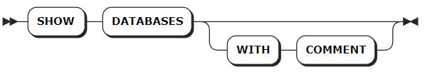

# Relational Databases

## CREATE DATABASE

The `CREATE DATABASE` statement creates a relational database.

### Privileges

The user must be a member of the `admin` role. By default, the `root` user belongs to the `admin` role.
### Syntax


### Parameters

:::warning Note
The optional parameters must be configured in an order of `[ENCODING [=] <'code_name'>] [COMMENT [=] <'comment_text'>]`. Otherwise, the system returns an error.
:::

| Parameter | Description |
| --- | --- |
| `IF NOT EXISTS` | Optional. <br>- When the `IF NOT EXISTS` keyword is used, the system creates a new database only if a database of the same name does not already exist. Otherwise, the system fails to create a new database without returning an error. <br>- When the `IF NOT EXISTS` keyword is not used, the system creates a new database only if a database of the same name does not already exist. Otherwise, the system fails to create a new database and returns an error.|
| `db_name` | The name of the database to create, which must be unique and follow these [Identifier Rules](../../sql-identifiers.md). |
| `WITH` | Optional. Whether or not using the keyword does not affect the creation of the database. |
| `ENCODING` | Optional. Specify the encoding method. Currently, KWDB only supports UTF-8 and its alias (UTF8 and UNICODE). Values should be enclosed in single quotes (`' '`) and are case-insensitive, such as `CREATE DATABASE bank ENCODING = 'UTF-8'`. |
| `COMMENT` | Optional. Specify the comment to be associated to the database. |

### Examples

- Create a database.

    This example creates a database named `db1`.

    ```sql
    CREATE DATABASE db1;
    CREATE DATABASE
    ```

- Create a database using the `IF NOT EXISTS` keyword.

    This example creates a database named `db1`, which has already existed. The system fails to create the database without returning an error.

    ```sql
    CREATE DATABASE IF NOT EXISTS db1;
    CREATE DATABASE
    ```

- Create a database and specify comments for the database.

    This example creates a database named `db_student` and associates the comment text `database for student statistics` to the database.

    ```sql
    CREATE DATABASE db_student COMMENT = 'database for student statistics';
    ```

## SHOW DATABASES

The `SHOW DATABASES` statement lists all databases in the KWDB cluster, including relational databases and time-series databases.

### Privileges

N/A

### Syntax



### Parameters

| Parameter | Description |
| --- | --- |
| `WITH COMMENT` | Optional. Show a database's comments. By default, the database's comment is set to `NULL`. |

### Examples

:::warning Note
The `engine_type` for time-series databases and relational databases is `TIME SERIES` and `RELATIONAL` respectively.
:::

- Show all created databases.

    ```sql
    SHOW DATABASES;
    ```

    If you succeed, you should see an output similar to the following:

    ```sql
      database_name | engine_type
    ----------------+--------------
      db1           | RELATIONAL
      db2           | RELATIONAL
      defaultdb     | RELATIONAL
      postgres      | RELATIONAL
      system        | RELATIONAL
      iot           | TIME SERIES 
    (6 rows)
    ```

- Show all created databases' comments.

    ```sql
    SHOW DATABASES WITH COMMENT;
    ```

    If you succeed, you should see an output similar to the following:

    ```sql
      database_name | engine_type | comment
    ----------------+-------------+----------
      db1           | RELATIONAL  | NULL
      db2           | RELATIONAL  | NULL
      defaultdb     | RELATIONAL  | NULL
      postgres      | RELATIONAL  | NULL
      system        | RELATIONAL  | NULL
      iot           | TIME SERIES | NULL
    (6 rows)
    ```

## SHOW CREATE DATABASE

The `SHOW CREATE DATABASE` statement shows the `CREATE DATABASE` statement for an existing database. Currently, the relational database only supports viewing the name of the database.

### Privileges

N/A

### Syntax


### Parameters

| Parameter | Description |
| --- | --- |
| `database_name` | The name of the database to view. |

### Examples

This example shows the statement that is used to create the `reldb1` database.

```sql
-- 1. Create a database named reldb1.

CREATE DATABASE reldb1 WITH ENCODING = 'UTF8';

--2. Show the created reldb1 database.

SHOW CREATE DATABASE reldb1;
  database_name |    create_statement
----------------+-------------------------
  reldb1        | CREATE DATABASE reldb1
(1 row)
```

## ALTER DATABASE

The `ALTER DATABASE` statement modifies the database name or zone configuration.

::: warning Note
KWDB does not support changing the name of a database which has dependent views.
:::

### Privileges

- Modify database name: The user must be a member of the `admin` role. By default, the `root` user belongs to the `admin` role.
- Modify system database zone configuration: The user must be a member of the `admin` role. By default, the `root` user belongs to the `admin` role.
- Modify other database zone configuration: The user must be a member of the `admin` role or have CREATE or ZONECONFIG privileges on the target database. By default, the `root` user belongs to the `admin` role.

### Syntax


### Parameters

| Parameter | Description |
| --- | --- |
| `database_name` | The name of the database to change. If the target database is the current database, set the `sql_safe_updates` parameter to `true`. Otherwise, the database cannot be renamed. |
| `new_name` | The new name of the database, which must be unique and follow these [Identifier Rules](../../sql-identifiers.md).|
| `variable` | The name of the variable to modify. The following variables are supported: <br>- `range_min_bytes`: the minimum size in bytes for a data range. When a range is smaller than this value, KWDB merges it with an adjacent range. Default: 256 MiB. The value must be greater than 1 MiB (1048576 bytes) and smaller than the maximum size of the range. <br>- `range_max_bytes`: the maximum size in bytes for a data range. When a range exceeds this value, KWDB splits it into two ranges. Default: 512 MiB. The value must not be smaller than 5 MiB (5242880 bytes). <br>- `gc.ttlseconds`: the number of seconds data will be retained before garbage collection. Default: `90000` (25 hours). We recommend setting a value of at least 600 seconds (10 minutes) to avoid affecting long-running queries. A smaller value saves disk space while a larger value increases the time range allowed for `AS OF SYSTEM TIME` queries. Additionally, since all versions of each row are stored in a single, unsplit range, avoid setting this value too large to prevent all changes to a single row from exceeding 64 MiB, which may cause memory issues or other problems. <br>- `num_replicas`: the number of replicas. Default: 3. For the `system` database and the `meta`, `liveness`, and `system` ranges, the default number of replicas is 5. **Note**: The number of replicas cannot be reduced when unavailable nodes exist in the cluster. <br>- `constraints`: required (+) and/or prohibited (-) constraints for where replicas can be placed. For example, `constraints = '{"+region=NODE1": 1, "+region=NODE2": 1, "+region=NODE3": 1}'` places one replica on each of nodes 1, 2, and 3. Currently only supports the `region=NODEx` format. <br>- `lease_preferences`: an ordered list of required (+) and/or prohibited (-) constraints for where the leaseholder should be placed. For example, `lease_preferences = '[[+region=NODE1]]'` prefers placing the leaseholder on node 1. If this isn't possible, KWDB tries the next preference in the list. If no preferences can be satisfied, KWDB uses the default lease distribution algorithm, which balances leases across nodes based on their current lease count. Each value in the list can contain multiple constraints.|
| `value` | The value of the variable to change. |
|`COPY FROM PARENT`| Use the settings of the parent zone. |
|`DISCARD` | Remove the zone settings and use the default values. |

### Examples

- Change the name of a database.

    This example renames the `rdb` database to `relationaldb`.

    ```sql
    -- 1. Show all databases.
    
    SHOW DATABASES;
    database_name|engine_type
    -------------+-----------
    defaultdb    |RELATIONAL
    postgres     |RELATIONAL
    rdb          |RELATIONAL
    system       |RELATIONAL
    tsdb         |TIME SERIES
    (5 rows)
    
    -- 2. Rename the rdb database to relationaldb.
    
    ALTER DATABASE rdb RENAME TO relationaldb;
    ALTER DATABASE
    
    -- 3. Show all databases.
    
    SHOW DATABASES;
    database_name|engine_type
    -------------+-----------
    defaultdb    |RELATIONAL
    postgres     |RELATIONAL
    relationaldb |RELATIONAL
    system       |RELATIONAL
    tsdb         |TIME SERIES
    (5 rows)
    ```

- Change the zone configurations of a database.
  
    This example sets the number of the replicas of the `db3` database to `5` and the time to retain data before garbage collection to `100000` seconds.
  
  ```sql
  -- 1. Change the zone configurations of the tsdb database.

  ALTER DATABASE db3 CONFIGURE ZONE USING num_replicas = 5, gc.ttlseconds = 100000;
  CONFIGURE ZONE 1

  -- 2. Check whether the configurations are applied successfully. 

  SHOW ZONE CONFIGURATION FOR DATABASE db3;
        target  |               config_sql
  -------------------+------------------------------------------
    DATABASE db3 | ALTER DATABASE db3 CONFIGURE ZONE USING
                |     range_min_bytes = 134217728,
                |     range_max_bytes = 536870912,
                |     gc.ttlseconds = 100000,
                |     num_replicas = 5,
                |     constraints = '[]',
                |     lease_preferences = '[]'
  (1 row)
  ```
  
## DROP DATABASE

The `DROP DATABASE` statement removes a database and all its objects from a KWDB cluster. To remove the current database, use the `USE <database_name>` statement to set another database as the current database. After deletion, all privileges on the database and its tables are also removed.

### Privileges

: the user must be a member of the `admin` role or have DROP privileges on the target database and objects. By default, the `root` user belongs to the `admin` role.


### Syntax


### Parameters

| Parameter | Description |
| --- | --- |
| `IF EXISTS` | Optional. <br>- When the `IF EXISTS` keyword is used, the system removes the database only if the database has already existed. Otherwise, the system fails to remove the database without returning an error. <br>- When the `IF EXISTS` keyword is not used, the system removes the database only if the database has already existed. Otherwise, the system fails to remove the database and returns an error. |
| `database_name` | The name of the database to remove. |
| `CASCADE` | Optional. Remove tables and views in the database as well as all objects (such as constraints and views) that depend on those tables. The `CASCADE` keyword does not list objects it removes, so it should be used cautiously.|
| `RESTRICT` | Optional. Do not remove the database if it contains any tables or views.|

### Examples

- Remove a database and its dependent objects using the `CASCADE` keyword.

    ```sql
    -- 1. Show tables in the relationaldb database.

    SHOW TABLES FROM relationaldb;
    table_name|table_type
    ----------+----------
    ints      |BASE TABLE
    (1 row)

    -- 2. Remove the relationaldb database and its dependent objects.

    DROP DATABASE relationaldb CASCADE;
    DROP DATABASE

    -- 3. Show tables in the relationaldb database.

    SHOW TABLES FROM relationaldb;
    ERROR: target database or schema does not exist
    ```

- Remove a database and its dependent objects using the `RESTRICT` keyword.

    ```sql
    -- 1. Show tables in the db1 database.
    
    SHOW TABLES FROM db1;
    table_name|table_type
    ----------+----------
    int       |BASE TABLE
    ints      |BASE TABLE
    (2 rows)
    
    -- 2. Remove the db1 database.
    
    DROP DATABASE db1 RESTRICT;
    ERROR:  database "db1" is not empty and RESTRICT was specified
    ```
