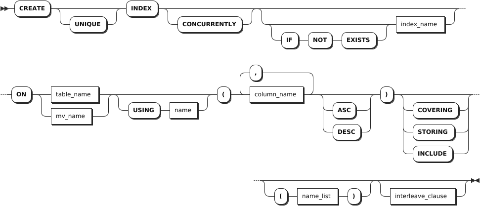
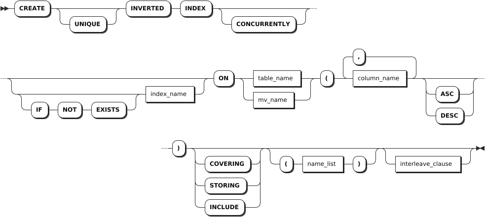
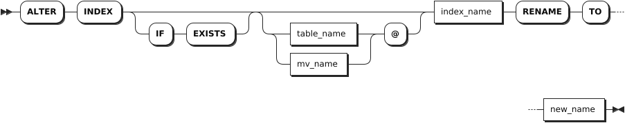
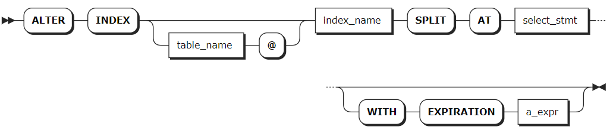
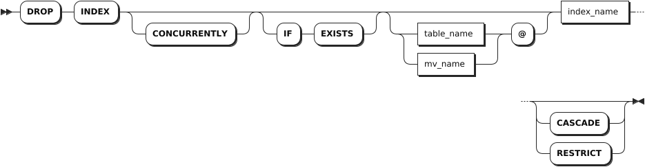

# Indexes

## CREATE INDEX

The `CREATE INDEX` statement creates a standard or inverted index for a table or a materialized view. Indexes improve your database's performance by helping SQL locate data without having to look through every row of a table or a materialized view.

::: warning Note

KWDB does not support creating interleaving indexes, Hash-sharded indexes, or UNIQUE indexes for a materialized view.
:::

KWDB supports creating a function-based index, where the indexed column is not a data column in the table but a function expression. During searches, a function-based index is triggered not by the projected columns but by whether the left-hand side (LHS) of the `WHERE` condition matches the function stored in the index. This approach reduces computation time and improves search efficiency when querying data with fixed functions.

Currently, function-based indexes do not support window functions, aggregate functions, subqueries, or functions that return values. If unsupported functions are used, the client will report a type error. Currently, KWDB supports FLOAT and INT functions (e.g., `abs`, `floor`), STRING and BYTE functions, Comparison functions, and so on.

### Privileges

The user must be a member of the `admin` role or have been granted the `CREATE` privilege on the specified table(s) or materialized view(s). By default, the `root` user belongs to the `admin` role.

### Syntax

- Standard index

    

- Inverted index

    

### Parameters

| Parameter | Description |
| --- | --- |
| `UNIQUE` | Optional. Apply the UNIQUE constraint to the indexed columns. This causes the system to check for existing duplicate values on index creation. It also applies the UNIQUE constraint at the table level, so the system checks for duplicate values when inserting or updating data. <br > **Note** <br > KWDB does not support creating the UNIQUE index for a materialized view. |
| `CONCURRENTLY` | Optional. It is compatible with the PostgreSQL syntax. All indexes are created concurrently in KWDB.|
| `IF NOT EXISTS` | Optional. <br>- When the `IF NOT EXISTS` keyword is used, the system creates a new index only if an index of the same name does not already exist. Otherwise, the system fails to create a new index without returning an error. <br>- When the `IF NOT EXISTS` keyword is not used, the system creates a new index only if an index of the same name does not already exist. Otherwise, the system fails to create a new index and returns an error. |
| `index_name` | The name of the index to create. The index name must be unique within the database and must follow these [Identifier Rules](../../../sql-reference/sql-identifiers.md). |
| `table_name` | The name of the table to create the index on. |
| `mv_name` | The name of the materialized view to create the index on. |
| `USING name` | An optional clause for compatibility with third-party tools. Accepted values for `name` are `btree` and `gin`, where `btree` for a standard secondary index and `gin` as the PostgreSQL-compatible syntax for an inverted index. |
| `column_name` | The name of the column to create the index on. |
| `ASC` or `DESC` | Sort the column in ascending (ASC) or descending (DESC) order in the index. How columns are sorted affects query results, particularly when using the `LIMIT` clause. By default, it is set to `ASC`. |
| `STORING` | Store but do not sort specified columns. `COVERING` and `INCLUDE` are aliases for `STORING` and work identically. Storing a column improves the performance of queries that retrieve (but do not filter) its values.<br > **Note** <br > Columns that are part of a table's PRIMARY KEY cannot be specified as `STORING` columns in secondary indexes on the table. However, to use stored columns, queries must filter another column in the same index.  |
| `interleave_clause` | KWDB supports using interleaving indexes to optimize query performance. However, this will change how KWDB stores data. <br > **Note** <br > KWDB does not support creating interleaving indexes on materialized views. |
| `INVERTED` | Create an inverted index on the schemaless data in the specified JSONB column. You can also use the PostgreSQL-compatible syntax `USING GIN`. |

### Examples

- Create a single-column index to sort the values of a single column.

    ```sql
    CREATE INDEX ON re_users (city);
    CREATE INDEX
    ```

- Create a multiple-column index to sort columns in the order you list them.

    ```sql
    CREATE INDEX ON re_users (city, name);
    CREATE INDEX
    ```

- Create a UNIQUE index to disallow duplicate values among their columns. This also applies the UNIQUE constraint at the table level, similar to the `ALTER TABLE ... ADD CONSTRAINT` statement.

    ```sql
    CREATE UNIQUE INDEX ON re_users (credit_card, dl);
    CREATE INDEX
    ```

- Create an inverted index on schemaless data in a JSONB column.

    ```sql
    CREATE INVERTED INDEX ON users (profile);
    ```

- Store a column.

    ```sql
    CREATE INDEX ON products (price) STORING (name);
    ```

- Change the column sort order.

    ```sql
    CREATE INDEX ON products (price DESC, stock);
    ```

- Query specific indexes.

    ```sql
    -- 1. Check indexes on the customers table.

    SHOW INDEX FROM customers;
      table_name |       index_name       | non_unique | seq_in_index | column_name | direction | storing | implicit
    -------------+------------------------+------------+--------------+-------------+-----------+---------+-----------
      customers  | primary                |   false    |            1 | id          | ASC       |  false  |  false
      customers  | customers_id_idx       |    true    |            1 | id          | ASC       |  false  |  false
      customers  | customers_name_id_idx  |    true    |            1 | name        | ASC       |  false  |  false
      customers  | customers_name_id_idx  |    true    |            2 | id          | ASC       |  false  |  false
    (4 rows)

    -- 2. Check the customers_id_idx index on the customers table.

    SELECT name FROM customers@customers_id_idx;
        name
    --------------
      Li Ming
      Liu Yang
      Wang Cheng
    (3 rows)
    ```

- Create a function-based index.

    ```sql
    -- 1. Create a table.
    CREATE TABLE t1 (a FLOAT);
    CREATE TABLE

    -- 2. Create a function-based index.

    CREATE INDEX idx ON t1(abs(a));
    CREATE INDEX

    -- 3. Insert data into the table.

    INSERT INTO t1 VALUES (0),(1);
    INSERT 2

    -- 4. Query data in the table.

    EXPLAIN (opt,verbose) SELECT * FROM t1 WHERE abs(a)>-1;
    +-------------------------------------------------------+
      scan t1@idx                                            
      ├── columns: a:1                                   
      ├── CONSTRAINT: /1/3/2: [/-0.9999999999999999 - ]  
      ├── stats: [rows=333.333333]                       
      └── cost: 346.676667                               
    (5 rows)
    ```

- Create an index on a materialized view.

    ```sql
    -- 1. Check the orders table.

    SELECT * FROM orders;
      customer_id |   id   | total
    --------------+--------+--------
          100001 | 100001 |   234
          100001 | 100002 |   120
          100002 | 100003 |    59
          100002 | 100004 |   120
    (4 rows)

    -- 2. Create a materialized view to get the id and amount info from the orders table. 

    CREATE MATERIALIZED VIEW small_order (id, amount) AS SELECT id, total FROM orders;

    -- 3. Create an index for the materialized view.

    CREATE INDEX idx1 ON small_order(id)
    ```

## SHOW INDEX

The `SHOW INDEX` statement shows index information for a table，a database, or a materialized view.

### Privileges

The user must have any privilege on the specified database(s), table(s) or materialized view(s).

### Syntax


### Parameters

| Parameter | Description |
| --- | --- |
| `table_name` | The name of the table for which to show indexes. |
| `database_name` | The name of the database for which to show indexes. |
| `mview_name` | The name of the materialized view for which to show indexes. |
| `WITH COMMENT` | Optional. Show an index's comments. By default, the index's comment is set to `NULL`. |

### Responses

| Field | Description |
| --- | --- |
| `table_name` | The name of the table. |
| `index_name` | The name of the index. |
| `non_unique` | Whether values in the indexed column are unique. |
| `seq_in_index` | The position of the column in the index, starting with 1. |
| `column_name` | The indexed column. |
| `direction` | How the column is sorted in the index. It is set to `N/A` for stored columns. |
| `storing` | Whether the `STORING` clause is used to index the column during index creation. |
| `implicit` | Whether the column is part of the index despite not being explicitly included during index creation. |

### Examples

- List all indexes on a specified table.

    This example lists all indexes on the `re_users` table.

    ```sql
    SHOW INDEX FROM re_users;
    ```

    If you succeed, you should see an output similar to the following:

    ```sql
      table_name |        index_name        | non_unique | seq_in_index | column_name | direction | storing | implicit
    -------------+--------------------------+------------+--------------+-------------+-----------+---------+-----------
      re_users   | primary                  |   false    |            1 | city        | ASC       |  false  |  false
      re_users   | primary                  |   false    |            2 | id          | ASC       |  false  |  false
      re_users   | re_users_city_idx        |    true    |            1 | city        | ASC       |  false  |  false
      re_users   | re_users_city_idx        |    true    |            2 | id          | ASC       |  false  |   true
      re_users   | re_users_city_name_idx   |    true    |            1 | city        | ASC       |  false  |  false
      re_users   | re_users_city_name_idx   |    true    |            2 | name        | ASC       |  false  |  false
      re_users   | re_users_city_name_idx   |    true    |            3 | id          | ASC       |  false  |   true
      re_users   | re_users_credit_card_key |   false    |            1 | credit_card | ASC       |  false  |  false
      re_users   | re_users_credit_card_key |   false    |            2 | city        | ASC       |  false  |   true
      re_users   | re_users_credit_card_key |   false    |            3 | id          | ASC       |  false  |   true
    (10 rows)
    ```

- List all indexes on a specified materialized view.

    This example lists all indexes on the `small_order` materialized view.

    ```sql
    -- List all tables in the current database.
    SHOW TABLES;
      table_name  |    table_type
    --------------+--------------------
      accounts    | BASE TABLE
      small_order | MATERIALIZED VIEW
    (2 rows)

    -- List all indexes on the specified materialized view.
    SHOW INDEX FROM small_order;
    ```

    If you succeed, you should see an output similar to the following:

    ```sql
      table_name  | index_name | non_unique | seq_in_index | column_name | direction | storing | implicit
    --------------+------------+------------+--------------+-------------+-----------+---------+-----------
      small_order | primary    |   false    |            1 | rowid       | ASC       |  false  |  false
      small_order | idx1       |    true    |            1 | id          | ASC       |  false  |  false
      small_order | idx1       |    true    |            2 | rowid       | ASC       |  false  |   true
    (3 rows)
    ```

## ALTER INDEX

The `ALTER INDEX` statement changes the name of an index or applies a range split to a specified row in the index.

### Privileges

- Change the name of an index: the user must be a member of the `admin` role or have been granted the `CREATE` privilege on the specified table(s) or materialized view(s). By default, the `root` user belongs to the `admin` role.
- Apply a range split for a specified row in the index: the user must be a member of the `admin` role or have been granted the `INSERT` privilege on the specified index(es). By default, the `root` user belongs to the `admin` role.

### Syntax

- Change the name of an index

    

- Apply a range split for a specified row in the index

    

### Parameters

| Parameter | Description |
| --- | --- |
| `IF EXISTS` | Optional. <br>- When the `IF EXISTS` keyword is used, the system updates the index only if the target index has already existed. Otherwise, the system fails to update the index without returning an error. <br>- When the `IF EXISTS` keyword is not used, the system updates the index only if the target index has already existed. Otherwise, the system fails to update the index and returns an error. |
| `table_name` | The name of the table with the index to change. You can use the `SHOW TABLES` statement to get existing table names. |
| `mv_name` | The name of the materialized view with the index to change. You can use the `SHOW TABLES` statement to get existing materialized view names. |
| `index_name` | The current name of the index to change.|
| `new_name` | The new name of the index. The index name must be unique within the database and must follow these [Identifier Rules](../../sql-identifiers.md).|
| `SPLIT AT` | Force a range split at the specified row in the index.|
| `select_stmt` | A `SELECT` query statement that produces one or more rows at which to split the index.|
| `a_expr` | The expiration of the split enforcement on the index. Available options are `DECIMAL`, `INTERVAL`, `TIMESTAMP`, or `TIMESTAMPZ`.|

### Examples

- Rename an index.

    ```sql
    -- 1. Check indexes on the re_users table.

    SHOW INDEXES FROM re_users;
      table_name |        index_name        | non_unique | seq_in_index | column_name | direction | storing | implicit
    -------------+--------------------------+------------+--------------+-------------+-----------+---------+-----------
      re_users   | primary                  |   false    |            1 | city        | ASC       |  false  |  false
      re_users   | primary                  |   false    |            2 | id          | ASC       |  false  |  false
      re_users   | re_users_city_idx        |    true    |            1 | city        | ASC       |  false  |  false
      re_users   | re_users_city_idx        |    true    |            2 | id          | ASC       |  false  |   true
      re_users   | re_users_city_name_idx   |    true    |            1 | city        | ASC       |  false  |  false
      re_users   | re_users_city_name_idx   |    true    |            2 | name        | ASC       |  false  |  false
      re_users   | re_users_city_name_idx   |    true    |            3 | id          | ASC       |  false  |   true
      re_users   | re_users_credit_card_key |   false    |            1 | credit_card | ASC       |  false  |  false
      re_users   | re_users_credit_card_key |   false    |            2 | city        | ASC       |  false  |   true
      re_users   | re_users_credit_card_key |   false    |            3 | id          | ASC       |  false  |   true
    (10 rows)

    -- 2. Rename the re_users_city_idx index to re_users_city_idx_rename for the re_users table.

    ALTER INDEX re_users@re_users_city_idx RENAME TO re_users_city_idx_rename;
    ALTER INDEX

    -- 3. Check indexes on the re_users table.

    SHOW INDEXES FROM re_users;
      table_name |        index_name        | non_unique | seq_in_index | column_name | direction | storing | implicit
    -------------+--------------------------+------------+--------------+-------------+-----------+---------+-----------
      re_users   | primary                  |   false    |            1 | city        | ASC       |  false  |  false
      re_users   | primary                  |   false    |            2 | id          | ASC       |  false  |  false
      re_users   | re_users_city_idx_rename |    true    |            1 | city        | ASC       |  false  |  false
      re_users   | re_users_city_idx_rename |    true    |            2 | id          | ASC       |  false  |   true
      re_users   | re_users_city_name_idx   |    true    |            1 | city        | ASC       |  false  |  false
      re_users   | re_users_city_name_idx   |    true    |            2 | name        | ASC       |  false  |  false
      re_users   | re_users_city_name_idx   |    true    |            3 | id          | ASC       |  false  |   true
      re_users   | re_users_credit_card_key |   false    |            1 | credit_card | ASC       |  false  |  false
      re_users   | re_users_credit_card_key |   false    |            2 | city        | ASC       |  false  |   true
      re_users   | re_users_credit_card_key |   false    |            3 | id          | ASC       |  false  |   true
    (10 rows)
    ```

- Split an index.

    ```sql
    -- 1. Check indexes on the customers table.

    SHOW INDEX FROM customers;
      table_name |       index_name       | non_unique | seq_in_index | column_name | direction | storing | implicit
    -------------+------------------------+------------+--------------+-------------+-----------+---------+-----------
      customers  | primary                |   false    |            1 | id          | ASC       |  false  |  false
      customers  | customers_id_idx       |    true    |            1 | id          | ASC       |  false  |  false
      customers  | customers_name_id_idx  |    true    |            1 | name        | ASC       |  false  |  false
      customers  | customers_name_id_idx  |    true    |            2 | id          | ASC       |  false  |  false
      customers  | customers_name_id_idx1 |    true    |            1 | name        | ASC       |  false  |  false
      customers  | customers_name_id_idx1 |    true    |            2 | id          | ASC       |  false  |  false
    (6 rows)

    -- 2. Split the customers_id_index for the customers table.

    ALTER INDEX customers@customers_id_idx SPLIT AT SELECT id FROM customers;
            key        |       pretty        |       split_enforced_until
    -------------------+---------------------+-----------------------------------
      \xf6c18af80186a1 | /Table/193/2/100001 | 2262-04-11 23:47:16.854776+00:00
      \xf6c18af80186a2 | /Table/193/2/100002 | 2262-04-11 23:47:16.854776+00:00
      \xf6c18af80186a3 | /Table/193/2/100003 | 2262-04-11 23:47:16.854776+00:00
    (3 rows)

    -- 3. Check ranges for the customers_id_idx index.

    SHOW RANGES FROM INDEX customers@customers_id_idx;
      start_key | end_key | range_id | range_size_mb | lease_holder | lease_holder_locality | replicas | replica_localities
    ------------+---------+----------+---------------+--------------+-----------------------+----------+---------------------
      NULL      | /100001 |      162 |      0.000109 |            1 |                       | {1}      | {""}
      /100001   | /100002 |      177 |      0.000026 |            1 |                       | {1}      | {""}
      /100002   | /100003 |      178 |      0.000026 |            1 |                       | {1}      | {""}
      /100003   | NULL    |      179 |       0.00025 |            1 |                       | {1}      | {""}
    (4 rows)
    ```

## DROP INDEX

The `DROP INDEX` statement removes indexes from tables or materialized views.

### Privileges

The user must be a member of the `admin` role or have been granted the `CREATE` privilege on the specified table(s) or materialized view(s). By default, the `root` user belongs to the `admin` role.

### Syntax



### Parameters

| Parameter | Description |
| --- | --- |
| `CONCURRENTLY` | Optional. It is compatible with the PostgreSQL syntax. All indexes are removed concurrently in KWDB. |
| `IF EXISTS` | Optional. <br>- When the `IF EXISTS` keyword is used, the system removes the index only if the target index has already existed. Otherwise, the system fails to remove the index without returning an error. <br>- When the `IF EXISTS` keyword is not used, the system removes the index only if the target index has already existed. Otherwise, the system fails to remove the index and returns an error. |
| `table_name` | The name of the table with the index to remove. You can use the `SHOW TABLES` statement to get existing table names. |
| `mv_name` | The name of the materialized view with the index you to remove. You can use the `SHOW TABLES` statement to get existing materialized view names. |
| `index_name` | The name of the index to remove. You can use the `SHOW TABLES` statement to get existing index names. You cannot remove a table's primary index.|
| `CASCADE` | Optional. Remove the target index and its dependent objects. The `CASCADE` keyword does not list objects it removes, so it should be used cautiously. |
| `RESTRICT` | (Default) Optional. Do not remove the index if any objects depend on it. |

### Examples

- Remove an index with no dependencies from a table.

    ```sql
    -- 1. Check indexes on the t1 table.

    SHOW INDEX FROM t1;
    table_name | index_name  | non_unique | seq_in_index | column_name | direction | storing | implicit |
    -----------+-------------+------------+--------------+-------------+-----------+---------+----------+
    t1         | primary     |   false    |            1 | id          | ASC       |  false  |  false   |
    t1         | t1_name_idx |    true    |            1 | name        | ASC       |  false  |  false   |
    t1         | t1_name_idx |    true    |            2 | id          | ASC       |  false  |   true   |
    (3 rows)

    -- 2. Remove the t1_name_index index with no dependencies from the t1 table.

    DROP INDEX t1@t1_name_idx;
    DROP INDEX 

    -- 3. Check indexes on the t1 table.

    SHOW INDEX FROM t1;
    table_name | index_name | non_unique | seq_in_index | column_name | direction | storing | implicit |
    -----------+------------+------------+--------------+-------------+-----------+---------+----------+
    t1         | primary    |   false    |            1 | id          | ASC       |  false  |  false   |
    (1 row)
    ```

- Remove an index with dependencies from a table.

    ```sql

    -- 1. Check indexes on the orders table.

    SHOW INDEX FROM orders;
    table_name |                 index_name                  | non_unique | seq_in_index | column_name | direction | storing | implicit |
    -----------+---------------------------------------------+------------+--------------+-------------+-----------+---------+----------+
    orders     | primary                                     |   false    |            1 | id          | ASC       |  false  |  false   |
    orders     | orders_auto_index_fk_customer_ref_customers |    true    |            1 | customer    | ASC       |  false  |  false   |
    orders     | orders_auto_index_fk_customer_ref_customers |    true    |            2 | id          | ASC       |  false  |   true   |
    (3 rows)

    -- 2. Remove the orders_auto_index_fk_customer_ref_customers index from the orders table. Since the orders_auto_index_fk_customer_ref_customers index has dependencies, the system fails to remove the index.

    DROP INDEX orders_auto_index_fk_customer_ref_customers;
    pq: index "orders_auto_index_fk_customer_ref_customers" is in use as a foreign key CONSTRAINT

    -- 3. Check indexes on the orders table.

    SHOW CONSTRAINTS FROM orders;
    table_name |      CONSTRAINT_name      | CONSTRAINT_type |                     details                      | validated |
    -----------+---------------------------+-----------------+--------------------------------------------------+-----------+
    orders     | fk_customer_ref_customers | FOREIGN KEY     | FOREIGN KEY (customer) REFERENCES customers (id) |   true    |
    orders     | primary                   | PRIMARY KEY     | PRIMARY KEY (id ASC)                             |   true    |
    (2 rows)

    -- 4. Remove the orders_auto_index_fk_customer_ref_customers index using the CASECADE keyword from the orders table.

    DROP INDEX orders_auto_index_fk_customer_ref_customers CASCADE;
    DROP INDEX

    -- 5. Check indexes on the orders table.

    SHOW CONSTRAINTS FROM orders;
    table_name | CONSTRAINT_name | CONSTRAINT_type |       details        | validated |
    -----------+-----------------+-----------------+----------------------+-----------+
    orders     | primary         | PRIMARY KEY     | PRIMARY KEY (id ASC) |   true    |
    (1 row)
    ```

- Remove an index from a materialized view.

    ```sql
    DROP INDEX small_order@idx1
    ```
