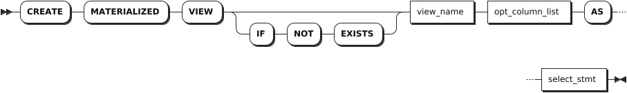
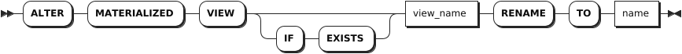
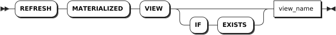
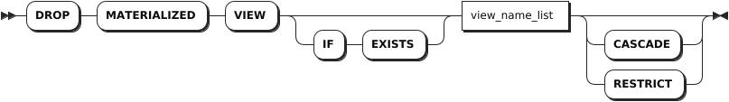

# Materialized Views

A materialized view is a view that stores the results of its underlying query.

## CREATE MATERIALIZED VIEW

The `CREATE MATERIALIZED VIEW` statement creates a materialized view. The system writes query results into the materialized view during the creation of the materialized view. You cannot insert into, update, or remove data from a materialized view. When you select from a materialized view, the stored query data that is returned might be out-of-date. To get the latest results from a materialized view, you must manually refresh the materialized view. For details, see [REFRESH MATERIALIZED VIEW](#refresh-materialized-view).

KWDB does not support creating a materialized view based on a temporary table/view, or using an explicit transaction.

### Privileges

The user must be a member of the `admin` role or have been granted the `CREATE` privilege on the parent database and the `SELECT` privilege on any table(s) referenced by the materialized view. By default, the `root` user belongs to the `admin` role.

### Syntax



### Parameters

| Parameter | Description |
| --- | --- |
| `IF NOT EXISTS` | Optional. <br>- When the `IF NOT EXISTS` keyword is used, the system creates a new materialized view only if a materialized view of the same name does not already exist. Otherwise, the system fails to create a new materialized view without returning an error. <br>- When the `IF NOT EXISTS` keyword is not used, the system creates a new materialized view only if a materialized view of the same name does not already exist. Otherwise, the system fails to create a new materialized view and returns an error. |
| `view_name` | The name of the materialized view to create. The materialized view name must be unique within the database and must follow these [Identifier Rules](../../../sql-reference/sql-identifiers.md). When the parent database is not set as the default, the name must be formatted as `database.view_name`. |
| `opt_column_list` | An optional, comma-separated list of column names for the materialized view. If specified, these names will be used in the response instead of the columns specified in the `select_stmt` statement.  |
| `select_stmt` | The selection query to execute when the materialized view is requested. |

### Examples

```sql
-- 1. Check data of the orders table.

SELECT * FROM orders;
  customer_id |   id   | total
--------------+--------+--------
       100001 | 100001 |   234
       100001 | 100002 |   120
       100002 | 100003 |    59
       100002 | 100004 |   120
(4 rows)

-- 2. Create a materialized view named small_order for the orders table to get the order id and order amount.

CREATE MATERIALIZED VIEW small_order (id, amount) AS SELECT id, total FROM orders;


-- 3. Check the materialized view.

SELECT * FROM small_order;
    id   | amount
---------+---------
  100001 |    234
  100002 |    120
  100003 |     59
  100004 |    120
(4 rows)
```

## ALTER MATERIALIZED VIEW

The `ALTER MATERIALIZED VIEW` statement changes the name of a materialized view.

### Privileges

The user must be a member of the `admin` role or have been granted the `DROP` privilege on the current materialized view and the `CREATE` privilege on the parent database of the renamed materialized view. By default, the `root` user belongs to the `admin` role.

### Syntax



### Parameters

| Parameter | Description |
| --- | --- |
| `IF EXISTS` | Optional. <br>- When the `IF EXISTS` keyword is used, the system updates the materialized view only if the target materialized view has already existed. Otherwise, the system fails to update the materialized view without returning an error. <br>- When the `IF EXISTS` keyword is not used, the system updates the materialized view only if the target materialized view has already existed. Otherwise, the system fails to update the materialized view and returns an error. |
| `view_name` | The current name of the materialized view to rename. You can use the `SELECT * FROM information_schema.tables WHERE table_type = 'MATERIALIZED VIEW'` statement to get existing materialized view names. |
| `name` | The new name of the materialized view. The materialized view name must be unique within the database and must follow these [Identifier Rules](../../sql-identifiers.md). |

### Examples

This example renames the `test_view` materialized view to `names`.

```sql
-- 1. Check all materialized views.

SELECT * FROM information_schema.tables WHERE table_type = 'MATERIALIZED VIEW';
  table_catalog | table_schema | table_name  | table_type              | is_insertable_into | version | namespace_oid
----------------+--------------+-------------+-------------------------+--------------------+---------+----------------
  db2           | public       | test_view   | MATERIALIZED VIEW       | NO                 |       1 |    1497612465
  db2           | public       | small_order | MATERIALIZED VIEW       | NO                 |       1 |    1497612465
(2 rows)

-- 2. Rename the test_view materialized view to names.

ALTER MATERIALIZED VIEW test_view rename to names;

-- 3. Check all materialized views.

SELECT * FROM information_schema.tables WHERE table_type = 'MATERIALIZED VIEW';
  table_catalog | table_schema | table_name  | table_type              | is_insertable_into | version | namespace_oid
----------------+--------------+-------------+-------------------------+--------------------+---------+----------------
  db2           | public       | names       | MATERIALIZED VIEW       | NO                 |       1 |    1497612465
  db2           | public       | small_order | MATERIALIZED VIEW       | NO                 |       1 |    1497612465
(2 rows)
```

## REFRESH MATERIALIZED VIEW

The `REFRESH MATERIALIZED VIEW` statement updates the stored query results of a materialized view. If you do not refresh a materialized view, the stored query results in the materialized view are not automatically updated. Refreshing materialized views does not affect querying data. You can use the `SHOW JOBS` statement to check the running refresh jobs. If a refresh operation is running when you refresh the materialized view, the system returns an error.

KWDB does not support materialized views that are refreshed on a explicit transaction commit.

### Privileges

The user must be a member of the `admin` role or have been granted the `UPDATE` privilege on the specified materialized view(s). By default, the `root` user belongs to the `admin` role.

### Syntax



### Parameters

| Parameter | Description |
| --- | --- |
| `view_name` | The name of the materialized view to refresh.|

### Examples

This example refreshes the `small_orders` materialized view.

```sql
REFRESH MATERIALIZED VIEW small_orders;
```

## DROP MATERIALIZED VIEW

The `DROP MATERIALIZED VIEW` statement removes a materialized view from a database.

### Privileges

- Remove a materialized view with no dependency: the user must be a member of the `admin` role or have been granted the `DROP` privilege on the specified materialized view(s). By default, the `root` user belongs to the `admin` role.
- Remove a materialized view with dependencies: the user must be a member of the `admin` role or have been granted the `DROP` privilege on the specified materialized view(s) and its dependent objects. By default, the `root` user belongs to the `admin` role.

### Syntax



### Parameters

| Parameter | Description |
| --- | --- |
| `IF EXISTS` | Optional. <br>- When the `IF EXISTS` keyword is used, the system removes the materialized view only if the target materialized view has already existed. Otherwise, the system fails to remove the materialized view without returning an error. <br>- When the `IF EXISTS` keyword is not used, the system removes the materialized view only if the target materialized view has already existed. Otherwise, the system fails to remove the materialized view and returns an error. |
| `view_name_list` | A comma-separated list of materialized view names. You can use the `SELECT * FROM information_schema.tables WHERE table_type = 'MATERIALIZED VIEW'` statement to get existing materialized view names. |
| `CASCADE` | Optional. Remove the target materialized view and its dependent objects. The `CASCADE` keyword does not list objects it removes, so it should be used cautiously. |
| `RESTRICT` | (Default) Optional. Do not remove the materialized view if any objects depend on it. |

### Examples

This example removes the `names` materialized view.

```sql
-- 1. Check all materialized views. 

SELECT * FROM information_schema.tables WHERE table_type = 'MATERIALIZED VIEW';
  table_catalog | table_schema | table_name  | table_type              | is_insertable_into | version | namespace_oid
----------------+--------------+-------------+-------------------------+--------------------+---------+----------------
  db2           | public       | names       | MATERIALIZED VIEW       | NO                 |       1 |    1497612465
  db2           | public       | small_order | MATERIALIZED VIEW       | NO                 |       1 |    1497612465
(2 rows)

-- 2. Remove the names materialized view.

DROP MATERIALIZED VIEW names;

-- 3. Check all materialized views. 

SELECT * FROM information_schema.tables WHERE table_type = 'MATERIALIZED VIEW';
  table_catalog | table_schema | table_name  | table_type              | is_insertable_into | version | namespace_oid
----------------+--------------+-------------+-------------------------+--------------------+---------+----------------
  db2           | public       | small_order | MATERIALIZED VIEW       | NO                 |       1 |    1497612465
(1 rows)
```
