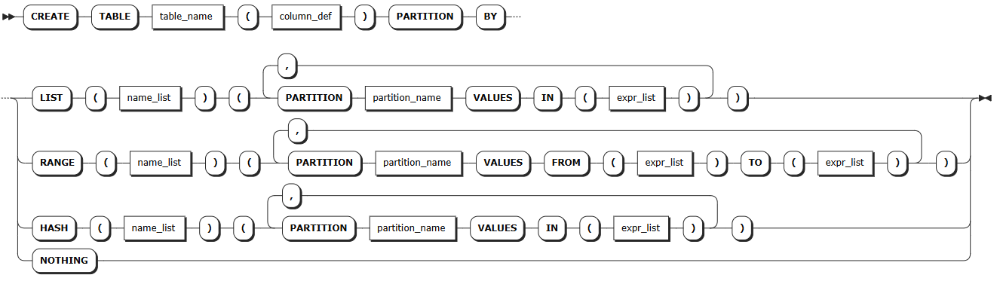
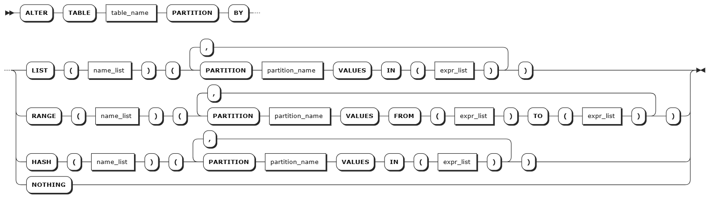
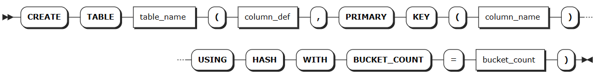
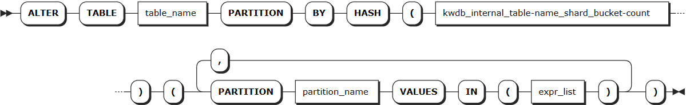
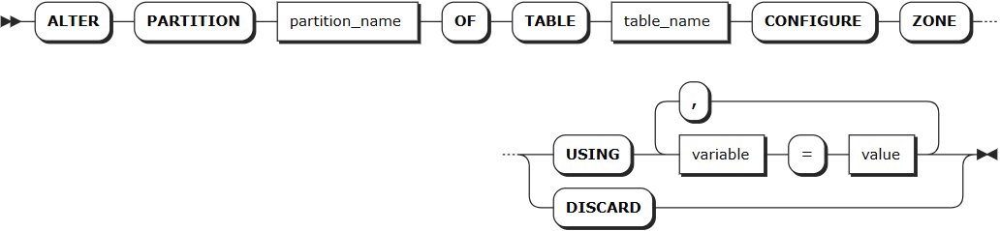

# Partitions

Table partitioning is a database optimization technique that distributes table data across specified nodes based on defined rules. This provides row-level control over data storage locations, reducing query latency and improving overall performance.

## How It Works

Table partitioning in KWDB relies on two core components working together:

**Partition Definition**

You can define partitioning strategies on one or more table columns during table creation or modification. KWDB supports the following partitioning methods:

| Partitioning Method | Syntax | Use Cases | Key Features | Example Scenarios |
| :------- | :------------------- | :------------------------------- | :----------------------------------------------------------- | :----------------------------- |
| List Partitioning | `PARTITION BY LIST` | Partition key values are limited and relatively fixed | - Explicitly enumerates all possible values for each partition<br>- Supports single-column or multi-column combinations as partition keys<br>- Can set a `DEFAULT` partition as a fallback | Partitioning user data by country or region |
| Range Partitioning | `PARTITION BY RANGE` | Partition key values are numerous and cannot be enumerated individually | - Defines continuous value ranges through upper and lower bounds<br>- Supports `MINVALUE` and `MAXVALUE` boundaries<br>- Lower bound is inclusive, upper bound is exclusive<br>- NULL values are treated as minimum values | Partitioning order data by time range |
| Hash Partitioning | `PARTITION BY HASH` | Data needs even distribution without obvious business grouping | - Uses a hash function to map data to a fixed number of partitions<br>- Ensures relatively even data distribution<br>- Can be used with `USING HASH WITH BUCKET_COUNT` to distribute index key values into multiple buckets for improved distribution | Hash partitioning by user ID for load balancing |

::: warning Notes

- **Range partition expressions**: Range partition boundaries are evaluated only once at creation time and do not update dynamically. For example, a partition with boundary `< (now() - '1d')` created on 2025-01-30 will permanently contain values less than 2025-01-29.
- **Hash partition configuration**: When using `USING HASH WITH BUCKET_COUNT`, you must first enable the hash sharded index feature with the statement `SET experimental_enable_hash_sharded_indexes = ON;`.
- **Partition limitations**: Currently, modifying partitions after creation is not supported, nor is primary key nested partitioning.

:::

**Zone Configuration**

Partition definitions assign identifiers to rows that meet specified conditions. To activate these partitions and control where data is stored, you must configure zones and apply them to the corresponding partitions.

**Configuration priority**: partition > table > database

## Create Partition

### Privileges

- **Creating partitions when creating a table**: The user must be a member of the `admin` role or have CREATE privileges on the database. By default, the `root` user is a member of the `admin` role.
- **Creating partitions when altering a table**: The user must be a member of the `admin` role or have CREATE privileges on the target table. By default, the `root` user is a member of the `admin` role.

### Syntax

::: warning Note

The following syntax shows only the parameters required for creating partitions. For all parameters supported for creating and altering tables, see [Create Table](../../../sql-reference/ddl/relational-db/relational-table.md#creating-tables) and [Alter Table](../../../sql-reference/ddl/relational-db/relational-table.md#alter-table).

:::

- Creating partitions when creating a table

  

- Creating partitions when altering a table

  

- Creating partitions through hash sharded indexes

  1. Define hash sharding when creating a table

        

  2. Create partitions when altering a table

        

### Parameters

| Parameter | Description |
| :--------------- | :----------------------------------------------------------- |
| `table_name` | The name of the table containing the partition |
| `column_def` | Table column definition. A comma-separated list of one or more column definitions. Column names must be unique within the table but can share names with indexes or constraints. Each column must define a column name and data type, and can optionally define column-level constraints or other column qualifications (such as computed columns), in the format `<column_name> <typename> [col_qual_list]`. Column-level primary keys, unique constraints, and check constraints are automatically converted to table-level constraints during table creation |
| `name_list` | Partition key, which must appear at the beginning of the primary key list |
| `partition_name` | Partition name |
| `expr_list` | List of partition expressions |
| `column_name` | Column name of primary keys |
| `bucket_count` | Number of shard buckets; must be an integer |
| `kwdb_internal_primary-key_shard_bucket-count` | Internal column automatically generated by the system after enabling the hash sharded index feature. Used to store the hash shard key, where `primary-key` is the primary key name of the partition's table and `bucket-count` is the number of shard buckets set when creating the table |

### Examples

- Creating partitions when creating a table:

  ```sql
    -- Create an e-commerce order management database
    CREATE DATABASE ecommerce_orders;

    -- Create a table partitioned by region, storing order data from different regions separately for regionalized management and nearby access
    CREATE TABLE ecommerce_orders.regional_orders (
        order_id BIGINT,
        region_code INT,  -- Region code: 1-North China, 2-East China, 3-South China
        customer_id BIGINT,
        product_id BIGINT,
        order_amount DECIMAL(10,2),
        order_status VARCHAR(20),
        created_at TIMESTAMP DEFAULT NOW(),
        PRIMARY KEY (region_code, order_id)  -- Partition key must be at the beginning of the primary key list
    ) PARTITION BY LIST (region_code) (
        PARTITION north_china VALUES IN (1),    -- North China partition
        PARTITION east_china VALUES IN (2),     -- East China partition  
        PARTITION south_china VALUES IN (3)     -- South China partition
    );
  ```

- Creating partitions when altering a table:

  ```sql
    -- Add time range partitions to an existing table
    ALTER TABLE existing_orders 
    PARTITION BY RANGE (created_at) (
        PARTITION q1_2025 VALUES FROM ('2025-01-01') TO ('2025-04-01'),
        PARTITION q2_2025 VALUES FROM ('2025-04-01') TO ('2025-07-01'),
        PARTITION q3_2025 VALUES FROM ('2025-07-01') TO ('2025-10-01'),
        PARTITION q4_2025 VALUES FROM ('2025-10-01') TO ('2026-01-01')
    );
  ```

- Creating partitions through hash sharded indexes:

  ```sql
    -- Enable hash sharded indexes
    SET experimental_enable_hash_sharded_indexes = ON;
    
    -- Create a table using hash sharding
    CREATE TABLE users (
        user_id BIGINT,
        username VARCHAR(50),
        email VARCHAR(100),
        created_at TIMESTAMP DEFAULT NOW(),
        PRIMARY KEY (user_id) USING HASH WITH BUCKET_COUNT = 8
    );
    
    -- View table indexes
    SHOW INDEXES FROM users;
    
    -- Create partitions for the hash sharded table
    ALTER TABLE users 
    PARTITION BY HASH (kwdb_internal_user_id_shard_8) (
        PARTITION shard_0 VALUES IN (0),
        PARTITION shard_1 VALUES IN (1),
        PARTITION shard_2 VALUES IN (2),
        PARTITION shard_3 VALUES IN (3),
        PARTITION shard_4 VALUES IN (4),
        PARTITION shard_5 VALUES IN (5),
        PARTITION shard_6 VALUES IN (6),
        PARTITION shard_7 VALUES IN (7)
    );
  ```

## Alter Partition

The `ALTER PARTITION` statement is used to modify the replica zone configuration of table partitions.

::: warning Note

- **Node health and scale-in impact**: Your configured `lease_preferences` and `constraints` may not apply as expected if target nodes are unhealthy or is undergoing scale-in operations.
- **High availability and scale-in behavior**:
    - When a node fails, `lease_preferences` pointing to that node will stop working, but the system maintains high availability. Note that `constraints` settings may prevent the system from replenishing replicas.
    - During scale-in operations, `lease_preferences` may stop working while high availability is maintained. However, `constraints` settings may block the scale-in operation from completing.

:::

### Privileges

The user must be a member of the `admin` role or have CREATE privileges on the target table. By default, the `root` user is a member of the `admin` role.

### Syntax



### Parameters

| Parameter | Description |
| :--------------- | :----------------------------------------------------------- |
| `partition_name` | The name of the partition to be modified |
| `table_name` | The name of the table containing the partition |
| `variable` | Supports modifying the following variables:<br>- `num_replicas`: Number of replicas. Default is 3<br>- `constraints`: Required (+) and/or prohibited (-) constraints for where replicas can be placed. For example, `constraints = '{"+region=NODE1": 1, "+region=NODE2": 1, "+region=NODE3": 1}'` places one replica on each of node 1, node 2, and node 3. Currently only supports the `region=NODEx` format<br>- `lease_preferences`: An ordered list of required (+) and/or prohibited (-) constraints for where the leaseholder should be placed. For example, `lease_preferences = '[[+region=NODE1]]'` prefers placing the leaseholder on node 1. If this isn't possible, KWDB tries the next preference in the list. If no preferences can be satisfied, KWDB uses the default lease distribution algorithm, which balances leases across nodes based on their current lease count. Each value in the list can contain multiple constraints<br><br>**Note**:<br>- Lease preferences can be defined independently from the `constraints` field<br>- When setting `constraints`, you must also set `num_replicas`, and the number of `constraints` must be less than or equal to `num_replicas`. The order of `constraints` doesn't matter|
| `value` | Variable value, which can be a specific value or `COPY FROM PARENT`, indicating to use the parent zone's setting value |
| `DISCARD` | Remove zone configuration and adopt default values |

### Examples

```sql
-- North China partition: Data stored on all nodes, lease prefers node 1
ALTER PARTITION north_china OF TABLE ecommerce_orders.regional_orders 
CONFIGURE ZONE USING 
    num_replicas = 3, 
    constraints = '{"+region=NODE1": 1, "+region=NODE2": 1, "+region=NODE3": 1}',
    lease_preferences = '[[+region=NODE1]]';

-- East China partition: Data stored on all nodes, lease prefers node 2
ALTER PARTITION east_china OF TABLE ecommerce_orders.regional_orders 
CONFIGURE ZONE USING 
    num_replicas = 3, 
    constraints = '{"+region=NODE1": 1, "+region=NODE2": 1, "+region=NODE3": 1}',
    lease_preferences = '[[+region=NODE2]]';

-- South China partition: Data stored on all nodes, lease prefers node 3
ALTER PARTITION south_china OF TABLE ecommerce_orders.regional_orders 
CONFIGURE ZONE USING 
    num_replicas = 3, 
    constraints = '{"+region=NODE1": 1, "+region=NODE2": 1, "+region=NODE3": 1}',
    lease_preferences = '[[+region=NODE3]]';

-- Insert data into the table
INSERT INTO ecommerce_orders.regional_orders VALUES
  (1001, 1, 5001, 2001, 299.99, 'completed', '2025-01-15 10:30:00'),  -- North China region order
  (1002, 2, 5002, 2002, 459.50, 'pending', '2025-01-15 11:15:00'),    -- East China region order  
  (1003, 3, 5003, 2003, 189.00, 'completed', '2025-01-15 14:20:00'),  -- South China region order
  (1004, 1, 5004, 2001, 799.99, 'processing', '2025-01-15 16:45:00'), -- North China region order
  (1005, 2, 5005, 2004, 329.00, 'completed', '2025-01-15 18:30:00'),  -- East China region order
  (1006, 3, 5006, 2005, 259.99, 'pending', '2025-01-15 20:15:00');    -- South China region order

-- Query data distribution
SELECT database_name, table_name, range_id, start_pretty, end_pretty, lease_holder, replicas, range_size 
FROM kwdb_internal.ranges 
WHERE database_name = 'ecommerce_orders' AND table_name = 'regional_orders';
```