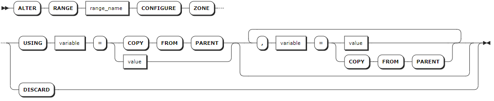
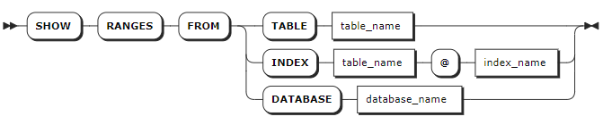

# Ranges

KWDB stores all user data (tables, indexes, etc.) and almost all system data in a sorted map of key-value pairs. This keyspace is divided into contiguous chunks called ranges. Therefore, you can find every key in one range.

From a SQL perspective, a relational table and its secondary indexes initially map to a single range, where each key-value pair in the range represents a single row in the table (also called the primary index ) or a single row in a secondary index. As soon as the size of a range reaches 512 MiB, it is split into two ranges. This process continues for these new ranges as the table and its indexes continue growing. When the table and its indexes decrease, the ranges will be automatically merged. Note that KWDB supports Mark-Sweep. Therefore, ranges are not merged immediately after the data is removed. Ranges are merged only when the removed data is garbage collected.

## ALTER RANGE

The `ALTER RANGE` statement applies a zone configuration change to a range. In addition to the databases and tables that are visible via the SQL interface, KWDB stores internal data in the following system ranges and comes with pre-configured zones for some of these ranges:

- `meta`: contain the information about the location of all data in the cluster. Set the number of replicas to `5` to make these ranges more resilient to node failure and a lower-than-default `gc.ttlseconds` value to keep these ranges smaller for reliable performance.
- `liveness`: contain the information about which nodes are live at any given time. Set the number of replicas to `5` to make these ranges more resilient to node failure and a lower-than-default `gc.ttlseconds` value to keep these ranges smaller for reliable performance.
- `system`: contain information needed to allocate new table IDs and track the status of a cluster's nodes. Set the number of replicas to `5` to make these ranges more resilient to node failure.
- `timeseries`: contain monitoring data about the cluster.

::: warning Note
Use caution when editing zone configurations for system ranges, as they could cause some (or all) parts of your cluster to stop working.
:::

### Privileges

The user must be the Admin user or a member of the `admin` role. By default, the `root` user belongs to the `admin` role.

### Syntax



### Parameters

| Parameter | Description |
| --- | --- |
| `range_name` | The name of the range to change, including: <br>- `default`: contain default replica settings. <br>- `meta`: contain the information about the location of all data in the cluster. <br>- `liveness`: contain the information about which nodes are live at any given time. <br>- `system`: contain information needed to allocate new table IDs and track the status of a cluster's nodes. <br>- `timeseries`: contain monitoring data about the cluster.|
| `variable` | The name of the variable to change. The relational database supports updating the following variables: <br>- `range_min_bytes`: the minimum size in bytes for a range of data in the zone. When a range is less than this size, KWDB will merge it with the adjacent range. By default, it is set to `256 MiB`. The value should be greater then `1 MiB` (1048576 bytes) and smaller than the maximum size of the range. <br>- `range_max_bytes`: the maximum size in bytes for a range of data in the zone. When a range reaches this size, KWDB will split it into two ranges. By default, it is set to `512 MiB`. The value should not be smaller than `5 MiB` (5242880 bytes). <br>- `gc.ttlseconds`: the number of seconds that data will be retained before garbage collection (unit: second). By default, it is set to `90000` (25 hours). It is recommended to set a value that is greater than or equal to 600 seconds (10 minutes) to avoid affecting long-time data queries. A smaller value can save disk space while a greater value will increase the interval allowed for `AS OF SYSTEM TIME` queries. In addition, it is not recommended to set a so great value because all versions of each row are stored in a single, unsplit zone. This can help prevent the updates exceeding 64 MiB, which may cause a memory lack or other issues. <br>- `num_replicas`: the number of replicas in the zone. By default, it is set to `3`. By default, for the `system` database and the `meta`, `liveness`, and `system` ranges, it is set to `5`. **Note**: The number of the replicas cannot be decreased when unavailable nodes are in the KWDB cluster. <br>- `constraints`: an array of required (+) and/or prohibited (-) constraints influencing the location of replicas. <br> - `lease_preferences`: an ordered list of required and/or prohibited (-) constraints influencing the location of leaseholders. Whether each constraint is required or prohibited is expressed with a leading + or -, respectively. Note that lease preference constraints do not have to be shared with the `constraints` field. For example, it's valid for your configuration to define a `lease_preferences` field that does not reference any values from the `constraints` field.  It is also valid to define a `lease_preferences` field with no `constraints` field at all. If the first preference cannot be satisfied, KWDB will attempt to satisfy the second preference, and so on. If none of the preferences can be met, the lease will be placed using the default lease placement algorithm, which is to base lease placement decisions on how many leases each node already has, trying to make all the nodes have around the same amount. Each value in the list can include multiple constraints. For example, the list `[[+zone=us-east-1b, +ssd], [+zone=us-east-1a], [+zone=us-east-1c, +ssd]]` means preferring nodes with an SSD in `us-east-1b`, then any nodes in `us-east-1a`, then nodes in `us-east-1c` with an SSD. <br > Default: no lease location preferences are applied if this field is not specified. |
| `value` | The value of the variable to change. |
|`COPY FROM PARENT`| Use the settings of the parent zone. |
|`DISCARD` | Remove the zone settings and use the default values. |

### Examples

This example changes the number of replicas to `7` for the `meta` range.

```sql
ALTER RANGE meta CONFIGURE ZONE USING num_replicas=7;
ALTER RANGE 

SHOW ZONE CONFIGURATION FOR RANGE meta;
    target   |            raw_config_sql
-------------+----------------------------------------
  RANGE meta | ALTER RANGE meta CONFIGURE ZONE USING
            |     range_min_bytes = 134217728,
            |     range_max_bytes = 536870912,
            |     gc.ttlseconds = 3600,
            |     num_replicas = 7,
            |     constraints = '[]',
            |     lease_preferences = '[]'
(1 row)
```

## SHOW RANGES

The `SHOW RANGES` statement shows information about the ranges that comprise the data for a table, index, or database. This information is useful for verifying how SQL data maps to underlying ranges, and where the replicas for those ranges are located.

### Privileges

The user must be the Admin user or a member of the `admin` role. By default, the `root` user belongs to the `admin` role.

### Syntax



### Parameters

| Parameter | Description |
| --- | --- |
| `table_name` | The name of the table you want range information about. |
| `index_name` | The name of the index you want range information about. |
| `database_name` | The name of the database you want range information about. |

### Examples

- Show ranges for a table.

    ```sql
    SHOW RANGES FROM TABLE orders;
    ```

    If you succeed, you should see an output similar to the following:

    ```sql
      start_key | end_key | range_id | range_size_mb | lease_holder | lease_holder_locality | replicas | replica_localities
    ------------+---------+----------+---------------+--------------+-----------------------+----------+---------------------
      NULL      | NULL    |      180 |      0.000077 |            1 |                       | {1}      | {""}
    (1 row)
    ```

- Show ranges for an index.

    ```sql
    SHOW RANGES FROM INDEX orders @ primary;
    ```

    If you succeed, you should see an output similar to the following:

    ```sql
      start_key | end_key | range_id | range_size_mb | lease_holder | lease_holder_locality | replicas | replica_localities
    ------------+---------+----------+---------------+--------------+-----------------------+----------+---------------------
      NULL      | NULL    |      180 |      0.000077 |            1 |                       | {1}      | {""}
    (1 row)
    ```

- Show ranges for a database.

    ```sql
    SHOW RANGES FROM DATABASE db3;
    ```

    If you succeed, you should see an output similar to the following:

    ```sql
      table_name | start_key | end_key | range_id | range_size_mb | lease_holder | lease_holder_locality | replicas | replica_localities
    -------------+-----------+---------+----------+---------------+--------------+-----------------------+----------+---------------------
      order_list | NULL      | NULL    |      185 |      0.000145 |            1 |                       | {1}      | {""}
      orders     | NULL      | NULL    |      180 |      0.000077 |            1 |                       | {1}      | {""}
      orders_seq | NULL      | NULL    |      183 |      0.000114 |            1 |                       | {1}      | {""}
    (3 rows)
    ```
