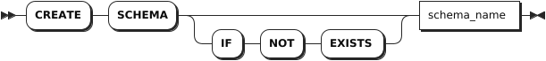
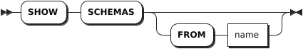

# Schema

## CREATE SCHEMA

The `CREATE SCHEMA` statement creates a new schema.

### Privileges

The user must have been granted the `CREATE` privilege on the parent database.

### Syntax



### Parameters

| Parameter | Description |
| --- | --- |
| `IF NOT EXISTS` | Optional. <br>- When the `IF NOT EXISTS` keyword is used, the system creates a new schema only if a schema of the same name does not already exist. Otherwise, the system fails to create a new schema without returning an error. <br>- When the `IF NOT EXISTS` keyword is not used, the system creates a new schema only if a schema of the same name does not already exist. Otherwise, the system fails to create a new schema and returns an error. |
| `schema_name` | The name of the schema to create. The schema name must be unique within the current database. By default, there are `information_schema`, `pg_catalog`, `public`, `kwdb_internal` schemas within the database.|

### Examples

This example creates a schema named `myschema1` for `db1` database.

```sql
-- 1. Create db1 database.

CREATE DATABASE db1;
CREATE DATABASE

-- 2. Use db1 database.

USE db1;
SET

-- 3. Create a schema within db1 database.

CREATE SCHEMA myschema1;
CREATE SCHEMA
```

## SHOW SCHEMAS

The `SHOW SCHEMAS` statement lists all schemas in a database.

### Privileges

N/A

### Syntax



### Parameters

| Parameter | Description |
| --- | --- |
| `name` | The name of the database for which to show the schema. If not specified, use the current database.|

### Examples

This example lists all schemas in the current database.

```sql
SHOW SCHEMAS;
```

If you succeed, you should see an output similar to the following:

```sql
     schema_name
----------------------
  information_schema
  kwdb_internal
  pg_catalog
  public
(4 rows)
```

## DROP SCHEMA

The `DROP SCHEMA` statement removes a schema. KWDB supports removing multiple schemas at once. You need to remove schemas in order. If an exception occurs when removing multiple schemas, the system returns an error and rollbacks all the operation. KWDB supports removing schemas with/without the `CASCADE` keyword. To remove a referenced schema, you must use the `CASCADE` keyword . Otherwise, the system fails to remove the schema and returns an error.

### Privileges

The user must have been granted the `DROP` privilege on the specified schema(s).

### Syntax


### Parameters

| Parameter | Description |
| --- | --- |
| `IF EXISTS` | Optional. <br>- When the `IF EXISTS` keyword is used, the system removes the schema only if the target schema has already existed. Otherwise, the system fails to remove the schema without returning an error. <br>- When the `IF EXISTS` keyword is not used, the system removes the schema only if the target schema has already existed. Otherwise, the system fails to remove the schema and returns an error. |
| `schema_name` | The name of the schema to remove.|
| `CASCADE` | Optional. Remove the target schema and its dependent objects. The `CASCADE` keyword does not list objects it removes, so it should be used cautiously. |
| `RESTRICT` | (Default) Optional. Do not remove the schema if any objects depend on it. |

### Examples

This example removes referenced schemas without using the `CASCADE` keyword. The system returns an error.

```sql
DROP SCHEMA myschema1, myschema2;
ERROR: schema "myschema1" is not empty and CASCADE was not specified
SQLSTATE: 2BP01
```

This example removes referenced schemas using the `CASCADE` keyword.

```sql
DROP SCHEMA myschema1, myschema2 CASCADE;
```
