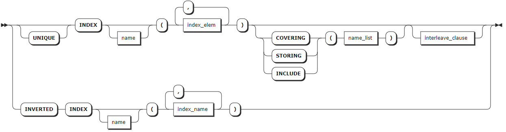
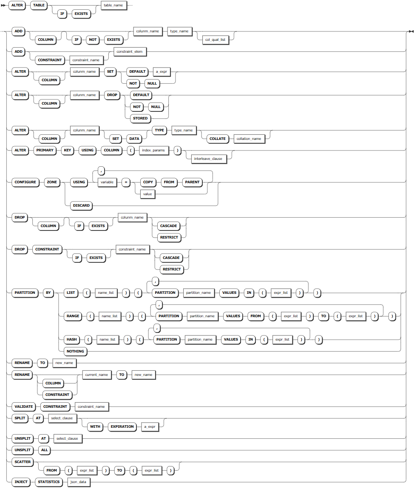

# Relational Tables

## CREATE TABLE

The `CREATE TABLE` statement creates a new table in a database.

### Privileges

The user must have been granted the `CREATE` privilege on the specified database(s).

### Syntax


- `column_def`

    

- `col_qualification`

    

- `col_quailfication_elem`

    

- `index_def`

    

- `family_def`

    

- `table_constraint`

    

- `constraint_elem`

    
  
- `interleave-clause`

    

- `partition-by-clause`

    

### Parameters

| Parameter | Description |
| --- | --- |
| `IF NOT EXISTS` | Optional. <br>- When the `IF NOT EXISTS` keyword is used, the system creates a new table only if a table of the same name does not already exist. Otherwise, the system fails to create a new table without returning an error. <br>- When the `IF NOT EXISTS` keyword is not used, the system creates a new table only if a table of the same name does not already exist. Otherwise, the system fails to create a new table and returns an error.<br > **Note** <br > `IF NOT EXISTS` checks the table name only. It does not check if an existing table has the same columns, indexes, constraints, etc., of the new table.|
| `table_name` | The name of the table to create, which must be unique within its database and follow these [Identifier Rules](../../../sql-reference/sql-identifiers.md). You can use `<database_name>.<table_name>` to specify a table in another database. If not specified, use the table in the current database. |
| `column_def` | A comma-separated list of column definitions. Each column requires a name and data type. Column names must be unique within the table but can have the same name as indexes or constraints. You can also specify a column qualification (a column-level constraint) in the format of `<column_name> <typename> [col_qual_list]`. Any PRIMARY KEY, UNIQUE, and CHECK constraints defined at the column level are moved to the table-level as part of the table's creation. Use the `SHOW CREATE TABLE` statement to view them at the table level. |
| `index_def` | Optional. A comma-separated list of index definitions. For each index, the column(s) to index must be specified. Or, a name can be specified. Index names must be unique within the table and follow these [Identifier Rules](../../sql-identifiers.md). For details about how to create an index, see [CREATE INDEX](./relational-index.md#create-index).|
| `family_def` | Optional. A comma-separated list of column family definitions in the format of `FAMILY [family_name] (name_list)`. Column family names must be unique within the table but can have the same name as columns, constraints, or indexes. A column family is a group of columns that are stored as a single key-value pair in the underlying key-value store. KWDB automatically groups columns into families to ensure efficient storage and performance. However, you can also manually assign columns to families.|
| `table_constraint` | Optional. A comma-separated list of table-level constraints in the format of `CONSTRAINT <constraint_name> <constraint_elem>`. Constraint names must be unique within the table but can have the same name as columns, column families, or indexes.|
| `interleave_clause` | Optional. KWDB supports optimizing query performance using interleaving indexes in the format of `INTERLEAVE IN PARENT <table_name> (<name_list>)`. This may changes how KWDB stores data. |

### Examples

- Create a table without defining a primary key.

    In relational databases, every table requires a primary key. If one is not explicitly defined, an INT8-typed column called `rowid` is added automatically as the primary key. KWDB supports using the `unique_rowid()` function to ensure that new rows always default to unique `rowid` values. The primary key is automatically indexed. Strictly speaking, a primary key's UNIQUE index is not created. It is derived from the key(s) under which the data is stored, so it takes no additional space. However, it appears as a normal UNIQUE index when using statements like `SHOW INDEX`.

    This example creates the `logon` table without defining a primary key.

    ```sql
    -- 1. Create a table named logon.

    CREATE TABLE logon (user_id INT, logon_date DATE);
    CREATE TABLE

    -- 2. Show columns of the logon table.

    SHOW COLUMNS FROM logon;
      column_name | data_type | is_nullable | column_default | generation_expression |  indices  | is_hidden | is_tag
    --------------+-----------+-------------+----------------+-----------------------+-----------+-----------+---------
      user_id     | INT4      |    true     | NULL           |                       | {}        |   false   | false
      logon_date  | DATE      |    true     | NULL           |                       | {}        |   false   | false
      rowid       | INT8      |    false    | unique_rowid() |                       | {primary} |   true    | false
    (3 rows)

    -- 3. Show indexes of the logon table.

    SHOW INDEX FROM logon;
      table_name | index_name | non_unique | seq_in_index | column_name | direction | storing | implicit
    -------------+------------+------------+--------------+-------------+-----------+---------+-----------
      logon      | primary    |   false    |            1 | rowid       | ASC       |  false  |  false
    (1 row)
    ```

- Create a table with a primary key defined.

    This example creates a table named `t1`. The table has three columns. The first column is the primary key column. The second column is configured with a UNIQUE constraint. The third column is not configured with any constraint. The system automatically creates indexes for the primary key column and the column configured with the UNIQUE constraint.

    ```sql
    -- 1. Create a table named t1.

    CREATE TABLE t1 (user_id INT PRIMARY KEY, user_email STRING UNIQUE, logoff_date DATE);
    CREATE TABLE

    -- 2. Show indexes of the t1 table.

    SHOW INDEX FROM t1;
      column_name | data_type | is_nullable | column_default | generation_expression |           indices           | is_hidden | is_tag
    --------------+-----------+-------------+----------------+-----------------------+-----------------------------+-----------+---------
      user_id     | INT4      |    false    | NULL           |                       | {primary,t1_user_email_key} |   false   | false
      user_email  | STRING    |    true     | NULL           |                       | {t1_user_email_key}         |   false   | false
      logoff_date | DATE      |    true     | NULL           |                       | {}                          |   false   | false
    (3 rows)
    ```

- Create a table with secondary and inverted indexes.

    This example creates a table named `vehicles` with secondary and inverted indexes during table creation. Secondary indexes allow efficient access to data with keys other than the primary key. Inverted indexes allow efficient access to the schemaless data in a JSONB column.

    ```sql
    -- 1. Create a table named vehicles.

    CREATE TABLE vehicles (
            id UUID NOT NULL,
            city STRING NOT NULL,
            type STRING,
            owner_id UUID,
            creation_time TIMESTAMP,
            status STRING,
            current_location STRING,
            ext jsonb,
            CONSTRAINT "primary" PRIMARY KEY (city ASC, id ASC),
            INDEX vehicles_auto_index_fk_city_ref_users (city ASC, owner_id ASC),
            INVERTED INDEX ix_vehicle_ext (ext),
            FAMILY "primary" (id, city, type, owner_id, creation_time, status, current_location, ext)
    );
    CREATE TABLE

    -- 2. Show indexes of the vehicles table.

    SHOW INDEX FROM vehicles;
      table_name |              index_name               | non_unique | seq_in_index | column_name | direction | storing | implicit
    -------------+---------------------------------------+------------+--------------+-------------+-----------+---------+-----------
      vehicles   | primary                               |   false    |            1 | city        | ASC       |  false  |  false
      vehicles   | primary                               |   false    |            2 | id          | ASC       |  false  |  false
      vehicles   | vehicles_auto_index_fk_city_ref_users |    true    |            1 | city        | ASC       |  false  |  false
      vehicles   | vehicles_auto_index_fk_city_ref_users |    true    |            2 | owner_id    | ASC       |  false  |  false
      vehicles   | vehicles_auto_index_fk_city_ref_users |    true    |            3 | id          | ASC       |  false  |   true
      vehicles   | ix_vehicle_ext                        |    true    |            1 | ext         | ASC       |  false  |  false
      vehicles   | ix_vehicle_ext                        |    true    |            2 | city        | ASC       |  false  |   true
      vehicles   | ix_vehicle_ext                        |    true    |            3 | id          | ASC       |  false  |   true
    (8 rows)
    ```

- Create a table with auto-generated unique row IDs.

    This example creates a table named `users`. The system automatically generates unique row IDs. The auto-generated column is a UUID-typed column with the `gen_random_uuid()` function as the default value.

    ```sql
    -- 1. Create a table named users.

    CREATE TABLE users (
            id UUID NOT NULL DEFAULT gen_random_UUID(),
            city STRING NOT NULL,
            name STRING NULL,
            address STRING NULL,
            credit_card STRING NULL,
            CONSTRAINT "primary" PRIMARY KEY (city ASC, id ASC),
            FAMILY "primary" (id, city, name, address, credit_card)
    );
    CREATE TABLE

    -- 2. Insert data into the users table. 

    INSERT INTO users (name, city) VALUES ('Petee', 'new york'), ('Eric', 'seattle'), ('Dan', 'seattle');
    INSERT 3

    -- 3. Check the data of the table.

    SELECT * FROM users;

                      id                  |   city   | name  | address | credit_card
    ---------------------------------------+----------+-------+---------+--------------
      163dc2f6-ebe6-4aa7-aba7-c1e54062ef5c | new york | Petee | NULL    | NULL
      1c9d094d-f761-4c27-9b4e-9891270af25b | seattle  | Dan   | NULL    | NULL
      7fb34aa5-2034-4ffe-97d5-679316a1acce | seattle  | Eric  | NULL    | NULL
    (3 rows)
    ```

    This example creates a table named `users`. The system automatically generates unique row IDs. The auto-generated column is a BYTES-typed column with the `UUID_v4()` function as the default value.

    ```sql
    -- 1. Create a table named users2.

    CREATE TABLE users2 (
            id BYTES DEFAULT UUID_v4(),
            city STRING NOT NULL,
            name STRING NULL,
            address STRING NULL,
            credit_card STRING NULL,
            CONSTRAINT "primary" PRIMARY KEY (city ASC, id ASC),
            FAMILY "primary" (id, city, name, address, credit_card)
    );
    CREATE TABLE

    -- 2. Insert data into the users table. 

    INSERT INTO users2 (name, city) VALUES ('Anna', 'new york'), ('Jonah', 'seattle'), ('Terry', 'chicago');
    INSERT 3

    -- 3. Check the data of the table.

    SELECT * FROM users2;
                      id                 |   city   | name  | address | credit_card
    -------------------------------------+----------+-------+---------+--------------
      \x574eb48921ba42c297cdf5242f2a2c21 | chicago  | Terry | NULL    | NULL
      \x5f81aee68c4943c09f8222723910ec45 | new york | Anna  | NULL    | NULL
      \x83923b3114294cfca3df26245b54e29b | seattle  | Jonah | NULL    | NULL
    (3 rows)
    ```

    In either case, generated IDs will be 128-bit, sufficiently large to generate unique values. Once the table grows beyond a single key-value range's default size (64 MB), new IDs will be scattered across all of the table's ranges and likely across different nodes. This means that multiple nodes will share the load. This approach has the disadvantage of creating a primary key that may not be useful in a query directly, which can require a join with another table or a secondary index.

    To store generated IDs in the same key-value range, you can use an integer-type column with the `unique_rowid()` function as the default value. Or, use the SERIAL pseudo-type to automatically generate IDs.

    ```sql
    -- 1. Create a table named users3.

    CREATE TABLE users3 (
            id INT8 DEFAULT unique_rowid(),
            city STRING NOT NULL,
            name STRING NULL,
            address STRING NULL,
            credit_card STRING NULL,
            CONSTRAINT "primary" PRIMARY KEY (city ASC, id ASC),
            FAMILY "primary" (id, city, name, address, credit_card)
    );
    CREATE TABLE

    -- 2. Insert data into the users table. 

    INSERT INTO users3 (name, city) VALUES ('Blake', 'chicago'), ('Hannah', 'seattle'), ('Bobby', 'seattle');
    INSERT 3

    -- 3. Check the data of the table.

    SELECT * FROM users3;
              id         |  city   |  name  | address | credit_card
    ---------------------+---------+--------+---------+--------------
      962382415902769153 | chicago | Blake  | NULL    | NULL
      962382415902834689 | seattle | Hannah | NULL    | NULL
      962382415902867457 | seattle | Bobby  | NULL    | NULL
    (3 rows)
    ```

    Upon insert or upsert, the `unique_rowid()` function generates a default value from the timestamp and ID of the node executing the insert. Such time-ordered values are likely to be globally unique except in cases where a very large number of IDs (100,000+) are generated per node per second. Also, there can be gaps and the order is not completely guaranteed.

- Create a table with a foreign key constraint.

    Foreign key constraints guarantee a column only uses values that already exist in the column it references, which must be from another table. This constraint enforces referential integrity between the two tables.

    There are two most important rules that govern foreign keys:

    - You must create an index for the primary key column. If you do not define any indexes using `INDEX`, `PRIMARY KEY` or `UNIQUE` during the table creation, the system will automatically creates a secondary index for the primary key column.
    - The referenced columns must contain unique values. This means the `REFERENCES` clause must use exactly the same columns as a primary key or UNIQUE constraint.

    You can include a foreign key action to specify what happens when a column referenced by a foreign key constraint is updated or deleted. The default actions are `ON UPDATE NO ACTION` and `ON DELETE NO ACTION`. This example uses `ON DELETE CASCADE`, which means when a row referenced by a foreign key constraint is deleted, all dependent rows are also deleted.

    ```sql
    -- 1. Create a table named users.

    CREATE TABLE users (
            id UUID PRIMARY KEY DEFAULT gen_random_UUID(),
            city STRING,
            name STRING,
            address STRING,
            credit_card STRING,
            dl STRING UNIQUE CHECK (LENGTH(dl) < 8)
    );
    CREATE TABLE

    -- 2. Create a table named vehicles. The vehicles table references the users table and uses its id row's value as the value of the owner_id row. 
    CREATE TABLE vehicles (
            id UUID NOT NULL DEFAULT gen_random_UUID(),
            city STRING NOT NULL,
            type STRING,
            owner_id UUID REFERENCES users(id) ON DELETE CASCADE,
            creation_time TIMESTAMP,
            status STRING,
            current_location STRING,
            ext jsonb,
            CONSTRAINT "primary" PRIMARY KEY (city ASC, id ASC),
            INDEX vehicles_auto_index_fk_city_ref_users (city ASC, owner_id ASC),
            INVERTED INDEX ix_vehicle_ext (ext),
            FAMILY "primary" (id, city, type, owner_id, creation_time, status, current_location, ext)
    );
    CREATE TABLE

    -- 3. Show the created vehicles table.

    SHOW CREATE TABLE vehicles;
    table_name|create_statement
    ----------+----------------
    vehicles  |CREATE TABLE vehicles (
    id UUID NOT NULL DEFAULT gen_random_UUID(),
    city STRING NOT NULL,
    type STRING NULL,
    owner_id UUID NULL,
    creation_time TIMESTAMP NULL,
    status STRING NULL,
    current_location STRING NULL,
    ext jsonb NULL,
    CONSTRAINT "primary" PRIMARY KEY (city ASC, id ASC),
    CONSTRAINT fk_owner_id_ref_users FOREIGN KEY (owner_id) REFERENCES users(id) ON DELETE CASCADE,
    INDEX vehicles_auto_index_fk_city_ref_users (city ASC, owner_id ASC),
    INVERTED INDEX ix_vehicle_ext (ext),
    INDEX vehicles_auto_index_fk_owner_id_ref_users (owner_id ASC),
    FAMILY "primary" (id, city, type, owner_id, creation_time, status, current_location, ext)
    )                 
    (1 row)

    -- 4. Insert data into the users table.

    INSERT INTO users (name, dl) VALUES ('Annika', 'ABC-123');
    INSERT 1

    -- 5. Check the data of the users table. 

    SELECT * FROM users;
    id                                  |city|name  |address|credit_card|dl     
    ------------------------------------+----+------+-------+-----------+-------
    fc47d311-e9c8-4627-9342-cd23822bc903|    |Annika|       |           |ABC-123
    (1 row)

    -- 6. Insert data into the vehicles table.

    INSERT INTO vehicles (city, owner_id) VALUES ('seattle', 'fc47d311-e9c8-4627-9342-cd23822bc903');
    INSERT 1

    -- 7. Check the data of the vehicles table. 

    SELECT * FROM vehicles;
    id                                  |city   |type|owner_id                            |creation_time|status|current_location|ext
    ------------------------------------+-------+----+------------------------------------+-------------+------+----------------+---
    75f4d3fd-b444-4c89-bdce-449974a35fed|seattle|    |fc47d311-e9c8-4627-9342-cd23822bc903|             |      |                |   
    (1 row)

    -- 8. Remove the row with the id of fc47d311-e9c8-4627-9342-cd23822bc903 from the users table.
    DELETE FROM users WHERE id = 'fc47d311-e9c8-4627-9342-cd23822bc903';
    DELETE 1

    -- 9. Check the data of the vehicles table. 

    SELECT * FROM vehicles;
    id|city|type|owner_id|creation_time|status|current_location|ext
    --+----+----+--------+-------------+------+----------------+---
    (0 row)
    ```

- Create a table with a check constraint.

    This example creates the `users` table. The first column is the primary key, and the last column is defined with a UNIQUE constraint and a CHECK constraint that limits the length of the string. The system automatically creates indexes for the primary key column and the column with UNIQUE constraint.

    ```sql
    -- 1. Create a table named users.
    CREATE TABLE users (
            id UUID PRIMARY KEY,
            city STRING,
            name STRING,
            address STRING,
            credit_card STRING,
            dl STRING UNIQUE CHECK (LENGTH(dl) < 8)
    );
    CREATE TABLE

    -- 2. Show columns of the users table.

    SHOW COLUMNS FROM users;
      column_name | data_type | is_nullable |  column_default   | generation_expression |         indices         | is_hidden | is_tag
    --------------+-----------+-------------+-------------------+-----------------------+-------------------------+-----------+---------
      id          | UUID      |    false    | gen_random_uuid() |                       | {primary,users_dl_key}  |   false   | false
      city        | STRING    |    true     | NULL              |                       | {}                      |   false   | false
      name        | STRING    |    true     | NULL              |                       | {}                      |   false   | false
      address     | STRING    |    true     | NULL              |                       | {}                      |   false   | false
      credit_card | STRING    |    true     | NULL              |                       | {}                      |   false   | false
      dl          | STRING    |    true     | NULL              |                       | {users_dl_key}          |   false   | false
    (6 rows)

    -- 3. Show indexes of the users table.

    SHOW INDEX FROM users;
    table_name |  index_name   | non_unique | seq_in_index | column_name | direction | storing | implicit
    -------------+---------------+------------+--------------+-------------+-----------+---------+-----------
      users     | primary       |   false    |            1 | id          | ASC       |  false  |  false
      users     | users_dl_key  |   false    |            1 | dl          | ASC       |  false  |  false
      users     | users_dl_key  |   false    |            2 | id          | ASC       |  false  |   true
    (3 rows)
    ```

- Create a table that mirrors key-value storage.

    KWDB is a distributed SQL database built on a transactional and strongly-consistent key-value store. Although it is not possible to access the key-value store directly, you can mirror direct access using a table of two columns, with one set as the primary key.

    ```sql
    -- 1. Create a table named kv.

    CREATE TABLE kv (k INT PRIMARY KEY, v BYTES);
    CREATE TABLE

    -- 2. Insert data into the users table. When the table has no indexes or foreign keys, UPSERT/UPDATE/DELETE statements translate to key-value operations with minimal overhead. For example, the following UPSERT to add or replace a row in the table would translate into a single key-value Put operation.

    UPSERT INTO kv VALUES (1, b'hello');
    UPSERT 1
    ```

- Create a table from a `SELECT` statement.

    You can use the `CREATE TABLE AS` statement to create a new table from the results of a `SELECT` statement. This example uses the query results of the users table to create a new table named `users_ny`.

    ```sql
    -- 1. Use the WHERE clause to check data of the new york column. 

    SELECT * FROM users WHERE city = 'new york';
    id                                  |city    |name |address|credit_card
    ------------------------------------+--------+-----+-------+-----------
    cd0bc9f9-707b-436c-9204-606244f4c4dd|new york|Petee|       |           
    (1 row)

    -- 2. Create a table named users_ny based ont the query results of the users table.

    CREATE TABLE users_ny AS SELECT * FROM users WHERE city = 'new york';
    CREATE TABLE

    -- 3. Check the data of the users_ny table.

    SELECT * FROM users_ny;
    id                                  |city    |name |address|credit_card
    ------------------------------------+--------+-----+-------+-----------
    cd0bc9f9-707b-436c-9204-606244f4c4dd|new york|Petee|       |           
    (1 row)
    ```

- Create a table with a computed column.

    This example creates a table named users, where the `full_name` column is computed from the `first_name` and `last_name` columns.

    ```sql
    -- 1. Create a table named users.

    CREATE TABLE users (id UUID PRIMARY KEY DEFAULT gen_random_UUID(), city STRING, first_name STRING, last_name STRING, full_name STRING AS (CONCAT(first_name, ' ', last_name)) STORED, address STRING, credit_card STRING, dl STRING UNIQUE CHECK (LENGTH(dl) < 8));
    CREATE TABLE

    -- 2. Insert data into the table.

    INSERT INTO users (first_name, last_name) VALUES
        ('Lola', 'McDog'),
        ('Carl', 'Kimball'),
        ('Ernie', 'Narayan');
    INSERT 3

    -- 3. Check the data of the table.

    SELECT * FROM users;
    id                                  |city|first_name|last_name|full_name    |address|credit_card|dl
    ------------------------------------+----+----------+---------+-------------+-------+-----------+--
    6d6b50e6-1492-4e57-8a12-12617e55c6f5|    |Ernie     |Narayan  |Ernie Narayan|       |           |  
    c4803c2e-c2e2-49bf-b912-80072229d785|    |Lola      |McDog    |Lola McDog   |       |           |  
    f363db85-dfd5-40b8-a68e-f12ca8a4b84f|    |Carl      |Kimball  |Carl Kimball |       |           |  
    (3 rows)
    ```

## SHOW TABLES

The `SHOW TABLES` statement lists the tables or views in a schema or database.

### Privileges

The user must have any privilege on the specified table(s).

### Syntax


### Parameters

| Parameter | Description |
|--- | --- |
| `database_name` | Optional. The name of the database for which to show tables. If not specified, use the current database. |
| `schema_name` | Optional. The name of the schema for which to show tables. If not specified, use the first schema (the public schema) in the query path.  |
| `WITH COMMENT` | Optional. Show a table's comments.|

### Examples

- Show all the tables in the current database.

    ```sql
    show tables;
    ```

    If you succeed, you should see an output similar to the following:

    ```sql
    table_name|table_type
    ----------+----------
    testblob  |BASE TABLE
    users     |BASE TABLE
    (2 rows)
    ```

- Show tables in the `information_schema` schema of the current database.

    ```sql
    SHOW TABLES FROM information_schema;
    ```

    If you succeed, you should see an output similar to the following:

    ```sql
    table_name                       
    ---------------------------------
    administrable_role_authorizations
    applicable_roles                 
    check_constraints                
    column_privileges                
    columns                          
    CONSTRAINT_column_usage          
    enabled_roles                    
    key_column_usage                 
    parameters                       
    ...                           
    (21 rows)
    ```

- Show tables in a specified database.

    ```sql
    SHOW TABLES FROM system.public;
    ```

    If you succeed, you should see an output similar to the following:

    ```sql
    table_name                     
    -------------------------------
    audits                         
    bo_white_list                  
    comments                       
    descriptor                     
    jobs                           
    kwdb_attribute                                                      
    kwdb_instance                                   
    kwdb_k_schema_option                          
    kwdb_node_choice_info          
    kwdb_node_info                 
    ...                          
    (52 rows)
    ```

- Show a table's comment.

    ```sql
    -- 1. Add a comment for the users table.

    COMMENT ON TABLE users IS 'This table contains information about users.';
    COMMENT ON TABLE

    -- 2. Check comments of the users table.

    SHOW TABLES WITH COMMENT;
      table_name   | table_type |                   comment
    ----------------+------------+-----------------------------------------------
      customers     | BASE TABLE |
      orders        | BASE TABLE |
      packages      | BASE TABLE |
      testblob      | BASE TABLE |
      users         | BASE TABLE | This table contains information about users.
    (5 rows)
    ```

## SHOW CREATE TABLE

The `SHOW CREATE [TABLE] <table_name>` statement shows the `CREATE TABLE` statement for an existing table.

### Privileges

The user must have any privilege on the specified table(s).

### Syntax


### Parameters

| Parameter | Description |
|-----------------|---------------------------------------------------------|
| `database_name` | The name of the database for which to show created tables. If not specified, use the current database. |
| `table_name`    | The name of the table to show.                                            |

### Examples

- Show the `CREATE TABLE` statement for a table in the current database.

    ```sql
    SHOW CREATE TABLE accounts;
      table_name|                 create_statement
    ------------+----------------------------------------------------
      accounts  | CREATE TABLE accounts (
                |     id INT8 NOT NULL DEFAULT unique_rowid(),
                |     name STRING NULL,
                |     balance DECIMAL NULL,
                |     enabled BOOL NULL,
                |     CONSTRAINT "primary" PRIMARY KEY (id ASC),
                |     FAMILY "primary" (id, name, balance, enabled)
                | )
    (1 row)
    ```

- Show the `CREATE TABLE` statement for a table in a specified database.

    ```sql
    SHOW CREATE TABLE r.t6;
      table_name  |         create_statement
    --------------+-----------------------------------
      r.public.t6 | CREATE TABLE t6 (
                  |     c1 NCHAR NULL,
                  |     FAMILY "primary" (c1, rowid)
                  | )
    (1 row)
    ```

## ALTER TABLE

The `ALTER TABLE` statement performs the following operations:

- Add columns to tables, update or rename columns of tables, and remove columns from tables.
- Add constraints to tables, validate or rename constraints of tables, and remove constraints from tables.
- Modify the primary key columns and zone configurations of tables.
- Rename tables. The renamed tables can be migrated to a new database or schema. Avoid renaming a relational table in the time-series database.
- Create or remove a range split at the specified rows in tables to improve performance.
- Redistribute data of tables.
- Inject statistics into tables.

### Privileges

- Add columns to tables, update or rename columns of tables, and remove columns from tables
  The user must have been granted the `CREATE` privilege on the specified table(s).
- Add constraints to tables, validate or rename constraints of tables, and remove constraints from tables
  The user must have been granted the `CREATE` privilege on the specified table(s).
- Modify primary key columns of tables
  The user must have been granted the `CREATE` privilege on the specified table(s).
- Modify zone configurations of tables
  The user must have been granted the `CREATE` or `ZONECONFIG` privilege on the specified table(s).
- Rename tables
  - Rename tables in the current database
    The user must have been granted the `CREATE` privilege on the specified database(s) and the `DROP` privilege on the original table. It is not possible to rename a table referenced by a view.
  - Rename tables and migrate them to other schema
    The user must have been granted the `CREATE` privilege on the specified database(s) and the `DROP` privilege on the original table.
  - Rename tables and migrate them to other databases
    The user must have been granted the `CREATE` privilege on the specified database(s) and the `DROP` privilege on the original table.
- Create or remove a range split at the specified rows in tables
  The user must have been granted the `INSERT` privilege on the specified table(s).

### Syntax



### Supported Operations

- ADD
  - `ADD COLUMN`: Add columns. You need to specify the column name and data type. The `COLUMN` keyword is optional. If not used, columns will be added by default. The `IF NOT EXISTS` keyword is optional. When the `IF NOT EXISTS` keyword is used, the system creates a new column only if a column of the same name does not already exist. Otherwise, the system fails to create a new column without returning an error. When the `IF NOT EXISTS` keyword is not used, the system creates a new column only if a column of the same name does not already exist. Otherwise, the system fails to create a new column and returns an error.
  - `ADD CONSTRAINT`: Add constraints. For details, see [ADD CONSTRAINT](./relational-constraint.md#add-constraint).
- ALTER
  - `ALTER COLUMN`: Change the default value, data type, and whether or not it's nullable.
  - `ALTER PRIMARY KEY`: Change the primary of the table.
- `CONFIGURE ZONE`: Change zone configurations of the table. For details, see [Zone Configurations](./relational-zone.md).
- DROP
  - `DROP COLUMN`: Rremove columns. You need to specify the column name. The `COLUMN` keyword is optional. If not used, columns will be removed by default. When the `IF EXISTS` keyword is used, the system removes the column only if the target table has already existed. Otherwise, the system fails to remove the column without returning an error. When the `IF EXISTS` keyword is not used, the system removes the column only if the target table has already existed. Otherwise, the system fails to remove the column and returns an error.
  - `DROP CONSTRAINT`: Remove constraints. For details, see [DROP CONSTRAINT](./relational-constraint.md#drop-constraint).
- RENAME
  - `RENAME TO`: Change the names of tables.
  - `RENAME COLUMN`: Change the names of columns. For details, see [ALTER COLUMN](./relational-column.md#alter-column).
  - `RENAME TAG/ATTRIBUTE`: Change the names of constraints. For details, see [RENAME CONSTRAINT](./relational-constraint.md#rename-constraint).
- `VALIDATE CONSTRAINT`: Validate whether the column value is matched with the constraints on the column.
- `SPLIT AT`: Create a split at the specified row or range in the table to optimize the table performance when the data is distributed unevenly or there are hotspots, etc. You can use the `WITH EXPIRATION` clause to set the expiration time of the split. Therefore, the system can automatically remove the splits after the specified time.
- `UNSPLIT AT`: Remove a split at the specified row or range from the table. You can use the `SELECT` clause to specify the position of the split to be removed.
- `UNSPLIT ALL`: Remove all range splits from the table to optimize the table performance when the data is distributed unevenly or there are hotspots, etc.
- `SCATTER`: Reditribute data of the tables to achieve better load balancing. You can use the `FROM` cluse to specify the data ranges to be reditributed.
- `INJECT STATISTICS`: An experimental feature used to inject statistics into a table. It can be used for test and debugging, and should be used with caution in a production environment.

### Parameters

| Parameter | Description |
| --- | --- |
| `table_name` | The name of the table. You can use `<database_name>.<table_name>` to specify a table in another database. If not specified, use the table in the current database. |
| `column_name` | The name of the column. The new column name must be unique within the table. |
| `typename` | The data type of the column.|
| `col_qual_list` | A list of column qualifications. KWDB supports the following qualifications: <br >- `<col_qualification_elem>`: `NULL`, `NOT NULL`, `UNIQUE`, `PRIMARY KEY`, `CHECK`, `DEFAULT`, `REFERENCES`, `AS`.<br >- `CONSTRAINT <constraint_name> <col_qualification_elem>` <br >- `COLLATE <collation_name>` <br >- `FAMILY <family_name>`: If no column family is specified, the column is added to the first column family. <br >- `CREATE FAMILY [<family_name>]` <br > **Note** <br > KWDB does not support adding columns with a FOREIGN KEY constraint. For details about how to add a FOREIGN KEY constraint to a column, see [ADD CONSTRAINT](./relational-constraint.md#add-constraint). |
| `constraint_name` | The name of the constraint. The constraint name must be unique within the table and must follow these [Identifier Rules](../../../sql-reference/sql-identifiers.md). |
| `constraint_elem` | The constraints to add. KWDB supports the following constrains: <br >- `CHECK`: specify the column values that match the specified conditons ir expressions. <br >- `UNIQUE`: specify that each non-NULL value in the constrained column must be unique. <br >- `FOREIGN KEY`: before adding a FOREIGN KEY constraint to a column, the column value must refer to anthor column. If not, you can use the `CREATE INDEX` statement to create an index and then add a FOREIGN KEY constraint. For details, see [ADD CONSTRAINT](./relational-constraint.md#add-constraint).|
| `a_expr` | The default value to use. |
| `collation_name` | The name of the collation. |
| `index_params` | The indexes. For details, see [Indexes](./relational-index.md).|
| `interleave_clause` |Optional. KWDB supports optimizing query performance using interleaving indexes in the format of `INTERLEAVE IN PARENT <table_name> (<name_list>)`. This may changes how KWDB stores data. |
| `json_data` | Inject statistics into the table. The statistics must be in JSON format and enclosed in single quotes (`''`). |

### Examples

- Rename a table.

  ```sql
  -- 1. Check tables in the current database.

  SHOW TABLES;
  table_name
  ----------
  kv        
  users     
  (2 rows)

  -- 2. Rename the users table to re_users.

  ALTER TABLE users RENAME TO re_users;
  ALTER TABLE

  -- 3. Check tables in the current database.

  SHOW TABLES;
  table_name
  ----------
  kv        
  re_users  
  (2 rows)
  ```

- Create a split.
  
  This example creates a split for the `vehicles` table base on the value of the `vehicleid` column.
  
  ```sql
  -- 1. Check data of the table.
  
  SELECT * FROM vehicles;
    vehicleid | licenseplate | owner | model | year
  ------------+--------------+-------+-------+-------
            1 | JA11111     | Mark  | BMW   | 2020
            2 | JA22222     | Jhon  | Buick | 2022
  (2 rows)
  
  -- 2. Set a split.
  ALTER TABLE vehicles SPLIT AT SELECT vehicleid from vehicles where vehicleid = 1;
      key    |    pretty     |       split_enforced_until
  -----------+---------------+-----------------------------------
    \xda8989 | /Table/82/1/1 | 2262-04-11 23:47:16.854776+00:00
  (1 row)
  ```

- Remove all splits.

  ```sql
  ALTER TABLE vehicles UNSPLIT ALL;
  ```

- Reditribute data of a table.

  ```sql
  ALTER TABLE vehicles SCATTER;
    key  |  pretty
  -------+------------
    \xda | /Table/82
  (1 row)
  ```

- Inject statistics into a table.

  ```sql
  ALTER TABLE kv INJECT STATISTICS '[{"name":"__auto__","created_at":"2000-01-01 00:00:00+00:00","columns":["k"],"row_count":2223475796173842391,"distinct_count":405727959889499775,"null_count":1571059772371006376},{"name":"__auto__","created_at":"2000-01-01 00:00:00+00:00","columns":["v"],"row_count":2223475796173842391,"distinct_count":2209895385460769436,"null_count":131122807856894709}]';
  ```

## DROP TABLE

The `DROP TABLE` statement removes a table and all its indexes from a database.

### Privileges

- The user must have been granted the `DROP` privilege on the specified table(s).
- When the target table has FOREIGN KEY constraints or is interleaved with other tables, the user must have been granted the `REFERENCES` privilege on the interleaved tables.
- When the target table is dependent on a view, the user must have been granted the `DROP` privilege on the specified table(s) and all dependent views.

### Syntax


### Parameters

| Parameter | Description |
| --- | --- |
| `IF EXISTS` | Optional. <br>- When the `IF EXISTS` keyword is used, the system removes the table only if the table has already existed. Otherwise, the system fails to remove the table without returning an error. <br>- When the `IF EXISTS` keyword is not used, the system removes the table only if the table has already existed. Otherwise, the system fails to remove the table and returns an error.|
| `table_name_list` | A comma-separated list of table names. KWDB supports removing one or more tables at once. |
| `CASCADE` | Optional. Remove the target table and its dependent objects. The `CASCADE` keyword does not list objects it removes, so it should be used cautiously. |
| `RESTRICT` | (Default) Optional. Do not remove the table if any objects depend on it. |

### Examples

This table removes a table named `kv` from the current database.

```sql
-- 1. Check tables in the current database.

SHOW TABLES;
table_name
----------
kv        
re_users  
(2 rows)

-- 2. Remove the kv table.
DROP TABLE kv;
DROP TABLE

-- 3. Check tables in the current database.

SHOW TABLES;
table_name
----------
re_users  
(1 row)
```
