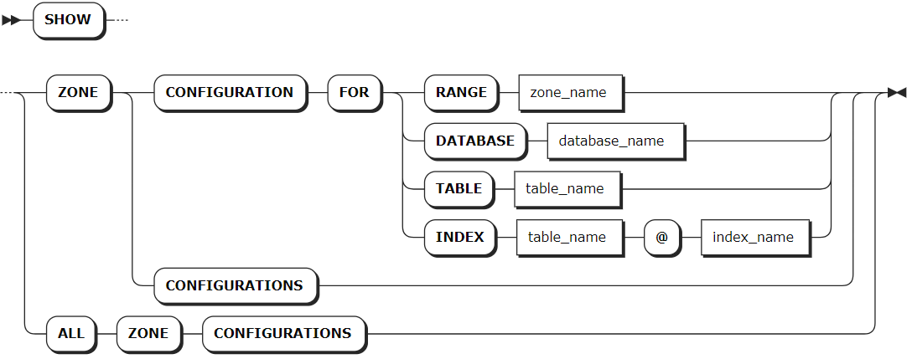

# Zone Configurations

In a KWDB cluster, each range belongs to a specific zone. When rebalancing ranges in a cluster, the system will consider zone configurations to ensure all constraints are complied with.

When being initiated, KWDB will automatically generate pre-configured zones and the `default` zone. Pre-configured zones store internal data while the `default` zone stores other data. You can directly use or change these ranges or set ranges for a specified database or table.

KWDB stores data in the following ranges. During data replication, the ranges are prioritized from table-level ranges, to database-level ranges, and then to cluster-level ranges.

- **Cluster-level ranges**: the pre-configured `default` range, which stores data that is not constrainted by a database, table, or row. This range can be changed but not removed.
- **Database-level ranges**: set ranges for specified databases.
- **Table-level ranges**: set ranges for specified tables.

KWDB stores internal data to system ranges, which apply to the following zones:

- **Cluster-level ranges**: the pre-configured `default` range, which stores system data that is not constrainted by a range.
- **System ranges**: KWDB provides zones for significant system ranges. You can also set new zones for system ranges. Changes to zones for system ranges may override the default setting. KWDB also provides pre-configured zones for the system database and the `system.jobs` table.

## CONFIGURE ZONE

The `ALTER RANGE ... CONFIGURE ZONE` statement modifies or removes zones for a database, table, or range.

### Privileges

- Modify zones for the system database or system range
  The user must be the Admin user or a member of the `admin` role.
- Modify zones for other databases or ranges/tables in other databases
  The user must have been granted `CREATE` or `ZONECONFIG` privileges on the specified object(s).

### Syntax


### Parameters

| Parameter | Description |
| --- | --- |
| `database_name` | The name of the database to change.|
| `table_name` | The name of the table to change.|
| `range_name` | The name of the range to change, including: <br>- `default`: contain default replica settings. <br>- `meta`: contain the information about the location of all data in the cluster. <br>- `liveness`: contain the information about which nodes are live at any given time. <br>- `system`: contain information needed to allocate new table IDs and track the status of a cluster's nodes. <br>- `timeseries`: contain monitoring data about the cluster.|
| `variable` | The name of the variable to change. The relational database supports updating the following variables: <br>- `range_min_bytes`: the minimum size in bytes for a range of data in the zone. When a range is less than this size, KWDB will merge it with the adjacent range. By default, it is set to `256 MiB`. The value should be greater then `1 MiB` (1048576 bytes) and smaller than the maximum size of the range. <br>- `range_max_bytes`: the maximum size in bytes for a range of data in the zone. When a range reaches this size, KWDB will split it into two ranges. By default, it is set to `512 MiB`. The value should not be smaller than `5 MiB` (5242880 bytes). <br>- `gc.ttlseconds`: the number of seconds that data will be retained before garbage collection (unit: second). By default, it is set to `90000` (25 hours). It is recommended to set a value that is greater than or equal to 600 seconds (10 minutes) to avoid affecting long-time data queries. A smaller value can save disk space while a greater value will increase the interval allowed for `AS OF SYSTEM TIME` queries. In addition, it is not recommended to set a so great value because all versions of each row are stored in a single, unsplit zone. This can help prevent the updates exceeding 64 MiB, which may cause a memory lack or other issues. <br>- `num_replicas`: the number of replicas in the zone. By default, it is set to `3`. By default, for the `system` database and the `meta`, `liveness`, and `system` ranges, it is set to `5`. **Note**: The number of the replicas cannot be decreased when unavailable nodes are in the KWDB cluster. <br>- `constraints`: an array of required (+) and/or prohibited (-) constraints influencing the location of replicas. <br> - `lease_preferences`: an ordered list of required and/or prohibited (-) constraints influencing the location of leaseholders. Whether each constraint is required or prohibited is expressed with a leading + or -, respectively. Note that lease preference constraints do not have to be shared with the `constraints` field. For example, it's valid for your configuration to define a `lease_preferences` field that does not reference any values from the `constraints` field.  It is also valid to define a `lease_preferences` field with no `constraints` field at all. If the first preference cannot be satisfied, KWDB will attempt to satisfy the second preference, and so on. If none of the preferences can be met, the lease will be placed using the default lease placement algorithm, which is to base lease placement decisions on how many leases each node already has, trying to make all the nodes have around the same amount. Each value in the list can include multiple constraints. For example, the list `[[+zone=us-east-1b, +ssd], [+zone=us-east-1a], [+zone=us-east-1c, +ssd]]` means preferring nodes with an SSD in `us-east-1b`, then any nodes in `us-east-1a`, then nodes in `us-east-1c` with an SSD. <br > Default: no lease location preferences are applied if this field is not specified. |
| `value` | The value of the variable to change. |
|`COPY FROM PARENT`| Use the settings of the parent zone. |
|`DISCARD` | Remove the zone settings and use the default values. |

### Examples

- Modify zones for a database.

    ```SQL
    ALTER DATABASE db3 CONFIGURE ZONE USING num_replicas = 5, gc.ttlseconds = 100000;
    CONFIGURE ZONE 1

    SHOW ZONE CONFIGURATION FOR DATABASE db3;
    zone_name |               config_sql                 
    +-----------+-----------------------------------------+
    db3       | ALTER DATABASE db3 CONFIGURE ZONE USING  
              |     range_min_bytes = 268435456,          
              |     range_max_bytes = 536870912,          
              |     gc.ttlseconds = 100000,              
              |     num_replicas = 5,                    
              |     constraints = '[]',                  
              |     lease_preferences = '[]'             
    (6 rows)
    ```

- Modify zones for a table.

    ```SQL
    ALTER TABLE orders CONFIGURE ZONE USING num_replicas = 3, gc.ttlseconds = 100000;
    CONFIGURE ZONE 1

    show zone configuration for table orders;
        target    |             raw_config_sql
    ---------------+------------------------------------------
    TABLE orders | ALTER TABLE orders CONFIGURE ZONE USING
                  |     range_min_bytes = 268435456,
                  |     range_max_bytes = 536870912,
                  |     gc.ttlseconds = 100000,
                  |     num_replicas = 3,
                  |     constraints = '[]',
                  |     lease_preferences = '[]'
    (1 row)
    ```

- Remove zones from a table.

    ```SQL
    alter table orders configure zone discard;
    CONFIGURE ZONE 1

    show zone configuration for table orders;
        target     |              raw_config_sql
    ----------------+-------------------------------------------
    RANGE default | ALTER RANGE default CONFIGURE ZONE USING
                  |     range_min_bytes = 268435456,
                  |     range_max_bytes = 536870912,
                  |     gc.ttlseconds = 90000,
                  |     num_replicas = 3,
                  |     constraints = '[]',
                  |     lease_preferences = '[]'
    (1 row)
    ```

## SHOW ZONE CONFIGURATION

The `SHOW ZONE CONFIGURATION` statement shows details about zones of a specified object. The `SHOW ZONE CONFIGURATIONS` and `SHOW ALL ZONE CONFIGURATIONS` statements show all system ranges of a KWDB cluster or details about replicas of the system database and system table.

### Privileges

N/A

### Syntax



### Parameters

| Parameter | Description |
| --- | --- |
| `range_name` | The name of the range, including: <br>- `default`: contain default replica settings. <br>- `meta`: contain the information about the location of all data in the cluster. <br>- `liveness`: contain the information about which nodes are live at any given time. <br>- `system`: contain information needed to allocate new table IDs and track the status of a cluster's nodes. <br>- `timeseries`: contain monitoring data about the cluster. |
| `database_name` | The name of the database. |
| `table_name` | The name of the table. |
| `index_name` | The name of the index. |

### Examples

- Check details about zones for a system range.

    ```sql
    SHOW ZONE CONFIGURATION FOR RANGE default;
    ```

    If you succeed, you should see an output similar to the following:

    ```sql
        target     |              raw_config_sql
    ----------------+-------------------------------------------
    RANGE default | ALTER RANGE default CONFIGURE ZONE USING
                  |     range_min_bytes = 268435456,
                  |     range_max_bytes = 536870912,
                  |     gc.ttlseconds = 90000,
                  |     num_replicas = 3,
                  |     constraints = '[]',
                  |     lease_preferences = '[]'
    (1 row)
    ```

- Check details about zones for a database.

    ```sql
    SHOW ZONE CONFIGURATION FOR DATABASE db1;
    ```

    If you succeed, you should see an output similar to the following:

    ```sql
        target    |             raw_config_sql
    ---------------+------------------------------------------
    DATABASE db1 | ALTER DATABASE db1 CONFIGURE ZONE USING
                  |     range_min_bytes = 1048576,
                  |     range_max_bytes = 8388608,
                  |     gc.ttlseconds = 100000,
                  |     num_replicas = 5,
                  |     constraints = '[]',
                  |     lease_preferences = '[]'
    (1 row)
    ```

- Check details about zones for a table.

    ```sql
    SHOW ZONE CONFIGURATION FOR TABLE t1;
    ```

    If you succeed, you should see an output similar to the following:

    ```sql
        target     |              raw_config_sql
    ----------------+-------------------------------------------
    RANGE default | ALTER RANGE default CONFIGURE ZONE USING
                  |     range_min_bytes = 268435456,
                  |     range_max_bytes = 536870912,
                  |     gc.ttlseconds = 90000,
                  |     num_replicas = 3,
                  |     constraints = '[]',
                  |     lease_preferences = '[]'
    (1 row)
    ```
