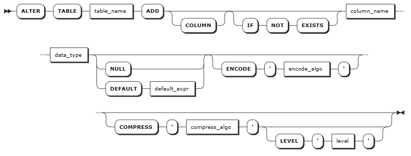
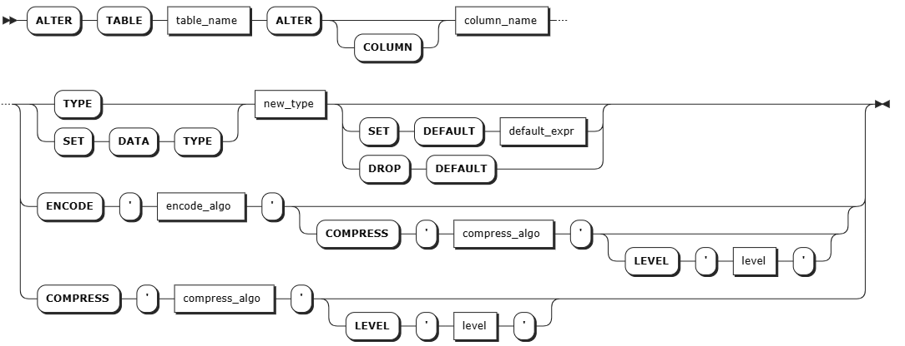
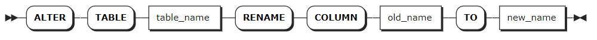
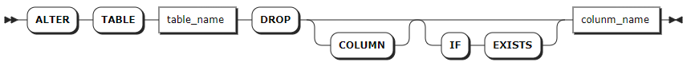

# Columns

## ADD COLUMN

The `ALTER TABLE ... ADD COLUMN` statement adds columns to existing tables. `ADD COLUMN` is an online operation, which does not block reading from or writing data into the database. Each table supports up to 4096 columns.

::: warning Note

- Currently, KWDB does not support adding multiple columns at once.
- When adding a column to an existing table, KWDB will check whether the current table is referenced by any stream. If yes, the system ruturns an error and lists all streams that reference the specified table. In this case, you should remove the stream and then add the column. For details about how to remove the stream, see [DROP STREAM](../../../../en/sql-reference/other-sql-statements/stream-sql.md#drop-stream).

:::

### Privileges

The user must be a member of the `admin` role or have been granted the `CREATE` privilege on the specified table(s). By default, the `root` user belongs to the `admin` role.

### Syntax



### Parameters

| Parameter | Description |
| --- | --- |
| `table_name` | The name of the table. You can use `<database_name>.<table_name>` to specify a table in another database. If not specified, use the table in the current database. |
| `COLUMN` |  Optional. Whether or not using the keyword does not affect the modification of the column. |
| `IF NOT EXISTS` | Optional. <br>- When the `IF NOT EXISTS` keyword is used, the system creates a new column only if a column of the same name does not already exist. Otherwise, the system fails to create a new column without returning an error. <br>- When the `IF NOT EXISTS` keyword is not used, the system creates a new column only if a column of the same name does not already exist. Otherwise, the system fails to create a new column and returns an error. |
| `column_name` | The name of the column to add. The column name must be unique within the table and supports up to 128 bytes. |
| `data_type` | The data type of the new column. For details about the data types supported by a time-series table, see [Time-Series Data Types](../../data-type/data-type-ts-db.md).|
| `DEFAULT <default expr>` | Optional. Set a default value for a data column. For non-TIMESTAMP data columns, the default value must be a constant. For TIMESTAMP-typed columns, the default value can either be a constant or the `now()` function. If the data type of the default value is not matched with that of the column, the system returns an error. KWDB supports setting NULL as the default value. |
| `NULL` | Optional. It can be only set to `NULL`. |
| `encode_algo` | Optional. Sets the encoding algorithm for the column, case-insensitively. Different data types support different encoding algorithms. For details, see [Data Compression](../../../db-operation/storage-mgmt.md#data-compression). Set to `disabled` to disable encoding for the column. If not specified, the default encoding for the data type is used. |
| `compress_algo` | Optional. Sets the compression algorithm for the column. Supported values are `lz4`, `zstd`, `zlib`, and `snappy`, case-insensitively. Set to `disabled` to disable compression. If not specified, `lz4` is used by default. |
| `level` | Optional. Sets the compression level for the compression algorithm. The value is case-insensitive and must immediately follow `COMPRESS`. Supported values are `low` (`l`), `medium` (`m`), and `high` (`h`); the default is `medium`. If `compress_algo` is set to `disabled`, specifying this parameter causes an error. |

### Examples

- Add a column to a table.

    ```sql
    ALTER TABLE ts_table ADD COLUMN c3 INT NULL;
    ```

- Add a column to a table with a default value.

    ```sql
    ALTER TABLE ts_table ADD COLUMN c4 VARCHAR(50) DEFAULT 'aaa';
    ```

- Add a column and specify its encoding and compression settings.

    ```sql
    ALTER TABLE ts_table ADD COLUMN c5 INT ENCODE 'Simple8B' COMPRESS 'lz4' LEVEL 'high';
    ```

## SHOW COLUMNS

The `SHOW COLUMNS` statement shows details about columns in a table, including each column's name, tag name, data type, and whether or not it's nullable.

### Privileges

The user must have any privilege on the specified table(s).

### Syntax


### Parameters

| Parameter | Description |
| --- | --- |
| `table_name` | The name of the table. You can use `<database_name>.<table_name>` to specify a table in another database. If not specified, use the table in the current database.|
| `WITH COMMENT` | Optional. Show a column's comments. By default, the column's comment is set to `NULL`. |

### Examples

- Show details about columns.

    This example shows details about columns in the `sensor_data` table.

    ```sql
    SHOW COLUMNS FROM sensor_data;
    ```

    If you succeed, you should see an output similar to the following:

    ```sql
      column_name |  data_type  | is_nullable | column_default | generation_expression |  indices  | is_hidden | is_tag
    --------------+-------------+-------------+----------------+-----------------------+-----------+-----------+---------
      k_timestamp | TIMESTAMPTZ |    false    | NULL           |                       | {primary} |   false   | false
      temperature | FLOAT8      |    false    | NULL           |                       | {}        |   false   | false
      humidity    | FLOAT8      |    true     | NULL           |                       | {}        |   false   | false
      pressure    | FLOAT8      |    true     | NULL           |                       | {}        |   false   | false
      sensor_id   | INT4        |    false    | NULL           |                       | {}        |   false   |  true
      sensor_type | VARCHAR(30) |    false    | NULL           |                       | {}        |   false   |  true
    (6 rows)
    ```

- Show a column's comment.

    ```sql
    -- 1. Add a comment for the sensor_id column in the sensor_data table.

    COMMENT ON COLUMN sensor_data.sensor_id IS 'device ID statistics';
    COMMENT ON COLUMN

    -- 2. Check comments of columns in the sensor_data table.

    SHOW COLUMNS FROM sensor_data WITH COMMENT;
    ```

    If you succeed, you should see an output similar to the following:

    ```sql
      column_name |  data_type  | is_nullable | column_default | generation_expression |  indices  | is_hidden | is_tag |       comment
    --------------+-------------+-------------+----------------+-----------------------+-----------+-----------+--------+-----------------------
      k_timestamp | TIMESTAMPTZ |    false    | NULL           |                       | {primary} |   false   | false  | NULL
      temperature | FLOAT8      |    false    | NULL           |                       | {}        |   false   | false  | NULL
      humidity    | FLOAT8      |    true     | NULL           |                       | {}        |   false   | false  | NULL
      pressure    | FLOAT8      |    true     | NULL           |                       | {}        |   false   | false  | NULL
      sensor_id   | INT4        |    false    | NULL           |                       | {}        |   false   |  true  | device ID statistics
      sensor_type | VARCHAR(30) |    false    | NULL           |                       | {}        |   false   |  true  | NULL
    (6 rows)
    ```

## ALTER COLUMN

The `ALTER TABLE ... ALTER COLUMN` statement performs the following operations. `ALTER COLUMN` is an online operation, which does not block reading from or writing data into the database.

- Set, change, or drop a column's default value.
- Change a column's data type. When the new data type is not matched with that of the existing data, you can still successfully change the data type. Values that do not meet the new data type will be displayed as `NULL`.
- Change a column's data width.

::: warning Note
When changing a column, KWDB will check whether the current table is referenced by any stream. If yes, the system ruturns an error and lists all streams that reference the specified table. In this case, you should remove the stream and then change the column. For details about how to remove the stream, see [DROP STREAM](../../../../en/sql-reference/other-sql-statements/stream-sql.md#drop-stream).
:::

### Privileges

The user must be a member of the `admin` role or have been granted the `CREATE` privilege on the specified table(s). By default, the `root` user belongs to the `admin` role.

### Syntax



### Parameters

| Parameter | Description |
| --- | --- |
| `table_name` | The name of the table. You can use `<database_name>.<table_name>` to specify a table in another database. If not specified, use the table in the current database. |
| `column_name` | The name of the column to modify. |
| `new_type` | The data type and data width of the column to modify. For details about the data type, default width, maximum width, and convertible data types, see [Data Type Conversion Rules](#data-type-conversion-rules). |
| `SET DEFAULT <default_expr>` | Required. KWDB writes the default value when inserting a row of data. Therefore, there is no need to explicitly specify a value for the column. For non-TIMESTAMP data columns, the default value must be a constant. For TIMESTAMP-typed columns, the default value can either be a constant or the `now()` function. If the data type of the default value is not matched with that of the column, the system returns an error. KWDB supports setting NULL as the default value.|
| `DROP DEFAULT` | Required. Remove the defined default value. No default value is inserted after the defined default value is removed.|
| `encode_algo` | Optional. Sets the column encoding algorithm, case-insensitively. Different data types support different encoding algorithms. For details, see [Data Compression](../../../db-operation/storage-mgmt.md#data-compression). Set to `disabled` to disable encoding for the column. If not specified, the data type default encoding is used. When both `ENCODE` and `COMPRESS` are specified, the order must be `ENCODE ... COMPRESS ... LEVEL ...`. |
| `compress_algo` | Optional. Sets the compression algorithm for the column. Supported values are `lz4`, `zstd`, `zlib`, and `snappy`, case-insensitively. Set to `disabled` to disable compression. If not specified, `lz4` is used by default. |
| `level` | Optional. Sets the compression level for the compression algorithm. The value is case-insensitive and must immediately follow `COMPRESS`. Supported values are `low` (`l`), `medium` (`m`), and `high` (`h`); the default is `medium`. If `compress_algo` is set to `disabled`, specifying this parameter causes an error. |

### Data Type Conversion Rules

This table lists the original data types, default width, maximum width, and converted data types for time-series data.

::: warning Note

- The converted data width must be greater than the original data width. For example, INT4 can be converted to INT8 but not to INT2. CHAR(200) can be converted to VARCHAR (254) but not to VARCHAR (100).
- CHAR-typed, VARCHAR-typed, NCHAR-typed, and NVARCHAR-typed values can be converted to values of the same data types. But the width cannot be shorter. For example, CHAR(100) can be converted to VARCHAR (200) but not to VARCHAR (50).

:::

| Original Data Type | Default Width | Max Width        | Converted Data Type                                  | Description                                                                                                                                                                                                               |
|--------------------|---------------|------------------|------------------------------------------------------|---------------------------------------------------------------------------------------------------------------------------------------------------------------------------------------------------------------------------|
| TIMESTAMP   | -        | -          | TIMESTAMPTZ, INT8, FLOAT4, FLOAT8                     | It is unavailable for TAG columns. <br>- When converting TIMESTAMP-typed values to INT8-typed values, the INT8-typed value is fixed with the microseconds precision level that has 13 digits. <br>- When converting TIMESTAMP-typed values to FLOAT4-typed values, the FLOAT4-typed value is fixed with a precision level that has about 7 valid digits. <br>- When converting TIMESTAMP-typed values to FLOAT8-typed values, the FLOAT8-typed value is fixed with a precision level that has about 15-17 valid digits.     |
| TIMESTAMPTZ | -        | -          | TIMESTAMP, INT8, FLOAT4, FLOAT8                                              | It is unavailable for TAG columns. <br>- When converting TIMESTAMPTZ-typed values to INT8-typed values, the INT8-typed value is fixed with the microseconds precision level that has 13 digits. <br>- When converting TIMESTAMPTZ-typed values to FLOAT4-typed values, the FLOAT4-typed value is fixed with a precision level that has about 7 valid digits. <br>- When converting TIMESTAMPTZ-typed values to FLOAT8-typed values, the FLOAT8-typed value is fixed with a precision level that has about 15-17 valid digits.                                                                              |
| INT2               | 2 bytes       | -                | INT4, INT8, VARCHAR                                  | When converting INT2-typed values to VARCHAR-typed values, the minimum VARCHAR-typed data width is 6.                                                                                                                      |
| INT4               | 4 bytes       | -                | INT8, VARCHAR                                        | When converting INT4-typed values to VARCHAR-typed values, the minimum VARCHAR-typed data width is 11.                                                                                                                     |
| INT8               | 8 bytes       | -                | VARCHAR                                              | When converting INT8-typed values to VARCHAR-typed values, the minimum VARCHAR-typed data width is 20.                                                                                                                     |
| FLOAT4             | 4 bytes       | -                | FLOAT, VARCHAR                                       | When converting FLOAT4-typed values to VARCHAR-typed values, the minimum VARCHAR-typed data width is 30.                                                                                                                     |
| FLOAT8             | 8 bytes       | -                | VARCHAR                                              | When converting FLOAT8-typed values to VARCHAR-typed values, the minimum VARCHAR-typed data width is 30.                                                                                                                    |
| CHAR               | 1 byte        | 1023             | NCHAR, VARCHAR, NVARCHAR                             | When converting CHAR-typed values to NCHAR-typed or NVARCHAR-typed values, the NCHAR-typed or NVARCHAR-typed data width should not be shorter than a quarter of the original data width.                                  |
| VARCHAR            | 254 bytes     | 65534 bytes      | CHAR, NCHAR, NVARCHAR, INT2, INT4, INT8, REAL, FLOAT | When converting VARCHAR-typed values to NCHAR-typed or NVARCHAR-typed values, the NCHAR-typed or NVARCHAR-typed data width should not be shorter than a quarter of the original data width.                               |
| NCHAR              | 1 character   | 254 characters   | CHAR, VARCHAR, NVARCHAR                              | When converting NCHAR-typed values to CHAR-typed or VARCHAR-typed values, the CHAR-typed or VARCHAR-typed data width should not be shorter than 4 times of the original data width.                                       |
| NVARCHAR           | 63 characters | 16383 characters | CHAR, VARCHAR, NCHAR                                 | When converting NVARCHAR-typed values to CHAR-typed or VARCHAR-typed values, the CHAR-typed or VARCHAR-typed data width should not be shorter than 4 times of the original data width. It is unavailable for TAG columns. |


### Examples

- Modify the data type of a column.

    ```sql
    ALTER TABLE ts_table ALTER COLUMN c3 TYPE INT8;
    ```

- Set a default value for a column.

    ```sql
    ALTER TABLE ts_table ALTER COLUMN c4 SET DEFAULT '789';
    ```

- Remove the default value of a column.

    ```sql
    ALTER TABLE ts_table ALTER COLUMN c4 DROP DEFAULT;
    ```

- Change a column's compression algorithm and level.

    ```sql
    ALTER TABLE ts_table ALTER COLUMN c3 COMPRESS 'zstd' LEVEL 'high';
    ```

- Change a column's encoding and compression algorithm together.

    ```sql
    ALTER TABLE ts_table ALTER COLUMN c3 ENCODE 'Simple8B' COMPRESS 'zstd' LEVEL 'medium';
    ```

- Disable a column's compression.

    ```sql
    ALTER TABLE ts_table ALTER COLUMN c3 COMPRESS 'disabled';
    ```

## RENAME COLUMN

The `ALTER TABLE ... RENAME COLUMN` statement changes the name of a column in a table.

::: warning Note
When renaming a column, KWDB will check whether the current table is referenced by any stream. If yes, the system ruturns an error and lists all streams that reference the specified table. In this case, you should remove the stream and then rename the column. For details about how to remove the stream, see [DROP STREAM](../../../../en/sql-reference/other-sql-statements/stream-sql.md#drop-stream).
:::

### Privileges

The user must be a member of the `admin` role or have been granted the `CREATE` privilege on the specified table(s). By default, the `root` user belongs to the `admin` role.

### Syntax



### Parameters

| Parameter    | Description                                                                                                                                                        |
|--------------|--------------------------------------------------------------------------------------------------------------------------------------------------------------------|
| `table_name` | The name of the table. You can use `<database_name>.<table_name>` to specify a table in another database. If not specified, use the table in the current database. |
| `old_name`   | The current name of the column.                                                                                                                                    |
| `new_name`   | The new name of the column. The new name must be unique within the table and supports up to 128 bytes.                                                            |

### Examples

This example renames the `c2` column to `c4`.

```sql
ALTER TABLE ts_table RENAME COLUMN c2 TO c4;
```

## DROP COLUMN

The `ALTER TABLE ... DROP COLUMN` statement removes columns from a table. `DROP COLUMN` is an online operation, which does not block reading from or writing data into the database.

::: warning Note

- When removing a column from a table, you must ensure that there are at lease data columns in the table. In addition, you can not remove the first column (TIMESTAMP-typed column).
- Currently, KWDB does not support removing multiple columns at once.
- When removing a column, KWDB will check whether the current table is referenced by any stream. If yes, the system ruturns an error and lists all streams that reference the specified table. In this case, you should remove the stream and then remove the column. For details about how to remove the stream, see [DROP STREAM](../../../../en/sql-reference/other-sql-statements/stream-sql.md#drop-stream).

:::

### Privileges

The user must be a member of the `admin` role or have been granted the `CREATE` privilege on the specified table(s). By default, the `root` user belongs to the `admin` role.

### Syntax



### Parameters

| Parameter | Description |
| --- | --- |
| `table_name` | The name of the table. You can use `<database_name>.<table_name>` to specify a table in another database. If not specified, use the table in the current database. |
| `COLUMN` | Optional. Whether or not using the keyword does not affect the deletion of the column. |
| `IF EXISTS` | Optional. <br>- When the `IF EXISTS` keyword is used, the system removes the column only if the target table has already existed. Otherwise, the system fails to remove the column without returning an error. <br>- When the `IF EXISTS` keyword is not used, the system removes the column only if the target table has already existed. Otherwise, the system fails to remove the column and returns an error.|
| `column_name` | The name of the column to remove. |

### Examples

This example removes the `c4` column from the `ts_table` table.

```sql
ALTER TABLE ts_table DROP c4;
```
