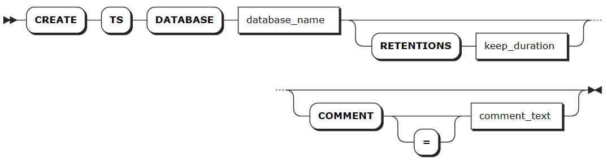
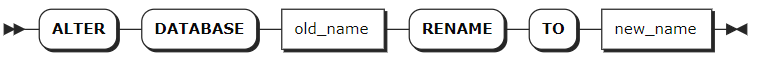
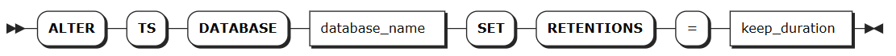
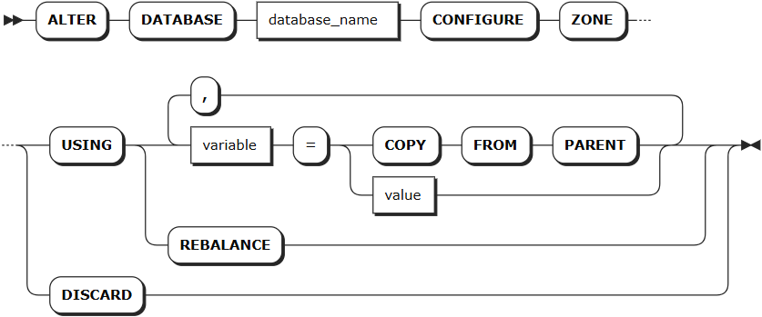
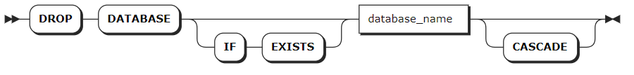

# Time-Series Databases

As a multi-model database system, KWDB supports creating one or more database objects on a KWDB instance to manage time-series and relational data. One of the database objects dedicated to storing and managing time-series data is the time-series database. The time-series database includes the `public` schema and user-defined time-series tables.

## CREATE DATABASE

The `CREATE DATABASE` statement creates a new time-series database.

### Privileges

The user must be a member of the `admin` role. By default, the `root` user belongs to the `admin` role.

### Syntax



### Parameters

:::warning Note

- The optional parameters must be configured in an order of `[RETENTIONS <keep_duration>] [COMMENT [=] <'comment_text'>]`. Otherwise, the system returns an error.
- Version 3.0.0 only supports a 10-day database partition interval. Other configuration values are not valid.

:::

| Parameter | Description |
| --- | --- |
| `database_name` | The name of the database to create, which must be unique and follow these [Identifier Rules](../../sql-identifiers.md). Currently, the name does not support Chinese characters and supports up to 63 bytes.|
| `keep_duration` | Optional. Defines the data retention period for the database. Data older than this duration will be automatically purged.<br>Default: `0s` (retain indefinitely)<br>Time units:<br>- Seconds: `s` or `second`<br>- Minutes: `m` or `minute`<br>- Hours: `h` or `hour`<br>- Days: `d` or `day`<br>- Weeks: `w` or `week`<br>- Months: `mon` or `month`<br>- Years: `y` or `year`<br>Valid range: Positive integer up to 1000 years<br>Note:<br>- Table-level retention settings override database-level settings.<br>- Longer retention periods consume more storage. Configure based on your business needs.<br>- Data that already exceeds the retention period at write time will be rejected and not stored. |
| `comment_text` | Optional. Specify the comment to be associated to the database.|

### Examples

- Create a database.

    This example creates a database named `ts_db`.

    ```sql
    CREATE TS DATABASE ts_db;
    ```

    If you succeed, you should see an output similar to the following:

    ```sql
    CREATE TS DATABASE
    ```

- Create a database and set the retention of the database.

    This example creates a database named `ts_db_temp` and sets the database retention to `50d`.

    ```sql
    CREATE TS DATABASE ts_db_temp RETENTIONS 50d;
    ```

    If you succeed, you should see an output similar to the following:

    ```sql
    CREATE TS DATABASE
    ```

- Create a database and specify comments for the database.

    This example creates a database named `ts_db_power` and associates the comment text `database for power statistics` to the database.

    ```sql
    CREATE TS DATABASE ts_db_power COMMENT = 'database for power statistics';
    ```

    If you succeed, you should see an output similar to the following:

    ```sql
    CREATE TS DATABASE
    ```

- Create a database and specify comments for the database.

    This example creates a database named `ts_db_power` and associates the comment text `database for power statistics` to the database.

    ```sql
    CREATE TS DATABASE ts_db_power COMMENT = 'database for power statistics';
    ```

    If you succeed, you should see an output similar to the following:

    ```sql
    CREATE TS DATABASE
    ```

## SHOW DATABASES

The `SHOW DATABASES` statement lists all databases in the KWDB cluster, including relational databases and time-series databases.

### Privileges

N/A

### Syntax


### Parameters

| Parameter      | Description                                                                                                |
|----------------|------------------------------------------------------------------------------------------------------------|
| `WITH COMMENT` | Optional. Show a database's comments. By default, the database's comment is set to `NULL`. |

### Examples

:::warning Note
The `engine_type` for time-series databases and relational databases is `TIME SERIES` and `RELATIONAL` respectively.
:::

- Show all created databases.

    ```sql
    SHOW DATABASES;
    ```

    If you succeed, you should see an output similar to the following:

    ```sql
      database_name  |   engine_type 
    -----------------+-------------------        
      defaultdb      | RELATIONAL
      postgres       | RELATIONAL
      system         | RELATIONAL
      ts_db          | TIME SERIES
    (4 rows)
    ```

- Show all created databases' comments.

    ```sql
    SHOW DATABASES WITH COMMENT;
    ```

    If you succeed, you should see an output similar to the following:

    ```sql
      database_name       | engine_type |            comment
    ----------------------+-------------+--------------------------------
      defaultdb           | RELATIONAL  | NULL
      postgres            | RELATIONAL  | NULL
      ts_db               | TIME SERIES | database for power statistics
      system              | RELATIONAL  | NULL
    (4 rows)
    ```

## SHOW CREATE DATABASE

The `SHOW CREATE DATABASE` statement shows the SQL statement used to create a database, along with its configuration parameters.

For time-series databases, this command shows:

- The database name
- The `retentions` parameter value (displays the specified value, or `0s` if not explicitly set during creation)

### Privileges

N/A

### Syntax


### Parameters

| Parameter       | Description                       |
|-----------------|-----------------------------------|
| `database_name` | The name of the database to view. |

### Examples

This example shows the statement that is used to create the `tsdb1` database, and the values of related parameters.

```sql
-- 1. Create a database named tsdb1, and set retentions to `10d`.

CREATE TS DATABASE tsdb1 RETENTIONS 10d PARTITION INTERVAL 10d;

--2. Show the created tsdb1 database.

SHOW CREATE DATABASE tsdb1;
  database_name |       create_statement
----------------+-------------------------------
  tsdb1         | CREATE TS DATABASE tsdb1
                |      retentions 864000s
                |      partition interval 10d
(1 row)
```

## USE

The `USE` statement sets a target database to the current database.

### Privileges

N/A

### Syntax


### Parameters

| Parameter | Description                      |
|-----------|----------------------------------|
| `db_name` | The name of the database to use. |

### Examples

This example sets the `ts_db` database to the current database.

```sql
USE ts_db;
```

## ALTER DATABASE

The `ALTER DATABASE` statement applies a name, retention, or zone configurations to a database.

### Privileges

- Change the name of the database: the user must be a member of the `admin` role. By default, the `root` user belongs to the `admin` role.

- Change the retention of the database: the user must be a member of the `admin` role. By default, the `root` user belongs to the `admin` role.

- Change the zone configurations of the system database: the user must be a member of the `admin` role. By default, the `root` user belongs to the `admin` role.

- Modify zones for other databases: the user must be a member of the `admin` role or have been granted `CREATE` or `ZONECONFIG` privileges. By default, the `root` user belongs to the `admin` role.

### Syntax

- Change the name of the database

    

- Change the retention of the database

    

- Change the zone configurations of the database

    

### Parameters

| Parameter | Description |
| --- | --- |
| `old_name` | The name of the database to change. |
| `new_name` | The new name of the database, which must be unique and follow these [Identifier Rules](../../sql-identifiers.md). Currently, the name does not support Chinese characters and supports up to 63 bytes.|
| `database_name` | The name of the database to change. |
| `keep_duration` |Optional. Defines the data retention period for the database. Data older than this duration will be automatically purged.<br>Default: `0s` (retain indefinitely)<br>Time units:<br>- Seconds: `s` or `second`<br>- Minutes: `m` or `minute`<br>- Hours: `h` or `hour`<br>- Days: `d` or `day`<br>- Weeks: `w` or `week`<br>- Months: `mon` or `month`<br>- Years: `y` or `year`<br>Valid range: Positive integer up to 1000 years<br>Note:<br>- Table-level retention settings override database-level settings.<br>- Longer retention periods consume more storage. Configure based on your business needs.<br>- Data that already exceeds the retention period at write time will be rejected and not stored.  |
| `variable` | The name of the variable to modify. The following variables are supported: <br>- `range_min_bytes`: the minimum size in bytes for a data range. When a range is smaller than this value, KWDB merges it with an adjacent range. Default: 256 MiB. The value must be greater than 1 MiB (1048576 bytes) and smaller than the maximum size of the range. <br>- `range_max_bytes`: the maximum size in bytes for a data range. When a range exceeds this value, KWDB splits it into two ranges. Default: 512 MiB. The value must not be smaller than 5 MiB (5242880 bytes). <br>- `gc.ttlseconds`: the number of seconds data will be retained before garbage collection. Default: `90000` (25 hours). We recommend setting a value of at least 600 seconds (10 minutes) to avoid affecting long-running queries. A smaller value saves disk space while a larger value increases the time range allowed for `AS OF SYSTEM TIME` queries. Additionally, since all versions of each row are stored in a single, unsplit range, avoid setting this value too large to prevent all changes to a single row from exceeding 64 MiB, which may cause memory issues or other problems. <br>- `num_replicas`: the number of replicas. Default: 3. For the `system` database and the `meta`, `liveness`, and `system` ranges, the default number of replicas is 5. **Note**: The number of replicas cannot be reduced when unavailable nodes exist in the cluster. <br>- `constraints`: required (+) and/or prohibited (-) constraints for where replicas can be placed. For example, `constraints = '{"+region=NODE1": 1, "+region=NODE2": 1, "+region=NODE3": 1}'` places one replica on each of nodes 1, 2, and 3. Currently only supports the `region=NODEx` format. <br>- `lease_preferences`: an ordered list of required (+) and/or prohibited (-) constraints for where the leaseholder should be placed. For example, `lease_preferences = '[[+region=NODE1]]'` prefers placing the leaseholder on node 1. If this isn't possible, KWDB tries the next preference in the list. If no preferences can be satisfied, KWDB uses the default lease distribution algorithm, which balances leases across nodes based on their current lease count. Each value in the list can contain multiple constraints. <br>- `ts_merge.days`: the merging time for time-series data ranges. After ranges in the same time-series table at the same hash point are split by timestamp, ranges that exceed this time are automatically merged and won't be automatically split again. Default: 10 (10 days). The value must be greater than or equal to 0. When set to 0, time-series data ranges are automatically merged immediately after being split by timestamp. If network or other failures are caused by too many system ranges, you can reduce this value to mitigate data volume issues. <br><br>**Tips**: <br>- `lease_preferences` can be defined independently from the `constraints` field. <br>- When setting `constraints`, you must also set `num_replicas`, and the number of constraints must be less than or equal to the number of replicas. The order of `constraints` doesn't matter. <br>- By default, KWDB only splits ranges based on hash points, so the range merging by time is disabled by default. To support merging ranges by time, set the `kv.kvserver.ts_split_interval` runtime parameter to `1` and the `kv.kvserver.ts_split_by_timestamp.enabled` runtime parameter to `true` to enable splitting ranges by both hash points and timestamps.|
| `value` | The value of the variable to change. |
|`COPY FROM PARENT`| Use the settings of the parent zone. |
|`DISCARD` | Remove the zone settings and use the default values. |

### Examples

- Change the name of a database.

    This example renames the `ts_db` database to `tsdb`.

    ```sql
    ALTER DATABASE ts_db RENAME TO tsdb;
    ```

- Change the retention of a database.

    This example sets the retention of the `tsdb` database to `10 day`.

    ```sql
    ALTER TS DATABASE tsdb SET RETENTIONS = 10 day;
    ```

- Change the zone configurations of a database.
  
    This example sets the number of the replicas of the `tsdb` database to `5` and the time to retain data before garbage collection to `100000` seconds.

    ```SQL
    -- 1. Change the zone configurations of the tsdb database.

    ALTER DATABASE tsdb CONFIGURE ZONE USING num_replicas = 5, gc.ttlseconds = 100000;
    CONFIGURE ZONE 1

    -- 2. Check whether the configurations are applied successfully. 

    SHOW ZONE CONFIGURATION FOR DATABASE tsdb;
        target     |              config_sql
    ----------------+-------------------------------------------
      DATABASE tsdb | ALTER DATABASE tsdb CONFIGURE ZONE USING
                    |     range_min_bytes = 134217728,
                    |     range_max_bytes = 536870912,
                    |     gc.ttlseconds = 100000,
                    |     num_replicas = 5,
                    |     constraints = '[]',
                    |     lease_preferences = '[]'
    (1 row)
    ```

## DROP DATABASE

The `DROP DATABASE` statement removes a database and all its objects from a KWDB cluster. To remove the current database, use the `USE <database_name>` statement to set another database as the current database. After deletion, all privileges on the database and its tables are also removed.

::: warning Note
<<<<<<< HEAD
When removing a database, KWDB will check whether the current database is referenced by the stream computing service. If yes, the system ruturns an error and lists all streams that reference the specified database. In this case, you can use the `CASCADE` keyword to remove the specified database and its dependent objects.
=======
When removing a database, KWDB will check whether the current database is referenced by the real-time data feed service. If yes, the system returns an error and lists all pipes that reference the specified database. In this case, you can use the `CASCADE` keyword to remove the specified database and its dependent objects.
>>>>>>> 7c0a557 (add update)
:::

### Privileges

The user must be a member of the `admin` role or have the `DROP` privilege on the specified database and tables in the database. By default, the `root` user belongs to the `admin` role.

### Syntax



### Parameters

| Parameter | Description |
| --- | --- |
| `IF EXISTS` | Optional. <br>- When the `IF EXISTS` keyword is used, the system removes the database only if the database has already existed. Otherwise, the system fails to remove the database without returning an error. <br>- When the `IF EXISTS` keyword is not used, the system removes the database only if the database has already existed. Otherwise, the system fails to remove the database and returns an error. |
| `database_name` | The name of the database to remove. |
| `CASCADE` | Optional. Remove all tables in the database. The `CASCADE` keyword does not list objects it removes, so it should be used cautiously.|

### Examples

This example removes the `tsdb` database and its dependent objects using the `CASCADE` keyword.

```sql
-- 1. Show tables in the tsdb database.

SHOW TABLES FROM tsdb;
  table_name  |    table_type
--------------+--------------------
  sensor_data | TIME SERIES TABLE
  temp        | TIME SERIES TABLE
  water       | TIME SERIES TABLE
(3 rows)

-- 2. Remove the tsdb database and its dependent objects.

DROP DATABASE tsdb CASCADE;
DROP DATABASE

-- 3. Show tables in the tsdb database.

SHOW TABLES FROM tsdb;
ERROR: target database or schema does not exist
```
