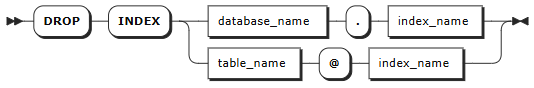

# Indexes

## CREATE INDEX

When you create a time series table in KWDB, the system automatically creates indexes for primary tag columns. Additionally, you can create custom indexes on regular tag columns to further improve query performance.

Properly configured indexes significantly improve query performance in the following scenarios:

- Equality queries that don't select primary tag columns

  ```sql
  SELECT c1, tag1 FROM t1 WHERE tag1 = 100;
  ```
  
- IN queries that don't select primary tag columns or other indexed tags

  ```sql
  SELECT c1, tag1 FROM t1 WHERE tag1 IN (100, 200, 300);
  ```
  
- Combined queries with only indexed tags and regular columns using AND conditions

  ```sql
  SELECT c1, tag1 FROM t1 WHERE tag1 = 100 AND c1 = 200;
  ```
  
- Combined queries with only multiple indexed tags using OR or AND conditions

  ```sql
  SELECT c1, tag1 FROM t1 WHERE tag1 = 100 OR tag2 = 100;
  ```

### Privileges

The user must be a member of the `admin` role or have CREATE privilege on the specified table(s). By default, the `root` user belongs to the `admin` role.

### Syntax


### Parameters

| Parameter | Description |
| --- | --- |
| `index_name` | The name of the index to be created. This name must be unique in the database and follow these [Identifier Rules](../../../sql-reference/sql-identifiers.md). |
| `table_name` | The name of the specified table(s). |
| `tag_name_list` | Comma-separated list of tag columns to include in the index. Supports up to 4 tags per index. <br >**Note** <br > Only regular tag columns (not primary tags) with integer, floating-point, CHAR, or NCHAR data types are supported. |

### Examples

The following example creates an index on the `sensor_type` regular tag column in the `temperature` table:

```sql
CREATE INDEX sensor_type_index ON temperature (sensor_type);
```

## SHOW INDEXES

The `SHOW INDEXES` statement lists all indexes defined for a specific table.

### Privileges

The user must have any privilege on the specified table(s).

### Syntax


### Parameters

| Parameter | Description |
| --- | --- |
| `table_name` | The name of the table whose indexes you want to view. |

### Examples

The following example shows all indexes in the `temperature` table.

```sql
SHOW INDEXES FROM temperature;
```

## ALTER INDEX

The `ALTER INDEX` statement allows you to rename an existing index.

### Privileges

The user must be a member of the `admin` role or have CREATE privilege on the table containing the index. By default, the `root` user belongs to the `admin` role.

### Syntax


### Parameters

| Parameter | Description |
| --- | --- |
| `index_name` | The current name of the index. |
| `new_name` | The new name for the index. This name must be unique within the database and follow these [Identifier Rules](../../sql-identifiers.md). |

### Examples

The following example renames the `sensor_type_index` index to `sensor_index`.

```sql
-- 1. Rename the index.
ALTER INDEX sensor_type_index RENAME TO sensor_index;

-- 2. Verify the change.
SHOW INDEXES FROM temperature;
```

## DROP INDEX

The `DROP INDEX` statement allows you to remove an index from a table.

### Privileges

The user must be a member of the `admin` role or have CREATE privilege on the specified table(s). By default, the `root` user belongs to the `admin` role.

### Syntax




### Parameters

| Parameter | Description |
| --- | --- |
| `table_name` | The name of the table containing the index to be deleted. |
| `index_name` | The name of the index to be deleted. |

### Examples

The following example deletes the `sensor_index` index from the `temperature` table.

```sql
-- 1. Delete the sensor_index index from the temperature table.
DROP INDEX temperature@sensor_index;

-- 2. Verify the deletion.
SHOW INDEXES FROM temperature;
```