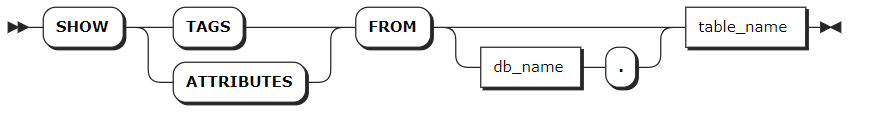
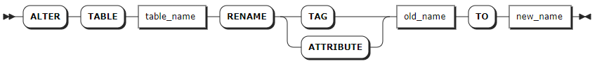
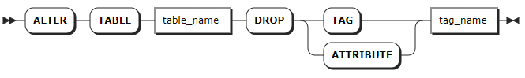

# Tags

Tags describe characteristics and behaviors of data objects, such as the data type, length, and default values etc. Tags define the structure and rules of data objects, ensuring data integrity and validity.

KWDB supports using ATTRIBUTE and ATTRIBUTES as aliases of TAG and TAGS.

## ADD TAG

The `ALTER TABLE ... ADD TAG` statement adds tags to existing tables. `ADD TAG` is an online operation, which does not block reading from or writing data into the database. 

::: warning Note

- KWDB does not support adding multiple tags at once.
- KWDB does not support adding primary tags or non-NULL tags to an exsiting table.

:::

### Privileges

The user must have been granted the `CREATE` privilege on the specified table(s).

### Syntax


### Parameters

| Parameter | Description |
| --- | --- |
| `table_name` | The name of the table. You can use `<database_name>.<table_name>` to specify a table in another database. If not specified, use the table in the current database. |
| `tag_name` | The name of the tag to add. The tag name supports up to 128 bytes. KWDB does not support defining database-level tags. |
| `tag_type` | The data type of the tag. KWDB does not support setting TIMESTAMP, TIMESTAMPTZ, NVARCHAR or GEOMETRY data types for time-series tables. |

### Examples

This example adds a `color` tag to the `ts_table` table.

```sql
ALTER TABLE ts_table ADD TAG color VARCHAR(30);
```

## SHOW TAGS

The `SHOW TAGS` statement lists all tags of a table.

### Privileges

The user must have any privilege on the specified table(s).

### Syntax



### Parameters

| Parameter | Description |
| --- | --- |
| `db_name` | The name of the database for which to show tags. If not specified, use the current database.|
| `table_name` | The name of the table. You can use `<database_name>.<table_name>` to specify a table in another database. If not specified, use the table in the current database. |

### Examples

This example shows tags of the `sensor_data` table in the current database.

```sql
SHOW TAGS FROM sensor_data;
```

If you succeed, you should see an output similar to the following:

```sql
      tag     |    type     | is_primary | nullable
--------------+-------------+------------+-----------
  sensor_id   | INT4        |    true    |  false
  sensor_type | VARCHAR(30) |   false    |  false
(2 rows)
```

## SHOW TAG VALUES

The `SHOW TAG VALUES` statement shows all tag values of a table.

### Privileges

The user must have been granted the `SELECT` privilege on the specified table(s).

### Syntax


### Parameters

| Parameter | Description |
| --- | --- |
| `db_name` | The name of the database for which to show tag values. If not specified, use the current database.|
| `table_name` |The name of the table. You can use `<database_name>.<table_name>` to specify a table in another database. If not specified, use the table in the current database.|

### Examples

This example shows tag values of the `sensor_data` table in the current database.

```sql
SHOW TAG VALUES FROM sensor_data;
```

If you succeed, you should see an output similar to the following:

```sql
  sensor_id 
------------
          1
(1 row)
```

## ALTER TAG

The `ALTER TABLE ... ALTER TAG` statement changes the data type or width of tags. `ALTER TAG` is an online operation, which does not block reading from or writing data into the database. When the new data type is not matched with that of the existing data, you can still successfully change the data type. Values that do not meet the new data type will be displayed as `NULL`.

### Privileges

The user must have been granted the `CREATE` privilege on the specified table(s).

### Syntax


### Parameters

| Parameter | Description |
| --- | --- |
| `table_name` | The name of the table. You can use `<database_name>.<table_name>` to specify a table in another database. If not specified, use the table in the current database.|
| `tag_name` | The name of the tag to modify. |
| `new_type` | The data type and data width of the tag to modify. <br > **Note** <br >- The converted data width must be greater than the original data width. For example, INT4 can be converted to INT8 but not to INT2. CHAR(200) can be converted to VARCHAR (254) but not to VARCHAR (100). <br >- CHAR-typed, VARCHAR-typed, NCHAR-typed, and NVARCHAR-typed values can be converted to values of the same data types. But the width cannot be shorter. For example, CHAR(100) can be converted to VARCHAR (200) but not to VARCHAR (50). For details about the data type, default width, maximum width, and convertible data types, see [Time-Series Data Types](../../../sql-reference/data-type/data-type-ts-db.md). |

### Examples

This example changes the data type and width of the `color` tag to `VARCHAR(50)`.

```sql
ALTER TABLE ts_table ALTER color TYPE VARCHAR(50);
```

## RENAME TAG

The `ALTER TABLE ... RENAME TAG` statement changes the name of a tag in a table.

### Privileges

The user must have been granted the `CREATE` privilege on the specified table(s).

### Syntax



### Parameters

| Parameter | Description |
| --- | --- |
| `table_name` | The name of the table. You can use `<database_name>.<table_name>` to specify a table in another database. If not specified, use the table in the current database.|
| `old_name` | The current name of the tag.                                                                                                                                    |
| `new_name` | The new name of the tag. The new name supports up to 128 bytes.                                                            |

### Examples

This example renames the `site` tag to `location`.

```sql
ALTER TABLE ts_table RENAME TAG site TO location;
```

## DROP TAG

The `ALTER TABLE ... DROP TAG` statement removes tags from a table. `DROP TAG` is an online operation, which does not block reading from or writing data into the database.

::: warning Note

- Currently, KWDB does not support removing primary tags.
- Currently, KWDB does not support removing multiple tags at once.
- If an index exists for the tag to be deleted, you must delete the index first.

:::

### Privileges

The user must have been granted the `CREATE` privilege on the specified table(s).

### Syntax



### Parameters

| Parameter | Description |
| --- | --- |
| `table_name` | The name of the table. You can use `<database_name>.<table_name>` to specify a table in another database. If not specified, use the table in the current database. |
| `tag_name` | The name of the tag to remove. Currently, KWDB does not support removing primary tags. |

### Examples

This example removes the `color` tag from the `ts_table` table.

```sql
ALTER TABLE ts_table DROP TAG color;
```
