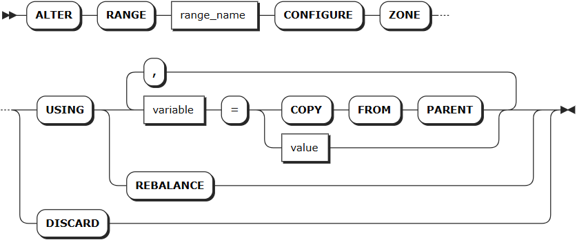

# Ranges

KWDB stores all user data and almost all system data in a sorted map of key-value pairs. This keyspace is divided into contiguous chunks called ranges. Therefore, you can find every key in one range.

From a SQL perspective, a table initially maps to a single range, where each key-value pair in the range represents a single row in the table. As soon as the size of a range reaches 512 MiB, it is split into two ranges. This process continues for these new ranges as the table continues growing. When the table decreases, the ranges will be automatically merged. Note that KWDB supports Mark-Sweep. Therefore, ranges are not merged immediately after the data is removed. Ranges are merged only when the removed data is garbage collected.

Each range belongs to a specific zone. When rebalancing ranges in a cluster, the system will consider zone configurations to ensure all constraints are complied with. For details about zones, see [Zones](./ts-zone.md).

KWDB supports using the `SELECT * from kwdb_internal.ranges` statement to check ranges about a time-series database and table.

## ALTER RANGE

The `ALTER RANGE` statement applies a zone configuration change to a range. In addition to the databases and tables that are visible via the SQL interface, KWDB stores internal data in the following system ranges and comes with pre-configured zones for some of these ranges:

- `meta`: contain the information about the location of all data in the cluster. Set the number of replicas to `5` to make these ranges more resilient to node failure and a lower-than-default `gc.ttlseconds` value to keep these ranges smaller for reliable performance.
- `liveness`: contain the information about which nodes are live at any given time. Set the number of replicas to `5` to make these ranges more resilient to node failure and a lower-than-default `gc.ttlseconds` value to keep these ranges smaller for reliable performance.
- `system`: contain information needed to allocate new table IDs and track the status of a cluster's nodes. Set the number of replicas to `5` to make these ranges more resilient to node failure.
- `timeseries`: contain monitoring data about the cluster.

::: warning Note
Use caution when editing zone configurations for system ranges, as they could cause some (or all) parts of your cluster to stop working.
:::

### Privileges

The user must be a member of the `admin` role. By default, the `root` user belongs to the `admin` role.

### Syntax



### Parameters

| Parameter | Description |
| --- | --- |
| `range_name` | The name of the range to change, including: <br>- `default`: contain default replica settings. <br>- `meta`: contain the information about the location of all data in the cluster. <br>- `liveness`: contain the information about which nodes are live at any given time. <br>- `system`: contain information needed to allocate new table IDs and track the status of a cluster's nodes. <br>- `timeseries`: contain monitoring data about the cluster.|
| `variable` |The name of the variable to modify. The following variables are supported: <br>- `range_min_bytes`: the minimum size in bytes for a data range. When a range is smaller than this value, KWDB merges it with an adjacent range. Default: 256 MiB. The value must be greater than 1 MiB (1048576 bytes) and smaller than the maximum size of the range. <br>- `range_max_bytes`: the maximum size in bytes for a data range. When a range exceeds this value, KWDB splits it into two ranges. Default: 512 MiB. The value must not be smaller than 5 MiB (5242880 bytes). <br>- `num_replicas`: the number of replicas. Default: 3. For the `system` database and the `meta`, `liveness`, and `system` ranges, the default number of replicas is 5. **Note**: The number of replicas cannot be reduced when unavailable nodes exist in the cluster. <br>- `constraints`: required (+) and/or prohibited (-) constraints for where replicas can be placed. For example, `constraints = '{"+region=NODE1": 1, "+region=NODE2": 1, "+region=NODE3": 1}'` places one replica on each of nodes 1, 2, and 3. Currently only supports the `region=NODEx` format. <br>- `lease_preferences`: an ordered list of required (+) and/or prohibited (-) constraints for where the leaseholder should be placed. For example, `lease_preferences = '[[+region=NODE1]]'` prefers placing the leaseholder on node 1. If this isn't possible, KWDB tries the next preference in the list. If no preferences can be satisfied, KWDB uses the default lease distribution algorithm, which balances leases across nodes based on their current lease count. Each value in the list can contain multiple constraints. <br>- `ts_merge.days`: the merging time for time-series data ranges. After ranges in the same time-series table at the same hash point are split by timestamp, ranges that exceed this time are automatically merged and won't be automatically split again. Default: 10 (10 days). The value must be greater than or equal to 0. When set to 0, time-series data ranges are automatically merged immediately after being split by timestamp. If network or other failures are caused by too many system ranges, you can reduce this value to mitigate data volume issues. <br><br>**Tips**: <br>- `lease_preferences` can be defined independently from the `constraints` field. <br>- When setting `constraints`, you must also set `num_replicas`, and the number of constraints must be less than or equal to the number of replicas. The order of `constraints` doesn't matter. <br>- By default, KWDB only splits ranges based on hash points, so the range merging by time is disabled by default. To support merging ranges by time, set the `kv.kvserver.ts_split_interval` runtime parameter to `1` and the `kv.kvserver.ts_split_by_timestamp.enabled` runtime parameter to `true` to enable splitting ranges by both hash points and timestamps.|
| `value` | The value of the variable to change. |
|`COPY FROM PARENT`| Use the settings of the parent zone. |
|`DISCARD` | Remove the zone settings and use the default values. |

### Examples

This example changes the number of replicas to `7` for the `meta` range.

```SQL
ALTER RANGE meta CONFIGURE ZONE USING num_replicas=7;
ALTER RANGE 

SHOW ZONE CONFIGURATION FOR RANGE meta;
    target   |            raw_config_sql
-------------+----------------------------------------
  RANGE meta | ALTER RANGE meta CONFIGURE ZONE USING
              |     range_min_bytes = 268435456,
              |     range_max_bytes = 536870912,
              |     gc.ttlseconds = 3600,
              |     num_replicas = 7,
              |     constraints = '[]',
              |     lease_preferences = '[]'
(1 row)
```
