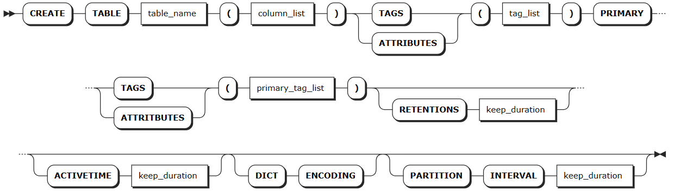
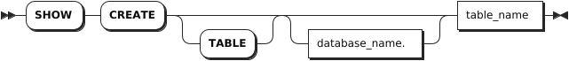
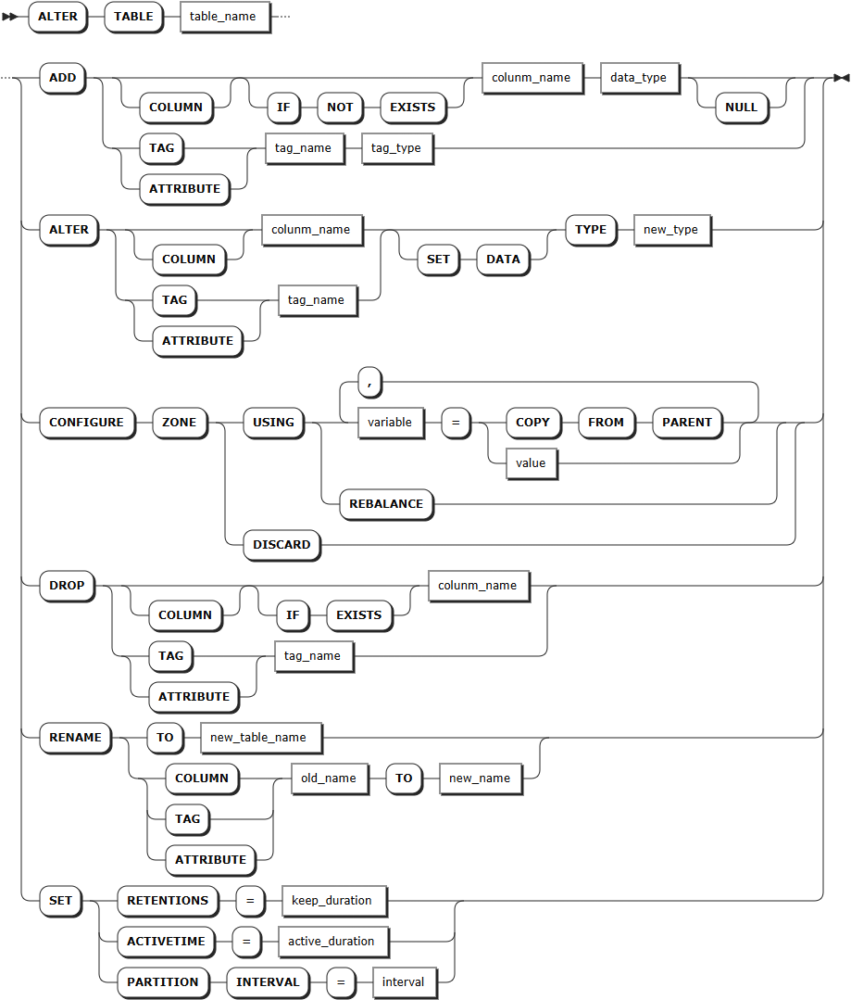

# Time-Series Tables

The time-series table stores time-series data.

## CREATE TABLE

The `CREATE TABLE` statement creates a new table in a database.

### Privileges

The user must have been granted the `CREATE` privilege on the specified database(s).

### Syntax



### Parameters

:::warning Note
Currently, the table name, column name, and tag name do not support Chiese characters.
Configure optional parameters in an order of `[RETENTIONS <keep_duration>][ACTIVETIME <active_duration>] [DICT ENCODING] [PARTITION INTERVAL <interval>]`. Otherwise, the system returns an error.
:::

| Parameter | Description |
| --- | --- |
| `table_name`| The name of the table to create, which must be unique within its database and follow these [Identifier Rules](../../sql-identifiers.md). The table name supports up to 128 bytes. |
| `column_list`| A comma-separated list of columns. You can specify two or more columns. Each column requires a name, data type and default value. Each table supports up to 4096 columns. <br > The column name supports up to 128 bytes. You can set the data type to NOT NULL. By default, the data type is set to NULL. For non-TIMESTAMP data columns, the default value must be a constant. For TIMESTAMP-typed columns, the default value can either be a constant or the `now()` function. If the data type of the default value is not matched with that of the column, the system returns an error. KWDB supports setting NULL as the default value. |
| `tag_list`| A comma-separated list of tags. You can specify one or more tags. Each table supports up to 128 tags. Each tag requires a name and data type. The tag name supports up to 128 bytes. You can set the data type to NOT NULL. By default, the data type is set to NULL. KWDB does not support setting TIMESTAMP, TIMESTAMPTZ, NVARCHAR or GEOMETRY data types for time-series tables. |
| `primary_tag_list`| A comma-separated list of primary tags. You can specify one or more primary tags. Each table supports up to 4 primary tags. Primary tags must be included in the list of tags and set to NOT NULL. Currently, primary tags does not support floating-point and variable-length data types, except for the VARCHAR data type. By default, a VARCHAR-typed data length is `64` bytes. The maximum of a VARCHAR-typed data length is `128` bytes. |
| `keep_duration`| Optional. Specify the retention of the table. By default, it is set to `0d`, which means not deleting the table after expiration. Support the following units: second (S or SECOND), minute (M or MINUTE), hour (H or HOUR), day (D or DAY), week (W or WEEK), month (M or MONTH), and year (Y or YEAR). The value must be an integer and the maximum value must not exceed `1000` years. <br > **Note** <br >- The retention configuration does not apply to the current partition. The data is stored in the current partition. When the value of the retention is less than the partition interval, you can still query the data even if the retention of the table has expired. <br >- When all data in a partition exceeds the retention (`now() - retention time`), the system attempts to delete the data in that partition. If you are reading or writing the data in the partition at this time, or the system is compressing or making statistcs on the partition, the system cannot delete the data in the partition immediately. The system tries to delete the data again at the next retention. (By default, the system schedules data every hour.) <br >- The retention and partition interval settings are closely related to the storage space of the system. The longer the retention and the larger the partition interval, the more storage space the system requires. For the formula for calculating the storage space, see [Estimate Disk Usage](../../../db-operation/cluster-planning.md#estimate-disk-usage). <br >- When you individually specify or modify the retention or partition interval of a time-series table within the database, the configuration applies only to that time-series table.|
| `active_duration`| Optional. Specify the active duration of the data. After it expires, the system automatically compress data with a table. By default, it is set to `0d`, which means compressing partitions made one day before. Support the following units: second (S or SECOND), minute (M or MINUTE), hour (H or HOUR), day (D or DAY), week (W or WEEK), month (M or MONTH), and year (Y or YEAR). The value must be an integer and the maximum value must not exceed `1000` years. If it is set to `0`, it means not compressing data. |
| `DICT ENCODING`| Optional. Enable dictionary encoding to improve the compression capability of STRING-typed data. The higher the repetition rate of the STRING-typed data is, the better the data is compressed. This function is only applied to CHAR- and VARCHAR-typed data whose length is less than or equal to `1023`. You can only enable it when creating a table. Once enabled, you cannot disable it. |
| `interval`| Optional. Specify a partition interval for a table. By default, it is set to `10d`, which means making a partition every 10 days. Support the following units: day (D or DAY), week (W or WEEK), month (M or MONTH), and year (Y or YEAR). The value must be an integer and the maximum value must not exceed `1000` years.|

### Examples

- Create a table.

    ```sql
    -- 1. Create a table named sensor_data.

    CREATE TABLE sensor_data (
      k_timestamp TIMESTAMP NOT NULL,
      temperature FLOAT NOT NULL,
      humidity FLOAT,
      pressure FLOAT
    ) TAGS (
          sensor_id INT NOT NULL,
          sensor_type VARCHAR(30) NOT NULL
    ) PRIMARY TAGS (sensor_id);
    
    -- 2. Check the created table.
    
    SHOW CREATE sensor_data;
      table_name  |                        create_statement
    --------------+-----------------------------------------------------------------
      sensor_data | CREATE TABLE sensor_data (
                  |     k_timestamp TIMESTAMPTZ NOT NULL,
                  |     temperature FLOAT8 NOT NULL,
                  |     humidity FLOAT8 NULL,
                  |     pressure FLOAT8 NULL
                  | ) TAGS (
                  |     sensor_id INT4 NOT NULL,
                  |     sensor_type VARCHAR(30) NOT NULL ) PRIMARY TAGS(sensor_id)
    (1 row)
    ```

- Create a table and set the active duration for the data.

    ```sql
    CREATE TABLE power (ts TIMESTAMP NOT NULL, value FLOAT) TAGS (sensor_id INT NOT NULL) PRIMARY TAGS (sensor_id) ACTIVETIME 20D;
    ```

- Create a table and set the retention and partition interval for the table.

    ```sql
    -- 1. Create a table named temp and set the retention and partition interval to 20D and 5D respectively.

    CREATE TABLE temp (ts TIMESTAMP NOT NULL, value FLOAT) TAGS (sensor_id INT NOT NULL) PRIMARY TAGS (sensor_id) RETENTIONS 20D PARTITION INTERVAL 5D;
    CREATE TABLE

    -- 2. Check the retention of the table.

    SHOW RETENTIONS ON TABLE temp;
      name | retentions | sample
    -------+------------+---------
      temp | 20d        | NULL
    (1 row)
    ```

- Create a table and enable dictionary encoding.

    ```sql
    CREATE TABLE water (ts TIMESTAMP NOT NULL, value FLOAT) TAGS (sensor_id INT NOT NULL) PRIMARY TAGS (sensor_id) DICT ENCODING;
    ```

## SHOW TABLES

The `SHOW TABLES` statement lists the tables in a database.

### Privileges

The user must have any privilege on the specified table(s).

### Syntax


### Parameters

| Parameter | Description |
| --- | --- |
| `db_name` | The name of the database for which to show tables. If not specified, use the current database.|
| `schema_name` | Optional. The name of the schema for which to show tables. Currently, only the `public` schema is supported. |
| `table_name` | The name of the table to show. |
| `WITH COMMENT` | Optional. Show a table's comments. By default, the table's comment is set to `NULL`. |

### Examples

- Show all the tables in the current database.

    ```sql
    SHOW TABLES;
    ```

    If you succeed, you should see an output similar to the following:

    ```sql
    table_name    | table_type
    --------------+-------------------------------       
    sensor_data   | TIME SERIES TABLE
    ```

- Show tables in a specified database.

    ```sql
    SHOW TABLES FROM tsdb;
    ```

    If you succeed, you should see an output similar to the following:

    ```sql
      table_name  |    table_type
    --------------+--------------------
      t1          | TIME SERIES TABLE
      t2          | TIME SERIES TABLE
      t3          | TIME SERIES TABLE
      t4          | TIME SERIES TABLE
      t5          | TIME SERIES TABLE
    (5 rows)
    ```

- Show a table's comment.

    ```sql
    -- 1. Add a comment for the power table.

    COMMENT ON TABLE power IS 'power for all devices';
    COMMENT ON TABLE

    -- 2. Check comments of the power table.

    SHOW TABLES WITH COMMENT;
      table_name  |    table_type     |      comment
    --------------+-------------------+--------------------
      power       | TIME SERIES TABLE | power for all devices
    (1 row)
    ```

## SHOW CREATE TABLE

The `SHOW CREATE [TABLE] <table_name>` statement shows the `CREATE TABLE` statement for an existing table. When creating a table, if you specify values for the `activetime`, `retentions`, and `partition interval` parameters, the specified values are displayed. If not specified, the `activetime` parameter uses the default value, while the `retentions` and `partition interval` parameters inherit the database-level values. If these two parameters are not specified on the database level, the default values are used.

By default, the `activetime`, `retentions`, and `partition interval` parameters are set to take `0s`, `0s`, and `10d` respectively.

### Privileges

The user must have any privilege on the specified table(s).

### Syntax



### Parameters

| Parameter       | Description                                                                                            |
|-----------------|--------------------------------------------------------------------------------------------------------|
| `database_name` | The name of the database for which to show created tables. If not specified, use the current database. |
| `table_name`    | The name of the table to show.                                                                         |

### Examples

- Show the `CREATE TABLE` statement for a table in the current database.

    ```sql
    -- 1. Create a table named t3 and set a value for the activetime parameter. 

    CREATE TABLE t3(ts timestamp NOT NULL, a int) TAGS(ptag int NOT NULL) PRIMARY TAGS(ptag) ACTIVETIME 10s;

    -- 2. Checkt the created t1 table.

    SHOW CREATE TABLE t3;
      table_name |              create_statement
    -------------+----------------------------------------------
      t3         | CREATE TABLE t3 (
                |     ts TIMESTAMPTZ NOT NULL,
                |     a INT4 NULL
                | ) TAGS (
                |     ptag INT4 NOT NULL ) PRIMARY TAGS(ptag)
                |     retentions 0s
                |     activetime 10s
                |     partition interval 10d
    (1 row)
    ```

- Show the `CREATE TABLE` statement for a table in a specified database.

    ```sql
    SHOW CREATE tsdb.t1;
    ```

    If you succeed, you should see an output similar to the following:

    ```sql
        table_name   |              create_statement
    -----------------+----------------------------------------------
      tsdb.public.t1 | CREATE TABLE t1 (
                    |     ts TIMESTAMPTZ NOT NULL,
                    |     c1 INT4 NULL
                    | ) TAGS (
                    |     site INT4 NOT NULL ) PRIMARY TAGS(site)
                    |     retentions 0s
                    |     activetime 0s
                    |     partition interval 10d
    (1 row)
    ```

## ALTER TABLE

The `ALTER TABLE` statement performs the following operations:

- Change the table name, set the retention, active duration and partition interval of the table.
- Add columns, change names, data type or width of columns, set the default values of columns, and remove default values of columns.
- Add tags, change names, data type or width of tags, and remove tags.

::: warning Note

- When removing a column from a table, you must ensure that there are at lease data columns in the table. In addition, you can not remove the first column (TIMESTAMP-typed column).
- Currently, KWDB does not support adding, removing, or renaming primary tags.
- Currently, KWDB does not support adding or removing multiple columns at once.
- When altering a table, KWDB will check whether the current table is referenced by the real-time data feed service. If yes, the system ruturns an error and lists all pipes that reference the specified table. In this case, you should stop the real-time data feed service and then alter the table. For details about how to stop the real-time data feed service, see [ALTER PIPE](../../other-sql-statements/pipe-sql.md#alter-pipe).

:::

### Privileges

- Rename tables
  The user must have been granted the `DROP` privilege on the specified table(s) and the `CREATE` privilege on the specified database(s).
- Add columns/tags to tables, update or rename columns/tags of tables, and remove columns/tags from tables
  The user must have been granted the `CREATE` privilege on the specified table(s).
- Set the retention, active duration, and partition interval of tables
  The user must have been granted the `CREATE` privilege on the specified table(s).

### Syntax



### Supported Operations

- ADD
  - `ADD COLUMN`: Add columns. You need to specify the column name and data type. You can set default values for columns. Each table supports up to 4096 columns.
    - `COLUMN`: Optional. If not used, columns will be added by default.
    - `IF NOT EXISTS`: Optional. When the `IF NOT EXISTS` keyword is used, the system creates a new column only if a column of the same name does not already exist. Otherwise, the system fails to create a new column without returning an error. When the `IF NOT EXISTS` keyword is not used, the system creates a new column only if a column of the same name does not already exist. Otherwise, the system fails to create a new column and returns an error.
    - `DEFAULT <default_expr>`: Optional. Set a default value for a data column. For non-TIMESTAMP data columns, the default value must be a constant. For TIMESTAMP-typed columns, the default value can either be a constant or the `now()` function. If the data type of the default value is not matched with that of the column, the system returns an error. KWDB supports setting NULL as the default value.
    - `NULL`: Optional. It can be only set to `NULL`.
  - `ADD TAG/ATTRITBUTE`: Add tags. You need to specify the tag name and data type. Currently, KWDB does not support adding primary tags.
- ALTER
  - `ALTER COLUMN`: Change the data type or width of columns, as well as set or remove default values of columns.
    - `SET DATA`: Optional. Whether or not using the keyword does not affect modifying the data type and width of the column.
    - `SET DEFAULT <default_expr>`: Required. Set a default value for a data column. For non-TIMESTAMP data columns, the default value must be a constant. For TIMESTAMP-typed columns, the default value can either be a constant or the `now()` function. If the data type of the default value is not matched with that of the column, the system returns an error. KWDB supports setting NULL as the default value.
    - `DROP DEFAULT`: Required. Remove default values of columns. No default value is inserted after they are removed.
  - `ALTER TAG/ATTRITBUTE`: Change the data type or width of tags, where the `SET DATA` keyword is optional. Whether or not using the keyword does not affect modifying the data type and width of the tag. Currently, KWDB does not support modifying the data type or width of primary tags. **Note:** If an index exists for the tag to be changed, you must delete the index first.
- DROP
  - `DROP COLUMN`: Remove columns. You need to specify the column name.
    - `COLUMN`: Optional. If not used, columns will be removed by default.
    - `IF EXISTS`: Optional. When the `IF EXISTS` keyword is used, the system removes the column only if the target table has already existed. Otherwise, the system fails to remove the column without returning an error. When the `IF EXISTS` keyword is not used, the system removes the column only if the target table has already existed. Otherwise, the system fails to remove the column and returns an error.
  - `DROP TAG/ATTRITBUTE`: Remove tags. You need to specify the tag name. Currently, KWDB does not support removing primary tags. If an index exists for the tag to be deleted, you must delete the index first.
- RENAME
  - `RENAME TO`: Change the names of tables.
  - `RENAME COLUMN`: Change the names of columns.
  - `RENAME TAG/ATTRIBUTE`: Change the names of tags.
- SET
  - `SET RETENTIONS`: Set the retention of tables.
  - `SET ACTIVETIME`: Set the active duration of tables.
  - `SET PARTITION INTERVAL`: Set the partition interval of tables.

### Parameters

| Parameter | Description |
| --- | --- |
| `table_name` | The name of the table. You can use `<database_name>.<table_name>` to specify a table in another database. If not specified, use the table in the current database. |
| `column_name` | The name of the column. The column name must be unique within the table and supports up to 128 bytes. |
| `data_type` | The data type of the column. For details about the data types supported by a time-series table, see [Time-Series Data Types](../../../sql-reference/data-type/data-type-ts-db.md).|
| `tag_name` | The name of the tag. The tag name supports up to 128 bytes. KWDB does not support defining database-level tags. |
| `tag_type` | The data type of the tag. It supports all numeric-typed, BOOL-typed, and STRING-typed data, except for NVARCHAR-typed data. |
| `new_type` | The data type and data width of the column to modify. <br > **Note** <br >- The converted data width must be greater than the original data width. For example, INT4 can be converted to INT8 but not to INT2. CHAR(200) can be converted to VARCHAR (254) but not to VARCHAR (100). <br >- CHAR-typed, VARCHAR-typed, NCHAR-typed, and NVARCHAR-typed values can be converted to values of the same data types. But the width cannot be shorter. For example, CHAR(100) can be converted to VARCHAR (200) but not to VARCHAR (50). For details about the data type, default width, maximum width, and convertible data types, see [Time-Series Data Types](../../../sql-reference/data-type/data-type-ts-db.md). |
| `new_table_name` | The new name of the table. It supports up to 128 bytes. |
| `old_name` | The current name of the column or tag. Currently, KWDB does not support modifying names of primary tags.|
| `new_name` | The new name of the column. The new name must be unique within the table and supports up to 128 bytes. |
| `keep_duration`| Optional. Specify the retention of the table. By default, it is set to `0d`, which means not deleting the table after expiration. Support the following units: second (S or SECOND), minute (M or MINUTE), hour (H or HOUR), day (D or DAY), week (W or WEEK), month (M or MONTH), and year (Y or YEAR). The value must be an integer and the maximum value must not exceed `1000` years. <br > **Note** <br >- The retention configuration does not apply to the current partition. The data is stored in the current partition. When the value of the retention is less than the partition interval, you can still query the data even if the retention of the table has expired. <br >- When all data in a partition exceeds the retention (`now() - retention time`), the system attempts to delete the data in that partition. If you are reading or writing the data in the partition at this time, or the system is compressing or making statistcs on the partition, the system cannot delete the data in the partition immediately. The system tries to delete the data again at the next retention. (By default, the system schedules data every hour.) <br >- The retention and partition interval settings are closely related to the storage space of the system. The longer the retention and the larger the partition interval, the more storage space the system requires. For the formula for calculating the storage space, see [Estimate Disk Usage](../../../db-operation/cluster-planning.md#estimate-disk-usage). <br >- When you individually specify or modify the retention or partition interval of a time-series table within the database, the configuration applies only to that time-series table.|
| `active_duration`| Optional. Specify the active duration of the data. After it expires, the system automatically compress data with a table. By default, it is set to `0d`, which means compressing partitions made one day before. Support the following units: second (S or SECOND), minute (M or MINUTE), hour (H or HOUR), day (D or DAY), week (W or WEEK), month (M or MONTH), and year (Y or YEAR). The value must be an integer and the maximum value must not exceed `1000` years. If it is set to `0`, it means not compressing data. |
| `interval`| Optional. Specify a partition interval for a table. By default, it is set to `10d`, which means making a partition every 10 days. Support the following units: day (D or DAY), week (W or WEEK), month (M or MONTH), and year (Y or YEAR). The value must be an integer and the maximum value must not exceed `1000` years.|

### Examples

This example performs the following operations on the `ts_table` table.

- Change the name, retention, active duration, and partition interval of the data.
- Add columns to the table, remove columns from the table, and change names and data types of columns.
- Add tags to the table, remove tags from the table, and change names and width of tags.

```sql
-- Rename the table.

ALTER TABLE ts_table RENAME TO tstable;

-- Change the retention of the table.

ALTER TABLE ts_table SET RETENTIONS = 20d;

-- Change the active duration of the table.

ALTER TABLE ts_table SET ACTIVETIME = 20d;

-- Change the partition interval of the table.

ALTER TABLE ts_table SET PARTITION INTERVAL = 2d;

-- Add a column to the table.

ALTER TABLE ts_table ADD COLUMN c3 INT NULL;

-- Add a column to the table and set a default value for the column.

ALTER TABLE ts_table ADD COLUMN c4 VARCHAR(50) DEFAULT 'aaa';

-- Remove a column from the table.

ALTER TABLE ts_table DROP c3;

-- Modify the name of a column.

ALTER TABLE ts_table RENAME COLUMN c2 TO c4;

-- Modify the data type of a column.

ALTER TABLE ts_table ALTER COLUMN c3 TYPE INT8;

-- Modify the default value of a column.

ALTER TABLE ts_table ALTER COLUMN c4 SET DEFAULT '789';

-- Remove the default value of a column.

ALTER TABLE ts_table ALTER COLUMN c4 DROP DEFAULT;

-- Add a tag to the table. 

ALTER TABLE ts_table ADD TAG color VARCHAR(30);

-- Remove a tag from the table.

ALTER TABLE ts_table DROP TAG color;

-- Modify the name of a tag.

ALTER TABLE ts_table RENAME TAG site TO location;

-- Modify the width of a tag

ALTER TABLE ts_table ALTER color TYPE VARCHAR(50);
```

## DROP TABLE

The `DROP TABLE` statement removes all tables from a database. After deletion, all privileges on the tables are also removed.

::: warning Note
When removing a table, KWDB will check whether the current table is referenced by the real-time data feed service. If yes, the system ruturns an error and lists all pipes that reference the specified table. In this case, you can use the `CASCADE` keyword to remove the specified table and its dependent objects.
:::

### Privileges

The user must have been granted the `DROP` privilege on the specified table(s).

### Syntax


### Parameters

| Parameter    | Description                                                                                                                                                        |
|--------------|--------------------------------------------------------------------------------------------------------------------------------------------------------------------|
| `table_name` | The name of the table. You can use `<database_name>.<table_name>` to specify a table in another database. If not specified, use the table in the current database. |

### Examples

This example removes a table from the current database.

```sql
DROP TABLE ts_table;
```
