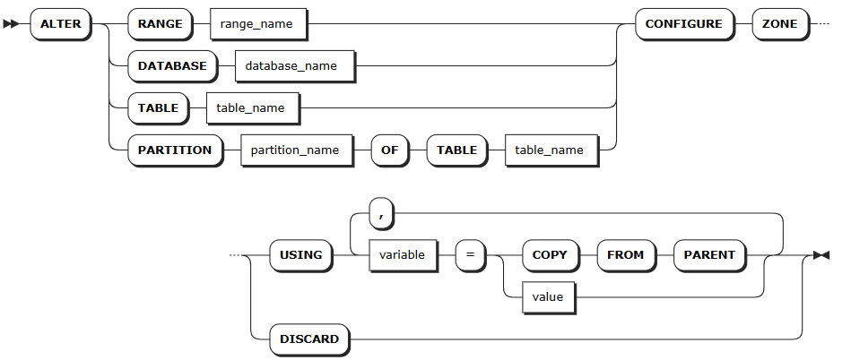

# Zones

In a KWDB cluster, each data range belongs to a specific replica zone. When rebalancing data ranges in a cluster, the system considers zone configurations to ensure all constraints are met.

When being initiated, KWDB automatically generates pre-configured zones and the `default` zone. Pre-configured zones are suitable for internal system data while the `default` zone applies to other data in the cluster. You can use or adjust these zones, or set zones separately for specified databases, tables, or partitions.

Zones applicable to table data are divided into the following levels:

- **Cluster-level**: the pre-configured `default` zone, which applies to data not constrained by a specified database, table, or row. This zone can be adjusted but not removed.
- **Database-level**: set zones for specified databases.
- **Table-level**: set zones for specified time-series tables.
- **Partition-level**: set zones for partitions of specified time-series tables.

During data replication, zones are prioritized in the following order: partition > table > database > cluster.

Internal system data is stored in system ranges and applies to the following zone levels:

- **Cluster-level**: the pre-configured `default` zone, which applies to system data not constrained by a specific zone.
- **System ranges**: KWDB provides pre-configured zones for critical system ranges such as `meta` and `liveness`. You can also configure new zones for system ranges as needed. Changes to zones for system ranges may override the default settings. KWDB also provides pre-configured zones for the internal system database and the `system.jobs` table.

You can use the `SHOW ZONE CONFIGURATION` statement to view zone configurations for specified objects and all zones within the cluster, and use the `ALTER ... CONFIGURE ZONE` statement to add, modify, reset, and remove zone configurations.

## SHOW ZONE CONFIGURATION

- The `SHOW ZONE CONFIGURATION` statement shows details about zones for a specified object.
- The `SHOW ZONE CONFIGURATIONS` and `SHOW ALL ZONE CONFIGURATIONS` statements show show replica information for all system ranges in a KWDB cluster, the `system` database, and system tables.

### Privileges

N/A

### Syntax


### Parameters

| Parameter | Description |
| --- | --- |
| `range_name` | The name of the data range, including: <br>- `default`: default replica settings <br>- `meta`: location information for all data <br>- `liveness`: information about which nodes are live at any given time <br>- `system`: information needed to allocate new table IDs and track the status of cluster nodes <br>- `timeseries`: cluster monitoring data |
| `database_name` | The name of the database. |
| `table_name` | The name of the table. |
| `partition_name` | The name of the partition. |

### Examples

- Check details about zones for a system range.

    The following example shows zone information for the `default` system range.

    ```sql
    SHOW ZONE CONFIGURATION FOR RANGE default;
    ```

    If you succeed, the console outputs the following information:

    ```sql
         target     |              raw_config_sql
    ----------------+-------------------------------------------
    RANGE default | ALTER RANGE default CONFIGURE ZONE USING
                   |     range_min_bytes = 268435456,
                   |     range_max_bytes = 536870912,
                   |     gc.ttlseconds = 90000,
                   |     num_replicas = 3,
                   |     constraints = '[]',
                   |     lease_preferences = '[]'
    (1 row)
    ```

- Check details about zones for a database.

    The following example shows zone information for the `db1` database.

    ```sql
    SHOW ZONE CONFIGURATION FOR DATABASE db1;
    ```

    If you succeed, the console outputs the following information:

    ```sql
         target    |             config_sql
    ---------------+------------------------------------------
    DATABASE db1 | ALTER DATABASE db1 CONFIGURE ZONE USING
                  |     range_min_bytes = 1048576,
                  |     range_max_bytes = 8388608,
                  |     gc.ttlseconds = 100000,
                  |     num_replicas = 5,
                  |     constraints = '[]',
                  |     lease_preferences = '[]'
    (1 row)
    ```

- Check details about zones for a table.

    The following example shows zone information for the `t1` table.
  
    ```sql
    SHOW ZONE CONFIGURATION FOR TABLE t1;
    ```

    If you succeed, the console outputs the following information:

    ```sql
         target     |              raw_config_sql
    ----------------+-------------------------------------------
    RANGE default | ALTER RANGE default CONFIGURE ZONE USING
                   |     range_min_bytes = 268435456,
                   |     range_max_bytes = 536870912,
                   |     gc.ttlseconds = 90000,
                   |     num_replicas = 3,
                   |     constraints = '[]',
                   |     lease_preferences = '[]'
    (1 row)
    ```

## CONFIGURE ZONE

The `ALTER ... CONFIGURE ZONE` statement is used for the following operations:

- Modify zone configurations for databases, tables, ranges, and partitions
- Remove zone configurations for databases, tables, ranges, and partitions

### Privileges

- Modify zones for the system database or system ranges: the user must be a member of the `admin` role. By default, the `root` user belongs to the `admin` role.
- Modify zones for other databases or ranges/tables/partitions in other databases: the user must be a member of the `admin` role or have been granted `CREATE` or `ZONECONFIG` privileges on the target object. By default, the `root` user belongs to the `admin` role.

### Syntax



### Parameters

| Parameter | Description |
| --- | --- |
| `range_name` | The name of the range to modify, including: <br>- `default`: default replica settings <br>- `meta`: location information for all data <br>- `liveness`: information about which nodes are live at any given time <br>- `system`: information needed to allocate new table IDs and track the status of cluster nodes <br>- `timeseries`: cluster monitoring data |
| `database_name` | The name of the database to modify. |
| `table_name` | The name of the table to modify. |
| `partition_name` | The name of the table partition to modify. |
| `variable` | The name of the variable to modify. The following variables are supported: <br>- `range_min_bytes`: the minimum size in bytes for a data range. When a range is smaller than this value, KWDB merges it with an adjacent range. Default: 256 MiB. The value must be greater than 1 MiB (1048576 bytes) and smaller than the maximum size of the range. <br>- `range_max_bytes`: the maximum size in bytes for a data range. When a range exceeds this value, KWDB splits it into two ranges. Default: 512 MiB. The value must not be smaller than 5 MiB (5242880 bytes). <br>- `gc.ttlseconds`: the number of seconds data will be retained before garbage collection. Default: `90000` (25 hours). We recommend setting a value of at least 600 seconds (10 minutes) to avoid affecting long-running queries. A smaller value saves disk space while a larger value increases the time range allowed for `AS OF SYSTEM TIME` queries. Additionally, since all versions of each row are stored in a single, unsplit range, avoid setting this value too large to prevent all changes to a single row from exceeding 64 MiB, which may cause memory issues or other problems. <br>- `num_replicas`: the number of replicas. Default: 3. For the `system` database and the `meta`, `liveness`, and `system` ranges, the default number of replicas is 5. **Note**: The number of replicas cannot be reduced when unavailable nodes exist in the cluster. <br>- `constraints`: required (+) and/or prohibited (-) constraints for where replicas can be placed. For example, `constraints = '{"+region=NODE1": 1, "+region=NODE2": 1, "+region=NODE3": 1}'` places one replica on each of nodes 1, 2, and 3. Currently only supports the `region=NODEx` format. <br>- `lease_preferences`: an ordered list of required (+) and/or prohibited (-) constraints for where the leaseholder should be placed. For example, `lease_preferences = '[[+region=NODE1]]'` prefers placing the leaseholder on node 1. If this isn't possible, KWDB tries the next preference in the list. If no preferences can be satisfied, KWDB uses the default lease distribution algorithm, which balances leases across nodes based on their current lease count. Each value in the list can contain multiple constraints. <br>- `ts_merge.days`: the merging time for time-series data ranges. After ranges in the same time-series table at the same hash point are split by timestamp, ranges that exceed this time are automatically merged and won't be automatically split again. Default: 10 (10 days). The value must be greater than or equal to 0. When set to 0, time-series data ranges are automatically merged immediately after being split by timestamp. If network or other failures are caused by too many system ranges, you can reduce this value to mitigate data volume issues. <br><br>**Tips**: <br>- `lease_preferences` can be defined independently from the `constraints` field. <br>- When setting `constraints`, you must also set `num_replicas`, and the number of constraints must be less than or equal to the number of replicas. The order of `constraints` doesn't matter. <br>- By default, KWDB only splits ranges based on hash points, so the range merging by time is disabled by default. To support merging ranges by time, set the `kv.kvserver.ts_split_interval` runtime parameter to `1` and the `kv.kvserver.ts_split_by_timestamp.enabled` runtime parameter to `true` to enable splitting ranges by both hash points and timestamps. |
| `value` | The value of the variable. |
|`COPY FROM PARENT`| Use the settings of the parent zone. |
|`DISCARD` | Remove the zone configuration and use the default values. |

### Examples

- Modify zones for a database.

    The following example changes the number of replicas for the `vtx` database to 5 and the data retention time before garbage collection to 100000 seconds.

    ```SQL
    ALTER DATABASE vtx CONFIGURE ZONE USING num_replicas = 5, gc.ttlseconds = 100000;
    CONFIGURE ZONE 1

    SHOW ZONE CONFIGURATION FOR DATABASE vtx;
         target     |              config_sql
    ----------------+-------------------------------------------
    DATABASE vtx   | ALTER DATABASE tsdb CONFIGURE ZONE USING
                   |     range_min_bytes = 134217728,
                   |     range_max_bytes = 536870912,
                   |     gc.ttlseconds = 100000,
                   |     num_replicas = 5,
                   |     constraints = '[]',
                   |     lease_preferences = '[]'
    (1 row)
    ```

- Modify zones for a table.

    The following example changes the number of replicas for the `vehicles` table to 3 and the data retention time before garbage collection to 100000 seconds.

    ```SQL
    ALTER TABLE vehicles CONFIGURE ZONE USING num_replicas = 3, gc.ttlseconds = 100000;
    CONFIGURE ZONE 1

    SHOW ZONE CONFIGURATION FOR TABLE vehicles;
         target    |             config_sql
    ---------------+------------------------------------------
    TABLE vehicles | ALTER TABLE vehicles CONFIGURE ZONE USING
                   |     range_min_bytes = 268435456,
                   |     range_max_bytes = 536870912,
                   |     gc.ttlseconds = 100000,
                   |     num_replicas = 3,
                   |     constraints = '[]',
                   |     lease_preferences = '[]'
    (1 row)
    ```

- Remove zone configuration from a table.

    The following example restores the default zone configuration for the `vehicles` table.

    ```SQL
    ALTER TABLE vehicles CONFIGURE ZONE DISCARD;
    CONFIGURE ZONE 1

    SHOW ZONE CONFIGURATION FOR TABLE vehicles;
         target     |              raw_config_sql
    ----------------+-------------------------------------------
    RANGE default | ALTER RANGE default CONFIGURE ZONE USING
                   |     range_min_bytes = 268435456,
                   |     range_max_bytes = 536870912,
                   |     gc.ttlseconds = 90000,
                   |     num_replicas = 3,
                   |     constraints = '[]',
                   |     lease_preferences = '[]'
    (1 row)
    ```