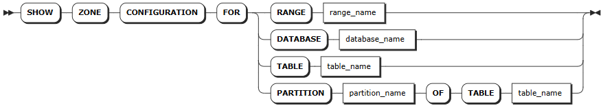

# Zone Configurations

In a KWDB cluster, each range belongs to a specific zone. When rebalancing ranges in a cluster, the system will consider zone configurations to ensure all constraints are complied with.

When being initiated, KWDB will automatically generate pre-configured zones and the `default` zone. Pre-configured zones store internal data while the `default` zone stores other data. You can directly use or change these ranges or set ranges for a specified database or table.

KWDB stores data in the following ranges. During data replication, the ranges are prioritized from table-level ranges, to database-level ranges, and then to cluster-level ranges.

- **Cluster-level ranges**: the pre-configured `default` range, which stores data that is not constrainted by a database, table, or row. This range can be changed but not removed.
- **Database-level ranges**: set ranges for specified databases.
- **Table-level ranges**: set ranges for specified tables.

KWDB stores internal data to system ranges, which apply to the following zones:

- **Cluster-level ranges**: the pre-configured `default` range, which stores system data that is not constrainted by a range.
- **System ranges**: KWDB provides zones for significant system ranges. You can also set new zones for system ranges. Changes to zones for system ranges may override the default setting. KWDB also provides pre-configured zones for the system database and the `system.jobs` table.

## SHOW ZONE CONFIGURATION

The `SHOW ZONE CONFIGURATION` statement shows details about zones of a specified object. The `SHOW ZONE CONFIGURATIONS` and `SHOW ALL ZONE CONFIGURATIONS` statements show all system ranges of a KWDB cluster or details about replicas of the system database and system table.

### Privileges

N/A

### Syntax



### Parameters

| Parameter | Description |
| --- | --- |
| `range_name` | The name of the range, including: <br>- `default`: contain default replica settings. <br>- `meta`: contain the information about the location of all data in the cluster. <br>- `liveness`: contain the information about which nodes are live at any given time. <br>- `system`: contain information needed to allocate new table IDs and track the status of a cluster's nodes. <br>- `timeseries`: contain monitoring data about the cluster. |
| `database_name` | The name of the database. |
| `table_name` | The name of the table. |

### Examples

- Check details about zones for a system range.

    ```sql
    SHOW ZONE CONFIGURATION FOR RANGE default;
    ```

    If you succeed, you should see an output similar to the following:

    ```sql
        target     |              raw_config_sql
    ----------------+-------------------------------------------
    RANGE default | ALTER RANGE default CONFIGURE ZONE USING
                  |     range_min_bytes = 268435456,
                  |     range_max_bytes = 536870912,
                  |     gc.ttlseconds = 90000,
                  |     num_replicas = 3,
                  |     constraints = '[]',
                  |     lease_preferences = '[]'
    (1 row)
    ```

- Check details about zones for a database.

    ```sql
    SHOW ZONE CONFIGURATION FOR DATABASE db1;
    ```

    If you succeed, you should see an output similar to the following:

    ```sql
        target    |             raw_config_sql
    ---------------+------------------------------------------
    DATABASE db1 | ALTER DATABASE db1 CONFIGURE ZONE USING
                  |     range_min_bytes = 1048576,
                  |     range_max_bytes = 8388608,
                  |     gc.ttlseconds = 100000,
                  |     num_replicas = 5,
                  |     constraints = '[]',
                  |     lease_preferences = '[]'
    (1 row)
    ```

- Check details about zones for a table.
  
    ```sql
    SHOW ZONE CONFIGURATION FOR TABLE t1;
    ```

    If you succeed, you should see an output similar to the following:

    ```sql
        target     |              raw_config_sql
    ----------------+-------------------------------------------
    RANGE default | ALTER RANGE default CONFIGURE ZONE USING
                  |     range_min_bytes = 268435456,
                  |     range_max_bytes = 536870912,
                  |     gc.ttlseconds = 90000,
                  |     num_replicas = 3,
                  |     constraints = '[]',
                  |     lease_preferences = '[]'
    (1 row)
    ```
