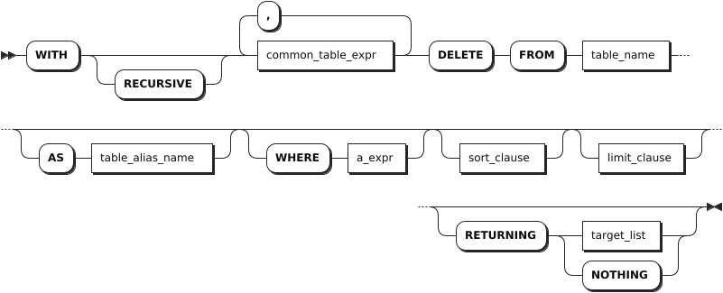

# DELETE

The `DELETE` statement deletes rows from a table.

::: warning Note
By default, when the `sql_safe_updates` session variable is set to `true`, you cannot delete all data. To delete all data, you need to set the `sql_safe_updates` session variable to `false`.
:::

## Privileges

The user must be a member of the `admin` role or have been granted the `SELECT` and `DELETE` privileges on the specified table(s).

## Syntax



- `common_table_expr`

    

- `sort_clause`

    

- `limit_clause`

    

- `target_list`

    

## Parameters

| Parameter | Description |
| --- | --- |
| `common_table_expr` | You can use it in combination with the `WITH` keyword as the `WITH AS` clause. It provides an alias for a frequently-performed SQL subquery before it is used in a larger query context. Therefore, the system can directly recall the SQL subquery using the alias. This improves the query performance. |
| `table_name` | The name of the table that contains the rows to delete. |
| `AS table_alias_name` | An alias for the table name. When an alias is provided, it completely hides the actual table name. |
| `WHERE a_expr` | The filtering statement for the `DELETE` statement, which is used to delete rows that return `TRUE`. `a_expr` must be an expression that returns Boolean values using columns (e.g., `<column> = <value>`). Without a `WHERE` clause, the `DELETE` statement deletes all rows from the table. To delete all rows in a table, it is recommended to use the `TRUNCATE` statement. |
| `RETURNING target_list` | Return values based on rows deleted, where `target_list` can be specific column names from the table. `*` means returning values for all columns while you can also use computations using scalar expressions to specify columns. To return nothing in the response, not even the number of rows updated, use `RETURNING NOTHING`. |

## Examples

These examples assume that you have created a table named `account_details` and inserted data into the table.

```sql
-- 1. Create the table.

CREATE TABLE account_details(account_id INT8 DEFAULT unique_rowid() PRIMARY KEY, balance DECIMAL, account_type STRING);
CREATE TABLE

-- 2. Insert data into the table.

INSERT INTO account_details VALUES(1, 20000, 'save'), (2, 30000, 'save'), (3, 40000, 'del'), (4, 50000, 'insert');
INSERT 4

-- 3. Check data of the table.

SELECT * FROM account_details;
  account_id | balance | account_type
-------------+---------+---------------
           1 |   20000 | save
           2 |   30000 | save
           3 |   40000 | del
           4 |   50000 | insert
(4 rows)
```

- Delete rows using columns with the Primary Key or UNIQUE constraints.

    ```sql
    DELETE FROM account_details WHERE account_id = 1;
    DELETE 1

    SELECT * FROM account_details;
      account_id | balance | account_type
    -------------+---------+---------------
              2 |   30000 | save
              3 |   40000 | del
              4 |   50000 | insert
    (3 rows)
    ```

- Delete rows using columns with non-UNIQUE constraints.

    ```sql
    DELETE FROM account_details WHERE account_type='save';
    DELETE 1

    SELECT * FROM account_details;
      account_id | balance | account_type
    -------------+---------+---------------
              3 |   40000 | del
              4 |   50000 | insert
    (2 rows)
    ```

- Return deleted rows.

    ```sql
    DELETE FROM account_details WHERE account_id = 3 RETURNING *;
    DELETE 1;
      account_id | balance | account_type
    -------------+---------+---------------
              3 |   40000 | del
    (1 row)


    SELECT * FROM account_details;
      account_id | balance | account_type
    -------------+---------+---------------
              4 |   50000 | insert
    (1 row)
    ```

- Delete all rows.

    ```sql
    SET sql_safe_updates = false;
    SET

    DELETE FROM account_details;
    DELETE 1


    SELECT * FROM account_details;
    account_id|balance|account_type
    ----------+-------+------------
    (0 rows)
    ```
