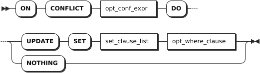

# INSERT

The `INSERT` statement inserts one or more rows into a table. In cases where inserted values conflict with UNIQUE constraints, use the `INSERT ON CONFLICT` clause to update tables.

## Privileges

The user must have been granted the `INSERT` privilege on the specified table(s). To use the `INSERT ON CONFLICT` and `ON CONFLICT DO UPDATE` clauses, the user must also have been granted the `SELECT` and `UPDATE` privileges on the specified table(s).

## Syntax


- `common_table_expr`

    

- `on_conflict`

    

## Parameters

| Parameter | Description |
| --- | --- |
| `common_table_expr` | You can use it in combination with the `WITH` keyword as the `WITH AS` caluse. It provides an alias for a frequently-performed SQL subquery before it is used in a larger query context. Therefore, the system can directly recall the SQL subquery using the alias. This improves the query performance.|
| `table_alias_name` | An alias for the table name. When an alias is provided, it completely hides the actual table name.|
| `column_name` | A comma-separated list of names of columns to populate during the insert. If no column name is specified, insert data into all columns of the table. |
| `preparable_stmt` | The statement or subquery to use as the common table expression.|
| `table_name` | The name of the table into which to write data.|
| `select_stmt` | A selection query to generate data to be inserted into the table. Each value must match the data type of its column. If column names are specified, values must be in corresponding order. Otherwise, values must follow the declared order of the columns in the table. |
| `DEFAULT VALUES` | To fill all columns with their default values, use `DEFAULT VALUES` in place of `select_stmt`. To fill a specific column with its default value, do not specify a value for the column in the `SELECT` statement or use `DEFAULT` at the appropriate position. |
| `RETURNING target_list` | Return values based on rows inserted, where `target_list` can be specific column names from the table. `*` means returning values for all columns while you can also use computations using scalar expressions to specify columns. To return nothing in the response, not even the number of rows updated, use `RETURNING NOTHING`.|
| `on_conflict` clause | It is more flexible and practical to use the `ON CONFLICT` clause than using the `INSERT` statement when there are UNIQUE constraint conflicts. Normally, when inserted values conflict with a UNIQUE constraint on one or more columns, KWDB returns an error. To update the affected rows instead, use an `ON CONFLICT` clause containing the column(s) with the UNIQUE constraint and the `DO UPDATE SET` expression set to the column(s) to be updated (any `SET` expression supported by the `UPDATE` statement is also supported, including those with `WHERE` clauses). To prevent the affected rows from updating while allowing new rows to be inserted, set `ON CONFLICT` to `DO NOTHING`.|

## Examples

These examples assume that you have created a table named `accounts` and inserted data into the table.

```sql
CREATE TABLE accounts(id INT8 DEFAULT unique_rowid() PRIMARY KEY, balance DECIMAL);
CREATE TABLE
```

- Insert a single row.

    ```sql
    -- Insert data into the table by specifying column names.
    INSERT INTO accounts (balance, id) VALUES (10000.50, 1);
    INSERT 1

    -- Insert data into the table using the columns of the table in their declared order.
    INSERT INTO accounts VALUES (2, 20000.75);
    INSERT 1
    ```

- Insert multiple rows.

    ```sql
    INSERT INTO accounts (id, balance) VALUES (3, 8100.73), (4, 9400.10);
    INSERT 2
    ```

- Insert data from a `SELECT` statement.

    ```sql
    CREATE TABLE accounts_type(id INT8 DEFAULT unique_rowid(),balance DECIMAL, data_type INT);
    CREATE TABLE

    INSERT INTO accounts_type (id, balance) SELECT id, balance FROM accounts;
    INSERT 4
    ```

- Insert default values.

    ```sql
    -- Insert default values or NULL values without specifying column names.
    INSERT INTO accounts (id) VALUES (8);
    INSERT 1

    -- Insert default values into specified columns using the DEFAULT keyword.
    INSERT INTO accounts (id, balance) VALUES (9, DEFAULT);
    INSERT 1


    SELECT * FROM accounts WHERE id in (8, 9);
      id | balance
    -----+----------
      8 | NULL
      9 | NULL
    (2 rows)

    -- Insert default values into all columns using the DEFAULT VALUES keyword.

    INSERT INTO accounts DEFAULT VALUES;
    INSERT 1

    SELECT * FROM accounts;
              id         | balance
    ---------------------+-----------
                      1 | 10000.50
                      2 | 20000.75
                      3 |  8100.73
                      4 |  9400.10
                      8 | NULL
                      9 | NULL
      962613247401426945 | NULL
    (7 rows)
    ```

- Insert data and return values of specified columns using the `RETURNING` clause.

    ```sql
    INSERT INTO accounts (id, balance) VALUES (DEFAULT, 1000), (DEFAULT, 250) RETURNING id;
              id
    ----------------------
      962613455969189889
      962613455969353729
    (2 rows)
    ```

- Insert data using the `ON_CONFLICT` clause to deal with UNIQUE constraint conflicts.

    ```sql
    -- Use the DO UPDATE SET expression to store the rows proposed for insertion in a temporary table called excluded when detecting UNIQUE constraint conflicts. Use the columns in the temporary excluded table to apply updates on conflict.  
    INSERT INTO accounts (id, balance) VALUES (8, 500.50) ON CONFLICT (id) DO UPDATE SET balance = excluded.balance;
    INSERT 1


    SELECT * FROM accounts WHERE id = 8;
    id|balance
    --+-------
    8 |500.50 
    (1 row)

    -- Use the DO UPDATE SET expression to use existing values to update rows.
    INSERT INTO accounts (id, balance) VALUES (8, 500.50) ON CONFLICT (id) DO UPDATE SET balance = accounts.balance + excluded.balance;
    INSERT 1

    SELECT * FROM accounts WHERE id = 8;
    id|balance
    --+-------
    8 |1001.00
    (1 row)

    -- Use a WHERE clause to apply the DO UPDATE SET expression conditionally.
    INSERT INTO accounts (id, balance) VALUES (8, 700) ON CONFLICT (id) DO UPDATE SET balance = excluded.balance WHERE excluded.balance < accounts.balance;
    INSERT 1

    SELECT * FROM accounts WHERE id = 8;
    id|balance
    --+-------
    8 |700    
    (1 row)

    -- Use ON CONFLICT DO NOTHING to prevent the affected row from being updated  while allowing unaffected rows to be inserted.
    INSERT INTO accounts (id, balance) VALUES (8, 125.50), (10, 450) ON CONFLICT (id) DO NOTHING;
    INSERT 1

    SELECT * FROM accounts WHERE id in (8, 10);
    id|balance
    --+-------
    8 |700    
    10|450    
    (2 rows)
    ```
