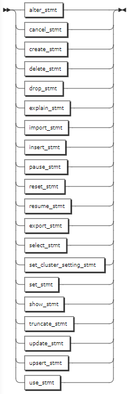

# SELECT Optimization

KWDB supports using `EXPLAIN` or `EXPLAIN ANALYZE` output to optimize your queries as follows:

- The less levels are, the more quickly queries execute.
- Restructure queries to require fewer levels of processing and then improve performance. Avoid scanning an entire table, which is the slowest way to access data. Create indexes that contain at least one of the columns that the query is filtering in its `WHERE` clause.

Based on the `EXPLAIN` output, KWDB confirms whether to perform entire table scans in either of the ways:

- Check the `Description` values of the rows whose `Field` property is set to `table` to get indexes the query uses.
- Check the `Description` values of the rows whose `Field` property is set to `spans` to get `key` values in the index to be scanned.

## EXPLAIN

The `EXPLAIN` statement returns KWDB's statement plan for a preparable statement. You can use this information to optimize the query.

### Privileges

The user must be a member of the `admin` role or have been granted appropriate privileges for the statement being explained.

### Syntax


- `preparable_stmt`

    

### Parameters

| Parameter | Description |
| --- | --- |
| `VERBOSE` | Show as much information as possible about the statement plan. |
| `TYPES` | Include the data types KWDB chooses to evaluate intermediate SQL expressions. |
| `OPT` | Display the statement plan tree generated by the Cost-Based Optimizer (COB). To include cost details used by the optimizer in planning the query, use the `OPT` and `VERBOSE` options. To include cost and type details, use the `OPT` and `TYPES` options. |
| `VEC` | Show detailed information about the vectorized execution plan for a query. If there are unsupported data types in the table to query, KWDB returns errors. <br > **Note** <br > By default, the vectorized execution engine is disabled. To Enable it, use the `SET vectorize = on` command. |
| `preparable_stmt` | The statement you want details about. Basically, all preparable statements can work with `EXPLAIN`, such as `CREATE`, `INSERT`, `UPDATE`, `DELETE` and so on.|

### Responses

A successful `EXPLAIN` statement returns a table with the following fields:

- `tree`: a tree representation of the hierarchy of the statement plan.
- `field`: the property names of the statement plan. Distributed and vectorized properties apply to the entire statement plan while other properties apply to statement plan nodes in the tree architecture.
- `description`: additional information about parameters in fields.
- `columns`: the columns provided to processes at lower levels of the hierarchy. This field is included in output of the `EXPLAIN` statement with the `TYPES` or `VERBOSE` option.
- `ordering`: the order where the results are presented to processes at each level of the hierarchy and other attributes of the result set at each level. This field is included in output of the `EXPLAIN` statement with the `TYPES` or `VERBOSE` option.

### Examples

These examples assume that you have created tables and inserted data into these tables.

```sql
-- Create a table named accounts.

CREATE TABLE accounts(id INT8 DEFAULT unique_rowid() PRIMARY KEY, balance DECIMAL);
CREATE TABLE 

-- Create a table named accounts_type.

CREATE TABLE accounts_type(id INT8 DEFAULT unique_rowid(),balance DECIMAL, data_type INT);
CREATE TABLE
```

- Run the `EXPLAIN` statement without any parameters.

    ```sql
    EXPLAIN SELECT * FROM accounts;
    tree|field      |description     
    ----+-----------+----------------
        |distributed|true            
        |vectorized |false           
    scan|           |                
        |table      |accounts@primary
        |spans      |FULL SCAN       
    (5 rows)
    ```

- Run the `EXPLAIN` statement on a JOIN query.

    ```sql
    EXPLAIN SELECT * FROM accounts AS a JOIN accounts_type AS b ON a.id=b.id;
    tree     |field            |description          
    ---------+-----------------+---------------------
            |distributed      |true                 
            |vectorized       |false                
    hash-join|                 |                     
    │       |type             |inner                
    │       |equality         |(id) = (id)          
    │       |left cols are key|                     
    ├── scan|                 |                     
    │       |table            |accounts@primary     
    │       |spans            |FULL SCAN            
    └── scan|                 |                     
            |table            |accounts_type@primary
            |spans            |FULL SCAN            
    (12 rows)
    ```

- Run the `EXPLAIN` statement with the `VERBOSE` option.

    ```sql
    EXPLAIN(VERBOSE) SELECT * FROM accounts;
    tree|field      |description     |columns      |ordering
    ----+-----------+----------------+-------------+--------
        |distributed|true            |             |        
        |vectorized |false           |             |        
    scan|           |                |(id, balance)|        
        |table      |accounts@primary|             |        
        |spans      |FULL SCAN       |             |        
    (5 rows)
    ```

- Run the `EXPLAIN` statement with the `TYPES` option.

    ```sql
    EXPLAIN(TYPES) SELECT * FROM accounts;
    tree|field      |description     |columns                  |ordering
    ----+-----------+----------------+-------------------------+--------
        |distributed|true            |                         |        
        |vectorized |false           |                         |        
    scan|           |                |(id int, balance decimal)|        
        |table      |accounts@primary|                         |        
        |spans      |FULL SCAN       |                         |        
    (5 rows)
    ```

- Run the `EXPLAIN` statement with the `OPT` option.

    ```sql
    EXPLAIN(OPT) SELECT * FROM accounts WHERE id > 2 ORDER BY balance DESC;
    text                             
    ---------------------------------
    sort                             
    └── scan accounts               
          └── CONSTRAINT: /1: [/3 - ]
    (3 rows)
    ```

- Run the `EXPLAIN` statement with the `OPT` and `VERBOSE` options.

    ```sql
    EXPLAIN(OPT, VERBOSE) SELECT * FROM accounts WHERE id > 2 ORDER BY balance DESC;
    text                                                                 
    ---------------------------------------------------------------------
    sort                                                                 
    ├── columns: id:1 balance:2                                         
    ├── stats: [rows=333.333333, distinct(1)=333.333333, null(1)=0]     
    ├── cost: 409.225479                                                
    ├── key: (1)                                                        
    ├── fd: (1)-->(2)                                                   
    ├── ordering: -2                                                    
    ├── prune: (2)                                                      
    ├── interesting orderings: (+1)                                     
    └── scan accounts                                                   
          ├── columns: id:1 balance:2                                    
          ├── CONSTRAINT: /1: [/3 - ]                                    
          ├── stats: [rows=333.333333, distinct(1)=333.333333, null(1)=0]
          ├── cost: 346.676667                                           
          ├── key: (1)                                                   
          ├── fd: (1)-->(2)                                              
          ├── prune: (2)                                                 
          └── interesting orderings: (+1)                                
    (18 rows)
    ```

- Run the `EXPLAIN` statement with the `OPT` and `TYPES` options.

    ```sql
    EXPLAIN(OPT, TYPES) SELECT * FROM accounts WHERE id > 2 ORDER BY balance DESC;
    text                                                                 
    ---------------------------------------------------------------------
    sort                                                                 
    ├── columns: id:1(int!null) balance:2(decimal)                      
    ├── stats: [rows=333.333333, distinct(1)=333.333333, null(1)=0]     
    ├── cost: 409.225479                                                
    ├── key: (1)                                                        
    ├── fd: (1)-->(2)                                                   
    ├── ordering: -2                                                    
    ├── prune: (2)                                                      
    ├── interesting orderings: (+1)                                     
    └── scan accounts                                                   
          ├── columns: id:1(int!null) balance:2(decimal)                 
          ├── CONSTRAINT: /1: [/3 - ]                                    
          ├── stats: [rows=333.333333, distinct(1)=333.333333, null(1)=0]
          ├── cost: 346.676667                                           
          ├── key: (1)                                                   
          ├── fd: (1)-->(2)                                              
          ├── prune: (2)                                                 
          └── interesting orderings: (+1)                                
    (18 rows)
    ```

- Run the `EXPLAIN` statement with the `VEC` option.

    ```sql
    SET vectorize = on;
    SET

    EXPLAIN(VEC) SELECT * FROM accounts WHERE id > 2;
    text                     
    -------------------------
    │                        
    └ Node 1                 
      └ *colexec.colBatchScan
    (3 rows)
    ```

- Run the `EXPLAIN` statement to understand which indexes and key ranges queries use, which can help you confirm whether a query performs a full table scan or not.

    ```sql
    -- 1. Create a table named explain_test.
    CREATE TABLE explain_test (k INT PRIMARY KEY, v INT);
    CREATE TABLE

    -- 2. Scan the full table when querying column v as there is no index created on column v.

    EXPLAIN SELECT * FROM explain_test WHERE v BETWEEN 4 AND 5;
    tree|field      |description          
    ----+-----------+---------------------
        |distributed|true                 
        |vectorized |false                
    scan|           |                     
        |table      |explain_test@primary 
        |spans      |FULL SCAN            
        |filter     |(v >= 4) AND (v <= 5)
    (6 rows)

    -- 3. Create an index on column v. 

    CREATE INDEX index_v ON explain_test (v);
    CREATE INDEX

    -- 4. Do not scan the full table when querying column v.

    EXPLAIN SELECT * FROM explain_test WHERE v BETWEEN 4 AND 5;
    tree|field      |description         
    ----+-----------+--------------------
        |distributed|false               
        |vectorized |false               
    scan|           |                    
        |table      |explain_test@index_v
        |spans      |/4-/6               
    (5 rows)
    ```

## EXPLAIN ANALYZE

The `EXPLAIN ANALYZE` statement executes a SQL query and generates a statement plan with execution statistics. Statement plans provide information around SQL execution, which can be used to troubleshoot slow queries by figuring out where time is being spent, how long a component takes streams of input rows and processes them according to a specification, etc.

### Privileges

The user must be a member of the `admin` role or have been granted appropriate privileges for the statement being explained.

### Syntax


- `preparable_stmt`

    

### Parameters

| Parameter | Description |
| --- | --- |
| `preparable_stmt` | The statement you want details about. Basically, all preparable statements can work with `EXPLAIN ANALYZE`, such as `CREATE`, `INSERT`, `UPDATE`, `DELETE` and so on. |

### Examples

This example runs a `SELECT` query using the `EXPLAIN ANALYZE` statement.

```sql
EXPLAIN ANALYZE(DEBUG) SELECT * FROM accounts WHERE id > 2 ORDER BY balance DESC;
text                                                                        
----------------------------------------------------------------------------
Statement diagnostics bundle generated. Download from the Admin UI (Advanced
Debug -> Statement Diagnostics History), via the direct link below, or using
the command line.                                                           
Admin UI: http://127.0.0.1:8080                                             
Direct link: http://127.0.0.1:8080/_admin/v1/stmtbundle/857952323520757761  
Command line: kwbase statement-diag list / download                         
(6 rows)
```
