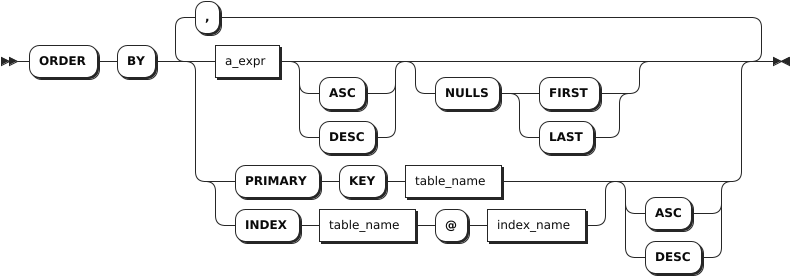
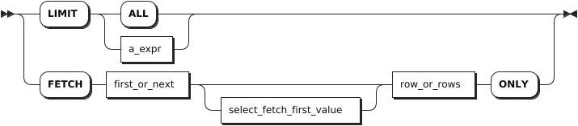

# SELECT

The simple `SELECT` clause is the main SQL syntax to read and process existing data. When used as a standalone statement, the simple `SELECT` clause is also called the `SELECT` statement. However, it is also a selection clause that can be combined with other constructs to form more complex queries. KWDB supports configuring the maximum number of returned rows of the SQL query results using the `SET CLUSTER SETTING sql.auto_limit.quantity = <value>` command.

KWDB supports addition and subtraction operations of time in queries for timestamp-typed columns or timestamp constants, and for functions and expressions whose result is timestamp. KWDB supports comparing the operation results using the greater than sign (`>`), the less than sign (`<`), the equals sign (`=`), the greater than or equal to sign (`>=`), and the less than or equal to sign (`<=`). The addition and subtraction operations can include the `interval` constant, other timestamp-typed columns, and the functions and expressions whose result is interval, timestamp, or timestampz. If both sides of the operator are timestamp-typed or timestamptz-typed columns, only subtraction is supported. 

In addition and subtraction operations, the supported units for the `interval` constant include microsecond (us), millisecond (ms), second (s), minute (m), hour (h), day (d), week (w), month (mon), and year (y). Currently, KWDB does ​not​ support composite time formats, such as `1d1h`.

The valid ranges for millisecond, second, minute, and hour are constrained by the maximum value of nanosecond (INT64). The table below specifies the supported value ranges:

| Unit             | Range                                     |
|------------------|-------------------------------------------|
| Microsecond (us) | [-62,167,219,200,000, 31,556,995,200,000] |
| Millisecond (ms) | [-62,167,219,200,000, 31,556,995,200,000] |
| Second (s)       | [-9,223,372,036, 9,223,372,036]           |
| Minute (m)       | [-153,722,867, 153,722,867]               |
| Hour (h)         | [-2,562,047, 2,562,047]                   |

The valid ranges for day, week, month, and year are constrained by the results of addition and subtraction operations, whose corresponding number of microseconds must not exceed the range of INT64.

::: warning Note

KWDB supports using the addition and subtraction operations of time in the following cases:

- `SELECT` list: such as `SELECT ts+1h FROM table1;`, which means to return the results based on the specified time (the column's timestamp + one hour).
- `WHERE` clause: such as `SELECT * FROM table1 WHERE ts+1h > now();`, which means to return the results whose specified time (the column's timestamp + one hour) is greater than the current time.
- `ORDER BY` clause: such as `SELECT * FROM table1 ORDER BY ts+1h;`, which means to sort columns based on the specified time (the column's timestamp + one hour).
- `HAVING` clause: such as `SELECT MAX(ts) FROM table1 GROUP BY ts HAVING ts+1h > now();`, which means to filter the qualified grouped results.
- Recall functions whose parameter type is set to timestamp: such as `SELECT CAST(ts+1h AS timestamp) FROM table1;`, which means to convert the results based on the specified time (the column's timestamp + one hour) into timestamp-typed values.
- Use comparison operations to indicate the join condition: such as `SELECT * FROM table1,table2 WHERE table1.ts+1h > table2.ts;`, which means to use the addition and subscription operations when joining two tables.

:::

## Privileges

The user must be a member of the `admin` role or have been granted the `SELECT` privilege on the specified table(s).

## Syntax

- Simple query

    

  - `target_elem`

    

  - `table_ref`

    

  - `a_expr`

    

  - `window_definition`

    

- Complex query

    

  - `select_clause`

    

  - `ordedr_by_clause`

    

  - `for_locking_clause`

    

  - `limit_clause`

    

  - `offset_clause`

    

## Parameters

- **Simple query**

    | Parameter | Description |
    | --- | --- |
    | `DISTINCT` or `ALL` | By default, or when `ALL` is specified, the `SELECT` statement returns all the selected rows, without removing duplicate rows. When `DISTINCT` is specified, duplicate rows are eliminated.|
    | `DISTINCT ON ( a_expr [, ...] )` | `a_expr[,…]` is a list of scalar expressions within parentheses. <br >- Without `ON`, two rows are considered duplicate rows if they are equal on all the results computed by `SELECT`. <br >- With `ON`, two rows are considered duplicate rows if they are equal only using the scalar expressions listed with `ON`. When two rows are considered duplicate rows according to `DISTINCT ON`, the values of the first row in the `FROM` clause in the order specified by `ORDER BY` are used to compute the remaining target expressions. If `ORDER BY` is not specified, KWDB will pick any one of the duplicate rows as first row, non-deterministically.|
    | `target_elem` | It can be a scalar expression or `*`. <br>- A scalar expression: compute a column in each result row. <br>- `*`: automatically retrieve all columns from the `FROM` clause. <br> If `target_elem` contains an aggregate function, a `GROUP BY` clause can be used to further control the aggregation.|
    | `table_ref` | The table expression to retrieve data from. Using two or more table expressions in the `FROM` clause, separated with a comma, is equivalent to a CROSS JOIN expression. For details about CROSS JOIN, see [Cross-model Query](../data-query.md).|
    | `AS OF SYSTEM TIME` | Retrieve data as it existed as of timestamp. <br> **Note** <br> Because `AS OF SYSTEM TIME` returns historical data, your reads might be stale.|
    | `WHERE a_expr` | The filtering statement for the `SELECT` statement, which is used to select rows that return `TRUE`. `a_expr` must be an expression that returns Boolean values using columns (e.g., `<column> = <value>`). `ROWNUM` is a sequence starting from `1`. The system filters each rows based on conditions. If no condition is met, the `ROWNUM` is not automatically incremented. If met, the `ROWNUM` is automatically incremented by `1`. <br>**Tip** <br> When there are multiple subqueries and logical operators (AND, OR) in the `WHERE` clause and there some semantic errors in some subqueries, the system returns an error when executing a query, saying `internal error: invalid index`. |
    | `GROUP BY + a_expr` | The system uses the `GROUP BY` clause to divide a data set into multiple small areas based on some rules (defined using `a_expr`) and then deals with data in these small areas. When an aggregate function follows `SELECT` as a `target_elem`, or `HAVING` as an `a_expr`, you can create aggregate groups on column groupings listed after `GROUP BY`. When using an aggregate function and `GROUP BY` clause in a query, avoid an oversized result set listed after the `GROUP BY`. |
    | `HAVING + a_expr` | When not working with the `WHERE` clause, the `HAVING` clause is used to filer grouped data. Normally, the `HAVING` clause works with the `GROUP BY` clause to only retrieve aggregate function groups that return `TRUE` for `a_expr`. `a_expr` must be an expression that returns Boolean values using columns (e.g., `<column> = <value>`). The `HAVING` clause works like the `WHERE` clause, but for aggregate functions.|
    | `WINDOW window_definition_list` | A list of window definitions. Available options are: <br >- `window_name`: the name of the new window frame.<br >- `opt_existing_window_name`: an optional name of an existing window frame, defined in a different window definition. <br >- `opt_sort_clause`: an optional `ORDER BY` clause. <br >- `opt_frame_clause`: an optional frame clause, which contains a frame boundary and/or an `EXCLUDE` clause.|

- **Complex query**

    | Parameter | Description |
    | --- | --- |
    | `SELECT` clause | The `SELECT` clause supports any of the following forms: <br >- `simple_SELECT_clause`: simple `SELECT` clause <br >- `values_clause`: `VALUES` clause <br >- `table_clause`: table clause <br >- `set_operation`: set operations|
    | `ORDER BY` | The `ORDER BY` clause takes a comma-separated list of ordering specifications. Each ordering specification is composed of a column selection followed optionally by the keyword `ASC` or `DESC`. The `ORDER` specifications can take any of the following forms: <br >- `a_expr`: an arbitrary scalar expression. This uses the result of evaluating that expression as the sorting key. <br >- `PRIMARY KEY` + `table_name`: use the primary key column(s) of the given table as the sorting key. This table must be part of the data source.<br >- `INDEX` + `table_name` + `@` + `index_name`: uses the columns indexed by the given index as the sorting key. This table must be part of the data source. <br>- Optional `ASC` and `DESC` keywords: they are used to specify the order. By default, it is set to `ASC`. The `ASC` keyword indicates to use the sorting key as-is. The `DESC` keyword indicates to invert the direction of the column(s). |
    | `FOR LOCKING` clause | Order transactions by controlling concurrent access to one or more rows. |
    | `LIMIT` clause | You can use the `LIMIT + count` format to retrieve the specified number of rows. KWDB also supports configuring the maximum number of returned rows of the SQL query results using the `sql.auto_limit.quantity` cluster parameter. But the priority of the `LIMIT` clause is higher than that of the `sql.auto_limit.quantity` cluster parameter. |
    | `OFFSET` clause | The `OFFSET` clause instructs the operation to skip a specified number of rows. It is often used with `LIMIT` to paginate through retrieved rows. To limit the size of the result set and skip some rows of the initial result set, you can use the `OFFSET` clause to get the next part of the result set. In general, the `OFFSET` clause is used to paginate large tables to avoid retrieving the full table.|

## Examples

These examples assume that you have created a table and inserted data into the table.

```sql
-- 1. Create a table named accounts.

CREATE TABLE accounts(id INT8 DEFAULT unique_rowid() PRIMARY KEY, name STRING, balance DECIMAL, enabled BOOL);
CREATE TABLE

-- 2. Insert data into the table.

INSERT INTO accounts VALUES (1, 'lily', 10000.5, true), (2, 'ruarc', 20000.75, true), (3, 'tullia', 30000, false), (4, 'arturo', 45000, false);
INSERT 4
```

- Retrieve specific columns.

    ```sql
    SELECT id FROM accounts WHERE balance < 21000;
    id
    --
    1 
    2 
    (2 rows)
    ```

- Retrieve all columns.

    ```sql
    SELECT * FROM accounts;
    id|name  |balance |enabled
    --+------+--------+-------
    1 |lily  |10000.5 |t      
    2 |ruarc |20000.75|t      
    3 |tullia|30000   |f      
    4 |arturo|45000   |f      
    (4 rows)
    ```

- Filter the table on a single condition.

    ```sql
    SELECT id FROM accounts WHERE balance < 21000;
    id
    --
    1 
    2 
    (2 rows)
    ```

- Filter the table on multiple conditions.

    ```sql
    SELECT * FROM accounts WHERE balance > 25000 AND enabled = false;
    id|name  |balance|enabled
    --+------+-------+-------
    3 |tullia|30000  |f      
    4 |arturo|45000  |f      
    (2 rows)
    ```

- Use the `DISTINCT` keyword to remove all but one instance of duplicate values from your retrieved data.

    ```sql
    SELECT DISTINCT name FROM accounts WHERE enabled=true;
    name 
    -----
    lily 
    ruarc
    (2 rows)
    ```

- Use the `WHERE <column> IN (<a comma-separated list of values>)` clause to filter the table.

    ```sql
    SELECT name FROM accounts WHERE balance in (10000.5, 20000.75);
    name 
    -----
    lily 
    ruarc
    (2 rows)
    ```

- Use the `AS` keyword to rename a column's name in output.

    ```sql
    SELECT name AS n, balance FROM accounts WHERE enabled=true;
    n    |balance 
    -----+--------
    lily |10000.5 
    ruarc|20000.75
    lily |50000.5 
    (3 rows)
    ```

- Search for string values.

    Search for partial string that matches in columns using `LIKE`, which supports the following wildcard operators:

    - `%`: match `0` or multiple characters.
    - `_`: match exactly `1` character.
    - `[charlist]`: match any character listed in `charlist`.
    - `charlist` or `[!charlist]`: do not match any character listed in `charlist`.

    ```sql
    SELECT * FROM accounts WHERE name LIKE '%li%';
    id|name  |balance|enabled
    --+------+-------+-------
    1 |lily  |10000.5|t      
    3 |tullia|30000  |f      
    5 |lily  |50000.5|t      
    (3 rows)
    ```

- Use aggregate functions to perform computation on retrieved rows.

    ```sql
    SELECT MIN(balance) FROM accounts;
    min    
    -------
    10000.5
    (1 row)
    ```

    KWDB supports using the retrieved value as part of the `WHERE` clause expression.

    ```sql
    SELECT id, name, balance FROM accounts WHERE balance = (SELECT MIN(balance) FROM accounts);
    id|name|balance
    --+----+-------
    1 |lily|10000.5
    (1 row)
    ```

- Perform aggregate function on retrieved rows.

    ```sql
    SELECT SUM(balance) FROM accounts WHERE enabled=true;
    SUM     
    --------
    80001.75
    (1 row)
    ```

- Use `FILTER (WHERE <Boolean expression>)` to filter columns fed into aggregate functions. Data that return `FALSE` or `NULL` for the `FILTER` clause's Boolean expression are not fed into the aggregate function.

    ```sql
    SELECT count(*) AS unfiltered, count(*) FILTER (WHERE balance > 15000) AS filtered FROM accounts; 
    unfiltered|filtered
    ----------+--------
    5         |4       
    (1 row)
    ```

- Split the retrieved rows into groups and then perform the aggregate function on each of them.

    ```sql
    SELECT enabled AS state, SUM(balance) AS state_balance FROM accounts GROUP BY enabled;
    state|state_balance
    -----+-------------
    t    |80001.75     
    f    |75000        
    (2 rows)
    ```

- Use the `HAVING` clause to filter aggregate groups.

    ```sql
    SELECT enabled AS state, SUM(balance) AS state_balance FROM accounts GROUP BY enabled HAVING AVG(balance) between 100 AND 30000;
    state|state_balance
    -----+-------------
    t    |80001.75     
    (1 row)
    ```

- Use aggregate functions in the `HAVING` clause.

    ```sql
    SELECT name, enabled FROM accounts WHERE enabled = true GROUP BY name, enabled HAVING count(name) > 1;
    name|enabled
    ----+-------
    lily|t      
    (1 row)
    ```

- Query tables using the `LIMIT` + `count` form.

    ```sql
    SELECT * FROM accounts LIMIT 5;
    id|name  |balance |enabled
    --+------+--------+-------
    1 |lily  |10000.5 |t      
    2 |ruarc |20000.75|t      
    3 |tullia|30000   |f      
    4 |arturo|45000   |f      
    5 |lily  |50000.5 |t      
    (5 rows)
    ```

- Query tables using the `FETCH FIRST` + `count` form.

    ```sql
    SELECT * FROM accounts FETCH FIRST 2 ROW ONLY;
    id|name |balance |enabled
    --+-----+--------+-------
    1 |lily |10000.5 |t      
    2 |ruarc|20000.75|t      
    (2 rows)
    ```

- Query tables using the `LIMIT` and `OFFSET` clauses.

    ```sql
    SELECT id, name FROM accounts LIMIT 1 OFFSET 1;
      id | name
    -----+-----------
      2 | Zhang San 
    (1 row)
    ```

- Query tables using the `OFFSET` and `NEXT` keywords.

    ```sql
    SELECT * FROM accounts OFFSET 2 rows FETCH NEXT 2 ROW ONLY;
      id |  name   | balance | enabled
    -----+---------+---------+----------
      3 | Zhao Si |   30000 |  false
      4 | Wang Wu |   45000 |  false
    (2 rows)
    ```
