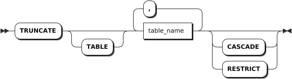

# TRUNCATE

The `TRUNCATE` statement removes all rows from a table.

## Privileges

The user must be a member of the `admin` role or have been granted the `DROP` privilege on the specified table(s).

## Syntax



## Parameters

| Parameter | Description |
| --- | --- |
| `table_name` | The name of the table that contains the rows to delete. |
| `CASCADE` | Optional. Truncate all tables with Foreign Key dependencies on the table being truncated. The `CASCADE` keyword does not list objects it truncates, so it should be used cautiously.|
| `RESTRICT` | (Default) Optional. Do not truncate the table if any other tables have Foreign Key dependencies on it.|

## Examples

These examples assume that you have created three tables and inserted data into these tables.

```sql
-- 1. Create a table named t1.

CREATE TABLE t1(id INT8 DEFAULT unique_rowid() PRIMARY KEY, name STRING);
CREATE TABLE 

-- 2. Insert data into table t1.

INSERT INTO t1 VALUES(1, 'foo'), (2, 'bar');
INSERT 2

-- 3. Check data of table t1.

SELECT * FROM t1;
  id | name
-----+-------
   1 | foo
   2 | bar
(2 rows)

-- 4. Create a table named customer.

CREATE TABLE customer(id INT8 DEFAULT unique_rowid() PRIMARY KEY, email STRING);
CREATE TABLE

-- 5. Insert data into table customer.

INSERT INTO customer VALUES (1, 'zhangsan@163.com'), (2, 'lisi@163.com');
INSERT 2

-- 6. Check data of table customer.

SELECT * FROM customer;
  id |      email
-----+-------------------
   1 | zhangsan@163.com
   2 | lisi@163.com
(2 rows)

-- 7. Create a table named orders and set a Foreign Key on the table.

CREATE TABLE orders(id INT8 DEFAULT unique_rowid() PRIMARY KEY, customer_id INT REFERENCES customer(id) ON DELETE CASCADE);
CREATE TABLE 

-- 8. Insert data into table orders.

INSERT INTO orders VALUES (1,1),(2,1),(3,2),(4,2);
INSERT 4

-- 9. Check data of table orders.

SELECT * FROM orders;
  id | customer_id
-----+--------------
   1 |           1
   2 |           1
   3 |           2
   4 |           2
(4 rows)
```

- Truncate a table without foreign key dependencies.

    ```sql
    -- 1. Truncate table t1.

    TRUNCATE t1;
    TRUNCATE

    -- 2. Check data of table t1.

    SELECT * FROM t1;
    id|name
    --+----
    (0 rows)
    ```

- Truncate a table and dependent tables.

    ```sql
    -- 1. Truncate table customer without specifying the CASCADE keyword. 

    TRUNCATE customer;
    ERROR:  "customer" is referenced by foreign key from table "orders"

    -- 2. Truncate table customer using the CASCADE keyword. 

    TRUNCATE customer CASCADE;
    TRUNCATE 

    -- 3. Check data of table customer.

    SELECT * FROM customer;
    id|email
    --+-----
    (0 rows)

    -- 4. Check data of orders customer.

    SELECT * FROM orders;
    id|customer_id
    --+-----------
    (0 rows)
    ```
