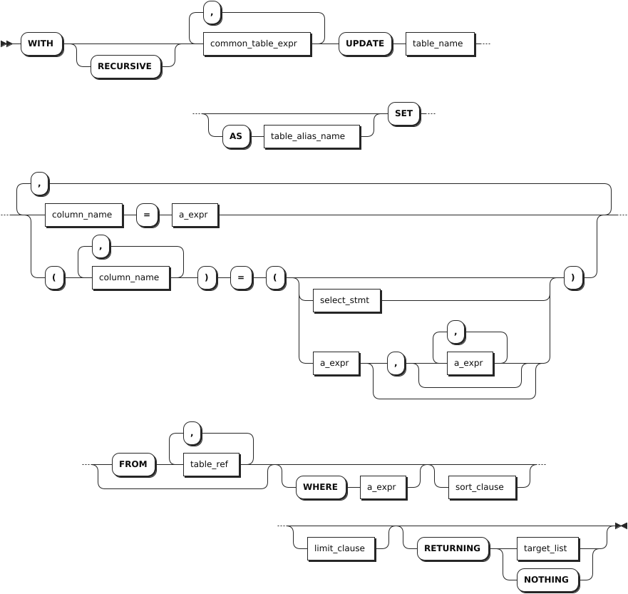

# UPDATE

The `UPDATE` statement updates rows in a table. When the `sql_safe_updates` session variable is set to `true`, you cannot update all data. To update all data, you need to set the `sql_safe_updates` session variable to `false`.

## Privileges

The user must be a member of the `admin` role or have been granted the `UPDATE` and `SELECT` privileges on the specified table(s).

## Syntax



- `common_table_expr`

    

- `limit_clause`

    

- `sort_clause`

    

- `target_list`

    

## Parameters

| Parameter | Description |
| --- | --- |
| `common_table_expr` | You can use it in combination with the `WITH` keyword as the `WITH AS` clause. It provides an alias for a frequently-performed SQL subquery before it is used in a larger query context. Therefore, the system can directly recall the SQL subquery using the alias. This improves the query performance. |
| `table_name` | The name of the table that contains the rows to update. |
| `AS table_alias_name` | An alias for the table name. When an alias is provided, it completely hides the actual table name. |
| `column_name` | A comma-separated list of names of columns to update. If no column name is specified, update all columns of the table. |
| `a_expr` | The new value, aggregate function or the scalar expression to use. To fill all columns with their default values, use `DEFAULT VALUES` in place of `a_expr`. To fill a specific column with its default value, leave the value out of the `a_expr` or use `DEFAULT` at the appropriate position. |
| `FROM table_ref` | Specify a table to reference, but not update, in `UPDATE` expressions, or in `RETURNING` and `WHERE` clauses. |
| `select_stmt` | A selection query to generate data to be inserted into the table. Each value must match the data type of its column. If column names are specified, values must be in corresponding order. Otherwise, values must follow the declared order of the columns in the table.|
| `WHERE a_expr` | The filtering statement for the `UPDATE` statement, which is used to update rows that return `TRUE`. `a_expr` must be an expression that returns Boolean values using columns (e.g., `<column> = <value>`). Without a `WHERE` clause, the `UPDATE` statement update all rows for the table.|
| `sort_clause` | An `ORDER BY` clause to specify the order of rows to update.|
| `limit_clause` | A `LIMIT` clause to limit the number of rows to update. |
| `RETURNING target_list` | Return values based on rows updated, where `target_list` can be specific column names from the table. `*` means returning values for all columns while you can also use computations using scalar expressions to specify columns. To return nothing in the response, not even the number of rows updated, use `RETURNING NOTHING`. |

## Examples

These examples assume that you have created a table and inserted data into the table.

```sql
-- 1. Crete a table named accounts.

CREATE TABLE accounts(id INT8 DEFAULT unique_rowid() PRIMARY KEY, balance DECIMAL, customer STRING);
CREATE TABLE 

-- 2. Insert data into the table.

INSERT INTO accounts (id, balance, customer) VALUES (1, 10000.50, 'Zhang San'), (2, 4000.0, 'Li Si'), (3, 8700.0, 'Wang Wu'), (4, 3400.0, 'Zhao Liu');
INSERT 4

-- 3. Check data of the table.

SELECT * FROM accounts;
  id | balance  | customer
-----+----------+------------
   1 | 10000.50 | Zhang San
   2 |   4000.0 | Li Si
   3 |   8700.0 | Wang Wu
   4 |   3400.0 | Zhao Liu
(4 rows)
```

- Update a single column in a single row using the `WHERE` clause.

    ```sql
    -- 1. Update the table.

    UPDATE accounts SET balance = 5000.0 WHERE id = 2;
    UPDATE 1

    -- 2. Check data of the table.

    SELECT * FROM accounts;
      id | balance  | customer
    -----+----------+------------
      1 | 10000.50 | Zhang San
      2 |   5000.0 | Li Si
      3 |   8700.0 | Wang Wu
      4 |   3400.0 | Zhao Liu 
    (4 rows)
    ```

- Update multiple columns in a single row using the `WHERE` clause.

    ```sql
    -- 1. Update the table.

    UPDATE accounts SET (balance, customer) = (9000.0, 'Qian Qi') WHERE id = 2;
    UPDATE 1

    -- 2. Check data of the table.

    SELECT * FROM accounts;
      id | balance  | customer
    -----+----------+------------
      1 | 10000.50 | Zhang San
      2 |   9000.0 | Qian Qi
      3 |   8700.0 | Wang Wu
      4 |   3400.0 | Zhao Liu
    (4 rows)

    -- 3. Update the table.

    UPDATE accounts SET balance = 6300.0, customer = 'Sun Yang' WHERE id = 3;
    UPDATE 1

    -- 4. Check data of the table.

    SELECT * FROM accounts;
      id | balance  | customer
    -----+----------+------------
      1 | 10000.50 | Zhang San
      2 |   9000.0 | Qian Qi
      3 |   6300.0 | Sun Yang
      4 |   3400.0 | Zhao Liu
    (4 rows)
    ```

- Update the table using the `SELECT` statement.

    ```sql
    -- 1. Update the table.

    UPDATE accounts SET (balance, customer)=(SELECT balance, customer FROM accounts WHERE id = 2) WHERE id = 4;
    UPDATE 1

    -- 2. Check data of the table.

    SELECT * FROM accounts;
      id | balance  | customer
    -----+----------+------------
      1 | 10000.50 | Zhang San
      2 |   9000.0 | Qian Qi
      3 |   6300.0 | Sun Yang
      4 |   9000.0 | Qian Qi
    (4 rows)
    ```

- Update a single column in a single row using the default value.

    ```sql
    -- 1. Update the table.

    UPDATE accounts SET balance = DEFAULT WHERE customer = 'Sun Yang';
    UPDATE 1

    -- 2. Check data of the table.

    SELECT * FROM accounts;
      id | balance  | customer
    -----+----------+------------
      1 | 10000.50 | Zhang San
      2 |   9000.0 | Qian Qi
      3 |   NULL   | Sun Yang
      4 |   9000.0 | Qian Qi
    (4 rows)
    ```

- Update the table using values from a different table.

    ```sql
    -- 1. Create a table named accounts2.

    CREATE TABLE accounts2(id INT8 DEFAULT unique_rowid(),balance DECIMAL);
    CREATE TABLE 

    -- 2. Insert data into table accounts2.

    INSERT INTO accounts2 (id, balance) VALUES (4, 1000);
    INSERT 1

    -- 3. Check data of table accounts2.

    SELECT * FROM accounts2;
    id|balance
    --+-------
    4 |1000   
    (1 row)

    -- 4. Update table accounts using values from table accounts2.

    UPDATE accounts SET customer = 'Li Ming' FROM accounts2 WHERE accounts.id=accounts2.id;
    UPDATE 1

    -- 5. Check data of the accounts table.

    SELECT * FROM accounts;
      id | balance  | customer
    -----+----------+------------
      1 | 10000.50 | Zhang San
      2 |   9000.0 | Qian Qi
      3 | NULL     | Sun Yang
      4 |   9000.0 | Li Ming
    (4 rows)
    ```

- Update all rows in a table.

    ```sql
    -- 1. Set the sql_safe_updates session variable to false.
    SET sql_safe_updates = false;
    SET

    -- 2. Update the table.

    UPDATE accounts SET balance = 5000.0;
    UPDATE 4

    -- 3. Check data of the table.

    SELECT * FROM accounts;
      id | balance | customer
    -----+---------+------------
      1 |  5000.0 | Zhang San
      2 |  5000.0 | Qian Qi
      3 |  5000.0 | Sun Yang
      4 |  5000.0 | Li Ming
    (4 rows)
    ```

- Update the table and return values of the specified column using the `RETURNING` clause.

    ```sql
    UPDATE accounts SET balance = DEFAULT WHERE id = 1 RETURNING id;
      id
    ------
      1
    (1 row)
    ```