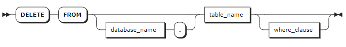

# DELETE

The `DELETE` statement deletes rows from a table.

::: warning Note

- If the system encounters an abnormal interruption during data deletion, you can ​restart the service and query the table​ to retrieve information about the deleted data. Additionally, you can ​check the logs​ to determine the ​number of deleted rows.
- By default, when the `sql_safe_updates` session variable is set to `true`, you cannot delete all data. To delete all data, you need to set the `sql_safe_updates` session variable to `false`.

:::

## Privileges

The user must be a member of the `admin` role or have been granted the `SELECT` and `DELETE` privileges on the specified table(s).


## Syntax



## Parameters

| Parameter | Description |
| --- | --- |
| `database_name` | Optional. The name of the database from which to delete data. If not specified, use the current database.|
| `table_name` | The name of the table from which to delete data. |
| `where_clause` | Optional. A filter condition for the delete operation. If omitted, all data column data in the table is deleted by default, while tag data is retained. The `WHERE` clause supports the following formats:<br>- `where <timestamp_column> = <value>`: Deletes data column data within the specified time range only, while retaining tag data. The timestamp column must be the first column of the table, and the corresponding value must be a timestamp literal, such as `'2023-12-01 08:00:00'`. KWDB supports specifying one or more time ranges using the `<`, `>`, `=`, `!=`, `>=`, `<=`, `and`, `or`, `in`, and `not in` operators.<br>- `where <primary_tag> = <value>`: Deletes both data column data and tag data. The `value` must be a constant. To delete all data column data and tag data from a time-series table with multiple primary tags, all primary tags and their values must be listed, joined with `and` — for example, `ptag1 = 1 and ptag2 = 2`. The `or` operator is also supported, but each operand must be a complete set of primary tag conditions — for example, `(ptag1 = value1 and ptag2 = value2) or (ptag1 = value3 and ptag2 = value4)`. To delete data column data and tag data for a subset of rows, you may specify only some primary tags and their values, joined with `and` — for example, `ptag1 = 1 and ptag2 = 2`. When specifying a partial set of primary tags, using `and` to combine different values for the same primary tag is not supported (e.g., `ptag1 = 1 and ptag1 = 2`), nor is using `or` (e.g., `ptag1 = 1 or ptag2 = 2` or `ptag1 = 1 or ptag1 = 2`). Currently, tag columns do not support the `<`, `>`, `!=`, `>=`, `<=`, `in`, or `not in` operators.<br>- `where <timestamp_column> = <value> and <primary_tag> = <value>`: Deletes data column data within the specified time range only, while retaining tag data. |

## Examples

These examples assume that you have created a time-series database and two time-series tables.

```sql
-- 1. Create a time-series database named ts and use the database.

create ts database ts;
use ts;
SET

-- 2. Create a time-series table named table1 and insert data into the table.

CREATE TABLE table1 (time timestamp not null, e1 smallint, e2 float, e3 bool) TAGS (tag1 smallint not null, tag2 int not null, tag3 bool) PRIMARY TAGS (tag1, tag2);
CREATE TABLE

INSERT INTO table1 VALUES ('2023-05-31 10:00:00', 1000,1000000,true, 1, 1, false), ('2023-05-31 11:00:00', 2000,2000000, true, 1, 1, false), ('2023-05-31 10:00:00', 1000,1000000,true, 2, 1, false), ('2023-05-31 11:00:00', 2000,2000000,true, 2, 1, false), ('2023-05-31 10:00:00', 1000,1000000,true, 3, 1, false), ('2023-05-31 11:00:00', 2000,2000000,true, 3, 1, false);
INSERT 6

-- 3. Create a time-series table named table2 and insert data into the table.

CREATE TABLE table2 (time timestamp not null, e1 smallint, e2 float, e3 bool) TAGS (tag1 smallint not null, tag2 int not null, tag3 bool) PRIMARY TAGS (tag1, tag2);
CREATE TABLE

INSERT INTO table2 VALUES ('2023-05-31 10:00:00', 1000,1000000,true, 1, 1, false), ('2023-05-31 11:00:00', 2000,2000000, true, 1, 1, false), ('2023-05-31 10:00:00', 1000,1000000,true, 2, 1, false), ('2023-05-31 11:00:00', 2000,2000000,true, 2, 1, false), ('2023-05-31 10:00:00', 1000,1000000,true, 3, 1, false), ('2023-05-31 11:00:00', 2000,2000000,true, 3, 1, false);
INSERT 6

-- 4. Check data of table table1.

SELECT * FROM table1;
            time            |  e1  |  e2   |  e3  | tag1 | tag2 | tag3
----------------------------+------+-------+------+------+------+--------
  2023-05-31 10:00:00+00:00 | 1000 | 1e+06 | true |    1 |    1 | false
  2023-05-31 11:00:00+00:00 | 2000 | 2e+06 | true |    1 |    1 | false
  2023-05-31 10:00:00+00:00 | 1000 | 1e+06 | true |    2 |    1 | false
  2023-05-31 11:00:00+00:00 | 2000 | 2e+06 | true |    2 |    1 | false
  2023-05-31 10:00:00+00:00 | 1000 | 1e+06 | true |    3 |    1 | false
  2023-05-31 11:00:00+00:00 | 2000 | 2e+06 | true |    3 |    1 | false
(6 rows)

-- 5. Check data of table table2.

SELECT * FROM table2;
            time            |  e1  |  e2   |  e3  | tag1 | tag2 | tag3
----------------------------+------+-------+------+------+------+--------
  2023-05-31 10:00:00+00:00 | 1000 | 1e+06 | true |    1 |    1 | false
  2023-05-31 11:00:00+00:00 | 2000 | 2e+06 | true |    1 |    1 | false
  2023-05-31 10:00:00+00:00 | 1000 | 1e+06 | true |    2 |    1 | false
  2023-05-31 11:00:00+00:00 | 2000 | 2e+06 | true |    2 |    1 | false
  2023-05-31 10:00:00+00:00 | 1000 | 1e+06 | true |    3 |    1 | false
  2023-05-31 11:00:00+00:00 | 2000 | 2e+06 | true |    3 |    1 | false
(6 rows)
```

- Only delete values of data columns from `table1` table and keep tag values.

    ```sql
    DELETE FROM table1;
    DELETE 6

    SELECT * FROM table1;
      time | e1 | e2 | e3 | tag1 | tag2 | tag3
    -------+----+----+----+------+------+-------
    (0 rows)

    SHOW TAG VALUES FROM table1;
      tag1 | tag2 | tag3
    -------+------+--------
        1 |    1 | false
        2 |    1 | false
        3 |    1 | false
    (2 rows)
    ```

- Delete values of both data columns and tag columns from `table2` table.

    ```sql
    DELETE FROM table2 WHERE tag1 = 1 AND tag2 = 1;
    DELETE 2

    SELECT * FROM table2;
                time            |  e1  |  e2   |  e3  | tag1 | tag2 | tag3
    ----------------------------+------+-------+------+------+------+--------
      2023-05-31 10:00:00+00:00 | 1000 | 1e+06 | true |    2 |    1 | false
      2023-05-31 11:00:00+00:00 | 2000 | 2e+06 | true |    2 |    1 | false
      2023-05-31 10:00:00+00:00 | 1000 | 1e+06 | true |    3 |    1 | false
      2023-05-31 11:00:00+00:00 | 2000 | 2e+06 | true |    3 |    1 | false
    (4 rows)


    SHOW TAG VALUES FROM table2;
      tag1 | tag2 | tag3
    -------+------+--------
        2 |    1 | false
        3 |    1 | false
    (2 rows)
    ```

- Delete values of data columns from `table2` table based on a specified time range but keep tag values.

    ```sql
    DELETE FROM table2 WHERE time > '2023-05-01 10:00:00';
    DELETE 2

    SELECT * FROM table2;
                time            |  e1  |  e2   |  e3  | tag1 | tag2 | tag3
    ----------------------------+------+-------+------+------+------+--------
      2023-05-31 10:00:00+00:00 | 1000 | 1e+06 | true |    3 |    1 | false
      2023-05-31 11:00:00+00:00 | 2000 | 2e+06 | true |    3 |    1 | false
    (2 rows)

    SHOW TAG VALUES FROM table2;
      tag1 | tag2 | tag3
    -------+------+--------
        2 |    1 | false
        3 |    1 | false
    (2 rows)
    ```

- Delete values of data columns from `table1` table based on multiple specified time ranges but keep tag values.

    ```sql
    DELETE FROM table1 WHERE time in ('2023-05-01 10:00:00', '2023-05-01 11:00:00');
    DELETE 2

    SELECT * FROM table1;
      time | e1 | e2 | e3 | tag1 | tag2 | tag3
    -------+----+----+----+------+------+-------
    (0 rows)

    SHOW TAG VALUES FROM table1;
      tag1 | tag2 | tag3
    -------+------+--------
        2 |    1 | false
        3 |    1 | false
    (2 rows)
    ```

- Delete data column data and tag data for specific rows.

  The following example deletes the specified data column data and tag data from `table2`.
  
  ```sql
  DELETE FROM table2 WHERE time > '2023-05-01 10:00:00' and tag1 = 1;
  ```