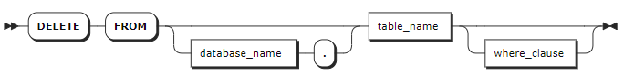

# DELETE

The `DELETE` statement deletes rows from a table.

::: warning Note

- If the system encounters an abnormal interruption during data deletion, you can ​restart the service and query the table​ to retrieve information about the deleted data. Additionally, you can ​check the logs​ to determine the ​number of deleted rows.
- By default, when the `sql_safe_updates` session variable is set to `true`, you cannot delete all data. To delete all data, you need to set the `sql_safe_updates` session variable to `false`.

:::

## Privileges

The user must have been granted the `SELECT` and `DELETE` privileges on the specified table(s).

## Syntax



## Parameters

| Parameter | Description |
| --- | --- |
| `database_name` | Optional. The name of the database from which to delete data. If not specified, use the current database.|
| `table_name` | The name of the table from which to delete data. |
| `where_clause` | Optional. Specify the ​time range​ for deleting values from data columns and whether to delete the tag values. If not specified, the system deletes all data from data columns but keeping tag values by default. The `WHERE` clause supports the following two forms: <br>- Specify the time range of values to be deleted but keeping tag values. The timestamp-typed column ​must be the first column​ in the table, and the corresponding value ​only supports timestamp constants​ (e.g., `'2023-12-01 08:00:00'`). KWDB allows specifying ​one or multiple time ranges​ using `<`, `>`, `=`, `!=`, `>=`, `<=`, `and`, `or`, `in`, and `not in` operators. <br>- `where <primary_tag> = <value>`: delete values from data columns and tag columns, where `value` ​only supports constant values. If the time-series table has ​multiple Primary tags, all Primary tags and their values must be listed and connected with `and` (e.g., `ptag1 = 1 and ptag2 = 2`). |

## Examples

These examples assume that you have created a time-series database and two time-series tables.

```sql
-- 1. Create a time-series database named ts and use the database.

create ts database ts;
use ts;
SET

-- 2. Create a time-series table named table1 and insert data into the table.

CREATE TABLE table1 (time timestamp not null, e1 smallint, e2 float, e3 bool) TAGS (tag1 smallint not null, tag2 int not null, tag3 bool) PRIMARY TAGS (tag1, tag2);
CREATE TABLE

INSERT INTO table1 VALUES ('2023-05-31 10:00:00', 1000,1000000,true, 1, 1, false), ('2023-05-31 11:00:00', 2000,2000000, true, 1, 1, false), ('2023-05-31 10:00:00', 1000,1000000,true, 2, 1, false), ('2023-05-31 11:00:00', 2000,2000000,true, 2, 1, false), ('2023-05-31 10:00:00', 1000,1000000,true, 3, 1, false), ('2023-05-31 11:00:00', 2000,2000000,true, 3, 1, false);
INSERT 6

-- 3. Create a time-series table named table2 and insert data into the table.

CREATE TABLE table2 (time timestamp not null, e1 smallint, e2 float, e3 bool) TAGS (tag1 smallint not null, tag2 int not null, tag3 bool) PRIMARY TAGS (tag1, tag2);
CREATE TABLE

INSERT INTO table2 VALUES ('2023-05-31 10:00:00', 1000,1000000,true, 1, 1, false), ('2023-05-31 11:00:00', 2000,2000000, true, 1, 1, false), ('2023-05-31 10:00:00', 1000,1000000,true, 2, 1, false), ('2023-05-31 11:00:00', 2000,2000000,true, 2, 1, false), ('2023-05-31 10:00:00', 1000,1000000,true, 3, 1, false), ('2023-05-31 11:00:00', 2000,2000000,true, 3, 1, false);
INSERT 6

-- 4. Check data of table table1.

SELECT * FROM table1;
            time            |  e1  |  e2   |  e3  | tag1 | tag2 | tag3
----------------------------+------+-------+------+------+------+--------
  2023-05-31 10:00:00+00:00 | 1000 | 1e+06 | true |    1 |    1 | false
  2023-05-31 11:00:00+00:00 | 2000 | 2e+06 | true |    1 |    1 | false
  2023-05-31 10:00:00+00:00 | 1000 | 1e+06 | true |    2 |    1 | false
  2023-05-31 11:00:00+00:00 | 2000 | 2e+06 | true |    2 |    1 | false
  2023-05-31 10:00:00+00:00 | 1000 | 1e+06 | true |    3 |    1 | false
  2023-05-31 11:00:00+00:00 | 2000 | 2e+06 | true |    3 |    1 | false
(6 rows)

-- 5. Check data of table table2.

SELECT * FROM table2;
            time            |  e1  |  e2   |  e3  | tag1 | tag2 | tag3
----------------------------+------+-------+------+------+------+--------
  2023-05-31 10:00:00+00:00 | 1000 | 1e+06 | true |    1 |    1 | false
  2023-05-31 11:00:00+00:00 | 2000 | 2e+06 | true |    1 |    1 | false
  2023-05-31 10:00:00+00:00 | 1000 | 1e+06 | true |    2 |    1 | false
  2023-05-31 11:00:00+00:00 | 2000 | 2e+06 | true |    2 |    1 | false
  2023-05-31 10:00:00+00:00 | 1000 | 1e+06 | true |    3 |    1 | false
  2023-05-31 11:00:00+00:00 | 2000 | 2e+06 | true |    3 |    1 | false
(6 rows)
```

- Only delete values of data columns from `table1` table and keep tag values.

    ```sql
    DELETE FROM table1;
    DELETE 6

    SELECT * FROM table1;
      time | e1 | e2 | e3 | tag1 | tag2 | tag3
    -------+----+----+----+------+------+-------
    (0 rows)

    SHOW TAG VALUES FROM table1;
      tag1 | tag2 | tag3
    -------+------+--------
        1 |    1 | false
        2 |    1 | false
        3 |    1 | false
    (2 rows)
    ```

- Delete values of both data columns and tag columns from `table2` table.

    ```sql
    DELETE FROM table2 WHERE tag1 = 1 AND tag2 = 1;
    DELETE 2

    SELECT * FROM table2;
                time            |  e1  |  e2   |  e3  | tag1 | tag2 | tag3
    ----------------------------+------+-------+------+------+------+--------
      2023-05-31 10:00:00+00:00 | 1000 | 1e+06 | true |    2 |    1 | false
      2023-05-31 11:00:00+00:00 | 2000 | 2e+06 | true |    2 |    1 | false
      2023-05-31 10:00:00+00:00 | 1000 | 1e+06 | true |    3 |    1 | false
      2023-05-31 11:00:00+00:00 | 2000 | 2e+06 | true |    3 |    1 | false
    (4 rows)


    SHOW TAG VALUES FROM table2;
      tag1 | tag2 | tag3
    -------+------+--------
        2 |    1 | false
        3 |    1 | false
    (2 rows)
    ```

- Delete values of data columns from `table2` table based on a specified time range but keep tag values.

    ```sql
    DELETE FROM table2 WHERE time > '2023-05-01 10:00:00';
    DELETE 2

    SELECT * FROM table2;
                time            |  e1  |  e2   |  e3  | tag1 | tag2 | tag3
    ----------------------------+------+-------+------+------+------+--------
      2023-05-31 10:00:00+00:00 | 1000 | 1e+06 | true |    3 |    1 | false
      2023-05-31 11:00:00+00:00 | 2000 | 2e+06 | true |    3 |    1 | false
    (2 rows)

    SHOW TAG VALUES FROM table2;
      tag1 | tag2 | tag3
    -------+------+--------
        2 |    1 | false
        3 |    1 | false
    (2 rows)
    ```

- Delete values of data columns from `table1` table based on multiple specified time ranges but keep tag values.

    ```sql
    DELETE FROM table1 WHERE time in ('2023-05-01 10:00:00', '2023-05-01 11:00:00');
    DELETE 2

    SELECT * FROM table1;
      time | e1 | e2 | e3 | tag1 | tag2 | tag3
    -------+----+----+----+------+------+-------
    (0 rows)

    SHOW TAG VALUES FROM table1;
      tag1 | tag2 | tag3
    -------+------+--------
        2 |    1 | false
        3 |    1 | false
    (2 rows)
    ```
