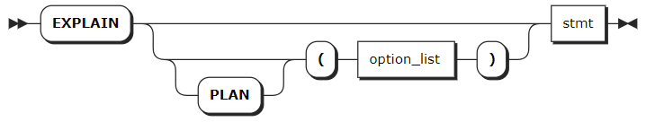
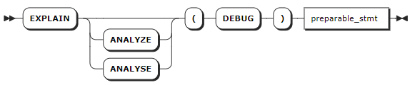
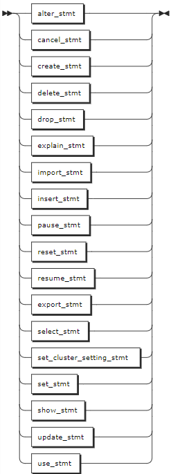

# SELECT Optimization

KWDB supports using `EXPLAIN` or `EXPLAIN ANALYZE` output to optimize your queries as follows:

- The less levels are, the more quickly queries execute.
- Restructure queries to require fewer levels of processing and then improve performance. Avoid scanning an entire table, which is the slowest way to access data. Create indexes that contain at least one of the columns that the query is filtering in its `WHERE` clause.

## EXPLAIN

The `EXPLAIN` statement returns KWDB's statement plan for a preparable statement. You can use this information to optimize the query.

### Privileges

The user must be a member of the `admin` role or have been granted appropriate privileges for the statement being explained.

### Syntax



### Parameters

| Parameter | Description |
| --- | --- |
| `option_list` | An optional comma-separated list of options. KWDB supports the following options: <br>- `VERBOSE`: show as much information as possible about the statement plan. <br>- `TYPES`: include the data types KWDB chooses to evaluate intermediate SQL expressions. <br>- `OPT`: display the statement plan tree generated by the Cost-Based Optimizer (COB). |
| `stmt` | The `SELECT` statement to explain. |

### Responses

A successful `EXPLAIN` statement returns a table with the following fields:

- `tree`: a tree representation of the hierarchy of the statement plan.
- `field`: the property names of the statement plan. Distributed and vectorized properties apply to the entire statement plan while other properties apply to statement plan nodes in the tree architecture.
- `description`: additional information about parameters in fields.
- `columns`: the columns provided to processes at lower levels of the hierarchy. This field is included in output of the `EXPLAIN` statement with the `TYPES` or `VERBOSE` option.
- `ordering`: the order where the results are presented to processes at each level of the hierarchy and other attributes of the result set at each level. This field is included in output of the `EXPLAIN` statement with the `TYPES` or `VERBOSE` option.

### Examples

These examples assume that you have created a table and inserted data into the table.

```sql
-- 1. Create a table named t3.
CREATE TABLE t3(k_timestamp timestamp not null,e1 int) TAGS (c1 smallint not null,c2 nchar(10) not null,c3 char not null,c4 varchar(10) not null,size int not null) PRIMARY TAGS (c1,c2,c3,c4);

-- 2. Insert data into the table.

INSERT INTO t3 VALUES ('2024-1-1 1:00:00',1,1,'100','a','aa',2);
INSERT INTO t3 VALUES ('2024-1-1 1:01:00',2,2,'200','a','aaa',2);
INSERT INTO t3 VALUES ('2024-1-1 2:00:00',3,2,'200','a','aaa',6);
INSERT INTO t3 VALUES ('2024-1-1 3:00:00',4,4,'500','b','bb',4);
INSERT INTO t3 VALUES ('2024-1-1 4:00:00',5,5,'500','b','bb',5);
INSERT INTO t3 VALUES ('2024-1-1 5:00:00',6,6,'6','b','bbb',6);
INSERT INTO t3 VALUES ('2024-1-1 6:00:00',7,7,'8','c','cc',7);
INSERT INTO t3 VALUES ('2024-1-1 7:00:00',8,8,'8','c','cc',8);
INSERT INTO t3 VALUES ('2024-1-1 8:00:00',9,9,'9','c','cc',9);
INSERT INTO t3 VALUES ('2024-1-1 9:00:00',10,10,'10','c','ccc',10);
```

- Run the `EXPLAIN` statement without any parameters.

    ```sql
    EXPLAIN SELECT c1 FROM t3 WHERE c1 = 1;
          tree     |     field     |  description
    ---------------+---------------+-----------------
                  | distributed   | true
                  | vectorized    | false
      synchronizer |               |
      └── ts scan |               |
                  | ts-table      | t3
                  | access mode   | tableTableMeta
                  | tag filter[0] | c1 = 1
    (7 rows)
    ```

- Run the `EXPLAIN` statement with the `VERBOSE` option.

    ```sql
    EXPLAIN (VERBOSE) SELECT c1 FROM t3 WHERE c1 = 1;
          tree     |     field     |  description   | columns | ordering
    ---------------+---------------+----------------+---------+-----------
                  | distributed   | true           |         |
                  | vectorized    | false          |         |
      synchronizer |               |                | (c1)    |
      └── ts scan |               |                | (c1)    |
                  | ts-table      | t3             |         |
                  | access mode   | tableTableMeta |         |
                  | tag filter[0] | c1 = 1         |         |
    (7 rows)
    ```

- Run the `EXPLAIN` statement with the `TYPES` option.

    ```sql
    EXPLAIN (TYPES) SELECT c1 FROM t3 WHERE c1 = 1;
          tree     |     field     |          description          |  columns  | ordering
    ---------------+---------------+-------------------------------+-----------+-----------
                  | distributed   | true                          |           |
                  | vectorized    | false                         |           |
      synchronizer |               |                               | (c1 int2) |
      └── ts scan |               |                               | (c1 int2) |
                  | ts-table      | t3                            |           |
                  | access mode   | tableTableMeta                |           |
                  | tag filter[0] | ((c1)[int2] = (1)[int])[bool] |           |
    (7 rows)
    ```

- Run the `EXPLAIN` statement with the `OPT` option.

    ```sql
    EXPLAIN (OPT) SELECT c1 FROM t3 WHERE c1 = 1;
        text
    ------------
      t-s-scan
    (1 row)
    ```

- Run the `EXPLAIN` statement with the `OPT` and `VERBOSE` options.

    ```sql
    EXPLAIN (OPT,VERBOSE) SELECT c1 FROM t3 WHERE c1 = 1;
                            text
    ----------------------------------------------------
      t-s-scan
      ├── columns: c1:3
      ├── stats: [rows=8, distinct(3)=0.8, null(3)=0]
      ├── cost: 0.01
      └── fd: ()-->(3)
    (5 rows)
    ```

## EXPLAIN ANALYZE

The `EXPLAIN ANALYZE` statement executes a SQL query and generates a statement plan with execution statistics. Statement plans provide information around SQL execution, which can be used to troubleshoot slow queries by figuring out where time is being spent, how long a component takes streams of input rows and processes them according to a specification, etc.

### Privileges

: the user must be a member of the `admin` role or have been granted appropriate privileges for the statement being explained.


### Syntax



- `preparable_stmt`

    

### Parameters

| Parameter | Description |
| --- | --- |
| `preparable_stmt` | The statement you want details about. Basically, all preparable statements can work with `EXPLAIN ANALYZE`, such as `CREATE`, `INSERT`, `UPDATE`, `DELETE` and so on. |

### Examples

This example runs a `SELECT` query using the `EXPLAIN ANALYZE` statement.

```sql
EXPLAIN ANALYZE(DEBUG) SELECT * FROM accounts WHERE id > 2 ORDER BY balance DESC;
text                                                                        
----------------------------------------------------------------------------
Statement diagnostics bundle generated. Download FROM the Admin UI (Advanced
Debug -> Statement Diagnostics History), via the direct link below, or using
the command line.                                                           
Admin UI: http://127.0.0.1:8080                                             
Direct link: http://127.0.0.1:8080/_admin/v1/stmtbundle/857952323520757761  
Command line: kwbase statement-diag list / download                         
(6 rows)
```
