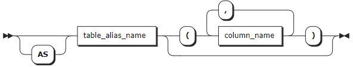
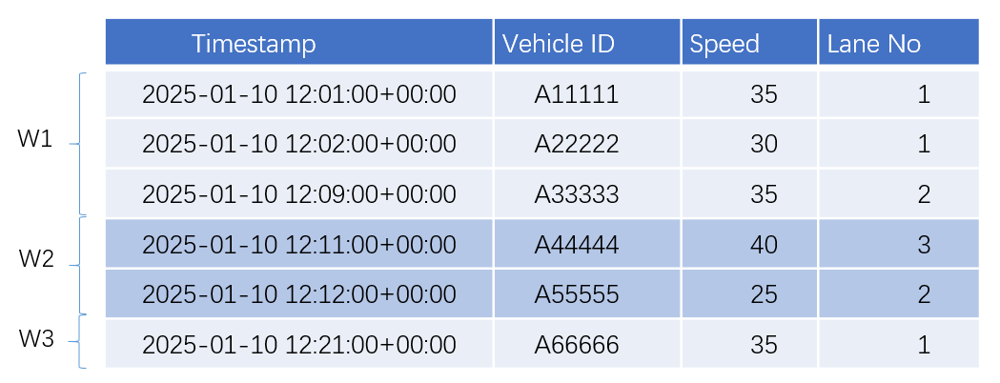
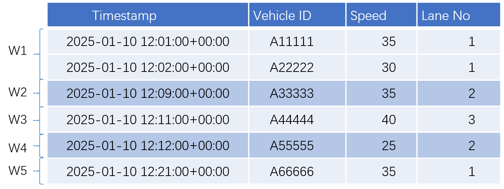
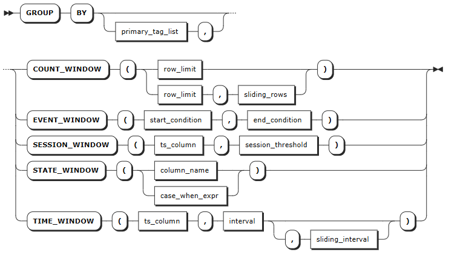
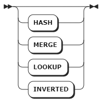
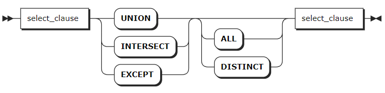

# SELECT

The time-series database supports executing various query types using SQL statements, including ​simple query, ​nested query, ​join query, ​UNION query, and ​interpolation query.

## Simple Query

The simple `SELECT` clause is the main SQL syntax to read and process existing data. When used as a standalone statement, the simple `SELECT` clause is also called the `SELECT` statement. However, it is also a selection clause that can be combined with other constructs to form more complex queries.

KWDB supports configuring the following cluster parameters related to querying time-series data.

- `SET CLUSTER SETTING ts.parallel_degree = <value>`: configure the number of rows to be concurrently queried.
- `SET CLUSTER SETTING sql.auto_limit.quantity = <value>`: configure the maximum number of returned rows of the SQL query results.
- `SET CLUSTER SETTING ts.ordered_table.enabled`: configure whether to return query results in reverse order of the timestamp of the inserted data when the `ORDER BY` clause is not included in a query. When it is set to `true`
  - For single-device queries, the system returns query results in reverse order of the timestamp of the inserted data.
  - For multi-device queries, the system first breaks down the query into single-device queries and then merges all results.

For more information, see [Real-time Parameters](../../../db-operation/cluster-settings-config.md#real-time-parameters).

KWDB supports using the highest precision to perform addition and substraction operations of time in queries for timestamp-typed columns or timestamp constants, and for functions and expressions whose result is timestamp. KWDB supports comparing the operation results using the greater than sign (`>`), the less than sign (`<`), the equals sign (`=`), the greater than or equal to sign (`>=`), and the less than or equal to sign (`<=`). The addition and substraction operations can include the `interval` constant, other timestamp-typed columns, and the functions and expressions whose result is interval, timestamp, or timestampz. If both sides of the operator are timestamp-typed or timestamptz-typed columns, only subtraction is supported. The difference in nanoseconds must not exceed the range of INT64, and the corresponding number of days must not exceed `106751` days. If the limit is exceeded, the system will display it as `106751 days 23:47:16.854775807`.

In addition and substraction operations, the supported units for the `interval` constant include nanosecond (ns), microsecond (us), millisecond (ms), second (s), minute (m), hour (h), day (d), week (w), month (mon), and year (y). Currently, KWDB does ​not​ support composite time formats, such as `1d1h`.

The valid ranges for millisecond, second, minute, and hour are constrained by the maximum value of nanosecond (INT64). The table below specifies the supported value ranges:

| Unit             | Range                                     |
|------------------|-------------------------------------------|
| Nanoseconds (ns) | [0, 9,214,646,400,000,000,000]            |
| Microsecond (us) | [-62,167,219,200,000, 31,556,995,200,000] |
| Millisecond (ms) | [-62,167,219,200,000, 31,556,995,200,000] |
| Second (s)       | [-9,223,372,036, 9,223,372,036]           |
| Minute (m)       | [-153,722,867, 153,722,867]               |
| Hour (h)         | [-2,562,047, 2,562,047]                   |

The valid ranges for day, week, month, and year are constrained by the results of addition and substraction operations, whose corresponding number of microseconds must not exceed the range of INT64.

::: warning Note

KWDB supports using the addition and substraction operations of time in the following cases:

- `SELECT` list: such as `SELECT ts+1h FROM table1;`, which means to return the results based on the specified time (the column's timestamp + one hour).
- `WHERE` clause: such as `SELECT * FROM table1 WHERE ts+1h > now();`, which means to return the results whose specified time (the column's timestamp + one hours) is greater than the current time.
- `ORDER BY` clause: such as `SELECT * FROM table1 ORDER BY ts+1h;`, which means to sort columns based on the specified time (the column's timestamp + one hour).
- `HAVING` clause: such as `SELECT MAX(ts) FROM table1 GROUP BY ts HAVING ts+1h > now();`, which means to filter the qualified grouped results.
- Recall functions whose parameter type is set to timestamp: such as `SELECT CAST(ts+1h AS timestamp) FROM table1;`, which means to convert the results based on the specified time (the column's timestamp + one hour) into timestamp-typed values.
- Use comparision operations to indicate the join condition: such as `SELECT * FROM table1,table2 WHERE table1.ts+1h > table2.ts;`, which means to use the addition and subscription operations when joinning two tables.

:::

### Privileges

The user must have been granted the `SELECT` privilege on the specified table(s).

### Syntax


- `select_clause`

    

- `a_expr`

    

- `target_elem`

    

- `alias_clause`

    

- `as_of_clause`

    

### Parameters

| Parameter | Description |
| --- | --- |
| `order_by_clause` | The `ORDER BY` clause takes a comma-separated list of ordering specifications. Each ordering specification is composed of a column selection followed optionally by the keyword `ASC` or `DESC`.|
| `limit_clause` | The `LIMIT` clause specifies the maximum number of returned rows. For example, `LIMIT 10` means to return up to 10 rows. You can set it to `LIMIT ALL`, which means to return all rows. KWDB also supports configuring the maximum number of returned rows of the SQL query results using the `sql.auto_limit.quantity` cluster parameter. But the priority of the `LIMIT` clause is higher than that of the `sql.auto_limit.quantity` cluster parameter. |
| `offset_clause` | The `OFFSET` clause instructs the operation to skip a specified number of rows. It is often used with `LIMIT` to paginate through retrieved rows. In general, the `OFFSET` cluase is used to paginate large tables to avoid restriving the full table.|
| `DISTINCT` | When `DISTINCT` is specified, duplicate rows in query results are eliminated. |
| `target_elem` | It can be a scalar expression or `*`. <br>- A scalar expression: compute a column in each result row. <br>- `*`: automatically retrieve all columns from the `FROM` clause. <br> If `target_elem` contains an aggregate function, a `GROUP BY` clause can be used to further control the aggregation. |
| `alias_clause` | An alias for the table name or the subquery, which makes queries more readable and understandable.|
| `as_of_clause` | Retrieve data as it existed as of timestamp. <br> **Note** <br> Because `AS OF SYSTEM TIME` returns historical data, your reads might be stale.|
| `WHERE` | The filtering statement for the `SELECT` statement, which is used to select rows that return `TRUE`. The format is `WHERE <column> <operator> <value>` where the `<operator>` supports `=`, `<>`, `<`, `<=`, `>`, `>=`, `LIKE` operators. The columns can be data columns or tag columns. |
| `GROUP BY` | The system uses the `GROUP BY` clause to divide a data set into multiple small areas based on expressions or group window functions and then deals with data in these small areas. When using an aggregate function and `GROUP BY` clause in a query, aviod an oversized result set listed after the `GROUP BY`. For details about Group Window functions, see [Group Window Query](#group-window-queries).|
| `HAVING` | When not working with the `WHERE` clause, the `HAVING` clause is used to filer grouped data. Normally, the `HAVING` clause works with the `GROUP BY` clause to only retrieve aggregate function groups that return `TRUE` for `a_expr`. `a_expr` must be an expression that returns Boolean values using columns (e.g., `<column> = <value>`). The `HAVING` clause works like the `WHERE` clause, but for aggregate functions.|

### Examples

- Retrieve data of a time-series table.

    ```sql
    -- 1. Create a table named t1.

    CREATE TABLE ts_db.t1(ts timestamp not null,a int, b int) tags(tag1 int not null, tag2 int) primary tags(tag1);
    CREATE TABLE

    -- 2. Insert data into the table.

    INSERT INTO ts_db.t1 VALUES(now(),11,11,33,44);
    INSERT INTO ts_db.t1 VALUES(now(),22,22,33,44);
    INSERT INTO ts_db.t1 VALUES(now(),11,33,33,44);
    INSERT INTO ts_db.t1 VALUES(now(),22,44,33,44);
    INSERT INTO ts_db.t1 VALUES(now(),33,55,44,44);
    INSERT INTO ts_db.t1 VALUES(now(),22,44,44,44);
    INSERT INTO ts_db.t1 VALUES(now(),33,44,55,44);
    INSERT INTO ts_db.t1 VALUES(now(),null,null,66,66);
    INSERT INTO ts_db.t1 VALUES(now(),null,null,66,77);

    -- 3. Check data of the table.

    SELECT * FROM t1;
                  ts               |  a   |  b   | tag1 | tag2
    --------------------------------+------+------+------+-------
      2024-02-26 01:28:28.867+00:00 |   11 |   11 |   33 |   44
      2024-02-26 01:28:28.874+00:00 |   22 |   22 |   33 |   44
      2024-02-26 01:28:28.877+00:00 |   11 |   33 |   33 |   44
      2024-02-26 01:28:28.88+00:00  |   22 |   44 |   33 |   44
      2024-02-26 01:28:28.883+00:00 |   33 |   55 |   44 |   44
      2024-02-26 01:28:28.885+00:00 |   22 |   44 |   44 |   44
      2024-02-26 01:28:28.888+00:00 |   33 |   44 |   55 |   44
      2024-02-26 01:28:28.89+00:00  | NULL | NULL |   66 |   66
      2024-02-26 01:28:28.893+00:00 | NULL | NULL |   66 |   66
    (9 rows)
    ```

- Retrieve specific columns.

    ```sql
    SELECT sum(a) FROM ts_db.t1;
      sum
    -------
      154
    (1 row)
    ```

- Use the `DISTINCT` keyword to remove all but one instance of duplicate values from your retrieved data.

    ```sql
    SELECT DISTINCT a FROM ts_db.t1;
      a
    --------
        11
        22
        33
      NULL
    (4 rows)
    ```

- Use the `WHERE` clause to filer tag columns.

    ```sql
    SELECT tag1 FROM ts_db.t1 WHERE a =11;
      tag1
    --------
        33
        33
    (2 rows)
    ```

- Use the `GROUP BY` and `ORDER BY` clauses to group and sort data columns.

    ```sql
    SELECT a, max(b) FROM ts_db.t1 GROUP BY a ORDER BY a;
      a   | max
    -------+-------
      NULL | NULL
        11 |   33
        22 |   44
        33 |   55
    (4 rows)
    ```

## Group Window Query

KWDB supports grouping data based on specific conditions​ (e.g., time intervals, the number of rows, or state information) ​and performing aggregate queries on data groups.

::: warning Note

- ​Group window queries must be used with the `GROUP BY` clause. The `GROUP BY` clause ​supports specifying the table's primary tags.
- Currently​, group window queries only support single-table queries​ and do not support nested queries, JOIN queries, UNION queries, or other grouping conditions.

:::

KWDB supports the following group window functions:

- **Count window**: group data into windows based on the fixed count. After being sorted by the timestamp, data are grouped into windows based on the row count. If the total number of rows is not evenly divisible by the specified row count, the last window will contain ​fewer rows​ than the specified size.

    This example has two windows where every 3 rows is one group.

    

    KWDB​ supports configuring the ​sliding rows​ to define the row interval between the starting points of adjacent windows​ to control the ​degree of overlap​ between windows. The first window is defined as `[1, 1+row_limit)`. The second window is defined as `[1+sliding_rows, 1+sliding_rows+row_limit)`.

    In this example, the fixed row count is set to 3 and the sliding row is set to 2. Data are grouped into 3 windows, where the first window includes data in `[1,4)` row while the second window includes data in `[3,6)` row.

    

- **Event window**: creates data windows dynamically using start and end conditions. Windows open when data meets the start condition and close when the end condition is met. You can use any expression for both conditions, and they can reference different columns.
  
  If a single data point meets both conditions at once and no window is currently open, it creates its own complete window. When the data stream ends, any remaining open window is automatically considered complete, even without meeting the end condition.
  
  In this example, the start condition is speed < 40 and the end condition is lane = 2, which creates 2 windows from the matching data. Row 5 meets both conditions simultaneously, creating one complete window. The final row only meets the start condition, but since it's at the end of the stream, it also forms a complete window.

    

- **Session window**: group data into windows based on the timestamp-typed column and the maximum consecutive interval. If the interval between two adjacent rows exceeds the maximum consecutive interval, the data are assigned to ​different windows.

    In this example, the maximum consecutive interval is set to 5 minute. The interval between the second and the third rows as well as between the fifth and sixth rows exceeds 5 minutes. Therefore, data are grouped into 3 windows.

    

- **State window**: Creates data windows based on device state changes. Consecutive data with the same state goes into the same window. When the state changes, the current window closes and a new one opens.

  In this example, lane number is used as the state field for window partitioning. The data is split into 5 windows based on lane number changes, with results sorted by timestamp.

    

- **Time window**: group data into windows based on the timestamp-typed column and the specified interval.

    After sorting the data by timestamp, the system calculates the window’s starting time (`t0`) based on the first timestamp and the specified interval. `​t0` is determined by rounding down the first timestamp​ based on the interval, which means to adjust it to the largest time point less than or equal to the original timestamp. For example, if the first timestamp is `2025-1-10 12:01:00.000` and the interval is set to 10 minutes, `t0` is rounded down to `2025-1-10 12:00:00.000`. If the interval is set to 1 year, `t0` is rounded down to `2025-1-1 00:00:00.000`.

    In this example, the interval is set to 10 minutes. Therefore, data are grouped into 3 windows: `[2025-1-10 12:00:00.000, 2025-1-10 12:10:00.000)`, `[2025-1-10 12:10:00.000, 2025-1-10 12:20:00.000)` and `[2025-1-10 12:20:00.000, 2025-1-10 12:30:00.000)`.

    

    KWDB supports configuring a sliding interval​ to control the degree of window overlap. The calculation of `t0` follows this logic. First, ​align the first timestamp​ to the nearest sliding interval (rounded up to the smallest time point that is greater than or equal to the original timestamp). Then, subtract the interval​ from the aligned timestamp to determine `t0`. For example, if the first timestamp is `2025-1-10 12:01:00.000` and the interval and sliding interval are 10 minutes and 5 minutes respectively, `t0` is rounded up to `2025-1-10 12:05:00.000` based on the sliding interval. Then, after the interval is substracted, `t0` is `2025-1-10 11:55:00.000`. If the interval is set to 1 year and the sliding interval is set to 1 day, `t0` is `2024-1-11 00:00:00.000`.

    In this example, the interval is set to 10 minutes, and the sliding interval is set to 5 minute. Therefore, data are grouped into 6 windows: `[2025-1-10 11:55:00.000, 2025-1-10 12:05:00.000)`, `[2025-1-10 12:00:00.000, 2025-1-10 12:10:00.000)`, `[2025-1-10 12:05:00.000, 2025-1-10 12:15:00.000)`, `[2025-1-10 12:10:00.000, 2025-1-10 12:20:00.000)`, `[2025-1-10 12:15:00.000, 2025-1-10 12:25:00.000)` and `[2025-1-10 12:20:00.000, 2025-1-10 12:25:00.000)`.

    

### Privileges

The user must have been granted the `SELECT` privilege on the specified table(s).

### Syntax



### Parameters

| Parameter | Description |
| --- | --- |
| `primary_tag_list` | Optional. Specify the primary tags of the time-series table.|
| `row_limit` | In the count window, it is used to specify the number of rows in a group. |
| `sliding_rows` | In the count window, it is used to specify the gap between the starting points of adjacent windows​ to control the ​degree of overlap​ between windows. This value should be smaller than or equal to the value of the `row_limit` parameter.|
| `start_condition` | In the event window, it is used to specify the conditions to start a window. It can be any expression or involve different columns. |
| `end_condition` | In the event window, it is used to specify the conditions to end a window. It can be any expression or involve different columns.   |
| `ts_column` | In the session window and time window, it is used to specify the first timestamp-typed column. |
| `session_threshold` | In the session window , it is used to specify the maximum consecutive interval. If the interval between two adjacent rows exceeds the maximum consecutive interval, the data are assigned to ​different windows. Available units are `s` (second), `m` (minute), `h` (hour), `d` (day) and `w` (week). Currently, KWDB does ​not​ support composite time formats. such as `1m2s`. |
| `column_name` | In the state window, it is used to specify data columns or tag columns. The data type must be Integer, Bool, CHAR, or VARCHAR. <br>- For data columns, the data type must be Integer, Bool, or any String except for GEOMETRY. <br>- For tag columns, the data type must be Integer, Bool, or any String except for GEOMETRY and NVARCHAR.|
| `case_when_expr` | In the state window, it is used to specify the expression to start or end a state after specified conditions are met. For example, `STATE_WINDOW (CASE WHEN voltage >= 225 AND voltage <= 235 THEN 1 ELSE 0 END)` means when the voltage is between `225` and `235`, the state is `1`. Otherwise, the state is `0`. |
| `interval` | In the time window, it is used to specify the interval, in unit of millisecond, second, minute, hour, day, week, month, and year. KWDB does not support composite time formats, such as `1d1h`. The interval must not be smaller than 10 ms. <br> The following lists the input forms for each unit. <br> - millisecond: `ms`, `msec`, `msecs`, `millisecond`, `milliseconds` <br> - second: `s`, `sec`, `secs`, `second`, `seconds` <br> - minute: `m`, `min`, `mins`, `minute`, `minutes` <br> - hour: `h`, `hr`, `hrs`, `hour`, `hours`<br> - day: `d`, `day`, `days` <br> - week: `w`, `week`, `weeks` <br> - month: `mon`, `mons`, `month`, `months` <br> - year: `y`, `yr`, `yrs`, `year`, `years` |
| `sliding_interval` |  In the time window, it is used to specify the sliding interval, in unit of millisecond, second, minute, hour, day, week, month, and year. KWDB does not support composite time formats, such as `1d1h`. <br> The following lists the input forms for each unit. <br> - millisecond: `ms`, `msec`, `msecs`, `millisecond`, `milliseconds` <br> - second: `s`, `sec`, `secs`, `second`, `seconds` <br> - minute: `m`, `min`, `mins`, `minute`, `minutes` <br> - hour: `h`, `hr`, `hrs`, `hour`, `hours`<br> - day: `d`, `day`, `days` <br> - week: `w`, `week`, `weeks` <br> - month: `mon`, `mons`, `month`, `months` <br> - year: `y`, `yr`, `yrs`, `year`, `years` <br> **Note** <br> Avoid significant discrepancies between the interval and sliding interval, as this may ​degrade query performance. Additionally, an ​excessive number of windows​ can lead to ​memory exhaustion.|

### Examples

These examples assume that you have created a table and inserted data into the table.

```sql
-- 1. Create a table named vehicles.
create table vehicles (ts timestamp not null, vehicle_id varchar, speed float, lane_no int) tags (location int not null) primary tags (location);


-- 2. Insert data into the table.
insert into vehicles values ('2025-1-10 12:01:00.000', 'A11111',35,1,1),('2025-1-10 12:02:00.000','A22222',30,1,1),('2025-1-10 12:09:00.000','A33333',35,2,1),('2025-1-10 12:11:00.000','A44444',40,3,1),('2025-1-10 12:12:00.000','A55555',25,2,1),('2025-1-10 12:21:00.000','A66666',35,1,1);

-- Check data of the table.
 select * from vehicles;
             ts             | vehicle_id | speed | lane_no | location
----------------------------+------------+-------+---------+-----------
  2025-01-10 12:01:00+00:00 | A11111     |    35 |       1 |        1
  2025-01-10 12:02:00+00:00 | A22222     |    30 |       1 |        1
  2025-01-10 12:09:00+00:00 | A33333     |    35 |       2 |        1
  2025-01-10 12:11:00+00:00 | A44444     |    40 |       3 |        1
  2025-01-10 12:12:00+00:00 | A55555     |    25 |       2 |        1
  2025-01-10 12:21:00+00:00 | A66666     |    35 |       1 |        1
(6 rows)

```

- Use the count window to perform aggregate queries and windows are not overlapped.

  This example uses the count window to group every 3 rows into a window and windows are not overlapped. `count(ts)` calculates the number of rows in each window and `avg(speed)` calculates the average speed of each window.

    ```sql
    SELECT count(ts) as records, avg(speed) as avg_speed FROM vehicles GROUP BY COUNT_WINDOW (3);
          records |     avg_speed
    ----------+---------------------
            3 | 33.333333333333336
            3 | 33.333333333333336
    (2 rows)
    ```

- Use the count window to perform aggregate queries and windows are overlapped.

  This example uses the count window to group every 3 rows into a window. The starting points of each window are offset by 2 rows, creating overlapped windows. `count(ts)` calculates the number of rows in each window and `avg(speed)` calculates the average speed of each window.

    ```sql
    SELECT count(ts) as records, avg(speed) as avg_speed FROM vehicles GROUP BY COUNT_WINDOW (3,2);
          records |     avg_speed
    ----------+---------------------
            3 | 33.333333333333336
            3 | 33.333333333333336
            2 |                 30
    (3 rows)
    ```

- Use the event window to perform aggregate queries.

  This example groups data into windows by setting the start condition to `speed<40` and the end condition to `lane_no=2`. `count(ts)` calculates the number of rows in each window and `avg(speed)` calculates the average speed of each window.

    ```sql
    SELECT count(ts) as records, avg(speed) as avg_speed FROM vehicles GROUP BY EVENT_WINDOW (speed<40,lane_no=2);
          records |     avg_speed
    ----------+---------------------
            3 | 33.333333333333336
            1 |                 25
            1 |                 35
    (3 rows)
    ```

- Use the session window to perform aggregate queries.

  This example groups data into windows based on the timestamp-typed column (`ts`). The maximum consecutive interval is set to 5 minutes. If the interval between two adjacent rows exceeds the maximum consecutive interval, the system opens a new session window. `count(ts)` calculates the number of rows in each window and `avg(speed)` calculates the average speed of each window.

    ```sql
    SELECT count(ts) as records, avg(speed) as avg_speed FROM vehicles GROUP BY SESSION_WINDOW (ts,'5m');
          records |     avg_speed
    ----------+---------------------
            2 |               32.5
            3 | 33.333333333333336
            1 |                 35
    (3 rows)
    ```

- Use the state window to perform aggregate queries.
  
  This example groups data into windows based on the lane number (`lane_no`). Different lane numbers are grouped into different windows. `count(ts)` calculates the number of rows in each window and `avg(speed)` calculates the average speed of each window.

    ```sql
    SELECT count(ts) as records, avg(speed) as avg_speed FROM vehicles GROUP BY STATE_WINDOW (lane_no);    
      records | avg_speed
    ----------+------------
            2 |      32.5
            1 |        35
            1 |        40
            1 |        25
            1 |        35
    (5 rows)
    ```

- Use the time window to perform aggregate queries and windows are not overlapped.

  This example groups data into windows based on the timestamp-typed column (`ts`). The interval for each window is set to 10 minutes and windows are not overlapped. `count(ts)` calculates the number of rows in each window and `avg(speed)` calculates the average speed of each window.

    ```sql
    SELECT count(ts) as records, avg(speed) as avg_speed FROM vehicles GROUP BY TIME_WINDOW (ts,'10m');
          records |     avg_speed
    ----------+---------------------
            3 | 33.333333333333336
            2 |               32.5
            1 |                 35
    (3 rows)
    ```

- Use the time window to perform aggregate queries and windows are overlapped.

  This example groups data into windows based on the timestamp-typed column (`ts`). The interval for each window is set to 10 minutes. The starting time of each window are offset by 5 minutes, creating overlapped windows. `count(ts)` calculates the number of rows in each window and `avg(speed)` calculates the average speed of each window.

    ```sql
    SELECT count(ts) as records, avg(speed) as avg_speed FROM vehicles GROUP BY TIME_WINDOW (ts,'10m','5m');    
      records |     avg_speed
    ----------+---------------------
            2 |               32.5
            3 | 33.333333333333336
            3 | 33.333333333333336
            2 |               32.5
            1 |                 35
            1 |                 35
    (6 rows)
    ```

## Nested Query

A nested query refers to embed a complete SQL query within another SQL query to perform more complex data retrieve.

KWDB supports the following nested query forms:

- Correlated Subquery: the inner query depends on the outer query’s result and is executed for each row processed by the outer query.
- Non-Correlated Subquery: the inner query is independent of the outer query and is executed only once, returning a fixed result.
- Correlated Scalar Subquery: the inner query depends on the outer query’s result and returns a single scalar value.
- Non-Correlated Scalar Subquery: the inner query is independent and returns a single scalar value.
- `FROM` Subquery: embed a complete SQL query within the `FROM` clause of another query, acting as a temporary table.

::: warning Note
When there are multiple subqueries and logical operators (AND, OR) in the `WHERE` clause and there some semantic errors in some subqueries, the system retruns an error when executing a query, saying `internal error: invalid index`.
:::

### Privileges

The user must have been granted the `SELECT` privilege on the specified table(s).

### Syntax


### Parameters

N/A

### Examples

- Non-Correlated Subquery

    ```sql
    SELECT e1 FROM ts_stable1 WHERE e1 = (SELECT avg (e1) FROM t1.stable);
    e1
    (0 rows)
    ```

- Non-Correlated Scalar Subquery

    ```sql
    SELECT first (e1) = (SELECT e1 FROM ts_stable2 limit 1) FROM ts_stable1;
    ?column?
    -------------
    t
    (1 row)
    ```

- Correlated Subquery

    ```sql
    SELECT e1 FROM t1.stable WHERE e1 in (SELECT e1 FROM t1.stable2 WHERE stable.e2=stable2.e2);
    e1
    -----
    1000
    2000
    3000
    2000
    3000
    4000
    3000
    4000
    5000
    (9 rows)
    ```

- Correlated Scalar Subquery

    ```sql
    SELECT sum(e1) = (SELECT e1 FROM ts_stable2 WHERE ts_stable2.e1=e1) FROM ts_stable1;
    ?column?
    -------------
    t
    (1 row)
    ```

- `FROM` Subquery

    ```sql
    SELECT avg (a) FROM (SELECT e1 as a FROM t1.ts_stable1);
    avg
    ------
    1000
    (1 row)
    ```

## JOIN Query

A JOIN query combines the results of multiple tables into a result set to get more information. KWDB supports the following JOIN query forms:

- INNER JOIN
- LEFT JOIN
- RIGHT JOIN
- FULL JOIN

::: warning Note

When using `FULL JOIN`, ​avoid using subqueries in join conditions.
:::

### Privileges

The user must have been granted the `SELECT` privilege on the specified table(s).

### Syntax


- `opt_join_hint`

    

### Parameters

| Parameter | Description |
| --- | --- |
| `joined_table` | The JOIN expression. |
| `table_ref` | The table expression. |
| `opt_join_hint` | Optional. The join hint. |
| `a_expr` | The scalar expression to use as an `ON` join condition. |
| `name` | The column name to use as a `USING` join condition.|

### Examples

```sql
SELECT ts_table1.e1, ts_table2.e1 FROM ts_table1 LEFT JOIN ts_table2 ON ts_table1.e1 = ts_table2.e1;
e1  | e1
----+-----
1000|1000
(1 row)
```

## UNION Query

A UNION query combines multiple results with the same column structure into a result table.

### Privileges

The user must have been granted the `SELECT` privilege on the specified table(s).

### Syntax



### Parameters

| Parameter | Description |
| --- | --- |
| `UNION` | Combine two or more queries into one result set and automatically remove duplicate rows.|
| `INTERSECT` | Return intersected rows of all queries as a result set. |
| `EXCEPT` | Return rows that are in the first query but not in the second query. |

### Examples

```sql
SELECT e1 FROM t1.ts_stable1 UNION SELECT e1 FROM t1.ts_stable2;
e1    
------
1000
(1 row)
```
