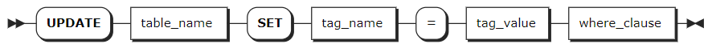

# UPDATE

The `UPDATE` statement updates tag values in a table.

::: tip
In a distributed cluster, if a device's data is distributed across multiple nodes and a node fails ​during a tag value update, it may result in ​inconsistent tag values​ across nodes. To resolve this, you can re-update the tag values to ensure consistent tag values across the cluster.
:::

## Privileges

The user must have been granted the `UPDATE` and `SELECT` privileges on the specified table(s).

## Syntax



## Parameters

| Parameter | Description |
| --- | --- |
| `table_name` | The name of the table. You can use `<database_name>.<table_name>` to specify a table in another database. If not specified, use the table in the current database.|
| `tag_name` | The name of the tag to update. Currently, KWDB does not support changing values of the primary tags. |
| `tag_value` | The new tag value. |
| `where_clause` | Specify the primary tag(s) and their values for the target table​ in the format `where <primary_tag> = <tag_value>`. ​Tag values must be constants. If the table has ​multiple primary tags, ​list all primary tags and their values, connected with `and`.|

## Examples

This example creates a database and a table, inserts data into the table, and updates values for non primary tags of the table.

```sql
-- 1. Create a time-series database named ts.

CREATE TS DATABASE ts;
CREATE TS DATABASE

-- 2. Use the database.

USE ts;
SET

-- 3. Create a time-series table named table1.

CREATE TABLE table1 (time timestamp not null, e1 smallint, e2 float, e3 bool)
TAGS (tag1 smallint not null, tag2 int not null, tag3 bool)
PRIMARY TAGS (tag1, tag2);
CREATE TABLE

-- 4. Insert data into the table.

INSERT INTO table1 VALUES ('2023-05-31 10:00:00', 1000,1000000,true, 1, 1, false), ('2023-05-31 11:00:00', 2000,2000000, true, 1, 1, false), ('2023-05-31 10:00:00', 1000,1000000,true, 2, 1, false), ('2023-05-31 11:00:00', 2000,2000000,true, 2, 1, false), ('2023-05-31 10:00:00', 1000,1000000,true, 3, 1, false), ('2023-05-31 11:00:00', 2000,2000000,true, 3, 1, false);
INSERT 6

-- 5. Check data of the table.

 SELECT * FROM table1;
            time            |  e1  |  e2   |  e3  | tag1 | tag2 | tag3
----------------------------+------+-------+------+------+------+--------
  2023-05-31 10:00:00+00:00 | 1000 | 1e+06 | true |    1 |    1 | false
  2023-05-31 11:00:00+00:00 | 2000 | 2e+06 | true |    1 |    1 | false
  2023-05-31 10:00:00+00:00 | 1000 | 1e+06 | true |    2 |    1 | false
  2023-05-31 11:00:00+00:00 | 2000 | 2e+06 | true |    2 |    1 | false
  2023-05-31 10:00:00+00:00 | 1000 | 1e+06 | true |    3 |    1 | false
  2023-05-31 11:00:00+00:00 | 2000 | 2e+06 | true |    3 |    1 | false
(6 rows)

-- 6. Update values for tag3 tag.

UPDATE table1 SET tag3 = true WHERE tag1 = 1 AND tag2 =1;
UPDATE 1

-- 7. Check data of the table.

SELECT * FROM table1;
            time            |  e1  |  e2   |  e3  | tag1 | tag2 | tag3
----------------------------+------+-------+------+------+------+--------
  2023-05-31 10:00:00+00:00 | 1000 | 1e+06 | true |    2 |    1 | false
  2023-05-31 11:00:00+00:00 | 2000 | 2e+06 | true |    2 |    1 | false
  2023-05-31 10:00:00+00:00 | 1000 | 1e+06 | true |    3 |    1 | false
  2023-05-31 11:00:00+00:00 | 2000 | 2e+06 | true |    3 |    1 | false
  2023-05-31 10:00:00+00:00 | 1000 | 1e+06 | true |    1 |    1 | true
  2023-05-31 11:00:00+00:00 | 2000 | 2e+06 | true |    1 |    1 | true
(6 rows)
```
