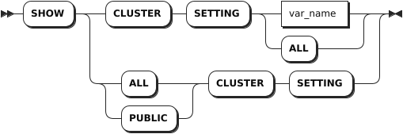

# Cluster Settings

## SET CLUSTER SETTING

The `SET CLUSTER SETTING` statement modifies a cluster-level setting.

::: warning Note
Many cluster settings are intended for tuning KWDB internals. Before changing these settings, it is strongly recommended to think about your goals with KWDB. Otherwise, you use them at your own risk.
:::

### Privileges

The user must be a member of the `admin` role. By default, the `root` user belongs to the `admin` role.

### Syntax


### Parameters

| Parameter   | Description                                         |
|-------------|-----------------------------------------------------|
| `var_name`  | The name of the cluster setting (case-insensitive). |
| `var_value` | The value for the cluster setting.                  |
| `DEFAULT`   | Reset the cluster setting to its default value.     |

### Examples

- Set a value for a single cluster setting.

    ```sql
    SET CLUSTER SETTING audit.enabled = true;
    ```

- Reset a cluster setting to its default value.

    ```sql
    SET CLUSTER SETTING audit.enabled = default;
    ```

## SHOW CLUSTER SETTING

The `SHOW CLUSTER SETTING` statement displays the values of cluster settings.

### Privileges

The user must be a member of the `admin` role. By default, the `root` user belongs to the `admin` role.

### Syntax



::: warning Note

The `SHOW CLUSTER SETTING` statement is unrelated to the following `SHOW` statements:

- `SHOW`
- `SHOW CREATE DATABASE`
- `SHOW CREATE TABLE`
- `SHOW CREATE VIEW`
- `SHOW USERS`
- `SHOW DATABASES`
- `SHOW COLUMNS`
- `SHOW GRANTS`
- `SHOW CONSTRAINTS`

:::

### Parameters

| Parameter  | Description                                         |
|------------|-----------------------------------------------------|
| `var_name` | The name of the cluster setting (case-insensitive). |

### Examples

- Show the value of a single cluster setting.

    ```sql
    SHOW CLUSTER SETTING audit.enabled;
      audit.enabled
    -----------------
          false
    (1 row)
    ```

- Show the values of all cluster settings.

    ```sql
    SHOW ALL CLUSTER SETTINGS;
    variable                                                 |value                                            |setting_type|public|description                                                                                                                                                                                                                                                                                                                                                                                                                                                 
    ---------------------------------------------------------+-------------------------------------------------+------------+------+------------------------------------------------------------------------------------------------------
    audit.enabled                                            |false                                            |b           |f     |the switch of audit                                                                                                                                                                                                                                                                                                                                                                                                                                         
    audit.log.enabled                                        |true                                             |b           |f     |the switch of audit log file record                                                                                                                                                                                                                                                                                                                                                                                                                         
    bulkio.replication_ingestion.apply_txn_interval          |1s                                               |d           |t     |the timestamp interval of apply txn                                                                                                                                                                                                                                                                                                                                                                                                                         
    bulkio.replication_ingestion.cutover_signal_poll_interval|30s                                              |d           |f     |the interval at which the stream ingestion job checks if it has been signaled to cutover                                                                                                                                                                                                                                                                                                                                                                    
    bulkio.replication_ingestion.minimum_flush_interval      |1s                                               |d           |t     |the minimum timestamp between flushes; flushes may still occur if internal buffers fill up                                                                                                                                                                                                                                                                                                                                                                  
    bulkio.replication_recv.apply_txn_interval               |1s                                               |d           |t     |the timestamp interval of apply txn                                                                                                                                                                                                                                                                                                                                                                                                                         
    bulkio.replication_recv.cutover_signal_poll_interval     |30s                                              |d           |f     |the interval at which the stream recv job checks if it has been signaled to cutover                                                                                                                                                                                                                                                                                                                                                                         
    bulkio.replication_recv.minimum_flush_interval           |1s                                               |d           |t     |the minimum timestamp between flushes; flushes may still occur if internal buffers fill up                                                                                                                                                                                                                                                                                                                                                                                                                                                                                   
    ...
    sql.stats.automatic_collection.min_stale_rows            |500                                              |i           |t     |target minimum number of stale rows per table that will trigger a statistics refresh                                                                                                                                                                                                                                                                                                                                                                        
    sql.stats.histogram_collection.enabled                   |true                                             |b           |t     |histogram collection mode                                                                                                                                                                                                                                                                                                                                                                                                                                   
    sql.stats.max_timestamp_age                              |5m0s                                             |d           |f     |maximum age of timestamp during table statistics collection                                                                                                                                                                                                                                                                                                                                                                                                 
    sql.stats.post_events.enabled                            |false                                            |b           |t     |if set, an event is logged for every CREATE STATISTICS job                                                                                                                                                                                                                                                                                                                                                                                                  
    sql.stmt_diagnostics.bundle_chunk_size                   |1.0 MiB                                          |z           |f     |chunk size for statement diagnostic bundles                                                                                                                                                                                                                                                                                                                                                                                                                 
    sql.stmt_diagnostics.poll_interval                       |10s                                              |d           |f     |rate at which the stmtdiagnostics.Registry polls for requests, set to zero to disable                                                                                                                                                                                                                                                                                                                                                                       
    sql.tablecache.lease.refresh_limit                       |50                                               |i           |f     |maximum number of tables to periodically refresh leases for                                                                                                                                                                                                                                                                                                                                                                                                 
    sql.tag_filter_parallel.enabled                          |false                                            |b           |t     |tag screen parallel                                                                                                                                                                                                                                                                                                                                                                                                                                         
    sql.tag_value_cache.enabled                              |true                                             |b           |f     |enable the tag value cache                                                                                                                                                                                                                                                                                                                                                                                                                                  
    sql.temp_object_cleaner.cleanup_interval                 |30m0s                                            |d           |t     |how often to clean up orphaned temporary objects                                                                                                                                                                                                                                                                                                                                                                                                            
    sql.template_table_limit.enabled                         |true                                             |b           |t     |template table limit                                                                                                                                                                                                                                                                                                                                                                                                                                        
    sql.testing.mutations.max_batch_size                     |0                                                |i           |f     |the max number of rows that are processed by a single KV batch when performing a mutation operation (0=default)                                                                                                                                                                                                                                                                                                                                             
    sql.testing.vectorize.batch_size                         |0                                                |i           |f     |the size of a batch of rows in the vectorized engine (0=default, value must be less than 4096)                                                                                                                                                                                                                                                                                                                                                              
    sql.trace.log_statement_execute                          |false                                            |b           |t     |set to true to enable logging of executed statements                                                                                                                                                                                                                                                                                                                                                                                                        
    sql.trace.session_eventlog.enabled                       |false                                            |b           |t     |set to true to enable session tracing. Note that enabling this may have a non-trivial negative performance impact.                                                                                                                                                                                                                                                                                                                                          
    sql.trace.txn.enable_threshold                           |0s                                               |d           |t     |duration beyond which all transactions are traced (set to 0 to disable)                                                                                                                                                                                                                                                                                                                                                                                     
    sql.workload_cache.buffer                                |1.0 GiB                                          |z           |f     |max size of workload info cache                                                                                                                                                                                                                                                                                                                                                                                                                             
    sql.workload_cache.save.interval                         |10s                                              |d           |f     |interval for kwbasedb to fall disk                                                                                                                                                                                                                                                                                                                                                                                                                          
    sql.workloadinfo.application_name_list                   |                                                 |s           |f     |set workload info application_name_list                                                                                                                                                                                                                                                                                                                                                                                                                     
    sql.workloadinfo.enabled                                 |false                                            |b           |f     |enable the workload info collection                                                                                                                                                                                                                                                                                                                                                                                                                         
    sql.workloadinfo.maxcollectnum                           |10                                               |i           |f     |max collecting num of workload info collection                                                                                                                                                                                                                                                                                                                                                                                                              
    sql.workloadinfo.tenant_portal_name_list                 |                                                 |s           |f     |set workload info tenant_portal_name_list                                                                                                                                                                                                                                                                                                                                                                                                                   
    sql.workloadinfo.user_name_list                          |                                                 |s           |f     |set workload info user_name_list                                                                                                                                                                                                                                                                                                                                                                                                                            
    stream_replication.job_checkpoint_frequency              |10s                                              |d           |f     |controls the frequency with which partitions update their progress; if 0, disabled                                                                                                                                                                                                                                                                                                                                                                          
    stream_replication.job_checkpoint_frequency_single       |10s                                              |d           |f     |controls the frequency with which partitions update their progress; if 0, disabled                                                                                                                                                                                                                                                                                                                                                                          
    template_table.precomputing.match.concurrent.enabled     |false                                            |b           |f     |can concurrent match precomputing of template table                                                                                                                                                                                                                                                                                                                                                                                                         
    testing.system_namespace_migration.enabled               |true                                             |b           |f     |internal testing only: disable the system namespace migration                                                                                                                                                                                                                                                                                                                                                                                               
    timeseries.storage.enabled                               |true                                             |b           |t     |if set, periodic timeseries data is stored within the cluster; disabling is not recommended unless you are storing the data elsewhere                                                                                                                                                                                                                                                                                                                       
    timeseries.storage.resolution_10s.ttl                    |240h0m0s                                         |d           |t     |the maximum age of time series data stored at the 10 second resolution. Data older than this is subject to rollup and deletion.                                                                                                                                                                                                                                                                                                                             
    timeseries.storage.resolution_30m.ttl                    |2160h0m0s                                        |d           |t     |the maximum age of time series data stored at the 30 minute resolution. Data older than this is subject to deletion.                                                                                                                                                                                                                                                                                                                                        
    timeseries.trace.on_off_list                             |                                                 |s           |f     |collection/push switch                                                                                                                                                                                                                                                                                                                                                                                                                                      
    trace.debug.enable                                       |false                                            |b           |t     |if set, traces for recent requests can be seen in the /debug page                                                                                                                                                                                                                                                                                                                                                                                           
    trace.lightstep.token                                    |                                                 |s           |t     |if set, traces go to Lightstep using this token                                                                                                                                                                                                                                                                                                                                                                                                             
    trace.zipkin.collector                                   |                                                 |s           |t     |if set, traces go to the given Zipkin instance (example: '127.0.0.1:9411'); ignored if trace.lightstep.token is set                                                                                                                                                                                                                                                                                                                                         
    version                                                  |20.1                                             |m           |t     |set the active cluster version in the format '<major>.<minor>'                                                                                                                                                                                                                                                                                                                                                                                              
    (223 rows)
    ```

## RESET CLUSTER SETTING

The `RESET CLUSTER SETTING` statement resets a cluster setting to its default value.

### Privileges

The user must be a member of the `admin` role. By default, the `root` user belongs to the `admin` role.

### Syntax


### Parameters

| Parameter  | Description                                         |
|------------|-----------------------------------------------------|
| `var_name` | The name of the cluster setting (case-insensitive). |

### Examples

This example resets the `audit.enabled` cluster seeting to its default value.

```sql
RESET CLUSTER SETTING audit.enabled;
```
