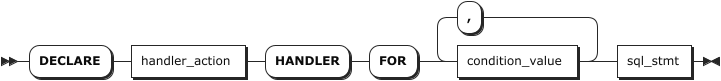

# Declarations

The `DECLARE` statement is used to define various items local to a program:

- User-defined variables
- Handlers
- Cursors

::: warning Note

- The `DECLARE` statement is permitted only inside a `BEGIN ... END` compound statement and must be at its start, before any other statements.
- Declarations must follow a certain order. Cursor declarations must appear before handler declarations. User-defined variable declarations must appear before cursor or handler declarations.

:::

## Declare User-defined Variables

KWDB supports declaring user-defined variables in stored procedures.

### Privileges

N/A

### Syntax


### Parameters

| Parameter | Description |
| --- | --- |
| `var_name` | The name of the user-defined variable to declare. |
| `typename` | The data type of the user-defined variable to declare. Available options are INT2, INT4, INT8, FLOAT4, FLOAT8, DECIMAL, STRING, TEXT, CHAR, VARCHAR, TIMESTAMP, TIMESTAMPTZ. |
| `opt_default_expr` | (Optional) The default value of the user-defined variable to declare. If not specified, it is set to NULL. |

### Examples

```sql
delimiter \\
CREATE PROCEDURE example_while()
 BEGIN
        declare a int;
        declare d int; 
        set a =1;
        LABEL my_loop:
        WHILE a<3 DO
                select d; 
                set a=a+1;
                LEAVE my_loop;
        ENDWHILE my_loop;
 END \\
```

## Declare Handlers

During the execution of stored procedures, there may be some special cases to handle, such as exiting or continuing the current stored procedure. KWDB supports defining handlers for some general warnings or exceptions.

The `DECLARE ... HANDLER` statement specifies a handler that deals with one or more conditions.

### Privileges

N/A

### Syntax



### Parameters

| Parameter | Description |
| --- | --- |
| `handler_action` | The action that the handler takes after execution of the handler statement. Available options: <br>- `CONTINUE`: Continue the current stored procedure after execution of the handler statement. <br >- `EXIT`: Exit the current stored procedure after execution of the handler statement.|
| `condition_value` | Specify the condition that activates the handler. Available options: <br>- `NOT FOUND`: No data is available. <br>- `SQLEXCEPTION`: An execution exception.|
|`sql_stmt`| The SQL statement to execute. |

### Examples

- Continue the current stored procedure after execution of the handler statement.

    ```sql
    delimiter \\
    create procedure test2() 
    begin 
        declare b int default 0;  -- Ensure that b has a initial value.
        declare err int default 0;  -- Initialize err.

        -- Declare a handler to deal with exceptions.
        declare continue handler for not found, sqlexception
        begin
            SELECT age FROM employees;
            set err = -1;
        endhandler;

        -- Start the loop.
        while b < 1 do 
            set b = b + 2;
            select * from t1;
        endwhile;
        select err, b;
    end \\
    ```

- Exit the current stored procedure after execution of the handler statement.

    ```sql
    delimiter \\
    create procedure test3() 
    begin 
        declare b int default 0;  -- Ensure that b has a initial value.
        declare err int default 0;  -- Initialize err.

        -- Declare a handler to deal with exceptions.
        declare exit handler for not found, sqlexception
        begin
            SELECT age FROM employees;
            set err = -1;
        endhandler;

        -- Start the loop.
        while b < 1 do 
            set b = b + 2;
            select * from t1;
        endwhile;
        select err, b;
    end \\
    ```

## Declare Cursors

The `DECLARE ... CURSOR` statement declares a cursor and associates it with a `SELECT` statement that retrieves the rows to be traversed by the cursor. A stored procedure may contain multiple cursor declarations, but each cursor declared in a given block must have a unique name.

::: warning Note
After declaring a cursor, you cannot use it until open the cursor. For details about how to user a cursor, see [Cursors](../other-sql-statements/cursor-sql.md).
:::

### Privileges

N/A

### Syntax


### Parameters

| Parameter | Description |
| --- | --- |
| `cursor_name` | The name of the cursor to declare. The cursor name must be unique. |
| `select_stmt` | The `SELECT` statement. <br> **Note** <br> The `SELECT` statement cannot have an `INTO` clause.|

### Examples

```sql
DELIMITER \\
CREATE PROCEDURE process_cursor_example1()
BEGIN 
    declare var_done int; 
    declare var_age int; 
    DECLARE cur CURSOR FOR SELECT age FROM employees; 
    DECLARE CONTINUE HANDLER FOR NOT FOUND SET var_done = 1; 
END \\
```
