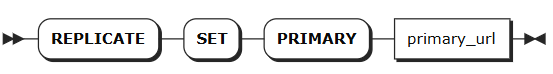
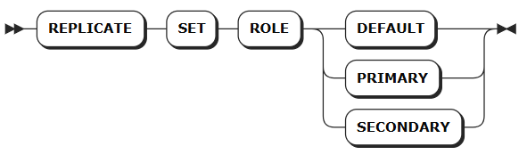
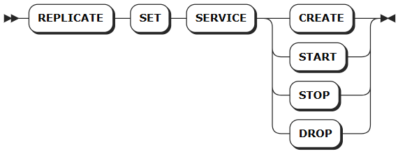

---
title: Primary-Secondary Replication
id: ha-sql
----------

# Primary-Secondary Replication

Primary-secondary replication provides high availability for standalone database deployments by maintaining synchronized copies of data across multiple nodes.

This feature allows you to configure primary and secondary node roles with flexible management of the replication service lifecycle, including start, pause, resume, and delete operations. For comprehensive information about the replication feature, see [Single-Node High Availability](../../db-operation/ha/single-ha.md).

::: warning Note

The following features are not currently supported:

* Replication of relational data

:::

## REPLICATE SET PRIMARY

The `REPLICATE SET PRIMARY` statement registers a target primary node address with the current node or updates an existing primary node's IP address.

Only regular nodes or secondary nodes can execute this statement. When a regular node executes this command, it automatically converts to a secondary node after the primary node address is registered.

### Privileges

The user must be a member of the `admin` role. By default, the `root` user belongs to the `admin` role.

### Syntax



### Parameters

| Parameter     | Description                                                                                                                                                                                                                                                                                                                        |
| ------------- | ---------------------------------------------------------------------------------------------------------------------------------------------------------------------------------------------------------------------------------------------------------------------------------------------------------------------------------- |
| `primary_url` | The primary node URL in JDBC connection string format. Supports both secure and non-secure connections. <br>For secure connections, certificate authentication is required, and the certificate path must reference the secondary node's certificate. Ensure identical certificate configuration between primary and secondary nodes.|

### Example

```sql
REPLICATE SET PRIMARY postgresql://root@localhost:26267/defaultdb?sslmode=verify-ca&sslcert=./certs/client.root.crt&sslkey=./certs/client.root.key&sslrootcert=./certs/ca.crt;
```

## REPLICATE SET ROLE

The `REPLICATE SET ROLE` statement changes a node's role within the replication topology. This command is essential for primary-secondary failover scenarios and handling unplanned primary node failures.

### Privileges

The user must be a member of the `admin` role. By default, the `root` user belongs to the `admin` role.

### Syntax



### Examples

* Convert the current node to a regular node with read-write capabilities:

  ```sql
  REPLICATE SET ROLE DEFAULT;
  ```

* Promote the current node to primary role with read-write capabilities:

  ```sql
  REPLICATE SET ROLE PRIMARY;
  ```

* Demote the current node to secondary role with read-only capabilities:

  ```sql
  REPLICATE SET ROLE SECONDARY;
  ```

## REPLICATE SET SERVICE

The `REPLICATE SET SERVICE` statement manages the replication service lifecycle through four operations:

* **CREATE**: Establishes the replication service and creates the primary-secondary high availability relationship
* **START**: Initiates the replication service, used for initial setup or recovery after planned maintenance
* **STOP**: Halts the replication service for planned maintenance or role transitions. When stopped, the primary database performs historical data synchronization and confirms successful completion once primary and secondary data achieve consistency
* **DROP**: Removes the replication service, terminates data synchronization, and dissolves the primary-secondary relationship

**Important**: Execute `CREATE`, `START`, and `STOP` operations on secondary nodes. Execute `DROP` operations on regular nodes only.

### Privileges

The user must be a member of the `admin` role. By default, the `root` user belongs to the `admin` role.

### Syntax



### Examples

* Establish the replication service:

  ```sql
  REPLICATE SET SERVICE CREATE;
  ```

* Start the replication service:

  ```sql
  REPLICATE SET SERVICE START;
  ```

* Stop the replication service:

  ```sql
  REPLICATE SET SERVICE STOP;
  ```

* Remove the replication service:

  ```sql
  REPLICATE SET SERVICE DROP;
  ```