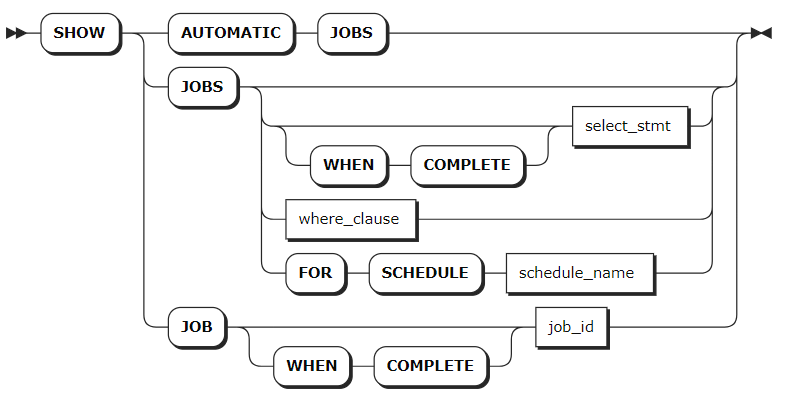

# Jobs

## SHOW JOBS

The `SHOW JOBS` statement lists all of the types of long-running tasks your cluster has performed in the last 12 hours, including:

- Schema changes jobs through `ALTER TABLE`, `DROP DATABASE` and `DROP TABLE`
- Import and export jobs
- Historical restart jobs
- User-created table statistics jobs created for use by the cost-based optimizer. To view automatic table statistics jobs, use the `SHOW AUTOMATIC JOBS` statement.

KWDB first checks all running jobs and then checks jobs completed in the last 12 hours. Running jobs are sorted based on the begin time of jobs while completed jobs are sorted based on the end time of jobs.

::: warning Note

- The `SHOW JOBS` statement shows only long-running tasks. To view all running jobs, you can use the SQL audit logs (preview).
- To view details for jobs older than 12 hours, you can query the `kwdb_internal.jobs` table.
- By default, KWDB retains jobs in the last 14 days. You can set the retention time using the `jobs.retention_time` cluster setting.

:::

### Privileges

The user must be a `root` user.

### Syntax



### Parameters

| Parameter             | Description                                                                                 |
|-----------------------|---------------------------------------------------------------------------------------------|
| `SHOW AUTOMATIC JOBS` | Show jobs performed for internal KWDB operations.                                        |
| `select_stmt`         | A selection query that returns IDs of jobs to view.                                         |
| `where_clause`        | A `WHERE` clause to filter qualified jobs from historical records.                          |
| `WHEN COMPLETE`       | Block `SHOW JOBS` or `SHOW JOB` statement until the specified job reaches a terminal state. |
| `schedule_name`       | The ID of the schedule to view. For more information, see [Schedules](./schedules-sql.md).  |
| `job_id`              | The ID of the job to view.                                                                  |

### Responses

| Field               | Description                                                                                                                                                                                                                                                                                                                                                                                          |
| -------------------- | --------------------------------------------------------------------------------------------------------------------------------------------------------------------------------------------------------------------------------------------------------------------------------------------------------------------------------------------------------------------------------------------- |
| `job_id`               | A unique ID to identify each job. This value is used for pausing, resuming, or cancelling jobs.                                                                                                                                                                                                                                                                                                                                                 |
| `job_type`             | The types of jobs, including: <br >- SCHEMA CHANGE (schema change jobs) <br >- IMPORT (import jobs) <br >- EXPORT (export jobs) <br >- CREATE_STATS (user-created table statistics jobs) <br >- AUTO_CREATE_STATS (automatic table statistics jobs) <br >- RESTART (historical restart jobs)                                                                                                                                                                                                                          |
| `description`          | The statement that starts the job, or a textual description of the job.                                                                                                                                                                                                                                                                                                                                                             |
| `statement`            | When the `description` field is a textual description of the job, the statement that starts the job is returned in this column. Currently, this field is available only for the automatic table statistics jobs.                                                                                                                                                                                                                                                                                                 |
| `user_name`            | The name of the user who starts the job.                                                                                                                                                                                                                                                                                                                                                                            |
| `status`               | The job's current state. Available values: <br >- `pending`: the job is created but has not started running. <br >- `running`: the job is running. If it is a multi-execution job, it means that the overall task is running. <br >- `failed`: the job is failed to complete. If it is a multi-execution job, it means that a single execution fails. <br >- `succeeded`: the job is successfully completed and will not run again. <br >- `canceled`: the job is cancelled.  <br >- `reverting`: the job is failed or canceled and its changes are being reverted. <br >- `revert-failed`: the job encounters a non-retryable error when reverting the changes. It is necessary to manually clean up the job with this status. |
| `running_status`       | The job's detailed running status, which provides visibility into the progress of the dropping (`DROP`) or truncating (`TRUNCATE`) of tables. For dropping or truncating jobs, the detailed running status is determined by the status of the table at the earliest stage of the schema change. The job is completed when the GC TTL expires and both the table data and ID are deleted from each of the tables involved. For the `SHOW AUTOMATIC JOBS` statement, the value of this field is `NULL`.                                                                                                                                                                     |
| `created`              | The TIMESTAMPTZ when the job is created.                                                                                                                                                                                                                                                                                                                                                                          |
| `started`              | The TIMESTAMPTZ when the job begins running.                                                                                                                                                                                                                                                                                                                                                                      |
| `finished`             | The TIMESTAMPTZ when the job is successfully completed (`succeeded`), failed to completed (`failed`), or cancelled (`canceled`).                                                                                                                                                                                                                                                                                                          |
| `modified`             | The TIMESTAMPTZ when the job is modified.                                                                                                                                                                                                                                                                                                                                                                          |
| `errord`               | The TIMESTAMPTZ when the job encounters an error.                                                                                                                                                                                                                                                                                                                                                                      |
| `fraction_completed`   | The fraction (between `0.00` and `1.00`) of the job that has been completed.                                                                                                                                                                                                                                                                                                                                                      |
| `error`                | If the job fails with a terminal error, this column will contain the error generated by the failure.                                                                                                                                                                                                                                                                                                                                                     |
| `coordinator_id`       | The ID of the node running the job.                                                                                                                                                                                                                                                                                                                                                                           |
| `total_num_of_ex`      | The total number of excutions for a multi-execution job.                                                                                                                                                                                                                                                                                                                                                                  |
| `total_num_of_success` | The total number of successful excutions for a multi-execution job.                                                                                                                                                                                                                                                                                                                                                              |
| `total_num_of_fail`    | The total number of failed excutions for a multi-execution job.                                                                                                                                                                                                                                                                                                                                                              |
| `time_of_last_success` | The time of the last successful excution for a multi-execution job.                                                                                                                                                                                                                                                                                                                                                        |

### Examples

- Show all jobs.

    ```sql
    show jobs;
    ```

    If you succeed, you should see an output similar to the following:

    ```sql
            job_id       |   job_type    |    description     | statement | user_name |  status   | running_status |             created              |             started              |             finished             |            modified             | errord | fraction_completed | error | coordinator_id | total_num_of_ex | total_num_of_success | total_num_of_fail |       time_of_last_success
    ---------------------+---------------+--------------------+-----------+-----------+-----------+----------------+----------------------------------+----------------------------------+----------------------------------+---------------------------------+--------+--------------------+-------+----------------+-----------------+----------------------+-------------------+-----------------------------------
      966387435059478529 | SCHEMA CHANGE | DROP DATABASE jobs |           | root      | succeeded | NULL           | 2024-05-06 09:40:40.481926+00:00 | 2024-05-06 09:40:40.511037+00:00 | 2024-05-06 09:40:40.518282+00:00 | 2024-05-06 09:40:40.51671+00:00 | NULL   |                  1 |       |              1 |               1 |                    1 |                 0 | 2024-05-06 09:40:40.518282+00:00
    (1 row)
    ```

- Filter jobs using the `SELECT` and `WHERE` clauses.

    ```sql
    SELECT * FROM [SHOW JOBS] WHERE job_type = 'SCHEMA CHANGE';
    ```

    If you succeed, you should see an output similar to the following:

    ```sql
    job_id            |job_type     |description                                                               |statement|user_name|status   |running_status|created                |started                |finished               |modified               |fraction_completed|error|coordinator_id| error_time
    ------------------|-------------|--------------------------------------------------------------------------|---------|---------|---------|--------------|-----------------------|-----------------------|-----------------------|-----------------------|------------------|-----|--------------|-----------
    902041667031498753|SCHEMA CHANGE|DROP DATABASE iot_db                                                      |         |KWDB  |succeeded|              |2023-09-22 03:01:10.452|2023-09-22 03:01:10.797|2023-09-22 03:01:11.249|2023-09-22 03:01:11.248|                 1|     |             1|
    (1 row)
    ```

- Filter historical jobs using the `WHERE` clause.

    ```sql
    show jobs where job_type = 'SCHEMA CHANGE';
    ```

    If you succeed, you should see an output similar to the following:

    ```sql
            job_id       |   job_type    |                                                                                                                                                    description                                                                                                                                                    | statement | user_name |  status   | running_status |             created              |             started              |             finished             |             modified             | errord | fraction_completed |                                       error                                        | coordinator_id | total_num_of_ex | total_num_of_success | total_num_of_fail |       time_of_last_success
    ---------------------+---------------+-------------------------------------------------------------------------------------------------------------------------------------------------------------------------------------------------------------------------------------------------------------------------------------------------------------------+-----------+-----------+-----------+----------------+----------------------------------+----------------------------------+----------------------------------+----------------------------------+--------+--------------------+------------------------------------------------------------------------------------+----------------+-----------------+----------------------+-------------------+-----------------------------------
      962704207243051009 | SCHEMA CHANGE | CREATE TABLE db2.public.orders (customer INT4, id INT4, total DECIMAL(20,5), PRIMARY KEY (customer, id), CONSTRAINT fk_customer FOREIGN KEY (customer) REFERENCES db2.public.customers) INTERLEAVE IN PARENT db2.public.customers (customer)                                                                      |           | root      | succeeded | NULL           | 2024-04-23 09:26:48.552734+00:00 | 2024-04-23 09:26:48.603675+00:00 | 2024-04-23 09:26:48.616608+00:00 | 2024-04-23 09:26:48.614163+00:00 | NULL   |                  1 |                                                                                    |              1 |               1 |                    1 |                 0 | 2024-04-23 09:26:48.616608+00:00
      962704207250391041 | SCHEMA CHANGE | updating referenced table;updating ancestor table                                                                                                                                                                                                                                                                 |           | root      | succeeded | NULL           | 2024-04-23 09:26:48.552734+00:00 | 2024-04-23 09:26:48.597467+00:00 | 2024-04-23 09:26:48.60655+00:00  | 2024-04-23 09:26:48.605119+00:00 | NULL   |                  1 |                                                                                    |              1 |               1 |                    1 |                 0 | 2024-04-23 09:26:48.60655+00:00
      962704243914113025 | SCHEMA CHANGE | CREATE TABLE db2.public.packages (customer INT4, "order" INT4, id INT4, address STRING(50), delivered BOOL, delivery_date DATE, PRIMARY KEY (customer, "order", id), CONSTRAINT fk_order FOREIGN KEY (customer, "order") REFERENCES db2.public.orders) INTERLEAVE IN PARENT db2.public.orders (customer, "order") |           | root      | succeeded | NULL           | 2024-04-23 09:26:59.743004+00:00 | 2024-04-23 09:26:59.799601+00:00 | 2024-04-23 09:26:59.810892+00:00 | 2024-04-23 09:26:59.809259+00:00 | NULL   |                  1 |                                                                                    |              1 |               1 |                    1 |                 0 | 2024-04-23 09:26:59.810892+00:00
      962704243924926465 | SCHEMA CHANGE | updating referenced table;updating ancestor table                                                                                                                                                                                                                                                                 |           | root      | succeeded | NULL           | 2024-04-23 09:26:59.743004+00:00 | 2024-04-23 09:26:59.791893+00:00 | 2024-04-23 09:26:59.806047+00:00 | 2024-04-23 09:26:59.803297+00:00 | NULL   |                  1 |                                                                                    |              1 |               1 |                    1 |                 0 | 2024-04-23 09:26:59.806047+00:00
      962907066109952001 | SCHEMA CHANGE | DROP TABLE db2.public.example_table, db2.public.testblob                                                                                                                                                                                                                                                          |           | root      | succeeded | NULL           | 2024-04-24 02:38:36.156104+00:00 | 2024-04-24 02:38:36.210874+00:00 | 2024-04-24 02:38:36.24302+00:00  | 2024-04-24 02:38:36.240734+00:00 | NULL   |                  1 |                                                                                    |              1 |               1 |                    1 |                 0 | 2024-04-24 02:38:36.24302+00:00
    ```

- Show automatic table statistics jobs.

    ```sql
    SHOW AUTOMATIC JOBS;
    ```

    If you succeed, you should see an output similar to the following:

    ```sql
    job_id            |job_type         |description                                             |statement                                                                                   |user_name|status   |running_status|created                |started                |finished               |modified               |fraction_completed|error|coordinator_id| error_time
    ------------------|-----------------|--------------------------------------------------------|--------------------------------------------------------------------------------------------|---------|---------|--------------|-----------------------|-----------------------|-----------------------|-----------------------|------------------|-----|--------------|-----------
    902025989139169281|AUTO CREATE STATS|Table statistics refresh for defaultdb."1".newtable     |CREATE STATISTICS __auto__ FROM [15093] WITH OPTIONS THROTTLING 0.9 AS OF SYSTEM TIME '-10s'|KWDB  |succeeded|              |2023-09-22 01:41:25.943|2023-09-22 01:41:25.950|2023-09-22 01:41:25.988|2023-09-22 01:41:25.986|                 1|     |             1|
    902024809042214913|AUTO CREATE STATS|Table statistics refresh for defaultdb."1".newtable     |CREATE STATISTICS __auto__ FROM [15093] WITH OPTIONS THROTTLING 0.9 AS OF SYSTEM TIME '-10s'|KWDB  |succeeded|              |2023-09-22 01:35:25.806|2023-09-22 01:35:25.901|2023-09-22 01:35:25.932|2023-09-22 01:35:25.931|                 1|     |             1|
    (2 rows)
    ```

## PAUSE JOB

The `PAUSE JOB` statement pauses the following types of jobs:

- Import and export jobs
- User-created table statistics jobs
- Automatic table statistics jobs

After pausing jobs, you can resume them with the `RESUME JOB` statement.

::: warning Note

- You can not pause a schema change job.
- To disable automatic table statistics jobs, set the `sql.stats.automatic_collection.enabled` cluster setting to `false`.

:::

### Privileges

The user must be a `root` user.

### Syntax


### Parameters

| Parameter     | Description                                                                    |
|---------------|--------------------------------------------------------------------------------|
| `job_id`      | The ID of the job to pause, which can be found with the `SHOW JOBS` statement. |
| `select_stmt` | A selection query that returns IDs of jobs to pause.                           |

### Examples

- Pause a single job.

    ```sql
    PAUSE JOB 505396193949089793;
    ```

- Pause multiple jobs by nesting a `SELECT` clause that retrieves `job_id` inside the `PAUSE JOBS` statement.

    ```sql
    PAUSE JOBS (SELECT job_id FROM [SHOW JOBS] WHERE user_name = 'stone');
    ```

## RESUME JOB

The `RESUME JOB` statement resumes the paused jobs.

### Privileges

The user must be a `root` user.

### Syntax


### Parameters

| Parameter     | Description                                                                     |
|---------------|---------------------------------------------------------------------------------|
| `job_id`      | The ID of the job to resume, which can be found with the `SHOW JOBS` statement. |
| `select_stmt` | A selection query that returns IDs of jobs to resume.                           |

### Examples

- Resume a single job.

    ```sql
    RESUME JOB 27536791415282;
    ```

- Resume multiple jobs by nesting a `SELECT` clause that retrieves `job_id` inside the `RESUME JOBS` statement.

    ```sql
    RESUME JOBS (SELECT job_id FROM [SHOW JOBS] WHERE user_name = 'stone');
    ```

## CANCEL JOB

The `CANCEL JOB` statement stops long-running jobs, including schema change jobs, user-created table statistics jobs, and automatic table statistics jobs.

::: warning Note
Canceling an automatic table statistics job is not useful since the system will automatically restart the job immediately. To disable automatic table statistics jobs, set the `sql.stats.automatic_collection.enabled` cluster setting to `false`.
:::

### Privileges

The user must be a member of the `admin` role. By default, the `root` user belongs to the `admin` role.

### Syntax


### Parameters

| Parameter     | Description                                                                 |
|---------------|-----------------------------------------------------------------------------|
| `job_id`      | The ID of the job to cancel, which can be found with the `SHOW JOBS` statement. |
| `select_stmt` | A selection query that returns IDs of jobs to cancel.                       |

### Examples

- Cancel a single job.

    ```sql
    CANCEL JOB 27536791415282;
    ```

- Cancel multiple jobs by nesting a `SELECT` clause that retrieves `job_id` inside the `CANCEL JOBS` statement.

    ```sql
    CANCEL JOBS (SELECT job_id FROM [SHOW JOBS] WHERE user_name = 'stone');
    ```
