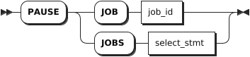

# Jobs

## SHOW JOBS

The `SHOW JOBS` statement lists all long-running tasks your cluster has performed in the last 12 hours, including:

- Schema changes triggered by `ALTER TABLE`, `DROP DATABASE`, and `DROP TABLE` statements
- Import and export jobs
- Historical restart jobs
- Backup and restore jobs
- User-created table statistics jobs for use by the cost-based optimizer. Automatic table statistics jobs are not included in `SHOW JOBS` results. To view automatic table statistics jobs, use the `SHOW AUTOMATIC JOBS` statement.

KWDB first checks all running jobs, then checks jobs completed in the last 12 hours. Running jobs are sorted by start time, while completed jobs are sorted by end time.

::: warning Note

- The `SHOW JOBS` statement is only used to view long-running jobs. To view all running jobs, use SQL audit logs (experimental).
- To view details for jobs older than 12 hours, query the `kwdb_internal.jobs` table.
- By default, the system retains job records for 14 days. You can configure the retention period using the `jobs.retention_time` cluster setting.

:::

### Privileges

The user must be a member of the `admin` role. By default, the `root` user belongs to the `admin` role.

### Syntax


### Parameters

| Parameter             | Description                                                                                 |
|-----------------------|---------------------------------------------------------------------------------------------|
| `SHOW AUTOMATIC JOBS` | View jobs required for internal operations.                                        |
| `select_stmt`         | A selection query that returns the IDs of jobs to view.                                         |
| `where_clause`        | A `WHERE` clause to filter qualified jobs from historical records.                          |
| `WHEN COMPLETE`       | Block the `SHOW JOBS` or `SHOW JOB` statement until the specified job reaches a terminal state. |
| `schedule_name`       | The name of the schedule to view. For more information, see [Schedules](./schedules-sql.md).  |
| `job_id`              | The ID of the job to view.                                                                  |

### Response Fields

The following table lists the fields returned for each job.

| Field               | Description                                                                                                                                                                                                                                                                                                                                                                                          |
| -------------------- | --------------------------------------------------------------------------------------------------------------------------------------------------------------------------------------------------------------------------------------------------------------------------------------------------------------------------------------------------------------------------------------------- |
| `job_id`               | A unique ID identifying each job. This value is used for pausing, resuming, or canceling jobs.                                                                                                                                                                                                                                                                                                                                                 |
| `job_type`             | The type of job, including: <br >- IMPORT (import jobs) <br >- EXPORT (export jobs) <br >- BACKUP (backup jobs) <br >- RESTORE (restore jobs) <br >- SCHEMA CHANGE (schema change jobs) <br >- CREATE_STATS (user-created table statistics jobs) <br >- AUTO_CREATE_STATS (automatic table statistics jobs) <br >- RESTART (historical restart jobs)                                                                                                                                                                                                          |
| `description`          | The statement that started the job, or a textual description of the job.                                                                                                                                                                                                                                                                                                                                                             |
| `statement`            | When the `description` field contains a textual description, this field returns the statement that started the job. Currently, this field is only available for automatic table statistics jobs.                                                                                                                                                                                                                                                                                                 |
| `user_name`            | The name of the user who started the job.                                                                                                                                                                                                                                                                                                                                                                            |
| `status`               | The job's current state. Available values: <br >- `pending`: The job is created but has not started executing. <br >- `running`: The job is executing. For multi-execution jobs, this indicates the overall task is executing. <br >- `failed`: The job failed to execute. For multi-execution jobs, this indicates a single execution has failed. <br >- `succeeded`: The job completed successfully and will not run again. <br >- `canceled`: The job was canceled.  <br >- `reverting`: The job failed or was canceled and its changes are being reverted. <br >- `revert-failed`: The job encountered a non-retryable error when reverting changes. Manual cleanup is required for jobs with this status. |
| `running_status`       | The job's detailed running status. KWDB provides progress visualization for `DROP` and `TRUNCATE` table operations. The running status of `DROP` or `TRUNCATE` operations depends on the table's initial schema change. After the GC TTL expires, the job completes and the table data and ID are deleted. When executing the `SHOW AUTOMATIC JOBS` statement, this field returns `NULL`.                                                                                                                                                                     |
| `created`              | The timestamp when the job was created.                                                                                                                                                                                                                                                                                                                                                                          |
| `started`              | The timestamp when the job started running.                                                                                                                                                                                                                                                                                                                                                                      |
| `finished`             | The timestamp when the job reached `succeeded`, `failed`, or `canceled` state.                                                                                                                                                                                                                                                                                                          |
| `modified`             | The timestamp when the job was last modified.                                                                                                                                                                                                                                                                                                                                                                          |
| `errord`               | The timestamp when the job encountered an error.                                                                                                                                                                                                                                                                                                                                                                      |
| `fraction_completed`   | The fraction of the job that has been completed, with values between `0.00` and `1.00`.                                                                                                                                                                                                                                                                                                                                                      |
| `error`                | The error message when the job is in `failed` state.                                                                                                                                                                                                                                                                                                                                                                     |
| `coordinator_id`       | The ID of the node running the job.                                                                                                                                                                                                                                                                                                                                                                           |
| `total_num_of_ex`      | The total number of executions for a multi-execution job.                                                                                                                                                                                                                                                                                                                                                                  |
| `total_num_of_success` | The total number of successful executions for a multi-execution job.                                                                                                                                                                                                                                                                                                                                                              |
| `total_num_of_fail`    | The total number of failed executions for a multi-execution job.                                                                                                                                                                                                                                                                                                                                                              |
| `time_of_last_success` | The timestamp of the last successful execution for a multi-execution job.                                                                                                                                                                                                                                                                                                                                                        |

### Examples

- View all jobs.

    ```sql
    show jobs;
    ```

    If you succeed, you should see an output similar to the following:

    ```sql
            job_id       |   job_type    |    description     | statement | user_name |  status   | running_status |             created              |             started              |             finished             |            modified             | errord | fraction_completed | error | coordinator_id | total_num_of_ex | total_num_of_success | total_num_of_fail |       time_of_last_success
    ---------------------+---------------+--------------------+-----------+-----------+-----------+----------------+----------------------------------+----------------------------------+----------------------------------+---------------------------------+--------+--------------------+-------+----------------+-----------------+----------------------+-------------------+-----------------------------------
      966387435059478529 | SCHEMA CHANGE | DROP DATABASE jobs |           | root      | succeeded | NULL           | 2024-05-06 09:40:40.481926+00:00 | 2024-05-06 09:40:40.511037+00:00 | 2024-05-06 09:40:40.518282+00:00 | 2024-05-06 09:40:40.51671+00:00 | NULL   |                  1 |       |              1 |               1 |                    1 |                 0 | 2024-05-06 09:40:40.518282+00:00
    (1 row)
    ```

- Filter jobs using the `SELECT` and `WHERE` statements.

    ```sql
    SELECT * FROM [SHOW JOBS] WHERE job_type = 'SCHEMA CHANGE';
    ```

    If you succeed, you should see an output similar to the following:

    ```sql
    job_id            |job_type     |description                                                               |statement|user_name|status   |running_status|created                |started                |finished               |modified               |fraction_completed|error|coordinator_id| error_time
    ------------------|-------------|--------------------------------------------------------------------------|---------|---------|---------|--------------|-----------------------|-----------------------|-----------------------|-----------------------|------------------|-----|--------------|-----------
    902041667031498753|SCHEMA CHANGE|DROP DATABASE iot_db                                                      |         |kaiwudb  |succeeded|              |2023-09-22 03:01:10.452|2023-09-22 03:01:10.797|2023-09-22 03:01:11.249|2023-09-22 03:01:11.248|                 1|     |             1|
    (1 row)
    ```

- Filter historical jobs using the `WHERE` clause.

    ```sql
    show jobs where job_type = 'SCHEMA CHANGE';
    ```

    If you succeed, you should see an output similar to the following:

    ```sql
            job_id       |   job_type    |                                                                                                                                                    description                                                                                                                                                    | statement | user_name |  status   | running_status |             created              |             started              |             finished             |             modified             | errord | fraction_completed |                                       error                                        | coordinator_id | total_num_of_ex | total_num_of_success | total_num_of_fail |       time_of_last_success
    ---------------------+---------------+-------------------------------------------------------------------------------------------------------------------------------------------------------------------------------------------------------------------------------------------------------------------------------------------------------------------+-----------+-----------+-----------+----------------+----------------------------------+----------------------------------+----------------------------------+----------------------------------+--------+--------------------+------------------------------------------------------------------------------------+----------------+-----------------+----------------------+-------------------+-----------------------------------
      962704207243051009 | SCHEMA CHANGE | CREATE TABLE db2.public.orders (customer INT4, id INT4, total DECIMAL(20,5), PRIMARY KEY (customer, id), CONSTRAINT fk_customer FOREIGN KEY (customer) REFERENCES db2.public.customers) INTERLEAVE IN PARENT db2.public.customers (customer)                                                                      |           | root      | succeeded | NULL           | 2024-04-23 09:26:48.552734+00:00 | 2024-04-23 09:26:48.603675+00:00 | 2024-04-23 09:26:48.616608+00:00 | 2024-04-23 09:26:48.614163+00:00 | NULL   |                  1 |                                                                                    |              1 |               1 |                    1 |                 0 | 2024-04-23 09:26:48.616608+00:00
      962704207250391041 | SCHEMA CHANGE | updating referenced table;updating ancestor table                                                                                                                                                                                                                                                                 |           | root      | succeeded | NULL           | 2024-04-23 09:26:48.552734+00:00 | 2024-04-23 09:26:48.597467+00:00 | 2024-04-23 09:26:48.60655+00:00  | 2024-04-23 09:26:48.605119+00:00 | NULL   |                  1 |                                                                                    |              1 |               1 |                    1 |                 0 | 2024-04-23 09:26:48.60655+00:00
      962704243914113025 | SCHEMA CHANGE | CREATE TABLE db2.public.packages (customer INT4, "order" INT4, id INT4, address STRING(50), delivered BOOL, delivery_date DATE, PRIMARY KEY (customer, "order", id), CONSTRAINT fk_order FOREIGN KEY (customer, "order") REFERENCES db2.public.orders) INTERLEAVE IN PARENT db2.public.orders (customer, "order") |           | root      | succeeded | NULL           | 2024-04-23 09:26:59.743004+00:00 | 2024-04-23 09:26:59.799601+00:00 | 2024-04-23 09:26:59.810892+00:00 | 2024-04-23 09:26:59.809259+00:00 | NULL   |                  1 |                                                                                    |              1 |               1 |                    1 |                 0 | 2024-04-23 09:26:59.810892+00:00
      962704243924926465 | SCHEMA CHANGE | updating referenced table;updating ancestor table                                                                                                                                                                                                                                                                 |           | root      | succeeded | NULL           | 2024-04-23 09:26:59.743004+00:00 | 2024-04-23 09:26:59.791893+00:00 | 2024-04-23 09:26:59.806047+00:00 | 2024-04-23 09:26:59.803297+00:00 | NULL   |                  1 |                                                                                    |              1 |               1 |                    1 |                 0 | 2024-04-23 09:26:59.806047+00:00
      962907066109952001 | SCHEMA CHANGE | DROP TABLE db2.public.example_table, db2.public.testblob                                                                                                                                                                                                                                                          |           | root      | succeeded | NULL           | 2024-04-24 02:38:36.156104+00:00 | 2024-04-24 02:38:36.210874+00:00 | 2024-04-24 02:38:36.24302+00:00  | 2024-04-24 02:38:36.240734+00:00 | NULL   |                  1 |                                                                                    |              1 |               1 |                    1 |                 0 | 2024-04-24 02:38:36.24302+00:00
    ```

- View automatic jobs.

    ```sql
    SHOW AUTOMATIC JOBS;
    ```

    If you succeed, you should see an output similar to the following:

    ```sql
    job_id            |job_type         |description                                             |statement                                                                                   |user_name|status   |running_status|created                |started                |finished               |modified               |fraction_completed|error|coordinator_id| error_time
    ------------------|-----------------|--------------------------------------------------------|--------------------------------------------------------------------------------------------|---------|---------|--------------|-----------------------|-----------------------|-----------------------|-----------------------|------------------|-----|--------------|-----------
    902025989139169281|AUTO CREATE STATS|Table statistics refresh for defaultdb."1".newtable     |CREATE STATISTICS __auto__ FROM [15093] WITH OPTIONS THROTTLING 0.9 AS OF SYSTEM TIME '-10s'|kaiwudb  |succeeded|              |2023-09-22 01:41:25.943|2023-09-22 01:41:25.950|2023-09-22 01:41:25.988|2023-09-22 01:41:25.986|                 1|     |             1|
    902024809042214913|AUTO CREATE STATS|Table statistics refresh for defaultdb."1".newtable     |CREATE STATISTICS __auto__ FROM [15093] WITH OPTIONS THROTTLING 0.9 AS OF SYSTEM TIME '-10s'|kaiwudb  |succeeded|              |2023-09-22 01:35:25.806|2023-09-22 01:35:25.901|2023-09-22 01:35:25.932|2023-09-22 01:35:25.931|                 1|     |             1|
    (2 rows)
    ```

## Pause Jobs

The `PAUSE JOB` statement pauses import and export jobs, full backup and restore jobs, user-created table statistics jobs, and automatic table statistics jobs.
After pausing jobs, you can resume them with the `RESUME JOB` statement.

::: warning Note

- You cannot pause schema change jobs.
- To disable automatic table statistics jobs, set the `sql.stats.automatic_collection.enabled` cluster setting to `false`.

:::

### Privileges

The user must be a member of the `admin` role. By default, the `root` user belongs to the `admin` role.


### Syntax



### Parameters

| Parameter     | Description                                                                    |
|---------------|--------------------------------------------------------------------------------|
| `job_id`      | The ID of the job to pause, which can be found with the `SHOW JOBS` statement. |
| `select_stmt` | A selection query that returns the IDs of jobs to pause.                           |

### Examples

- Pause a single job.

    ```sql
    PAUSE JOB 505396193949089793;
    ```

- Use the `SELECT` clause to query job IDs and pause multiple jobs.

    ```sql
    PAUSE JOBS (SELECT job_id FROM [SHOW JOBS] WHERE user_name = 'stone');
    ```

## Resume Jobs

The `RESUME JOB` statement resumes paused jobs.

### Privileges

The user must be a member of the `admin` role. By default, the `root` user belongs to the `admin` role.

### Syntax


### Parameters

| Parameter     | Description                                                                     |
|---------------|---------------------------------------------------------------------------------|
| `job_id`      | The ID of the job to resume, which can be found with the `SHOW JOBS` statement. |
| `select_stmt` | A selection query that returns the IDs of jobs to resume.                           |

### Examples

- Resume a single job.

    ```sql
    RESUME JOB 27536791415282;
    ```

- Use the `SELECT` clause to query job IDs and resume multiple jobs.

    ```sql
    RESUME JOBS (SELECT job_id FROM [SHOW JOBS] WHERE user_name = 'stone');
    ```

## CANCEL JOB

The `CANCEL JOB` statement stops long-running jobs, including schema change jobs, backup and restore jobs, user-created table statistics jobs, and automatic table statistics jobs.

::: warning Note

After canceling an automatic table statistics job, the system will automatically restart the job immediately. To disable automatic table statistics jobs, set the `sql.stats.automatic_collection.enabled` cluster setting to `false`.

:::

### Privileges

The user must be a member of the `admin` role. By default, the `root` user belongs to the `admin` role.

### Syntax


### Parameters

| Parameter     | Description                                                                 |
|---------------|-----------------------------------------------------------------------------|
| `job_id`      | The ID of the job to cancel, which can be found with the `SHOW JOBS` statement. |
| `select_stmt` | A selection query that returns the IDs of jobs to cancel.                       |

### Examples

- Cancel a single job.

    ```sql
    CANCEL JOB 27536791415282;
    ```

- Use the `SELECT` clause to query job IDs and cancel multiple jobs.

    ```sql
    CANCEL JOBS (SELECT job_id FROM [SHOW JOBS] WHERE user_name = 'stone');
    ```