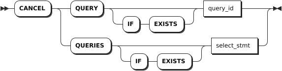

# Queries

## SHOW QUERIES

The `SHOW QUERIES` statement lists details about currently active SQL queries.

### Privileges

- Members of the `admin` role (By default, the `root` user belongs to the `admin` role.): view any currently active queries.
- Users who are not members of the `admin` role: view only their own currently active queries.

### Syntax


### Parameters

| Parameter | Description                                                        |
|-----------|--------------------------------------------------------------------|
| `CLUSTER` | Optional. List the active queries across all nodes of the cluster. |
| `LOCAL`   | Optional. List the active queries on the local node.          |

### Responses

| Field              | Description                                                                                                                                                             |
|--------------------|-------------------------------------------------------------------------------------------------------------------------------------------------------------------------|
| `query_id`         | The ID of the query.                                                                                                                                                    |
| `node_id`          | The ID of the node.                                                                                                                                                     |
| `session_id`       | The ID of the session.                                                                                                                                                  |
| `user_name`        | The name of the connected user.                                                                                                                                         |
| `start`            | The timestamptz at which the query starts.                                                                                                                              |
| `query`            | The SQL query statement.                                                                                                                                                |
| `client_address`   | The address and port of the client that issues the SQL query.                                                                                                           |
| `application_name` | The application name specified by the client, if any.                                                                                                                   |
| `distributed`      | Whether to execute the query distributedly.                                                                                                                |
| `phase`            | The phase of the query's execution. Available options: <br >- `prepare`: the statement is being parsed and planned.<br >- `executing`: the statement is being executed. |
| `exec_progress`    | The execution process for a query on the `executing` phase.                                                                                                             |

### Examples

- List the active queries across all nodes of the cluster.

    ```sql
    SHOW QUERIES;
    ```

    If you succeed, you should see an output similar to the following:

    ```sql
                  query_id             | node_id |            session_id            | user_name |              start               |        query         |  client_address  | application_name | distributed |   phase   | exec_progress
    -----------------------------------+---------+----------------------------------+-----------+----------------------------------+----------------------+------------------+------------------+-------------+-----------+----------------
      17c9796fa28ec8a10000000000000001 |       1 | 17c962175c4579860000000000000001 | root      | 2024-04-25 08:44:13.566642+00:00 | SHOW CLUSTER QUERIES | 172.18.0.1:47104 | $ kwbase sql     |    false    | executing |             0
    (1 row)
    ```

- List the active queries on the local node.

    ```sql
    SHOW LOCAL QUERIES;
    ```

    If you succeed, you should see an output similar to the following:

    ```sql
                  query_id             | node_id |            session_id            | user_name |              start               |       query        |  client_address  | application_name | distributed |   phase   | exec_progress
    -----------------------------------+---------+----------------------------------+-----------+----------------------------------+--------------------+------------------+------------------+-------------+-----------+----------------
      17c9796c44bef85c0000000000000001 |       1 | 17c962175c4579860000000000000001 | root      | 2024-04-25 08:43:59.107805+00:00 | SHOW LOCAL QUERIES | 172.18.0.1:47104 | $ kwbase sql     |    false    | executing |             0
    (1 row)
    ```

## CANCEL QUERY

The `CANCEL QUERY` statement cancels a running SQL query.

::: warning Note

- Schema changes are treated differently than other SQL queries. You can use the `SHOW JOBS` statement to monitor the progress of schema changes and the `CANCEL JOB` statement to cancel schema changes that are taking longer than expected.
- In rare cases where a query is close to completion when a cancellation request is issued, the query may run to completion.

:::

### Privileges

- Members of the `admin` role (By default, the `root` user belongs to the `admin` role.): cancel any currently active queries.
- Users who are not members of the `admin` role: cancel only their own currently active queries.

### Syntax



### Parameters

| Parameter | Description |
| --- | --- |
| `IF EXISTS` | Optional. <br>- When the `IF EXISTS` keyword is used, the system cancels a query only if the target query has already existed. Otherwise, the system fails to cancel the query without returning an error. <br>- When the `IF EXISTS` keyword is not used, the system cancels a query only if the target query has already existed. Otherwise, the system fails to cancel the query and returns an error. |
| `query_id` | The ID of the query to cancel.|
| `select_stmt` | A selection query whose result you want to cancel.|

::: warning Note
The `CANCEL QUERY` statement accepts a single query ID. If a subquery is used and returns multiple query IDs, the `CANCEL QUERY` statement will fail. To cancel multiple queries, use the `CANCEL QUERIES` statement.
:::

### Examples

- Cancel a query through the query ID.

    ```sql
    -- 1. Use the SHOW QUERIES statement to get the ID of a query.
    SHOW QUERIES;
                  query_id             | node_id |            session_id            | user_name |              start               |        query         |  client_address  | application_name | distributed |   phase   | exec_progress
    -----------------------------------+---------+----------------------------------+-----------+----------------------------------+----------------------+------------------+------------------+-------------+-----------+----------------
      17c9796fa28ec8a10000000000000001 |       1 | 17c962175c4579860000000000000001 | root      | 2024-04-25 08:44:13.566642+00:00 | SHOW CLUSTER QUERIES | 172.18.0.1:47104 | $ kwbase sql     |    false    | executing |             0
    (1 row)

    -- 2. Cancel the query based on the query ID.

    CANCEL QUERY '17c9796fa28ec8a10000000000000001';
    CANCAL QUERIES 1
    ```

- Cancel a query through a subquery.

    ```sql
    CANCEL QUERY (SELECT query_id FROM [SHOW CLUSTER QUERIES] WHERE client_address='your-host-ip:port' AND user_name='root' AND query = 'SHOW CLUSTER QUERIES');
    CANCAL QUERIES 1
    ```
