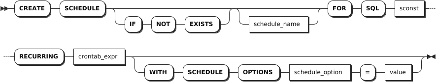
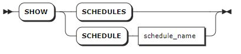
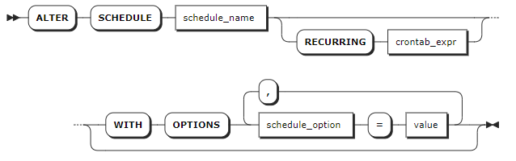
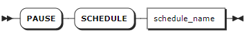
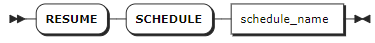
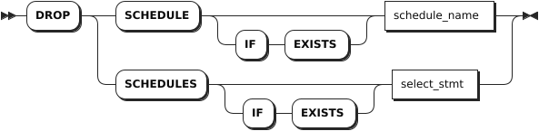

# Schedules

Schedules are specified jobs that are automatically executed based on the pre-defined time or event.

KWDB supports the following statements:

- `CREATE SCHEDULE`: create a schedule.
- `SHOW SCHEDULE`: view the scheduling period, execution time, and execution status of schedules.
- `SHOW JOBS FOR SCHEDULE`: view the start time, end time, execution progress, execution results, error messages of jobs executed in the history and current periods. For details, see [SHOW JOBS](./jobs-sql.md#show-jobs).
- `ALTER SCHEDULE`: change the scheduling period, the error handling policy for a running schedule, or the handling policy for a previous schedule that has not yet been executed.
- `PAUSE SCHEDULE`: pause a schedule.
- `RESUME SCHEDULE`: resume a paused schedule.
- `DROP SCHEDULE`: remove a schedule.

By default, KWDB scans the schedule list every `60` seconds and randomly gets and executes `10` schedules. You can use the `SET CLUSTER SETTING <parameter> = <value>` statement to set the following cluster settings:

- `jobs.scheduler.enabled`: enable or disable a schedule. By default, it is set to `TRUE`, which means to enable a schedule.
- `jobs.scheduler.pace`: set how often to schedule the `system.scheduled_jobs` table. By default, it is set to `60` seconds. It is recommended not to set a value that is smaller than `60s`. If you set a value that is smaller than `60s`, the system will adopt the default value (`60s`).
- `jobs.scheduler.max_jobs_per_iteration`: set the maximum number of schedules to be scanned each time. By default, it is set to `10`. If it is set to `0`, it means no limit on the number of schedules.

## CREATE SCHEDULE

The `CREATE SCHEDULE` statement creates a schedule.

### Privileges

The user must be a member of the `admin` role. By default, the `root` user belongs to the `admin` role.

### Syntax



### Parameters

| Parameter | Description |
| --- | --- |
| `IF NOT EXISTS` | Optional. <br>- When the `IF NOT EXISTS` keyword is used, the system creates a new schedule only if a schedule of the same name does not already exist. Otherwise, the system fails to create a new schedule without returning an error. <br>- When the `IF NOT EXISTS` keyword is not used, the system creates a new schedule only if a schedule of the same name does not already existed. Otherwise, the system fails to create a new schedule and returns an error. |
| `schedule_name` | Optional. The name of the schedule to create. If no name is specified, the system will automatically generate a name, such as `EXEC SQL 1718951529`. The schedule name must be unique within the database. The schedule name can be entered as a string literal but does not support pure digits. When the `IF NOT EXISTS` keyword is used, you must specify a name for a schedule. |
| `sconst` | The specified SQL statements. Currently, KWDB only supports `INSERT`, `UPDATE`, `DELETE` statements for a schedule. The SQL statements need to specify a database and tables.|
| `RECURRING crontab_expr` | The recurring expression to execute a schedule. Available recurring expressions: <br >- 7-field expression, also known as full-field expression: fields are separated using spaces (`<seconds> <minutes> <hours> <day-of-month> <month> <day-of-week> <year>`), where the `seconds` field is pre-set to `0`, indicating to execute the schedule for at `0` second. <br >- 6-field expression: fields are separated using spaces (`<minutes> <hours> <day-of-month> <month> <day-of-week> <year>`), where the `year` field is pre-set to `*`, indicating to execute the schedule for every year. <br >- 5-field expression: fields are separated using spaces (`<minutes> <hours> <day-of-month> <month> <day-of-week>`) <br > - Pre-defined expressions include `@annually` (run a schedule once a year at midnight on the first day of January), `@yearly` (run a schedule once a year at midnight on the first day of January, same to `@annually`), `@monthly` (run a schedule once a month at midnight on the first day of the month ), `@weekly` (run a schedule once a week at midnight every Sunday), `@daily` (run a schedule once a day at midnight), `@hourly` (run hourly)<br > For details about Crontab expression, see [Crontab Expression](#crontab-expression).|
| `schedule_option` | The options to execute a schedule. Available options: <br > `first_run`: execute the schedule at the specified time. If not specified, execute the schedule based on the `RECURRING` expression by default. Support using TIMESTAMPTZ and `NOW`. <br > `on_execution_failure`: if an error occurs during the schedule execution, do the following: <br >- `retry`: retry the schedule right away. <br >- `pause`: pause the schedule. This requires to manually resume the schedule. <br >- `reschedule`: (Default) retry the schedule based on the `RECURRING` expression. <br > `on_previous_running`: if the previous schedule is still running, do the following: <br >- `start`: start the new schedule anyway, even if the previous one is still running. <br >- `skip`: skip the new schedule. <br >- `wait`: (Default) wait for the previous schedule to complete and then run the new schedule. |

### Crontab expression

<table>
  <thead>
    <tr>
      <th width="130">Field</th>
      <th width="170">Value Range</th>
      <th width="150">Special Character</th>
      <th>Description</th>
    </tr>
  </thead>
  <tbody>
    <tr>
      <td><code>seconds</code></td>
      <td><code>[0, 59]</code></td>
      <td>
      <ul>
      <li>Asterisk (<code>*</code>)</li>
      <li>Comma (<code>,</code>)</li>
      <li>Hyphen (<code>-</code>)</li>
      <li>Slash (<code>/</code>)</li>
      </ul>
      </td>
      <td rowspan="7">
      <ul>
      <li>Asterisk (<code>*</code>): match all values for the specified filed. For example, <code>0 0 0 1 1 * *</code> indicates running a schedule once a year at midnight on the first day of January.</li>
      <li>Comma (<code>,</code>): specify multiple values to indicates the time to run a schedule. For example, <code>10, 15, 30</code> in the <code>minutes</code> filed indicates running a schedule at the 10th, 15th, and 30th minute respectively. </li>
      <li>Hyphen (<code>-</code>): define the value range. For example, <code>2000-2010</code> in the <code>year</code> filed indicates running a schedule between 2000 year and 2010 year, including 2000 and 2010 years. </li>
      <li>Slash (<code>/</code>): define the incremental values. For example, <code>*/15</code> in the <code>minutes</code> filed indicates running a schedule every 15 minutes.</li>
      <li>Character <code>L</code>: indicate <code>last</code>. In the <code>day of month</code> field, it indicates running a schedule on the last day of the month. In the <code>day of week</code> field, it indicates running a schedule on the last weekday of the month. For example, <code>5L</code> indicates running a schedule on the last Friday of the month. </li>
      <li>Character <code>W</code>: specify the nearest weekday (Monday through Friday) to a specified day. For example, <code>15W</code> indicates running a schedule on the nearest weekday to the 15th day of the specified month. If the 15th day is Saturday, the schedule is going to run on the 14th day (Friday). If the 15th day is Sunday, the schedule is going to run on the 16th day (Monday). If the 15th day is Tuesday, the schedule is going to run on the 15th day (Tuesday). The <code>W</code> character can work with the <code>L</code> character. <code>LW</code> indicates running a schedule on the last weekday of a month. Please note that the system will not skip the boundary of days in a month. For example, when it is set to <code>1W</code> and the first day of the month is Saturday, the schedule is going to run on the third day of the month (Monday). You cannot specify the character <code>W</code> until the <code>day of month</code> filed is set to a single date rather than a date range or a list of dates. </li>
      <li>Number sign (<code>#</code>): specify the “N-th” occurrence of a weekday of the month. In the <code>day of week</code> field, the number sign must be followed by a digit between 1 and 5 to indicate the “N-th” occurrence of a weekday. For example, <code>5#2</code> indicates running a schedule on the second Friday of the specified month. </li>
      </ul>
      </td>
    </tr>
    <tr>
      <td><code>minutes</code></td>
      <td><code>[0, 59]</code></td>
      <td>
      <ul>
      <li>Asterisk (<code>*</code>)</li>
      <li>Comma (<code>,</code>)</li>
      <li>Hyphen (<code>-</code>)</li>
      <li>Slash (<code>/</code>)</li>
      </ul>
      </td>
    </tr>
    <tr>
      <td><code>hour</code></td>
      <td><code>[0, 23]</code></td>
      <td>
      <ul>
      <li>Asterisk (<code>*</code>)</li>
      <li>Comma (<code>,</code>)</li>
      <li>Hyphen (<code>-</code>)</li>
      <li>Slash (<code>/</code>)</li>
      </ul>
      </td>
    </tr>
    <tr>
      <td><code>day of month</code></td>
      <td><code>[1, 31]</code></td>
      <td>
      <ul>
      <li>Asterisk (<code>*</code>)</li>
      <li>Comma (<code>,</code>)</li>
      <li>Hyphen (<code>-</code>)</li>
      <li>Slash (<code>/</code>)</li>
      <li>Character <code>L</code></li>
      <li>Character <code>W</code></li>
      </ul>
      </td>
    </tr>
    <tr>
      <td><code>month</code></td>
      <td><code>[1,12]</code>or <code>JAN-DEC</code></td>
      <td>
      <ul>
      <li>Asterisk (<code>*</code>)</li>
      <li>Comma (<code>,</code>)</li>
      <li>Hyphen (<code>-</code>)</li>
      <li>Slash (<code>/</code>)</li>
      </ul>
      </td>
    </tr>
    <tr>
      <td><code>day of week</code></td>
      <td><code>[0,7]</code>or <code>SUN-SAT</code>. Both <code>0</code> and <code>7</code> indicate Sunday, compatible with Linux <code>crontab</code>.</td>
      <td>
      <ul>
      <li>Asterisk (<code>*</code>)</li>
      <li>Comma (<code>,</code>)</li>
      <li>Hyphen (<code>-</code>)</li>
      <li>Slash (<code>/</code>)</li>
      <li>Character <code>L</code></li>
      <li>Number sign (<code>#</code>)</li>
      </ul>
      </td>
    </tr>
    <tr>
      <td><code>year</code></td>
      <td><code>[1970, 2099]</code></td>
      <td>
      <ul>
      <li>Asterisk (<code>*</code>)</li>
      <li>Comma (<code>,</code>)</li>
      <li>Hyphen (<code>-</code>)</li>
      <li>Slash (<code>/</code>)</li>
      </ul>
      </td>
    </tr>
  </tbody>
</table>

### Examples

This example creates a schedule named `s1`, which inserts data of the `tsdb.t1` table into the `tsdb.t2` table every hour.

```sql
CREATE SCHEDULE s1 FOR SQL 'INSERT INTO tsdb.t2 SELECT * FROM tsdb.t1' RECURRING '@hourly' WITH SCHEDULE OPTIONS first_run=NOW;
```

## SHOW SCHEDULES

The `SHOW SCHEDULE` statement lists created schedules. By default, the system automatically creates the `scheduled_table_retention` schedules.

### Privileges

The user must be a member of the `admin` role. By default, the `root` user belongs to the `admin` role.

### Syntax



### Parameters

| Parameter       | Description                       |
|-----------------|-----------------------------------|
| `schedule_name` | The name of the schedule to view. |

### Responses

| Field             | Description                                                                                                    |
|-------------------|----------------------------------------------------------------------------------------------------------------|
| `id`              | The ID of the schedule.                                                                                        |
| `name`            | The name of the schedule.                                                                                      |
| `schedule_status` | The status of the schedule.                                                                                    |
| `next_run`        | The TIMESTAMP at which the next schedule to run.                                                               |
| `state`           | Keep it as empty. Display last-known errors about the schedule, or messages about how to deal with the errors. |
| `recurrence`      | How often the schedule runs.                                                                                   |
| `jobsrunning`     | The number of jobs currently running for the schedule.                                                         |
| `owner`           | The user who creates the schedule.                                                                             |
| `created`         | The TIMESTAMP when the schedule was created.                                                                    |
| `command`         | The SQL command that the schedule will run.                                                                    |

### Examples

- Show details about schedules created by the system.

    ```sql
    show schedules;
            id         |              name          | schedule_status |         next_run          | state | recurrence | jobsrunning | owner |             created              |                                                 command
    ---------------------+----------------------------+-----------------+---------------------------+-------+------------+-------------+-------+----------------------------------+-----------------------------------------------------------------------------------------------------------
    958737479282262017 | scheduled_table_statistics | ACTIVE          | 2024-04-09 10:00:00+00:00 |       | @hourly    |           0 | root  | 2024-04-09 09:10:58.995182+00:00 | {"insert_statement": "INSERT INTO ts_table VALUES ('2023-07-13 14:06:32.272', 10.2, 219, 0.32, 1,1)"}
    (1 row)
    ```

- Show details about a specified schedule.

    ```sql
    show schedule scheduled_table_statistics;
            id         |              name          | schedule_status |         next_run          | state | recurrence | jobsrunning | owner |             created              |                                                 command
    ---------------------+----------------------------+-----------------+---------------------------+-------+------------+-------------+-------+----------------------------------+-----------------------------------------------------------------------------------------------------------
    958737479282262017 | scheduled_table_statistics | ACTIVE          | 2024-04-09 10:00:00+00:00 |       | @hourly    |           0 | root  | 2024-04-09 09:10:58.995182+00:00 | {"insert_statement": "INSERT INTO ts_table VALUES ('2023-07-13 14:06:32.272', 10.2, 219, 0.32, 1,1)"}
    (1 row)
    ```

## ALTER SCHEDULE

The `ALTER SCHEDULE` statement changes an existing schedule. The changes take effect at the next scheduling time and do not affect the status of the currently running jobs or schedules.

### Privileges

The user must be a member of the `admin` role. By default, the `root` user belongs to the `admin` role.

### Syntax



### Parameters

| Parameter | Description |
| --- | --- |
| `schedule_name` | The name of the schedule to change. |
| `RECURRING crontab_expr` | The recurring expression to execute a schedule. Available recurring expressions: <br >- 7-field expression, also known as full-field expression: fields are separated using spaces (`<seconds> <minutes> <hours> <day-of-month> <month> <day-of-week> <year>`), where the `seconds` field is pre-set to `0`, indicating to execute the schedule for at `0` second. <br >- 6-field expression: fields are separated using spaces (`<minutes> <hours> <day-of-month> <month> <day-of-week> <year>`), where the `year` field is pre-set to `*`, indicating to execute the schedule for every year. <br >- 5-field expression: fields are separated using spaces (`<minutes> <hours> <day-of-month> <month> <day-of-week>`) <br > - Pre-defined expressions include `@annually` (run a schedule once a year at midnight on the first day of January), `@yearly` (run a schedule once a year at midnight on the first day of January, same to `@annually`), `@monthly` (run a schedule once a month at midnight on the first day of the month ), `@weekly` (run a schedule once a week at midnight every Sunday), `@daily` (run a schedule once a day at midnight), `@hourly` (run hourly)<br > For details about Crontab expression, see [Crontab Expression](#crontab-expression).|
| `schedule_option` | The options to execute a schedule. Available options: <br > `first_run`: execute the schedule at the specified time. If not specified, execute the schedule based on the `RECURRING` expression by default. Support using TIMESTAMPTZ and `NOW`. <br > `on_execution_failure`: if an error occurs during the schedule execution, do the following: <br >- `retry`: retry the schedule right away. <br >- `pause`: pause the schedule. This requires to manually resume the schedule. <br >- `reschedule`: (Default) retry the schedule based on the `RECURRING` expression. <br > `on_previous_running`: if the previous schedule is still running, do the following: <br >- `start`: start the new schedule anyway, even if the previous one is still running. <br >- `skip`: skip the new schedule. <br >- `wait`: (Default) wait for the previous schedule to complete and then run the new schedule. |

### Examples

This example changes the frequency to run the schedule.

```sql
ALTER SCHEDULE scheduled_table_statistics RECURRING '@hourly';
```

## PAUSE SCHEDULE

When the system is performing high-load jobs such as importing a large amount of data, you can pause a pre-defined schedule to avoid further aggravating the system load or interfering with critical tasks. The `PAUSE SCHEDULE` command takes effect at the next scheduling time and does not affect the status of the currently running jobs or schedules.

The `PAUSE SCHEDULE` statement pauses a currently running schedule.

### Privileges

The user must be a member of the `admin` role. By default, the `root` user belongs to the `admin` role.

### Syntax



### Parameters

| Parameter       | Description                                |
|-----------------|--------------------------------------------|
| `schedule_name` | The name of the running schedule to pause. |

### Examples

This example pauses a specified schedule.

```sql
PAUSE SCHEDULE scheduled_table_statistics;
```

## RESUME SCHEDULE

The `RESUME SCHEDULE` statement resumes a paused schedule.

### Privileges

The user must be a member of the `admin` role. By default, the `root` user belongs to the `admin` role.

### Syntax



### Parameters

| Parameter       | Description                                |
|-----------------|--------------------------------------------|
| `schedule_name` | The name of the paused schedule to resume. |

### Examples

This example resumes a specified schedule.

```sql
RESUME SCHEDULE scheduled_table_statistics;
```

## DROP SCHEDULE

The `DROP SCHEDULE` statement removes a schedule. Currently, you can not remove `scheduled_table_retention` schedules that are automatically-created by the system.

### Privileges

The user must be a member of the `admin` role. By default, the `root` user belongs to the `admin` role.

### Syntax



### Parameters

| Parameter | Description |
| --- | --- |
| `IF EXISTS` | Optional. <br>- When the `IF EXISTS` keyword is used, the system removes a schedule only if the target schedule has already existed. Otherwise, the system fails to remove the schedule without returning an error. <br>- When the `IF EXISTS` keyword is not used, the system removes a schedule only if the target schedule has already existed. Otherwise, the system fails to remove the schedule and returns an error. |
| `schedule_name` | The name of the schedule to remove.|
| `select_stmt` | A selection query that returns names of schedules to remove. |

### Examples

- Remove a single schedule.

    ```sql
    DROP SCHEDULE s1;
    ```

- Remove multiple schedules by nesting a `SELECT` clause that retrieves name(s) inside the `DROP SCHEDULES` statement.

    ```sql
    DROP SCHEDULES SELECT name FROM [SHOW SCHEDULES] WHERE schedule_status='PAUSED';
    ```
