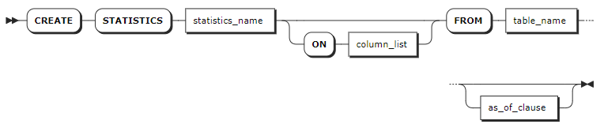
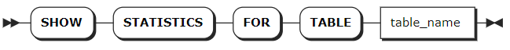

# Statistics

KWDB supports manually creating table statistics or automatically generating table statistics.

- **Manually create table statistics**: you can execute the `CREATE STATISTICS` statement to create statistics for the specified table(s) or column(s).

- **Automatically generate table statistics**: KWDB automatically starts the thread for refreshing statistics when the system is started. KWDB generates table statistics using a background job that automatically determines which columns to get statistics on.

For the relational table as well as the data columns and tag columns of the time-series table, KWDB autonomously monitors the data changes and updates the statistics when specific conditions are met. KWDB supports the following triggering rules:

- When there is no table statistics: KWDB automatically creates statistics for the table.
- Refresh triggered by time: KWDB automatically creates table statistics based on the interval when the last table statistics is created or updated. The initial refreshing interval is `12` hours. It is then refreshed by `2` times of the average of the last four refreshing intervals plus a random time within `1` hour. When you create a time-series table and insert data into the data, the system gets the timestamp. A second refresh is triggered after `12` hours. After that, the system will check the average time difference between the last few refreshes and use it to determine whether to trigger a refresh, thus avoiding multiple nodes refreshing at the same time or frequent refreshes.
- Refresh triggered by the row count changes: KWDB monitors data changes. When the row count changes reach to a certain percentage, KWDB automatically creates table statistics. For the relational table, KWDB automatically refreshes the table when the row count changes reach to 20% + 500 rows. For the time-series table, KWDB automatically refreshes the table when the row count changes of the data columns and tag columns reach to 20% + 2,000 rows. The refresh triggered by the row count changes only supports the update of table statistics triggered by the `INSERT` statement.

For the Primary Tag columns of the time-series table, KWDB automatically updates the statistics based on the following rules:

- When there is no statistics: KWDB automatically creates table statistics for the table within `1` minute.
- Refresh triggered by time: The initial refreshing interval is `6` hours. It is then refreshed by the average of the last four refreshing intervals plus a random time within `1` hour.
- Refresh triggered by the row count changes: KWDB automatically refreshes the table when the row count changes reach to 10% + 100 rows.

::: Warning Note

- When there is no statistics, KWDB automatically creates statistics on tables when the maximum number (the total number of rows in both the time-series table and the relational table) of rows for which statistics are concurrently created reaches to `256`. If the number of rows exceeds the specified value, KWDB will take longer time to refresh tables.
- Refresh triggered by the row count changes: the refresh triggered by the row count changes only supports the update of table statistics triggered by the `INSERT` statement. When the row count changes reaches to the specified threshold, KWDB automatically refreshes tables. For example, before the timer is triggered, the row count changes of all tables are sent to the counter. After the timer is triggered, the row count changes will not be sent to the counter. Therefore, there is a certain probability in the row count changes.
- Refresh triggered by time: refreshes are triggered by the `INSERT` statement after the triggering rules are met.
- These refreshing strategies are subject to the system running status.
- When the memory or resources are insufficient, KWDB will not create statistics for the tables.

## CREATE STATISTICS

The `CREATE STATISTICS` statement generates table statistics for the Cost-Based Optimizer (CBO) to make an optimal query plan based on the latest data distribution.

Once you create a table and insert data into the table using the `INSERT` or `IMPORT` statement, table statistics can be generated. This table lists items whose statistics to be created by the `CREATE STATISTICS` statement.

| <div style="width:50px">Table</div> |     <div style="width:50px">Column</div>        | Item (without specifying column names)                      | Item (specifying column names)                         |
| ------ | ------------ | ------------------------------------------- | ------------------------------------------- |
| Relational table | Data columns       | The total number of rows, the number of distinct values, the number of NULL values         | The total number of rows, the number of distinct values, the number of NULL values and the bar chart |
|        | Indexed columns       | The total number of rows, the number of distinct values,  the number of NULL values and the bar chart | The total number of rows, the number of distinct values, the number of NULL values         |
| Time-series table | Data columns and Tag columns | The total number of rows, the number of distinct values, the number of NULL values         | The total number of rows, the number of distinct values, the number of NULL values and the bar chart |
|        | Primary Tag columns     | The total number of rows, the number of distinct values, the number of NULL values         | The total number of rows, the number of distinct values, the number of NULL values         |

### Privileges

The user must be a member of the `admin` role or have been granted the `SELECT` privilege on the specified table(s).

### Syntax



### Parameters

| Parameter | Description |
| --- | --- |
| `statistics_name` |The name of the set of table statistics to create. |
| `column_list` | A comma-separated list of names of the columns to create statistics for. If not specified, the system will create statistics for all columns in the specified table. <br > By default, when creating statistics without specifying column names: <br >- The system creates statistics for all indexed columns and the first `100` non-index columns in a relational table. <br >- The system creates statistics for all Primary Tag columns and the first `100` data columns and tag columns in a time-series table. <br >When creating statistics without specifying column names, the system creates statistics for a single column or all Primary Tag columns in a time-series table. |
| `table_name` | The name of the table to create statistics for.|
| `as_of_clause` | Create historical statistics using the `AS OF SYSTEM TIME` clause. <br >**Note**: The time-series database does not support this clause.|

### Examples

These examples assume that you have created a relational table (`kv`) and a time-series table (`t3`) and inserted data into the tables.

```sql
-- Create the relational table.
CREATE TABLE kv (k INT PRIMARY KEY, v INT);

-- Create the time-series table and insert data into the table.
CREATE TABLE t3(k_timestamp timestamp not null,e1 int) tags (c1 smallint not null,c2 nchar(10) not null,c3 char not null,c4 varchar(10) not null,size int not null) primary tags (c1,c2,c3,c4);
Insert into t3 values ('2024-1-1 1:00:00',1,1,'100','a','aa',2);
Insert into t3 values ('2024-1-1 1:01:00',2,2,'200','a','aaa',2);
Insert into t3 values ('2024-1-1 2:00:00',3,2,'200','a','aaa',6);
Insert into t3 values ('2024-1-1 3:00:00',4,4,'500','b','bb',4);
Insert into t3 values ('2024-1-1 4:00:00',5,5,'500','b','bb',5);
Insert into t3 values ('2024-1-1 5:00:00',6,6,'6','b','bbb',6);
Insert into t3 values ('2024-1-1 6:00:00',7,7,'8','c','cc',7);
Insert into t3 values ('2024-1-1 7:00:00',8,8,'8','c','cc',8);
Insert into t3 values ('2024-1-1 8:00:00',9,9,'9','c','cc',9);
Insert into t3 values ('2024-1-1 9:00:00',10,10,'10','c','ccc',10);
```

- Create statistics on a single column.

    - Relational table

        ```sql
        CREATE STATISTICS kvalues ON v FROM kv;
        ```

    - Time-series table

        ```sql
        CREATE STATISTICS t3s1 ON e1 FROM t3;
        CREATE STATISTICS

        Time: 48.022209ms

        -- Check the table statistics.
        show statistics for table t3;
          statistics_name | column_names |             created              | row_count | distinct_count | null_count |    histogram_id
        ------------------+--------------+----------------------------------+-----------+----------------+------------+---------------------
          t3s1            | {e1}         | 2024-03-20 11:06:49.235701+00:00 |        10 |             10 |          0 | 953097942596517889
        (1 row)

        Time: 4.205361ms
        ```

- Create statistics on a default set of groups.

    - Relational table

        ```sql
        CREATE STATISTICS kvalues FROM kv;
        ```

    - Time-series table

        ```sql
        CREATE STATISTICS t3all FROM t3;
        CREATE STATISTICS

        Time: 54.317333ms

        -- Check the table statistics.
        show statistics for table t3
          statistics_name | column_names  |             created              | row_count | distinct_count | null_count |    histogram_id
        ------------------+---------------+----------------------------------+-----------+----------------+------------+---------------------
          t3all           | {k_timestamp} | 2024-03-20 11:04:20.236362+00:00 |        10 |             10 |          0 | 953097454356234241
          t3all           | {e1}          | 2024-03-20 11:04:20.236362+00:00 |        10 |             10 |          0 |               NULL
          t3all           | {size}        | 2024-03-20 11:04:20.236362+00:00 |        10 |              8 |          0 |               NULL
          t3all           | {c1,c2,c3,c4} | 2024-03-20 11:04:20.236362+00:00 |         9 |              9 |          0 |               NULL
        (4 rows)

        Time: 3.96791ms
        ```

- Create statistics as of a given time for the relational table.

    ::: warning Note
    Currently, the time-series database does not support this statement.
    :::

    ```sql
    CREATE STATISTICS kvalues FROM kv AS OF SYSTEM TIME '-4m';
    CREATE STATISTICS
    ```

    In this example, `'-4m'` refers to 4 minute ago. For details about the `AS OF SYSTEM TIME` statement, see [BEGIN](./transactions-sql.md#begin).

- Delete statistics.

    ::: warning Note
    After deleting statistics, you need to restart the node to clear the statistics cache.
    :::

    - Delete statistics for all tables in all databases.

        ```sql
        DELETE FROM system.table_statistics WHERE true;
        ```

    - Delete a specified set of statistics.

        ```sql
        DELETE FROM system.table_statistics WHERE name = 'my_stats';
        ```

- View statistics jobs.

    Every time when the `CREATE STATISTICS` statement is executed, it starts a background job. This is true for queries issued by your application as well as queries issued for automatically generated statistics.

    The `SHOW JOBS` statement lists all statistics jobs that are created by queries issued by your application.

    ```sql
    SELECT * FROM [SHOW JOBS] WHERE job_type LIKE '%CREATE STATS%';
    job_id            |job_type    |description                                                                             |statement|user_name|status   |running_status|created                   |started                   |finished                  |modified                  |fraction_completed|error                                                                         |coordinator_id
    ------------------+------------+----------------------------------------------------------------------------------------+---------+---------+---------+--------------+--------------------------+--------------------------+--------------------------+--------------------------+------------------+------------------------------------------------------------------------------+--------------
    858236607155634177|CREATE STATS|CREATE STATISTICS kvalues ON v FROM defaultdb.public.kv                                 |         |root     |succeeded|              |2023-04-20 09:37:07.086063|2023-04-20 09:37:07.095165|2023-04-20 09:37:07.109222|2023-04-20 09:37:07.108404|1                 |                                                                              |1             
    858236831262474241|CREATE STATS|CREATE STATISTICS kvalues FROM defaultdb.public.kv                                      |         |root     |succeeded|              |2023-04-20 09:38:15.478046|2023-04-20 09:38:15.481869|2023-04-20 09:38:15.499927|2023-04-20 09:38:15.493602|1                 |                                                                              |1             
    858236936373501953|CREATE STATS|CREATE STATISTICS kvalues FROM defaultdb.public.kv WITH OPTIONS AS OF SYSTEM TIME '-10m'|         |root     |failed   |              |2023-04-20 09:38:47.555391|2023-04-20 09:38:47.5584  |2023-04-20 09:38:47.567357|2023-04-20 09:38:47.561729|0                 |AS OF SYSTEM TIME: cannot specify timestamp older than 5m0s for this operation|1             
    858236958827315201|CREATE STATS|CREATE STATISTICS kvalues FROM defaultdb.public.kv WITH OPTIONS AS OF SYSTEM TIME '-5m' |         |root     |failed   |              |2023-04-20 09:38:54.407752|2023-04-20 09:38:54.411544|2023-04-20 09:38:54.423269|2023-04-20 09:38:54.415232|0                 |AS OF SYSTEM TIME: cannot specify timestamp older than 5m0s for this operation|1             
    858237045643739137|CREATE STATS|CREATE STATISTICS kvalues FROM defaultdb.public.kv WITH OPTIONS AS OF SYSTEM TIME '-4m' |         |root     |succeeded|              |2023-04-20 09:39:20.902014|2023-04-20 09:39:20.905123|2023-04-20 09:39:20.919033|2023-04-20 09:39:20.91831 |1                 |                                                                              |1             
    (5 rows)
    ```

    The `SHOW AUTOMATIC JOBS` statement lists all statistics jobs that are created by queries issued for automatically generated statistics.

    ```sql
    SELECT * FROM [SHOW AUTOMATIC JOBS] WHERE job_type LIKE '%CREATE STATS%';
    job_id|job_type|description|statement|user_name|status|running_status|created|started|finished|modified|fraction_completed|error|coordinator_id
    ------+--------+-----------+---------+---------+------+--------------+-------+-------+--------+--------+------------------+-----+--------------
    (0 rows)
    ```

## SHOW STATISTICS

The `SHOW STATISTICS` statement lists table statistics used by the cost-based optimizer.

### Privileges

The user must have any privilege on the specified table(s).

### Syntax



### Parameters

| Parameter | Description |
| --- | --- |
| `table_name` | The name of the table to view statistics for.|

### Examples

This example views statistics for a single table.

```sql
-- 1. Create statistics on column v in the kv table.

CREATE STATISTICS kvalues ON v FROM kv;
CREATE STATISTICS

-- 2. Check the table statistics.

SHOW STATISTICS FOR TABLE kv;
statistics_name|column_names|created                   |row_count|distinct_count|null_count|histogram_id      
---------------+------------+--------------------------+---------+--------------+----------+------------------
kvalues        |{v}         |2023-04-20 11:06:08.247022|6        |6             |0         |858254109079404545
(1 row)
```
