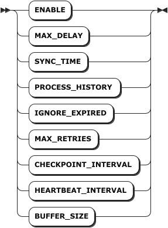
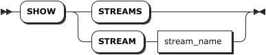
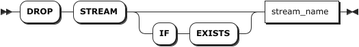

# Streams

## CREATE STREAM

The `CREATE STREAM` statement creates a stream.

::: warning Note
After a stream is created, you cannot update the structure of source or target tables.
:::

### Privileges

The user must be a member of the `admin` role or have been granted the `SELECT` privilege on the source table(s) and the `INSERT` privilege on the target table(s). By default, the `root` user belongs to the `admin` role.

### Syntax


- `stream_option`

    

- `stream_query`

    

### Parameters

| Parameter | Description |
| --- | --- |
| `stream_name` | The name of the stream to create. |
| `table_name` | The name of the target table.<br> **Note** <br> The schema of the target table must be compatible with the `select_list` option of the `stream_query` parameter. |
| `stream_option` | The stream parameters. Available options: <br >- `ENABLE`: Configure whether to enable the stream. Available options are `on` and `off`. `on` indicates enabling a stream while `off` indicates disabling a stream. By default, it is set to `on`. <br >- `MAX_DELAY`: The maximum duration for the aggregate window. By default, it is set to `24h`. The supported units for the `MAX_DELAY` parameter include millisecond (ms), second (s), minute (m), hour (h), day (d), and week (w).  <br >- `SYNC_TIME`: The maximum allowed out-of-order data window. By default, it is set to `1m`. The value of the `SYNC_TIME` parameter must be smaller than the value of the `MAX_DELAY` parameter. <br >- `PROCESS_HISTORY`: Configure whether to deal with historical data and pending data. Available options are `on` and `off`. `on` indicates dealing with historical data and pending data while `off` indicates not dealing with historical data and pending data. By default, it is set to `off`. <br >- `MAX_RETRIES`: The maximum retry times after a stream encounters an error. By default, it is set to `5`. <br >- `CHECKPOINT_INTERVAL`: The checkpoint period of the stream. By default, it is set to `10s`. The value of the `CHECKPOINT_INTERVAL` parameter must be smaller than the value of the `SYNC_TIME` parameter. <br >- `HEARTBEAT_INTERVAL`: The heartbeat period of the stream. By default, it is set to `2s`. <br >- `BUFFER_SIZE`: The buffer size for the stream to perform aggregate computing. By default, it is set to `2Gb`. This parameter is not available for a common stream query. <br > **Note** <br > Currently, KWDB only supports modifying the `ENABLE` parameter online. To modify other stream parameters, you need to stop the stream first and then make changes. |
| `value` | The values of stream parameters. |
| `stream_query` | The `SELECT` query statement. <br> **Note** <br>- The `select_list` parameter must be compatible with the schema of the target table. <br>- The `select_list` parameter must contain the `first(ts)` and `last(ts)` and take them as the first two output columns, which are used to record the begin time and end time of the window. Otherwise, the system cannot deal with historical data, expired data, and pending data. <br>- Support window functions (`SESSION_WINDOW`, `STATE_WINDOW`, `TIME_WINDOW`, `EVENT_WINDOW`, and `COUNT_WINDOW`) and the `Timebucket`function. The window functions only support `GROUP BY [<ptag>,]` and `group_window_function`. <br>- Support renaming all output columns using the `AS` clause. <br>- When creating a stream using the `TIME_WINDOW` function, you must use the `first_row` and `last_row` functions to get the begin time and end time of the aggregate window.  <br>- When creating a stream using the `TIME_WINDOW` with a sliding window, you must use the `first` and `last` functions to get the begin time and end time of the aggregate window and record them as the first output columns of the target table.|

### Examples

This example creates a stream named `cpu_stream`.

```sql
CREATE STREAM cpu_stream INTO cpu_avg AS SELECT first(ts_timestamp), last(ts_timestamp), count(*), avg(usage_user), avg(usage_system), hostname FROM benchmark.cpu GROUP BY TIME_WINDOW(ts_timestamp, '1m', '30s'), hostname;
```

## SHOW STREAMS

The `SHOW STREAMS` or `SHOW STREAM` statement lists details about all streams or a specified stream, including the stream name, the target table name, the stream parameters, the time to create the stream, the creator, the current status, the begin time, the end time, and the error messages if any.

- Current status: Whether the stream is enabled or disabled.
- Begin time: The last time when the stream is started. If not started yet, it is kept empty.
- End time: The last time when the stream is stopped. By default, it is kept empty.
- Error message: The reason why the stream fails.

### Privileges

N/A

### Syntax



### Parameters

| Parameter | Description |
| --- | --- |
| `stream_name` | The name of the stream to view. |

### Responses

| Field               | Description                                                                 |
|---------------------|-----------------------------------------------------------------------------|
| `name`              | The name of the stream. The stream name must be unique within the database. |
| `target_table_name` | The name of the target time-series table to create a stream for.            |
| `options`           | The parameters of the stream.                                               |
| `query`             | The `SELECT` statement used by the stream.                                  |
| `status`            | Whether the stream is enabled or not.                                       |
| `create_at`         | The time when the stream is created.                                        |
| `create_by`         | The creator of the stream.                                                  |
| `start_time`        | The last time to start the stream. If not started yet, it is kept empty. |
| `end_time`          | The last time to stop the stream. By default, it is kept empty.          |
| `error_message`     | The error message for a stream failure.                                     |

### Examples

This example lists details of the `test_stream` stream.

```sql
SHOW STREAM test_stream;
```

If you succeed, you should see an output similar to the following:

```sql
     name     |       target_table_name       |                                                                                                                      options                                                                                                                       |                        query                         | status  |            create_at             | create_by |        start_time         |         end_time          |                                                                     error_message
--------------+-------------------------------+----------------------------------------------------------------------------------------------------------------------------------------------------------------------------------------------------------------------------------------------------+------------------------------------------------------+---------+----------------------------------+-----------+---------------------------+---------------------------+---------------------------------------------------------------------------------------------------------------------------------------------------------
  test_stream | tsdb.public.ts_test_stream_02 | {"enable":"on","max_delay":"24h","sync_time":"1m","process_history":"off","ignore_expired":"on","ignore_update":"on","max_retries":"5","checkpoint_interval":"10s","heartbeat_interval":"2s","recalculate_delay_rounds":"10","buffer_size":"2GiB"} | SELECT * FROM tsdb.public.ts_test_stream WHERE 1 = 1 | Disable | 2025-08-19 08:25:06.940759+00:00 | root      | 2025-08-19 08:25:06+00:00 | 2025-08-19 08:27:11+00:00 | initial connection heartbeat failed: operation "rpc heartbeat" timed out after 6s: rpc error: code = DeadlineExceeded desc = context deadline exceeded
(1 row)
```

## ALTER STREAM

The `ALTER STREAM` statement modifies parameters of a stream.

### Privileges

The user must be a member of the `admin` role or the creator of the stream. By default, the `root` user belongs to the `admin` role.

::: warning Note
If the user who created a stream is removed, only the `admin` or `sysadmin` role can remove the specified stream.
:::

### Syntax


### Parameters

| Parameter | Description |
| --- | --- |
| `stream_name` | The name of the stream to modify. |
| `stream_option` | The stream parameters to modify. Available options: <br >- `ENABLE`: Configure whether to enable the stream. Available options are `on` and `off`. `on` indicates enabling a stream while `off` indicates disabling a stream. By default, it is set to `on`. <br >- `MAX_DELAY`: The maximum duration for the aggregate window. By default, it is set to `24h`. The supported units for the `MAX_DELAY` parameter include millisecond (ms), second (s), minute (m), hour (h), day (d), and week (w).  <br >- `SYNC_TIME`: The maximum allowed out-of-order data window. By default, it is set to `1m`. The value of the `SYNC_TIME` parameter must be smaller than the value of the `MAX_DELAY` parameter. <br >- `PROCESS_HISTORY`: Configure whether to deal with historical data and pending data. Available options are `on` and `off`. `on` indicates dealing with historical data and pending data while `off` indicates not dealing with historical data and pending data. By default, it is set to `off`. <br >- `MAX_RETRIES`: The maximum retry times after a stream encounters an error. By default, it is set to `5`. <br >- `CHECKPOINT_INTERVAL`: The checkpoint period of the stream. By default, it is set to `10s`. The value of the `CHECKPOINT_INTERVAL` parameter must be smaller than the value of the `SYNC_TIME` parameter. <br >- `HEARTBEAT_INTERVAL`: The heartbeat period of the stream. By default, it is set to `2s`. <br >- `BUFFER_SIZE`: The buffer size for the stream to perform aggregate computing. By default, it is set to `2Gb`. This parameter is not available for a common stream query. <br > **Note** <br >- Currently, KWDB only supports modifying the `ENABLE` parameter online. To modify other stream parameters, you need to stop the stream first and then make changes. <br >- When you resume a stopped stream, the system checks whether there is any pending data and uses the ​minimum data feed watermark to compute the volume of pending data. If there is any pending data, the system gets and deals with historical data synchronously and then deals with real-time data. If there is any window function, when receiving data sent in the first window function, the system asynchronously deals with historical data and the data that are not dealt before the first real-time data window. |
| `value` | The values of stream parameters. |

### Examples

This example stops a stream named `cpu_stream`.

```sql
-- Stop a stream.
ALTER STREAM cpu_stream SET OPTIONS(enable = 'off');
```

You can also use the `ALTER STREAM <name> SET <stream_option> = '<value>'` format to modify stream parameters. This example stops a stream named `cpu_stream`.

```sql
-- Stop a stream.
ALTER STREAM cpu_stream SET enable = 'off';
```

## DROP STREAM

The `DROP STREAM` statement removes a stream. If the target stream is running, the stream cannot be removed untill it is completed.

### Privileges

The user must be a member of the `admin` role or the creator of the stream. By default, the `root` user belongs to the `admin` role.

::: warning Note
If the user who created a stream is removed, only the `admin` or `sysadmin` role can remove the specified stream.
:::

### Syntax



### Parameters

| Parameter | Description |
| --- | --- |
| `IF EXISTS` | Optional. <br>- When the `IF EXISTS` keyword is used, the system removes the stream only if the stream has already existed. Otherwise, the system fails to remove the stream without returning an error. <br>- When the `IF EXISTS` keyword is not used, the system removes the stream only if the stream has already existed. Otherwise, the system fails to remove the stream and returns an error.|
| `stream_name` | The name of the stream to remove. |

### Examples

This example removes a stream named `cpu_stream`.

```sql
DROP STREAM cpu_stream;
```
