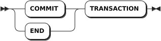

# Transactions

::: warning Note

- KWDB supports querying or inserting time-series data within ​explicit transactions but does not ensure the transactionality of the time-series engine or the consistency of the cross-model query results.
- KWDB does not support performing DDL operations on time-series data within ​explicit transactions.

:::

KWDB supports bundling multiple SQL statements into a single all-or-nothing transaction. If a transaction succeeds, all mutations are applied together with virtual simultaneity. If any part of a transaction fails, the entire transaction is aborted, and the database is left unchanged.

The transaction guarantees ACID semantics:

- A (Atomicity): all SQL statements are executed as an atomic transaction. Either all statements are executed or none of them is executed.
- C (Consistency): after the transactions is completed, the state of all data remains consistent.
- I (Isolation): if multiple transactions are executed, any reads or writes performed on the database will not be impacted by other reads of writes of separate transaction occurring on the same database.
- D (Durability): durability ensures that changes to the database that are successfully committed will survive permanently, even in the case of system failure.

KWDB supports both ​implicit and ​explicit transactions, both ensuring data consistency and integrity.

- ​​Implicit transactions are transactions that are automatically created for each operation without using the `BEGIN` or `COMMIT` statement and automatically committed or rollbacked after the operation is completed. ​Implicit transactions provide more simplified codes and higher development efficiency. ​Implicit transactions are suitable for signle-statement operations. If an operation succeeds, the system automatically commits the transaction. Otherwise, the system automatically rollbacks the transaction.
- ​Explicit transactions are transactions that are specified by the `BEGIN` or `COMMIT` statement in an application. ​Explicit transactions provide more granular control over multi-statement operations. After the operation are completed, you need to manually commit or rollback the transactions.

## Isolation Levels

When two concurrent transactions operate on the same record, issues like ​dirty reads, ​non-repeatable reads, and ​phantom reads may arise due to inconsistent data states. As a core component of ACID compliance, ​isolation governs how concurrency is managed to ensure consistency. KWDB supports three isolation levels:

- Serializable: Serializable isolation is the highest isolation level and ensures that concurrent transactions produce the same result as if executed sequentially. This prevents all exceptions allowed by weaker isolation levels and thus ensures data correctness. By default, KWDB provides Serializable isolation.
- Read Committed (RC): at the RC isolation level, a transaction reads data that has been committed by other transactions, but serializability of the transaction is not fully guaranteed. RC isolation permits some concurrency anomalies including unrepeatable reads, phantom reads, lost updates, and write skew, in exchange for minimizing transaction abortions, retries, and blocking. RC isolation doES not return serialization errors that require client-side handling. The RC isolation is appropriate in the following scenarios:
  - Your application needs to maintain a high workload concurrency with minimal transaction retries, and it can tolerate potential concurrency anomalies. Predictable query performance at high concurrency is more valuable than guaranteed transaction serializability.
  - You are migrating an application to KWDB that is built at a RC isolation level on the source database, and it is not feasible to modify your application to use Serializable isolation.
- Repeatable Read (RR): the RR isolation ensures that when the same data is read multiple times within the same transaction, the results are consistent. To accomplish this, when a transaction executes a query, it locks the columns or rows of the query to ensure that no other transaction can modify the data in the meantime. RR isolation solves issues like dirty reads, unrepeatable reads.

By default, KWDB uses the Serializable isolation level.

### Configure Isolation Levels

KWDB supports configuring cluster-level, session-level, and transaction-level isolation levels, where the transaction-level isolation levels are of the highest priority, and the cluster-level isolation levels are of the lowest priority.

#### Configure Cluster-level Isolation Levels

The cluster-level isolation level settings take effect only for subsequently initiated connections. For details, see [Cluster Settings](../../db-operation/cluster-settings-config.md). You can use the `SHOW CLUSTER SETTING sql.txn.cluster_transaction_isolation` statement to view cluster-level isolation level settings.

```sql
SET CLUSTER SETTING sql.txn.cluster_transaction_isolation = <level>;
```

Values for the `level` parameter:

- `serializable`: (default), Serializable isolation
- `read committed`: RC isolation
- `repeatable read`: RR isolation

#### Configure Session-level Isolation Levels

The session-level isolation level settings take effect only for the current connection. If no isolation level is specified when initiating a session, the system will use the cluster-level isolation level settings. You can use the following command to change the session-level isolation level settings. After update, you can use the `SHOW default_transaction_isolation` statement to view session-level isolation level settings.

```sql
SET default_transaction_isolation = <level>;
```

Values for the `level` parameter:

- `serializable`: (default), Serializable isolation
- `read committed`: RC isolation
- `repeatable read`: RR isolation

#### Configure Transaction-level Isolation Levels

If no isolation level is specified when initiating a transaction, the system will use the session-level isolation level settings. You can use the following command to change the transaction-level isolation level settings. After update, you can use the `SHOW transaction isolation level` statement to view transaction-level isolation level settings.

::: warning Note
KWDB only supports changes the isolation level settings within explicit transactions that do not execute kv operations (read and write operations).
:::

- Configure the transaction-level isolation level using the `BEGIN TRANSACTION ISOLATION LEVEL` statement.

  ```sql
  BEGIN TRANSACTION ISOLATION LEVEL <iso_level>;
  ```

  Values for the `iso_level` parameter:

  - `SERIALIZABLE`: (default), Serializable isolation
  - `READ COMMITTED`: RC isolation
  - `REPEATABLE READ`: RR isolation

- Configure the transaction-level isolation level using the `SET TRANSACTION ISOLATION LEVEL` statement.

  ```sql
  BEGIN; -- Initiate a transaction.
  SET TRANSACTION ISOLATION LEVEL <iso_level>; -- Set the isolation level within an explicit transaction.
  ```

  Values for the `iso_level` parameter:

  - `SERIALIZABLE`: (default), Serializable isolation
  - `READ COMMITTED`: RC isolation
  - `REPEATABLE READ`: RR isolation

- Configure the transaction-level isolation level using the `transaction_isolation` session variable.

  ```sql
  BEGIN; -- Initiate a transaction.
  SET transaction_isolation = <level>;  -- Set the isolation level within an explicit transaction.
  ```

  Values for the `level` parameter:

  - `serializable`: (default), Serializable isolation
  - `read committed`: RC isolation
  - `repeatable read`: RR isolation

- Configure the transaction-level isolation level using the `SET SESSION TRANSACTION ISOLATION LEVEL` statement.

  ```sql
  BEGIN; -- Initiate a transaction.
  SET SESSION TRANSACTION ISOLATION LEVEL <iso_level>; -- Set the isolation level within an explicit transaction.
  ```

  Values for the `level` parameter:

  - `serializable`: (default), Serializable isolation
  - `read committed`: RC isolation
  - `repeatable read`: RR isolation

## SQL Statements

### BEGIN

The `BEGIN` statement initiates a transaction, which either successfully executes all of the statements it contains or none at all. In KWDB, the following are aliases for the `BEGIN` statement:

- `BEGIN TRANSACTION`
- `START TRANSACTION`

#### Privileges

No privileges are required to initiate a transaction. However, privileges are required for each statement within a transaction.

#### Syntax


#### Parameters

| Parameter | Description |
| --- | --- |
| `ISOLATION LEVEL` | The isolation level of the transaction. Available options: <br >- Serializable: Serializable isolation is the strongest of the four transaction isolation levels defined by the SQL standard. Serializable isolation guarantees that even though transactions may execute in parallel, the result is the same as if they had executed one at a time, without any concurrency. <br >- Read Committed (RC): RC isolation guarantees a transaction to read data that has been committed by other transactions but does not guarantee the serializability of the transaction's operations. <br >- Repeatable Read (RR): RR isolation guarantees that when the same data is read multiple times within the same transaction, the results are consistent.|
| `PRIORITY` | The priority of the transaction. By default, it is set to `NORMAL`. You can set it to `LOW` or `HIGH` as required. Transactions with higher priority are less likely to need to be retried.|
| `READ` | The access mode of the transaction. Available options are `READ ONLY` and `READ WRITE`. By default, it is set to `READ WRITE`. You can set the access mode using the `transaction_read_only` session variable.|
| `AS OF SYSTEM TIME` | Execute the transaction using the "as of" timestamp. The `AS OF SYSTEM TIME` clause can be used only when the access mode is set to `READ ONLY`. If the transaction contains any writes, or if the `READ WRITE` access mode is specified, the system returns an error.|

#### Examples

These examples assume that you have created three tables (`accounts`, `orders`, `customers`) and inserted data into these tables.

- Initiate a transaction using default settings.

    By default, the isolation level is set to `SERIALIZABLE` and the priority is set to `NORMAL`.

    ```sql
    -- 1. Initiate a transaction.

    BEGIN;
    Now adding input for a multi-line SQL transaction client-side (smart_prompt enabled).
    Press Enter two times to send the SQL text collected so far to the server, or Ctrl+C to cancel.
    You can also use \show to display the statements entered so far.

    -- 2. Create a savepiont.

    SAVEPOINT foo;

    -- 3. Update the accounts table.

    UPDATE accounts SET balance = 5000.0 WHERE id = 2;

    -- 4. Insert data into the accounts table.

    INSERT INTO accounts (id, balance) VALUES (9, DEFAULT);

    -- 5. Commit the transaction.
    COMMIT;
    COMMIT
    ```

- Initiate a transaction and set the isolation level to `read committed`.

    ::: warning Note
    You can also use the `SET TRANSACTION` statement to set the isolation level for a transaction. For details, see [SET TRANSACTION](#set-transaction).
    :::

    ```sql
    -- 1.-- Set the isolation level using an explicit transaction.
    BEGIN TRANSACTION ISOLATION LEVEL read committed;

    -- 2. Commit the transaction.
    COMMIT;
    COMMIT
    ```

- Initiate a transaction and set the priority to `HIGH`.

    ::: warning Note
    You can also use the `SET TRANSACTION` statement to set the priority for a transaction. For details, see [SET TRANSACTION](#set-transaction).
    :::

    ```sql
    -- 1. Initiate a transaction.
    BEGIN PRIORITY HIGH;
    Now adding input for a multi-line SQL transaction client-side (smart_prompt enabled).
    Press Enter two times to send the SQL text collected so far to the server, or Ctrl+C to cancel.
    You can also use \show to display the statements entered so far.

    -- 2. Commit the transaction.
    COMMIT;
    COMMIT
    ```

- Initiate a transaction using the "as of" timestamp.

    ::: warning Note
    You can also use the `SET TRANSACTION` statement to set the "as of" timestamp. For details, see [SET TRANSACTION](#set-transaction).
    :::

    ```sql
    -- 1. Initiate a transaction.

    BEGIN AS OF SYSTEM TIME '2023-04-18 10:00:00.0+00:00';
    Now adding input for a multi-line SQL transaction client-side (smart_prompt enabled).
    Press Enter two times to send the SQL text collected so far to the server, or Ctrl+C to cancel.
    You can also use \show to display the statements entered so far.

    -- 2. Commit the transaction.
    COMMIT;
    COMMIT
    ```

- Initiate a transaction with automatic retries.

    KWDB will automatically retry all transactions that contain both `BEGIN` and `COMMIT` in the same batch. Batching is controlled by your driver or client's behavior, but means that KWDB receives all of the statements as a single unit, instead of a number of requests.
    From the perspective of KWDB, a transaction sent as a batch looks like this:

    ```sql
    -- 1. Initiate a transaction.

    BEGIN;
    Now adding input for a multi-line SQL transaction client-side (smart_prompt enabled).
    Press Enter two times to send the SQL text collected so far to the server, or Ctrl+C to cancel.
    You can also use \show to display the statements entered so far.

    -- 2. Remove data whose id field is set to 1 from the customers table.
    DELETE FROM customers WHERE id = 1;
    DELETE 

    -- 3. Remove data whose customer field is set to 1 from the orders table.

    DELETE orders WHERE customer = 1;
    DELETE 1

    -- 4. Commit the transaction.

    COMMIT;
    ```

    In your application's code, batched transactions are often just multiple statements sent at once. In this example, this transaction would send multiple statements as a single batch and automatically retry:

    ```go
    db.Exec(
      "BEGIN;

      DELETE FROM customers WHERE id = 1;

      DELETE orders WHERE customer = 1;

      COMMIT;"
    )
    ```

### SET TRANSACTION

The `SET TRANSACTION` statement sets the transaction priority, access mode, "as of" timestamp, and isolation level.

#### Privileges

No privileges are required to set the transaction priority. However, privileges are required for each statement within a transaction.

#### Syntax


#### Parameters

| Parameter | Description |
| --- | --- |
| `ISOLATION LEVEL` | The isolation level of the transaction. Available options: <br >- Serializable: Serializable isolation is the strongest of the four transaction isolation levels defined by the SQL standard. Serializable isolation guarantees that even though transactions may execute in parallel, the result is the same as if they had executed one at a time, without any concurrency. <br >- Read Committed (RC): RC isolation guarantees a transaction to read data that has been committed by other transactions but does not guarantee the serializability of the transaction's operations. <br >- Repeatable Read (RR): RR isolation guarantees that when the same data is read multiple times within the same transaction, the results are consistent.|
| `PRIORITY` | The priority of the transaction. By default, it is set to `NORMAL`. You can set it to `LOW` or `HIGH` as required. Transactions with higher priority are less likely to need to be retried.|
| `READ` | The access mode of the transaction. Available options are `READ ONLY` and `READ WRITE`. By default, it is set to `READ WRITE`. You can set the access mode using the `transaction_read_only` session variable.|
| `AS OF SYSTEM TIME` | Execute the transaction using the "as of" timestamp. The `AS OF SYSTEM TIME` clause can be used only when the access mode is set to `READ ONLY`. If the transaction contains any writes, or if the `READ WRITE` access mode is specified, the system returns an error.|

#### Examples

- Set the isolation level of a transaction.

    ```sql
    -- 1. Initiate a transaction.

    BEGIN;
    Now adding input for a multi-line SQL transaction client-side (smart_prompt enabled).
    Press Enter two times to send the SQL text collected so far to the server, or Ctrl+C to cancel.
    You can also use \show to display the statements entered so far.

    -- 2. Set the isolation level of the transaction to READ COMMITTED.

    SET TRANSACTION ISOLATION LEVEL READ COMMITTED;

    -- 3. Commit the transaction.

    COMMIT;
    COMMIT
    ```

- Set the priority of a transaction.

    ```sql
    -- 1. Initiate a transaction.

    BEGIN;
    Now adding input for a multi-line SQL transaction client-side (smart_prompt enabled).
    Press Enter two times to send the SQL text collected so far to the server, or Ctrl+C to cancel.
    You can also use \show to display the statements entered so far.

    -- 2. Set the priority of the transaction to HIGH.

    SET TRANSACTION PRIORITY HIGH;

    -- 3. Commit the transaction.

    COMMIT;
    COMMIT
    ```

- Set the `AS OF SYSTEM TIME` option of a transaction.

    ```sql
    -- 1. Initiate a transaction.

    BEGIN;
    Now adding input for a multi-line SQL transaction client-side (smart_prompt enabled).
    Press Enter two times to send the SQL text collected so far to the server, or Ctrl+C to cancel.
    You can also use \show to display the statements entered so far.

    -- 2. Set the AS OF SYSTEM TIME option of the transaction.

    SET TRANSACTION AS OF SYSTEM TIME '2023-04-18 10:00:00+00:00'; 

    -- 3. Commit the transaction.

    COMMIT;
    COMMIT
    ```

### ROLLBACK

The `ROLLBACK` statement aborts the current transaction and all of its nested transactions, discarding all transactional updates made by statements included in the transaction.

#### Privileges

No privileges are required to rollback a transaction. However, privileges are required for each statement within a transaction.

#### Syntax


#### Parameters

| Parameter | Description |
| --- | --- |
| `savepoint_name` | The name of the savepoint. KWDB supports creating savepoints for the following transactions: <br >- Nested transactions: the savepoint name can be any name. <br >- Auto-retry transactions: by default, the savepoint name is set to `kwbase_restart`. You can define another name as required. To make the user-defined savepoint name take effect, you need to set the `force_savepoint_restart` session variable to `true`. Once the setting takes effect, the savepoint name for auto-retry transactions can be any name. |

#### Examples

- Rollback a transaction.

    These examples assume that you have created a table named `accounts` and inserted data into the table.

    ```sql
    -- 1. Check data of the table.

    SELECT * FROM accounts;
      id | balance
    -----+----------
      1 |    1000
      2 |    2000
      3 |    3000
    (3 rows)

    -- 2. Initiate a transaction.

    BEGIN;
    Now adding input for a multi-line SQL transaction client-side (smart_prompt enabled).
    Press Enter two times to send the SQL text collected so far to the server, or Ctrl+C to cancel.
    You can also use \show to display the statements entered so far.

    -- 3. Update the accounts table.

    UPDATE accounts SET balance = 2500 WHERE id = 1;

    -- 4. Rollback the transaction.
    ROLLBACK;
    ROLLBACK

    -- 5. Check data of the table.

    SELECT * FROM accounts;
      id | balance
    -----+----------
      1 |    1000
      2 |    2000
      3 |    3000
    (3 rows)
    ```

- Retry a transaction.

    After enabling transaction retries, when `40001 / retry transaction` error occurs, you can use the `ROLLBACK TO SAVEPOINT` statement to handle a transaction that needs to be retried.

    ```sql
    ROLLBACK TO SAVEPOINT kwbase_restart;
    ```

- Perform a multi-level rollback with the `ROLLBACK TO SAVEPOINT` statement.

    Savepoints can be arbitrarily nested, and rolled back to the outermost level so that every subsequent statement is rolled back.

    This example assumes that you have created a table and inserted data into the table. For example, this transaction rollbacks values `(6,6)` and `(7,7)` and only inserts `(5,5)` into the table. 

    ```sql
    -- 1. Initiate a transaction.

    BEGIN;

    -- 2. Insert (5,5) into the table.

    INSERT INTO kv VALUES (5,5);

    -- 3. Create a savepoint named foo.

    SAVEPOINT foo;

    -- 4. Insert (6,6) into the table.

    INSERT INTO kv VALUES (6,6);

    -- 5. Create a savepoint named bar.

    SAVEPOINT bar;

    -- 6. Insert (7,7) into the table.

    INSERT INTO kv VALUES (7,7);

    -- 7. Release savepoint bar.

    RELEASE SAVEPOINT bar;

    -- 8. Rollback to savepoint foo.

    ROLLBACK TO SAVEPOINT foo;

    -- 9. Commit the transaction.

    COMMIT;
    COMMIT

    -- 10. Check data of the table.

    SELECT * FROM kv;
    k|v
    -+-
    1|1
    2|2
    3|3
    4|4
    5|5
    (5 rows)
    ```

- Recover from an error in nested transactions with the `ROLLBACK TO SAVEPOINT` statement.

    If the `ROLLBACK TO SAVEPOINT` statement is used after a database error, it can also cancel the error state of the transaction. Database errors move a nested transaction into an "Aborted" state. In this state, the transaction will not execute any further SQL statements. You can use the `ROLLBACK TO SAVEPOINT` statement to recover from a logical error in a nested transaction, including:

    - UNIQUE index error (duplicate row)
    - Failed foreign key constraint check (A row does not exist in the referenced table.)
    - Mistakes in queries (Reference a column that does not exist.)

    ```sql
    -- 1. Initiate a transaction.

    BEGIN;

    -- 2. Create a savepoint named error1.

    SAVEPOINT error1;

    -- 3. Insert (5,5) into the table.

    INSERT INTO kv VALUES (5,5);
    ERROR:  duplicate key value (k)=(5) violates unique CONSTRAINT "primary"

    -- 4. Create a savepoint named foo.

    SAVEPOINT foo;

    -- 6. Check the transaction status.

    SHOW TRANSACTION STATUS;
    TRANSACTION STATUS
    ------------------
    Aborted           
    (1 row)

    -- 7. Rollback to the savepoint error1.

    ROLLBACK TO SAVEPOINT error1;

    -- 8. Insert (6,6) into the table.

    INSERT INTO kv VALUES (6,6);
    INSERT 1

    -- 9. Commit the transaction.

    COMMIT;

    -- 10. Check data of the table.

    SELECT * FROM kv;
    k|v
    -+-
    1|1
    2|2
    3|3
    4|4
    5|5
    6|6
    (6 rows)
    ```

### COMMIT

The `COMMIT` statement commits the current transaction or, when using transaction retries, clears the connection to allow new transactions to begin.

- When using transaction retries, statements issued after the `SAVEPOINT` statement are committed when the `RELEASE SAVEPOINT` is issued. However, you must still issue a `COMMIT` statement to clear the connection for the next transaction.
- When not using transaction retries, if statements in the transaction generate any errors, the `COMMIT` statement is equivalent to `ROLLBACK`, which aborts the transaction and discards all updates made by its statements.

In KWDB, `END` is an alias for the `COMMIT` statement.

#### Privileges

No privileges are required to commit a transaction. However, privileges are required for each statement within a transaction.

#### Syntax



#### Parameters

N/A

#### Examples

```sql
-- 1. Initiate a transaction.

BEGIN;

-- 2. Commit the transaction.

COMMIT;
```

### SAVEPOINT

A savepoint is a marker that defines the beginning of a nested transaction. This marker can be later used to commit or rollback the nested transaction without affecting the progress of the enclosing transaction.

#### Privileges

No privileges are required to create a savepoint. However, privileges are required for each statement within a transaction.

#### Syntax


#### Parameters

| Parameter | Description |
| --- | --- |
| `savepoint_name` | The name of the savepoint. KWDB supports creating savepoints for the following transactions: <br >- Nested transactions: the savepoint name can be any name. <br >- Auto-retry transactions: by default, the savepoint name is set to `kwbase_restart`. You can define another name as required. To make the user-defined savepoint name take effect, you need to set the `force_savepoint_restart` session variable to `true`. Once the setting takes effect, the savepoint name for auto-retry transactions can be any name. |

#### Examples

These examples assume that you have created a table named `kv`.

```sql
CREATE TABLE kv (k INT PRIMARY KEY, v INT);
CREATE TABLE
```

- Create a savepoint inside a transaction.

    ```sql
    SAVEPOINT foo;
    ```

    ::: warning Note
    Both the `SAVEPOINT foo` and the `SAVEPOINT Foo` statements create a savepoint named `foo`. However, the `SAVEPOINT "Foo"` statement creates a savepoint named `Foo`.
    :::

- Create a savepoint for nested transactions.

    Transactions can be nested using savepoint names. The `RELEASE SAVEPOINT` and `ROLLBACK TO SAVEPOINT` statements can both refer to a savepoint higher in the nesting hierarchy. When this occurs, all of the savepoints under the nesting are automatically released or rollbacked.

    - When a previous savepoint is rollbacked, the statements entered after that savepoint are also rollbacked. For details, see [ROLLBACK](#rollback).
    - When a previous savepoint is released, the statements entered after that savepoint are also committed. For details, see [RELEASE SAVEPOINT](#release-savepoint).

- Create a savepoint for transaction retries.

    A savepoint defined with the name `kwbase_restart` is a "retry savepoint" and is used to implement transaction retries.

    By default, the savepoint name for transaction retries is set to `kwbase_restart`. You can set the `force_savepoint_restart` session variable to `true` to enable using a custom name for the retry savepoint.

    ```sql
    -- 1. Initiate a transaction.

    BEGIN;

    -- 2. Create the retry savepoint named kwbase_restart.

    SAVEPOINT kwbase_restart;

    -- 3. Update the products table.

    UPDATE products SET inventory = 0 WHERE sku = '8675309';

    -- 4. Insert data into the orders table.

    INSERT INTO orders (customer, sku, status) VALUES (1001, '8675309', 'new');

    -- 5. Release the kwbase_restart retry savepoint.

    RELEASE SAVEPOINT kwbase_restart;

    -- 6. Commit the transaction.

    COMMIT;
    ```

- Savepoints and prepared statements.

    Prepared statements (`PREPARE` / `EXECUTE`) are not transactional. Therefore, prepared statements are not invalidated upon savepoint rollback. As a result, the prepared statement is saved and executed inside the transaction, despite the rollback to the prior savepoint.

    ```sql
    -- 1. Initiate a transaction.
    BEGIN;

    -- 2. Create a savepoint named foo.

    SAVEPOINT foo;

    -- 3. Prepare the statement named bar.

    PREPARE bar AS SELECT 1;

    -- 4. Rollback to savepoint foo.

    ROLLBACK TO SAVEPOINT foo;

    -- 5. Execute the prepared statement bar.

    EXECUTE bar;

    ?column?
    --------
    1       
    (1 row)

    -- 6. Commit the transaction.

    COMMIT;
    ```

### RELEASE SAVEPOINT

The `RELEASE SAVEPOINT` statement commits the nested transaction starting at the corresponding `SAVEPOINT` statement using the same savepoint name, including all its nested sub-transactions. This further provides support for working with retry savepoints.

#### Privileges

No privileges are required to release a savepoint. However, privileges are required for each statement within a transaction.

#### Syntax


#### Parameters

| Parameter | Description |
| --- | --- |
| `savepoint_name` | The name of the savepoint. KWDB supports creating savepoints for the following transactions: <br >- Nested transactions: the savepoint name can be any name. <br >- Auto-retry transactions: by default, the savepoint name is set to `kwbase_restart`. You can define another name as required. To make the user-defined savepoint name take effect, you need to set the `force_savepoint_restart` session variable to `true`. Once the setting takes effect, the savepoint name for auto-retry transactions can be any name. |

#### Handle Errors

The `RELEASE SAVEPOINT` statement is invalid after the nested transaction has encountered an error. In this case, the following statements can be used:

- `ROLLBACK TO SAVEPOINT`: rollback to the previous savepoint.
- `ROLLBACK` or `ABORT`: rollback the entire transaction.
- `COMMIT`: commit the entire transaction. In case of error, the `COMMIT` statement is equivalent to the `ROLLBACK` or `ABORT` statement and also rollbacks the entire transaction.

When a transaction or sub-transaction encounters a retry error, the client should repeat the `ROLLBACK TO SAVEPOINT` statement and the statements in the transaction until the statements complete without error, then issue the `RELEASE SAVEPOINT` statement.

To completely remove the marker of a nested transaction after it encounters an error and begin other work in the outer transaction, use the `ROLLBACK TO SAVEPOINT` statement immediately followed by the `RELEASE SAVEPOINT` statement.

#### Examples

- Confirm whether a savepoint name exists or not.

    You cannot view the name of a rollbacked savepoint. In this example, you cannot view the `bar` savepoint after the transaction is rollbacked.

    ```sql
    -- 1. Initiate a transaction.

    BEGIN;

    -- 2. Create a savepoint named foo.

    SAVEPOINT foo;

    -- 3. Create a savepoint named bar.

    SAVEPOINT bar;

    -- 4. Rollback to the foo savepoint.

    ROLLBACK TO SAVEPOINT foo;

    -- 5. Release the bar savepoint.
    RELEASE SAVEPOINT bar;
    ERROR:  savepoint "bar" does not exist

    -- 6. Commit the transaction.
    COMMIT;
    ```

- Release a savepoint and commit a transaction.

    In this example, the transaction inserts `(2,2)` and `(4,4)` into the table.

    ```sql
    -- 1. Initiate a transaction.

    BEGIN;

    -- 2. Create a savepoint named foo.

    SAVEPOINT foo;

    -- 3. Insert (2,2) into the table.
    INSERT INTO kv VALUES (2,2);

    -- 4. Insert (4,4) into the table.
    INSERT INTO kv VALUES (4,4);

    -- 5. Release the foo savepoint.

    RELEASE SAVEPOINT foo;

    -- 6. Commit the transaction.

    COMMIT;

    -- 7. Check the data of the table.

    SELECT * FROM kv;
    k|v
    -+-
    2|2
    4|4
    (2 rows)
    ```

- Release a savepoint and commit a nested transaction.

    In this example, you will rollback the inner nested transaction (marked by the `lower` savepoint) and commit the outer `higher` savepoint.

    ```sql
    -- 1. Initiate a transaction.

    BEGIN;

    -- 2. Create a savepoint named higher.

    SAVEPOINT higher;

    -- 3. Update the promo_codes table.

    UPDATE promo_codes SET rules = jsonb_set(rules, '{value}', '"15%"') WHERE rules @> '{"type": "percent_discount"}';

    -- 4. Create a savepoint named lower.

    SAVEPOINT lower;

    -- 5. Update the promo_codes table.

    UPDATE promo_codes SET rules = jsonb_set(rules, '{value}', '"7.5%"') WHERE rules @> '{"type": "percent_discount"}';

    -- 6. Rollback to the lower savepoint.

    ROLLBACK TO SAVEPOINT lower;

    -- 7. Release the higher savepoint.

    RELEASE SAVEPOINT higher;

    -- 8. Commit the transaction.
    COMMIT;
    ```

- Release a retry savepoint and commit a transaction.

    After defining a retry savepoint, you can release the savepoint using the `RELEASE SAVEPOINT` statement and then prepare the connection for the next transaction with the `COMMIT` statement.

    ```sql
    -- 1. Initiate a transaction.

    BEGIN;

    -- 2. Create the kwbase_restart retry savepoint.

    SAVEPOINT kwbase_restart;

    -- 3. Update the products table.

    UPDATE products SET inventory = 0 WHERE sku = '8675309';

    -- 4. Insert data into the orders table.

    INSERT INTO orders (customer, sku, status) VALUES (1001, '8675309', 'new');

    -- 5. Release the kwbase_restart retry savepoint.

    RELEASE SAVEPOINT kwbase_restart;

    -- 6. Commit the transaction.
    COMMIT;
    ```
