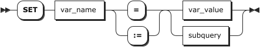

# User-defined Variables

You can store a value in a user-defined variable in one statement and refer to it later in another statement. This enables you to pass values from one statement to another. A user-defined variable is written as `@var_name`. KWDB supports user-defined variables, which enables you to assign values, reference variables, and calculate values in SQL statements. User-defined variables are session specific. A user variable defined by one client cannot be seen or used by other clients. All variables for a given client session are lost when that client exits.

User-defined variables are mainly used in the following scenarios:

- Arithmetic expressions.
- As the input of functions, such as `CONCAT(@SQL1, @SQL2)`.
- The `WHERE` clause.
- The `ORDER BY` clause.
- As SQL statements in the `PREPARE` statement. When using user-defined variables in the `PREPARE` statement, even if the value of user-defined variables are changed, the execute results of the `PREPARE` statement are not changed.
- The DML statements.
- The `INSERT` statement.

::: warning Note

- User-defined variables are unavailable for user-defined functions.
- User-defined variables are transaction-independent.

:::

KWDB supports initializing user-defined variables, updating their values, and querying both their values and data types. The data type of a user-defined variable is determined by its initial value. This table lists the data types supported by user-defined variables.

| Data Type | Description |
| --- | --- |
| Numeric | - Integer: INT2, INT4, INT8 <br >- Floating-point: FLOAT4, FLOAT8 <br >- DECIMAL: DECIMAL |
| BOOL | BOOL |
| STRING | STRING, CHAR, VARCHAR, BYTES, VARBYTES |

KWDB does not limit the data type width of user-defined variables. After user-defined variables are initialized, you cannot modify their data types. Their subsequent values must match with the initial data type. Otherwise, the system returns an error. For example, the system returns an error if a floating-point value is assigned to a user-defined variable that was initially defined as an integer. Since both INT4 and INT8 are the integer type, assigning an INT8 value to an INT4 user-defined variable will not cause an error. You can also use the `SET @var = <var_value>::<data_type>` statement to assign a value with a specified data type to a user-defined variable.

::: warning Note

- Do not support implicitly converting data types of User-defined variables.
- Do not support setting NULL value to user-defined variables.

:::

## SET {variable}

The `SET <variable>` statement sets a value for a user-defined variable. The `SELECT ... INTO` statement sets values for one or more user-defined variables. The `SELECT ... INTO` statement is equivalent to the `SET <var_name> := <subquery>;` statement.

For the `SET <variable>` statement, either `=` or `:=` can be used as the assignment operator. For the `SELECT ... INTO` statement, if the query result is a single row and the number of the returned columns matches with the number of user-defined variables, the system applies the query result to these user-defined variables. If no query result is returned, the system does not return an error or apply values to these user-defined variables.

::: warning Note
By default, user-defined variable values are set for the duration of the current session. In some cases, clients can drop and restart the connection to the server. When this happens, any user-defined variable configurations made with the `SET` statement are lost.
:::

### Privileges

N/A

### Syntax

- Assign a value to a user-defined variable using the `SET` statement

    

- Assign a value to a user-defined variable using the `SELECT ... INTO` statement

    

### Parameters

| Parameter | Description |
|--------------|--------------------------------------------------------------------------------|
| `var_name`   | The user-defined variable to set. The user-defined variable is written as `@var_name`.                    |
| `var_value`  | The value of the user-defined variable.                                                                 |
| `subquery`   | The `SELECT` sub-query statement. When assigning a value to a user-defined variable using the `SELECT ... INTO` statement, the sub-query result must be a single row and a single column. |
| `expr`       | The `expr` expression.                                                                   |
| `table_name` | The name of the table to query.                                                                |

### Examples

- Assign a value to a user-defined variable using the `SET` statement.

    ```sql
    -- Assign a value to the user-defined variable.
    SET @counter = 10;
    SET

    -- Check the value of the user-defined variable.
    select @counter;
      @counter
    ------------
            10
    (1 row)
    ```

- Assign a value to a user-defined variable using the `SELECT ... INTO` statement.

    This example assumes that you have created a table named `orders` and inserted data into the table.

    ```sql
    -- Assign a value to the user-defined variable.
    SELECT amount INTO @myvar FROM orders LIMIT 1;
    SET 1

    -- Check the value of the user-defined variable.
    SELECT @myvar;
      @myvar
    ----------
          1
    (1 row)
    ```

- Use user-defined variables in arithmetic expressions.

    ```sql
    SET @num = 10;
    SET

    SELECT @num * 2 AS double_value, @num + 5 AS increased_value;
      double_value | increased_value
    ---------------+------------------
                20 |              15
    (1 row)
    ```

- Use user-defined variables as function inputs.

    ```sql
    SET @prefix = 'Hello';
    SET

    SELECT CONCAT(@prefix, ' World!') AS greeting;
        greeting
    ----------------
      Hello World!
    (1 row)
    ```

- Pass user-defined variables from one SQL statement to another SQL statement.

    ```sql
    SET @avg_salary := (SELECT AVG(salary) FROM employees);
    SET

    SELECT * FROM employees WHERE salary > @avg_salary;
      employee_id | name  | salary  | department  |         hire_date
    --------------+-------+---------+-------------+----------------------------
                5 | Eve   | 7000.00 | Engineering | 2023-04-10 00:00:00+00:00
                7 | Grace | 8000.00 | Engineering | 2023-03-15 00:00:00+00:00
    (2 rows)
    ```

- Use user-defined variables to construct and perform SQL statements.

    ```sql
    SET @tbl := 'employees';
    SET

    SET @col := 'salary';
    SET

    SET @cond := 'salary >= 6000';
    SET

    SET @dyn_sql := CONCAT('SELECT employee_id, name, ', @col,
                            ' FROM ', @tbl,
                            ' WHERE ', @cond,
                            ' ORDER BY ', @col, ' DESC LIMIT 2');
    SET

    SELECT @dyn_sql;
            @dyn_sql
    -----------------------------------------------------------------------------------------------------
      SELECT employee_id, name, salary FROM employees WHERE salary >= 6000 ORDER BY salary DESC LIMIT 2
    (1 row)

    PREPARE stmt AS @dyn_sql;
    PREPARE

    EXECUTE stmt;
      employee_id | name  | salary
    --------------+-------+----------
                7 | Grace | 8000.00
                5 | Eve   | 7000.00
    (2 rows)

    SELECT employee_id, name, salary FROM employees WHERE salary >= 6000 ORDER BY salary DESC LIMIT 2;
      employee_id | name  | salary
    --------------+-------+----------
                7 | Grace | 8000.00
                5 | Eve   | 7000.00
    (2 rows)

    DEALLOCATE PREPARE stmt;
    DEALLOCATE
    ```

- Use user-defined variables in the `WHERE` clause.

    ```sql
    SET @min_salary = 5000;
    SET

    SELECT * FROM employees WHERE salary > @min_salary;
      name | salary
    -------+---------
      c    |   5500
    (1 row)
    ```

- Use user-defined variables in DML statements.

    ```sql
    SET @low_price := 5000;
    SET

    UPDATE products SET price = price * 2 WHERE price < @low_price;
    UPDATE 2

    SET @discount=1000;
    SET

    UPDATE products SET price = price-@discount WHERE price > @low_price;
    UPDATE 4
    ```

- Use user-defined variables in the `INSERT` statement.

    ```sql
    -- 1. Create a table.
    CREATE TABLE t1(a int);
    CREATE TABLE

    -- 2. Assign a value to the user-defined variable.
    SET @ss = 1;
    SET

    -- 3. Insert the value of the user-defined variable to the table.
    INSERT INTO t1 VALUES(@ss);
    INSERT 1

    -- 4. Check the data of the table.
    SELECT * FROM t1;
      a
    -----
      1
    (1 row)
    ```

## SELECT {variable}

The `SELECT <variable>` statement displays the value of a user-defined variable. Before querying a user-defined variable, you need to set an initial value for it. Otherwise, the system returns an error.

### Privileges

N/A

### Syntax


### Parameters

| Parameter | Description |
|------------|-------------------------------------------------------------------|
| `var_name` | The user-defined variable to view. The user-defined variable is written as `@var_name`. |

### Examples

```sql
-- Assign a value to the user-defined variable.
SET @counter = 8;
SET

-- Check the value of the user-defined variable.
select @counter;
  @counter
------------
        8
(1 row)
```

## SHOW {variable}

The `SHOW <variable>` statement displays the data type of a user-defined variable.

### Privileges

N/A

### Syntax


### Parameters

| Parameter | Description |
|------------|-------------------------------------------------------------------|
| `var_name` | The user-defined variable to view. The user-defined variable is written as `@var_name`. |

### Examples

```sql
-- Check the data type of a user-defined variable.
SHOW @myvar;
  var_name | var_type
-------------+-------------
    @myvar |    INT8
(0 rows)
```
