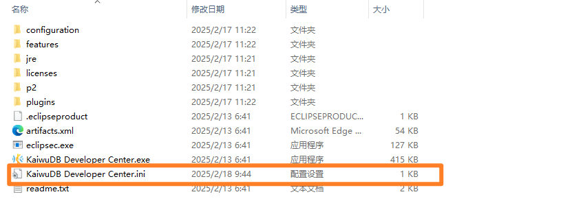

# 故障排查

KaiwuDB 开发者中心支持通过启用调试日志开关，设置调试日志文件大小和个数限制，帮助用户进行故障排查。

调试日志功能启用后，系统将在用户数据目录的`./matadata` 文件夹下生成 `debug.log` 日志文件，记录发送给数据库的 SQL 语句、执行时间，以及各模块打印的 `DEBUG` 及以上级别的日志信息。

不同操作系统的默认数据目录如下：

- Windows：`C:\Users\{username}\AppData\Roaming\KaiwuDB_Developer_Center\workspace6\.metadata`
- Linux: `~/.local/share/KaiwuDB_Developer_Center/workspace6/.metadata`
- Mac: `~/Library/KaiwuDB_Developer_Center/workspace6/.metadata`

日志格式如下：

```plain
timestamp [thread_name] level class_name - message
```

其中：

- `timestamp`: 事件发生时的时间戳，精度为毫秒级，例如 `2025-02-18 10:59:50.443`
- `thread_name`: 线程名称，如 `main`, `连接到数据库:'KaiwuDB - defaultdb' `
- `level`: 日志级别，包括 `DEBUG`、`INFO`、`WARN`、`ERROR` 和 `FATAL`。
- `class_name`：日志类名，例如 `c.k.k.u.e.s.e.DBSQLQueryJob`
- `message`: 日志信息。

示例：

```plain
2025-02-18 11:38:58.513 [读取数据 [show create table t2]] DEBUG c.k.k.m.i.j.e.JDBCStatementImpl - execute() Query executed: show create table t2
```

## 步骤

以下以 Windows 版本的 KaiwuDB 开发者中心为例说明如何启用调试日志功能：

1. 打开安装包内的 `KaiwuDB Developer Center.ini`文件。

    

2. 将调试日志开关 `debug.enabled` 设置为 `true`。
3. 根据需要在文件末尾添加调试日志文件的大小和个数限制。

    ```java
    -Dlogs.debug.files.output.maxSize=10485760
    -Dlogs.debug.files.output.maxCount=5
    ```

    参数说明：
    - `debug.files.output.maxSize`: 调试日志文件的最大大小，默认值为 `10485760`, 即 10 MB。文件大小达到限制时，系统会对文件进行切分，生成新的文件，命名格式为`debug-{ms_timestamp}.log`, 例如 `debug-1739847590443.log`。
    - `debug.files.output.maxCount`：调试日志文件的个数限制，默认值为 `5`, 文件数量达到限制时，系统会按照时间戳从最旧到最新的顺序删除文件，避免占用过多磁盘空间。

4. 保存文件并重启 KaiwuDB 开发者中心，使配置生效。