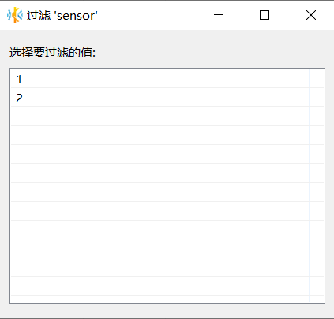
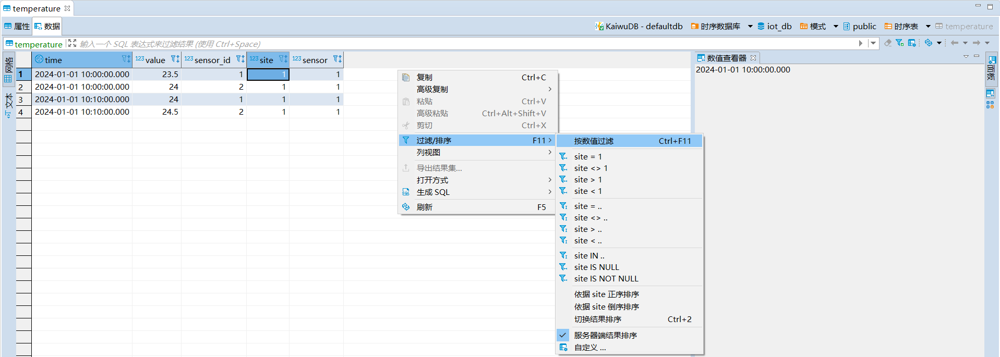
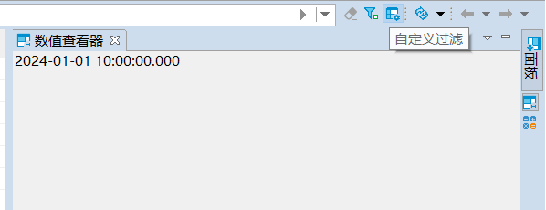
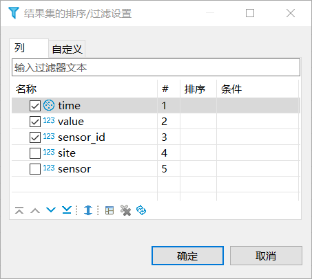
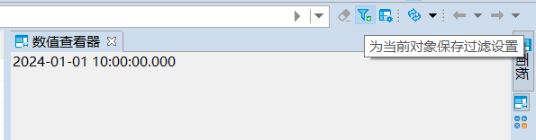
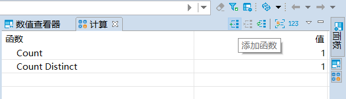
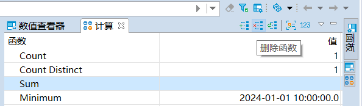
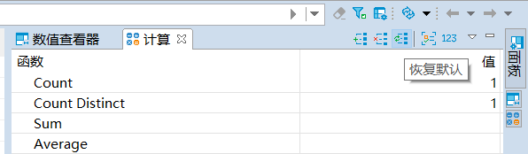
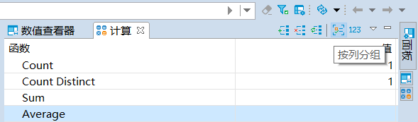

# 过滤和计算查询结果

KaiwuDB 开发者中心支持通过结果面板进一步过滤和计算查询结果。

## 过滤查询结果

### 按数值过滤

如需按数值过滤查询结果，遵循以下步骤。

1. 在**数据**页面，单击**按列过滤**图标。
2. 在**过滤**窗口，选择需要显示的值，即可过滤查询结果。

    

3. （可选）如需取消过滤，单击过滤栏右侧的**取消过滤**按钮。

### 按操作符过滤

如需按操作符过滤查询结果，遵循以下步骤。

1. 在**数据**页面，右键单击页面空白处，从右键菜单中单击**过滤/排序**，然后选择操作符。

    

2. （可选）如需取消过滤，单击过滤栏右侧的**取消过滤**按钮。

### 自定义过滤

如需自定义过滤查询结果，遵循以下步骤。

1. 单击过滤栏右侧的自定义按钮。

    

2. 在**结果集的排序/过滤设置**窗口，选择列，设置自定义参数，然后单击**确定**。

    

3. （可选）如需取消过滤，单击过滤栏右侧的**取消过滤**按钮。

### 保留当前过滤器

单击过滤栏右侧的**为当前对象保留过滤设置**按钮，保留当前过滤器。

## 计算数据结果

计算面板支持使用函数来计算数据结果。默认情况下，KaiwuDB 开发者中心提供计数（Count）和去重计数（Count Distinct）的计算结果。

### 添加函数

在计算面板，单击**添加函数**按钮，然后选择需要添加的函数。成功添加函数后，KaiwuDB 开发者中心自动计算数据并显示计算结果。

除默认函数外，KaiwuDB 开发者中心还支持求和（Sum）、求平均（Average）、求最小值（Minimum）、求最大值（Maximum）、求中间数（Median）和求众数（Mode）函数。

### 删除函数

如需删除函数，选择要删除的函数，然后单击**删除函数**按钮。

### 恢复默认设置

如需恢复默认设置，单击**恢复默认**按钮。

### 按列分组

如需将计算结果按列分组，单击**按列分组**按钮。

