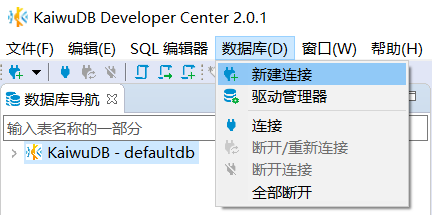
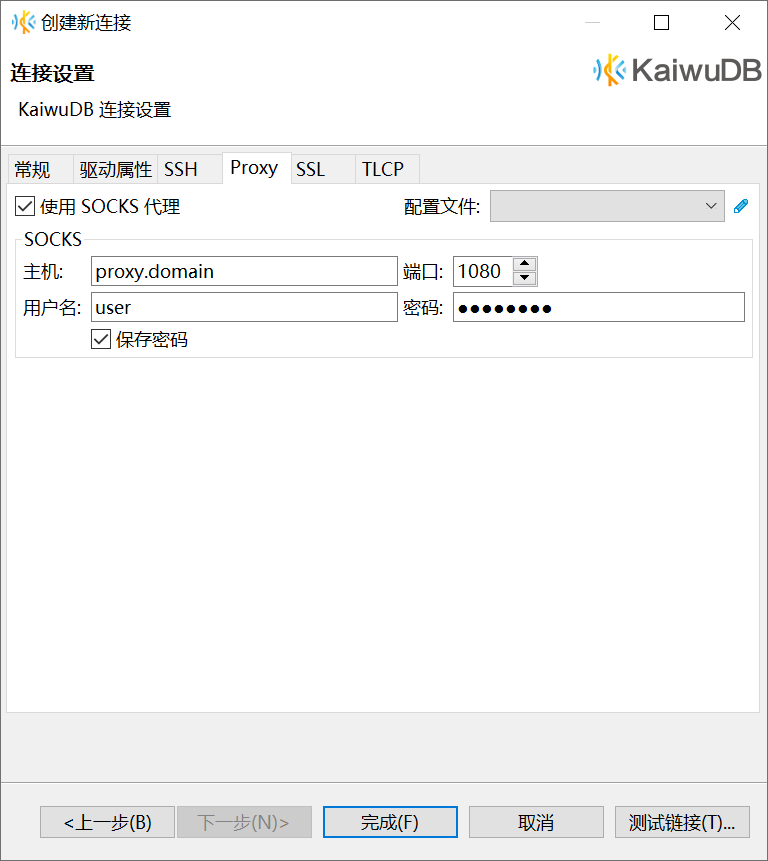
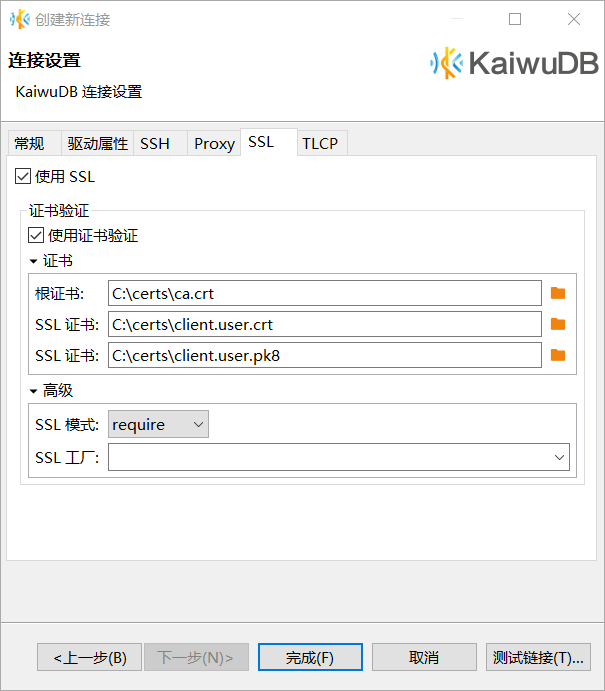
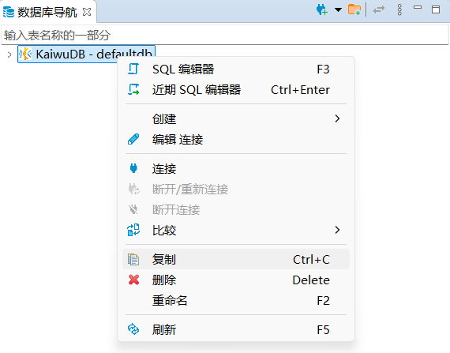
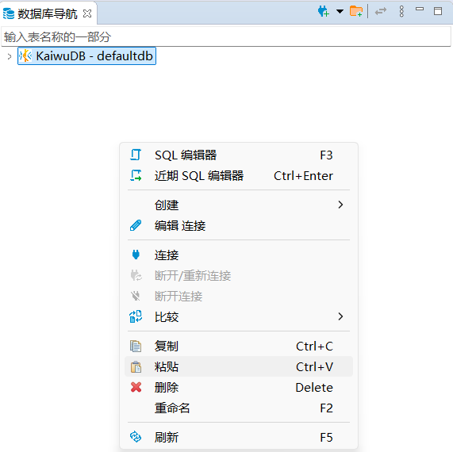

# 连接数据库

本文档假设用户已经[安装 KaiwuDB 开发者中心](./kdc-install.md)。

首次建立连接或软件中的所有连接都被删除后，软件启动后会自动弹出**新建连接**向导，引导用户建立连接。

其他情况下，如需创建连接，可以选择以下任一操作：

- 单击工具栏或数据库导航区工具栏中的**新建连接**按钮。

    

- 在菜单栏中，单击**数据库**，然后从下拉菜单中选择**新建连接**。

    

## 新建连接

### 常规连接

以下步骤以首次建立连接为例，说明如何连接数据库。

1. 在**创建新连接**窗口，选择 KaiwuDB 驱动，然后单击**下一步**。

    

2. 在**常规**页签，设置主机、端口、数据库、用户和密码（如果采用非安全部署模式，则无需设置密码）。

    

3. （可选）单击**测试链接**，检查连接是否成功。

    

4. 单击**完成**。

### SSH 登录

如需使用 SSH 连接数据库，遵循以下步骤。

1. 单击工具栏或数据库导航区工具栏中的**新建连接**按钮，或者在菜单栏中单击**数据库** > **新建连接**。
2. 在**创建新连接**窗口，选择 KaiwuDB 驱动，然后单击**下一步**。

    

3. 在**常规**页签，填写要连接的数据库名称，用户名及密码。主机和端口使用系统默认值。

    

4. 在 **SSH** 页签，勾选**使用 SSH 通道**，设置主机地址、端口、用户名和密码。

    

5. （可选）单击**测试链接**，检查连接是否成功。

    

6. 单击**完成**。

### Proxy 设置

如需使用 Proxy 连接数据库，遵循以下步骤。

1. 单击工具栏或数据库导航区工具栏中的**新建连接**按钮，或者在菜单栏中单击**数据库** > **新建连接**。
2. 在**创建新连接**窗口，选择 KaiwuDB 驱动，然后单击**下一步**。

    

3. 在**常规**页签，填写数据库名称、用户名及密码。主机和端口使用系统默认值。

    

4. 在 **Proxy** 页签，勾选**使用 SOCKS 代理**，设置主机地址、端口、用户名和密码。

    

5. （可选）单击**测试链接**，检查连接是否成功。

    

6. 单击**完成**。

### SSL 登录

#### 前提条件

如需使用 TLS 安全证书连接数据库，需满足以下条件：
- 已经获取 `ca.crt`和 `client.<user>.crt` 文件。
- 已经使用 OpenSSL 命令将 `client.<user>.key` 文件转换为 `.pk8` 格式。

::: warning 说明
启用 TLS 安全模式安装部署 KWDB 时，系统会自动生成 `ca.crt` 和 `client.<user>.crt` 文件。文件的存储目录是 `/etc/kaiwudb/certs/`。
:::

#### 步骤

如需使用 SSL 连接数据库，遵循以下步骤。

1. 单击工具栏或数据库导航区工具栏中的**新建连接**按钮，或者在菜单栏中单击**数据库** > **新建连接**。
2. 在**创建新连接**窗口，选择 KaiwuDB 驱动，然后单击**下一步**。

    

3. 在**常规**页签，填写主机地址、端口号、数据库名称、用户名及密码。

    ::: warning 提示

    KWDB 默认支持用户使用证书或密钥连接数据库，如果选择使用证书连接数据库，可不填写密码。
    
    :::

    

4. 在 **SSL** 页签，勾选**使用 SSL**，添加根证书、SSL 证书和 SSL 证书密钥。

    ::: warning 提示

    在默认身份鉴别设置下，如果选择使用密码连接数据库，可不勾选使用证书验证以及添加证书。

    :::

    

5. （可选）单击**测试链接**，检查连接是否成功。

    

6. 单击**完成**。

## 复制连接

KaiwuDB 开发者中心支持通过复制粘贴已有连接的方式快速创建数据库连接。

如需复制和粘贴已有数据库连接，遵循以下步骤。

1. 在数据库导航区中，右键点击需要复制的数据库连接，选择**复制**。

    

2. 右键点击数据库导航区的空白区域，选择**粘贴**。

    

    系统将自动在导航区创建一个新的数据库连接，连接名称为"原连接名称 1"。