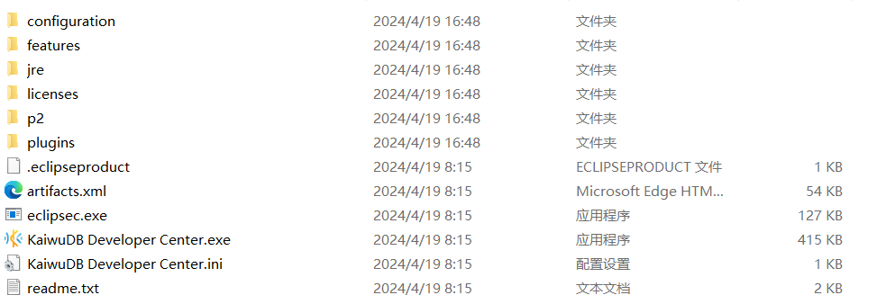

# 安装 KaiwuDB 开发者中心

本文档介绍如何安装 KaiwuDB 开发者中心。

## 支持的操作系统

::: warning 说明
不同操作系统版本的界面略有差异，但功能完全相同。
:::

KaiwuDB 开发者中心支持以下操作系统：

- Windows 7 及以上 64 位系统
- Linux 内核 2.6 及以上系统
- Mac 操作系统（macOS）

## 环境要求

KaiwuDB 开发者中心的安装需满足以下环境要求：

| 环境 | 要求            |
| ----------------------------------- | ---------------------------------------------- |
| 硬件环境                            | - 内存：1G 及以上   - 硬盘: 10G 及以上                |
| 软件环境                            | - KWDB 2.0 及以上版本   - OpenJRE 8 及以上版本 |

## 安装步骤

如需安装 KaiwuDB 开发者中心，遵循以下步骤。

1. 根据操作系统[下载](https://gitee.com/kwdb/kwdb/releases) KaiwuDB 开发者中心对应的安装包。

   ::: warning 提示：

   因文件大小限制，可能需要下载多个安装包。

   :::

2. 合并解压缩安装包，文件目录如下：

   

2. 双击运行 `KaiwuDB Developer Center.exe` 应用程序。
