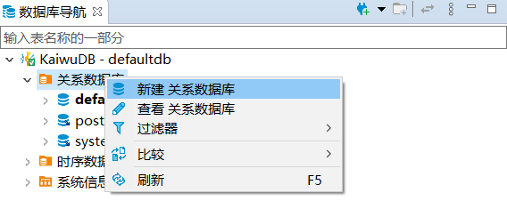
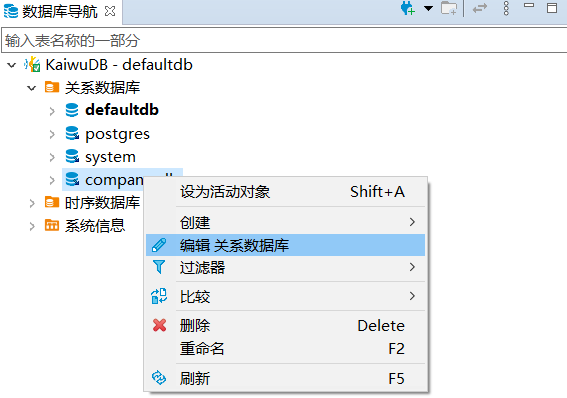
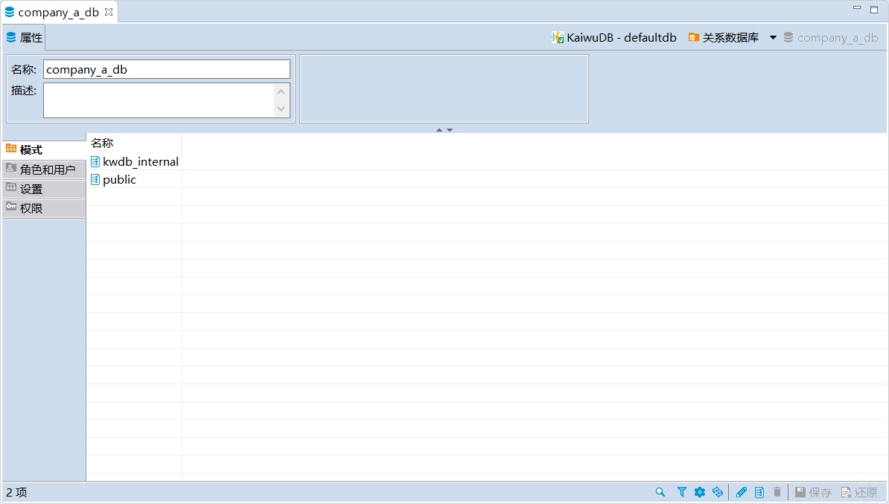
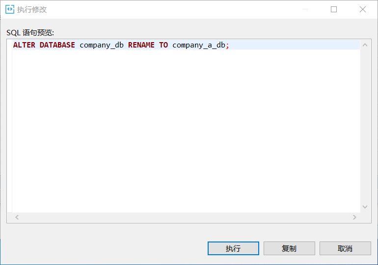
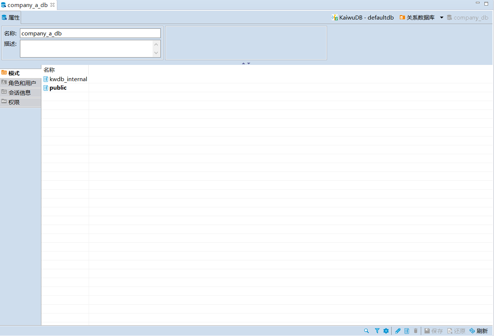
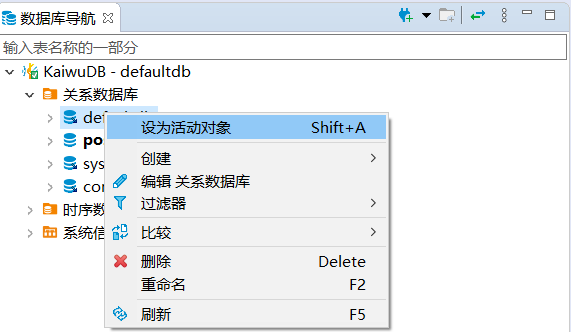
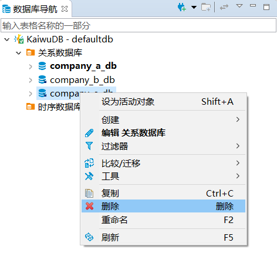
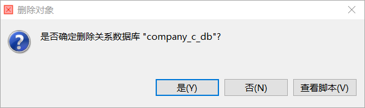
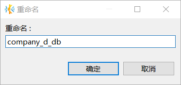
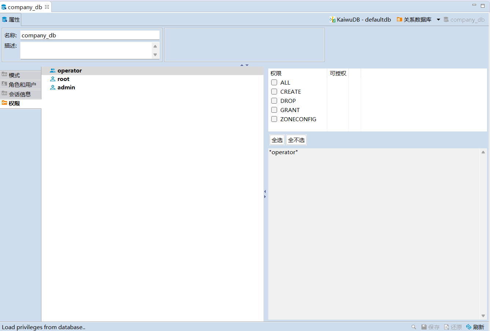

# 数据库管理

KaiwuDB 开发者中心支持创建、编辑、查看、切换、重命名和删除关系数据库。

## 创建数据库

### 前提条件

用户是 `admin` 角色的成员。默认情况下，`root` 用户属于 `admin` 角色。

### 步骤

如需创建关系数据库，遵循以下步骤。

1. 在数据库导航区，右键单击**关系数据库**，然后选择**新建关系数据库**。

    

2. 在**创建数据库**窗口，填写数据库名称，然后单击**确定**。

    

    创建成功后，新建数据库将自动显示在数据库导航区内，继承 KaiwuDB 数据库系统的角色和用户设置。

## 编辑数据库

### 前提条件

用户是 `admin` 角色的成员。默认情况下，`root` 用户属于 `admin` 角色。

### 步骤

如需编辑关系数据库，遵循以下步骤。

1. 在数据库导航区，右键单击需要修改的数据库，然后选择**编辑关系数据库**。

    

2. 修改数据库名称和描述信息，然后单击**保存**。

    

3. 在**执行修改**对话框，确认 SQL 语句无误，然后单击**执行**。

    

## 查看数据库

在数据库导航区，双击需要查看的数据库，即可在对象窗口查看数据库的名称、描述信息、模式、角色和用户、会话信息以及权限信息。

## 切换数据库

切换数据库用于设置正在使用的数据库。

如需切换正在使用的数据库，遵循以下步骤：

1. 在数据库导航区，右键单击需要切换使用的数据库，然后选择**设为活动对象**。

    

## 删除数据库

### 前提条件

- 用户是 `admin` 角色的成员或拥有目标数据库及对象 DROP 权限。默认情况下，`root` 用户属于 `admin` 角色。
- 要删除的数据库不是当前使用的数据库。

### 步骤

如需删除关系数据库，遵循以下步骤。

1. 在数据库导航区，右键单击需要删除的数据库，然后选择**删除**。

    

2. 在**删除对象**窗口中，单击**是**。删除成功后，系统将自动更新导航栏菜单。

    

## 重命名数据库

### 前提条件

- 用户是 `admin` 角色的成员。默认情况下，`root` 用户属于 `admin` 角色。
- 待重命名数据库不是当前使用的数据库。

### 步骤

如需重命名关系数据库，遵循以下步骤。

1. 在数据库导航区，右键单击需要重命名的数据库，然后选择**重命名**。

2. 在**重命名**窗口，设置新的数据库名称，然后单击**确定**。

    

3. 在**重命名脚本**窗口，确认新数据库名称无误，然后单击**执行**。

## 权限

权限管理用于赋予不同用户指定数据库的各项权限。

### 前提条件

用户是 `admin` 角色的成员或者拥有目标数据库 GRANT 和相应的权限。默认情况下，`root` 用户属于 `admin` 角色。

### 赋予权限

如需为用户赋予权限，遵循以下步骤。

1. 在指定数据库的对象窗口，单击**权限**页签。

    

2. 选择需要授权的用户，勾选相应的权限。
3. 单击页面右下方的保存按钮。
4. 在**执行修改**窗口，确认 SQL 语句无误后，单击**执行**。

### 撤销权限

如需撤销用户的权限，遵循以下步骤。

1. 在指定数据库的对象窗口，单击**权限**页签。
2. 选择需要撤销授权的用户，取消勾选相应的权限。
3. 单击页面右下方的保存按钮。
4. 在**执行修改**窗口，确认 SQL 语句无误，然后单击**执行**。