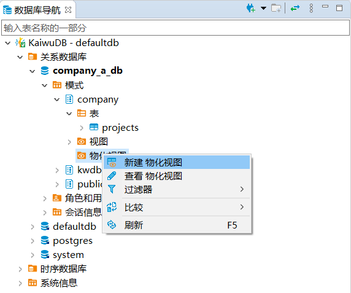
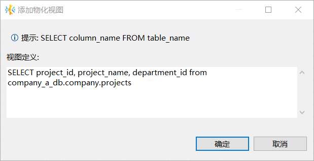
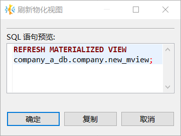
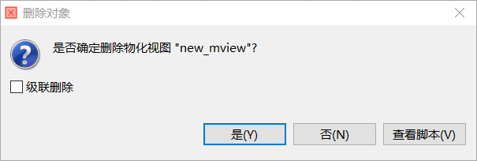

# 物化视图管理

物化视图（Materialized View）是一种特殊的数据库视图，用于存储底层查询结果。KaiwuDB 开发者中心支持为关系数据创建、刷新和删除物化视图。

创建物化视图时，系统会将查询结果写入物化视图。用户无法向物化视图中插入数据，也无法修改或删除物化视图中的数据。当用户查询物化视图中的数据时，物化视图返回的存储数据可能已经过时。如需从物化视图中获取最新数据，需要手动刷新物化视图。

## 前提条件

- 创建物化视图
  - 用户拥有所属数据库的 CREATE 权限和引用表的 SELECT 权限。
- 刷新物化视图
  - 用户拥有物化视图的 UPDATE 权限或者是 admin 角色的成员。默认情况下，root 用户属于 admin 角色。
- 删除物化视图
  - 删除无依赖关系的物化视图：用户拥有目标物化视图的 DROP 权限。
  - 删除存在依赖关系的物化视图：用户拥有目标物化视图的 DROP 权限及其关联对象的 DROP 权限。

## 创建物化视图

如需创建物化视图，遵循以下步骤。

1. 在数据库导航区，右键单击指定数据库模式下的物化视图，然后选择**新建物化视图**。

    

2. 在**添加物化视图**对话框，写入想要查询的 SQL 语句，然后单击**确定**。系统将自动创建名为 `new_mview` 的新物化视图。

    ::: warning 注意
    
    - 如果目标表所在的数据库不是当前数据库，必须指定数据库名。
    - 如果目标表所属的模式不是默认模式，必须指定模式名。
    
    :::

    

3. 在新建物化视图的**属性**页签，根据需要修改物化视图名称，然后单击页面右下方的保存按钮。

4. 在**执行修改**窗口，确认 SQL 语句无误，然后单击**执行**，系统将自动更新物化视图的字段信息。

## 刷新物化视图

如需从物化视图中获取最新数据，遵循以下步骤。

1. 在数据库导航区，右键单击需要刷新的物化视图，然后选择**工具** > **刷新物化视图** 。
2. 在**刷新物化视图**窗口，单击**确定**。

    

## 删除物化视图

如需删除关系表的物化视图，遵循以下步骤。

1. 在数据库导航区，右键单击需要删除的物化视图，然后选择**删除**。
2. 在**删除对象**窗口，单击**是**。

    
