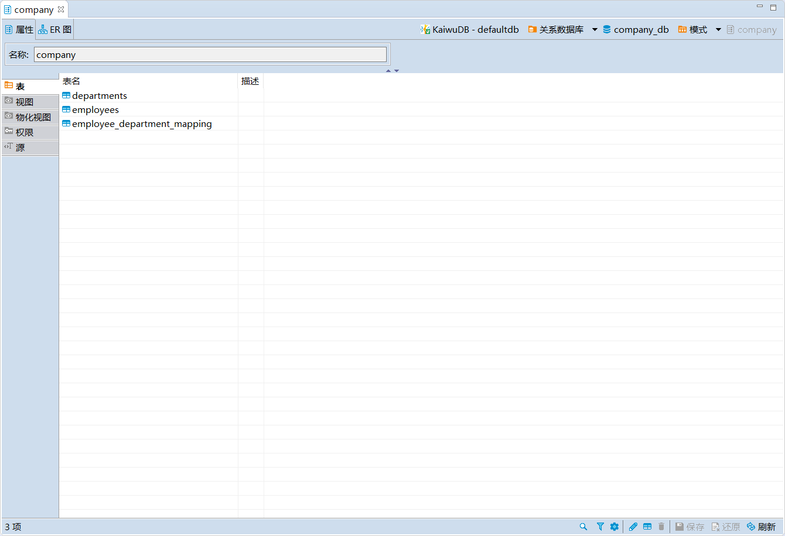

# 模式管理

KaiwuDB 开发者中心支持创建、编辑、查看、删除模式。

## 创建模式

### 前提条件

用户拥有 DATABASE CREATE 或 ALL 权限。

### 步骤

如需创建模式，遵循以下步骤。

1. 在数据库导航区，右键单击**模式**，然后选择**新建模式**。

    

2. 在**创建模式**窗口，填写模式名称，然后单击**确定**。

    

    创建成功后，新创建的模式将自动显示在导航菜单中。

## 编辑模式

### 前提条件

用户拥有 DATABASE CREATE 或 ALL 权限。

### 步骤

如需编辑模式，遵循以下步骤。

1. 在数据库导航区，右键单击需要编辑的模式，然后选择**编辑模式**。
2. 根据需要添加、修改、删除、查询模式下的表、视图和物化视图。

## 查看模式

在数据库导航区，双击需要查看的模式，即可在对象窗口查看模式的属性和 ER 图信息。

- 属性信息

    

- ER 图信息

    

## 删除模式

### 前提条件

- 用户拥有 DATABASE DROP 权限。
- 要删除的模式不是当前使用的模式。

### 步骤
如需删除模式，遵循以下步骤。

1. 在数据库导航区，右键单击需要删除的模式，然后选择**删除**。

    

2. 在**删除对象**窗口，单击**是**。

    
