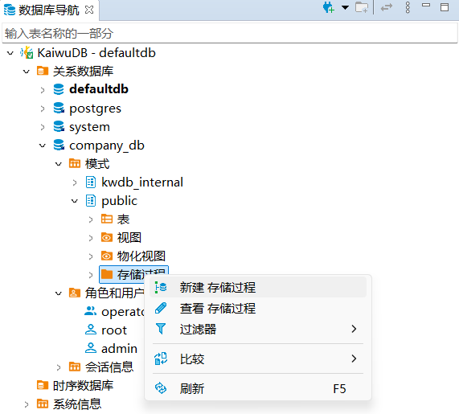
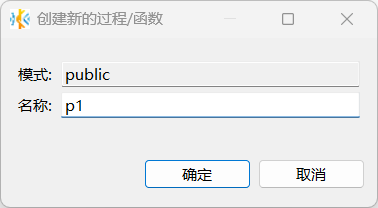
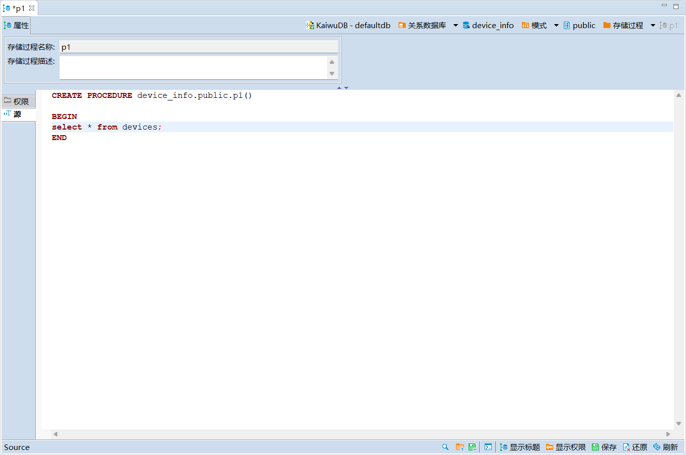
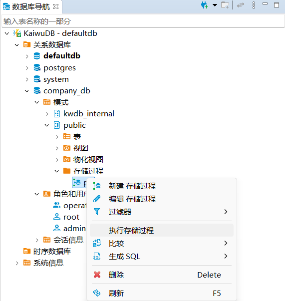
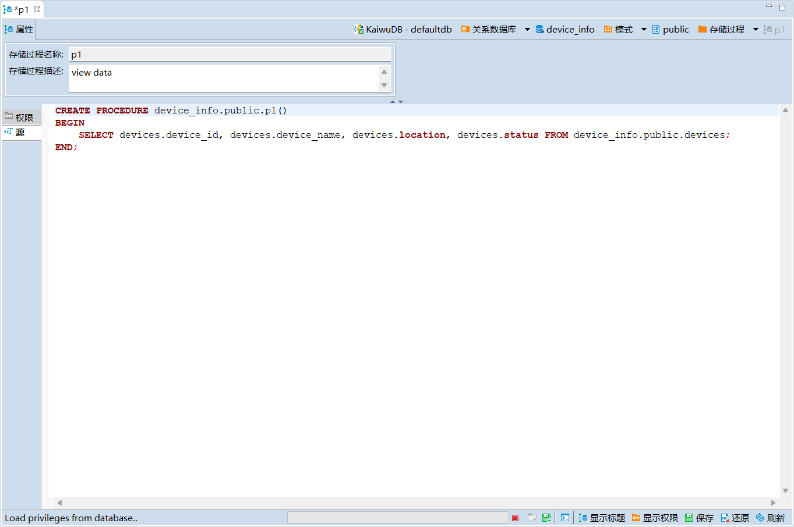
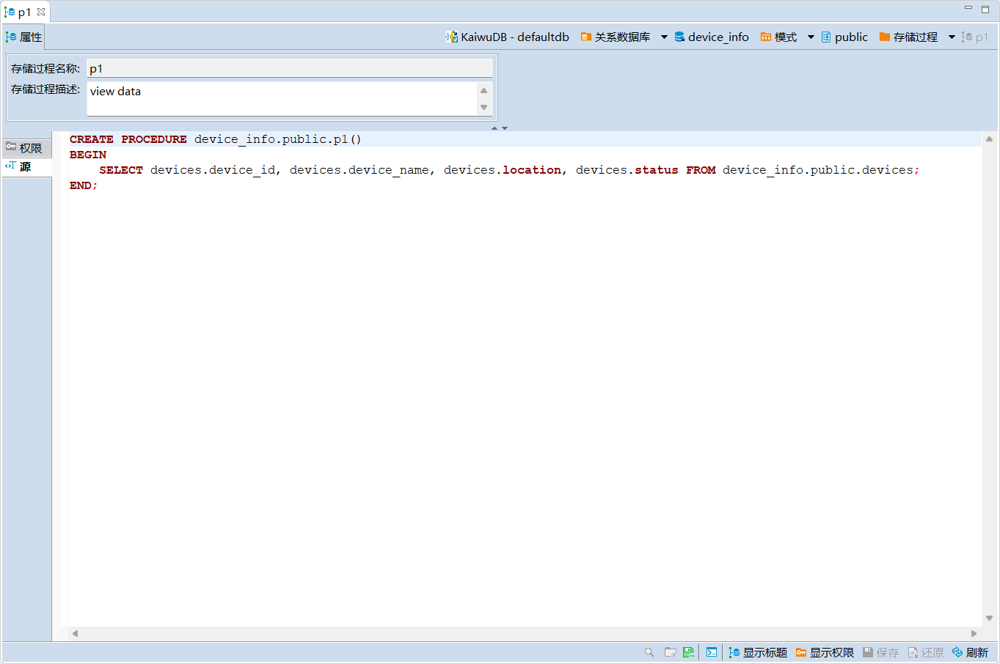
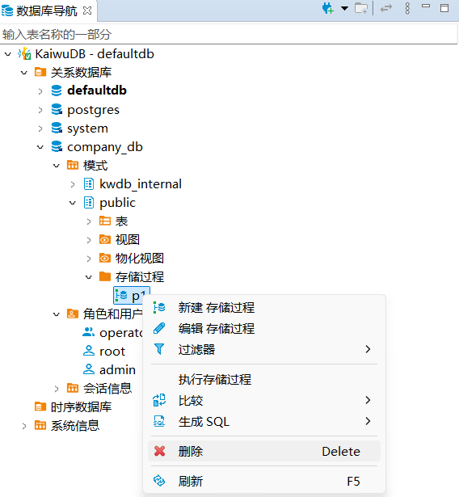
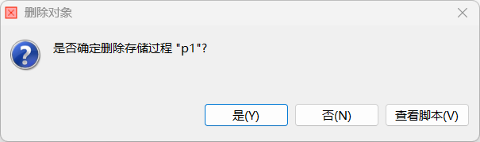
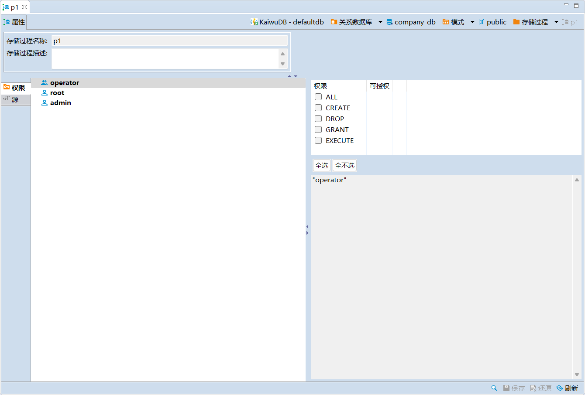
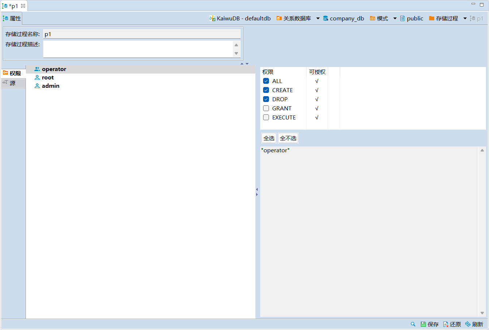

# 存储过程管理

存储过程（Stored Procedure）是一种数据库对象，用于存储复杂程序，以便外部程序调用。存储过程是为了完成特定功能的 SQL 语句集，经编译、创建并保存在数据库中。用户可以通过指定存储过程的名字和参数来调用执行存储过程。

KaiwuDB 开发者中心支持存储过程的创建、调用、修改、查看和删除。

## 创建存储过程

### 前提条件

用户是 `admin` 角色的成员或者拥有当前数据库的 CREATE 权限和存储过程体中引用的所有对象的相关权限（例如表的 SELECT 权限）。默认情况下，`root` 用户属于 `admin` 角色。

### 步骤

如需创建存储过程，遵循以下步骤：

1. 在数据库导航区，右键单击指定数据库模式下的存储过程文件夹或存储过程对象，然后选择**新建存储过程**。

    

2. 在**创建新的过程/函数**对话框，填写存储过程名称，然后单击**确定**。

    

3. 在存储过程的**源**页签，编辑存储过程函数体，然后单击页面右下方的保存按钮。

    

4. 在**执行修改**窗口，确认 SQL 语句无误，然后单击**执行**。

## 执行存储过程

### 前提条件

用户是 `admin` 角色的成员或者拥有目标存储过程的 EXECUTE 权限和存储过程体中引用的所有对象的相关权限（例如表的 SELECT 权限）。默认情况下，`root` 用户属于 `admin` 角色。

### 步骤

如需执行存储过程，遵循以下步骤：

1. 在数据库导航区，右键单击需要执行的存储过程，然后选择**执行存储过程** ，系统将自动弹出 SQL 编辑器页面。
2. 在 SQL 编辑器页面查看系统自动执行的 CALL 语句，如果存储过程需要输入参数，在自动弹出的对话框输入存储过程参数。

    

## 修改存储过程

修改存储过程支持修改存储过程的描述信息。

### 前提条件

用户是 `admin` 角色的成员或者拥有目标存储过程的 CREATE 权限。默认情况下，`root` 用户属于 `admin` 角色。

### 步骤

如需修改存储过程的描述信息，遵循以下步骤：

1. 在数据库导航区，双击需要修改的存储过程。
2. 在该存储过程的存储过程描述文本框修改描述信息，然后单击页面右下方的保存按钮。

    

3. 在**执行修改**窗口，确认 SQL 语句无误，然后单击**执行**。

## 查看存储过程

### 前提条件

用户拥有目标存储过程的任何权限。

### 步骤

如需查看指定存储过程，遵循以下步骤：

1. 在数据库导航区，双击需要查看的存储过程，即可在该存储过程的详情页查看该存储过程的名称、描述、权限和 DDL 语句信息。

    

## 删除存储过程

### 前提条件

用户是 `admin` 角色的成员或者拥有目标存储过程的 DROP 权限。默认情况下，`root` 用户属于 `admin` 角色。

### 步骤

如需删除存储过程，遵循以下步骤：

1. 在数据库导航区，右键单击需要删除的存储过程，然后选择**删除**。

    

2. 在**删除对象**窗口，单击**是**。

    

## 权限

权限管理用于赋予不同用户指定存储过程的各项权限。

### 前提条件

用户是 `admin` 角色的成员或者拥有目标表 GRANT 和相应的权限。默认情况下，`root` 用户属于 `admin` 角色。

### 赋予权限

如需为用户赋予权限，遵循以下步骤。

1. 在指定存储过程的对象窗口，单击**权限**页签，打开权限页面。
2. 选择需要授权的用户，勾选相应的权限。

    

3. 单击页面右下方的保存按钮。
4. 在**执行修改**窗口，确认 SQL 语句无误后，单击**执行**

### 撤销权限

如需撤销用户的权限，遵循以下步骤。

1. 在指定存储过程的对象窗口，单击**权限**页签，打开指定表的权限页面。
2. 选择需要撤销授权的用户，取消勾选相应的权限。

    
3. 单击页面右下方的保存按钮。
4. 在**执行修改**窗口，确认 SQL 语句无误，然后单击**执行**。