# 关系表管理

KaiwuDB 开发者中心支持管理关系表以及表中的字段、约束、外键、索引、权限等元素。

## 关系表

KaiwuDB 开发者中心支持创建、编辑、查看、截断、删除、重命名关系表，向表中写入数据或从表中读取数据、查看关系表的 ER 图，以及为关系表生成 SQL 语句。

::: warning 说明
避免频繁地创建、删除关系表。
:::

### 前提条件

- 创建、编辑、截断、重命名关系表
  - 用户拥有 TABLE CREATE 或 ALL 权限。
- 删除关系表
  - 用户拥有 TABLE DROP 权限。
- 从关系表中导出数据
  - 用户为 Admin 用户或者 Admin 角色成员。
- 向关系表中写入数据
  - 用户为 Admin 用户或者 Admin 角色成员。

### 创建关系表

如需创建关系表，遵循以下步骤。

1. 在数据库导航区，选择要操作的数据库和模式。

2. 右键单击**表**，然后选择**新建表**。

    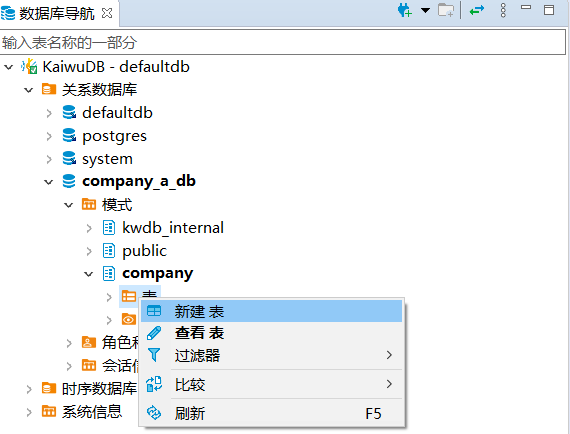

    系统将自动创建名为 `newtable` 的表，并打开对象窗口。

3. 在对象窗口，填写表名、描述信息、添加字段，然后单击**保存**。

   

4. 在**执行修改**窗口，确认 SQL 语句无误，然后单击**执行**。

### 编辑关系表

输入以下特殊数据类型时，需要进行特殊处理：

- JSONB 类型：需要在数值查看器中手动输入数据。

    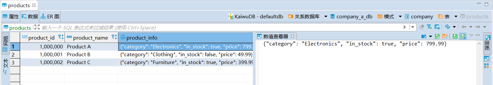

- BYTEA 类型：使用外部程序将二进制数据输入到数据库中，或者在数值查看器中手动输入数据。

- TIMESTAMP 类型：输入 TIMESTAMP 或 TIMESTAMPTZ 类型数据时，日期部分需要使用短横线（`-`）、双引号（`""`）或正斜杠符号（`/`）分割，时间部分需要使用冒号（`:`）分割，支持精确到微秒，例如：`'2023-01-25 10:10:10.123'`、`'2023 01 25 10:10:10.123'` 或 `'2023/01/25 10:10:10.123'`。

    

如需向关系表中写入数据或者修改表中数据，遵循以下步骤。

1. 在数据库导航区，右键单击需要修改的表，然后选择**编辑表**。

    

2. 在**属性**页签，编辑字段、约束、外键、索引或权限，然后单击**保存**。

3. 切换到**数据**页签，单击表格最下方的**添加新行**按钮，向表中加入相应的数据。

    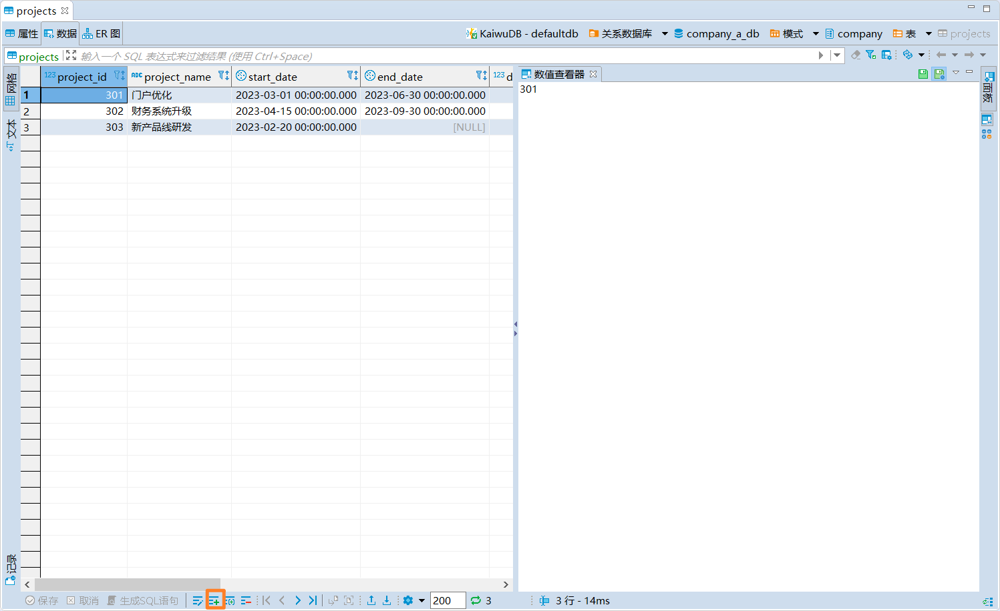

4. 如需修改已有数据，直接双击数据进行修改。
5. 如需查看相应的 SQL 语句，单击**生成 SQL 语句**，然后单击**执行**。
6. 如果无需查看 SQL 语句，单击**保存**。

### 查看关系表

在数据库导航区，双击要查看的表，即可查看时序表的属性、数据和 ER 图信息。

下表列出了属性、数据和 ER 图中的信息：

| 页面  | 信息                                                       |
| ----- | ---------------------------------------------------------- |
| 属性  | 表名、描述、字段、约束、外键、索引、权限和建表语句等信息。 |
| 数据  | 以网格和文本形式查看表内数据。                             |
| ER 图 | 以图形方式展示数据库实体、属性和关系之间的结构和链接。     |

### 截断关系表

如需截断关系表，遵循以下步骤。

1. 在数据库导航区，右键单击需要截断的表，然后选择**工具** > **截断**。
2. 在**截断表**窗口，选择是否**在单独的事务中运行**以及是否**级联**，然后单击**复制**或**确定**。

    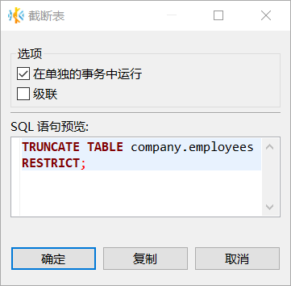

    系统将自动弹出**截断表**窗口，显示进度及是否完成截断。

    

::: warning 说明
完成截断后，双击已截断的表即可查看是否已清除数据。
:::

### 删除关系表

如需删除关系表，遵循以下步骤。

1. 在数据库导航区，右键单击需要删除的表，然后选择**删除**。
2. 在**删除对象**窗口，选择是否需要**级联删除**，然后单击**是**。

    

### 重命名关系表

::: warning 说明
新表名必须唯一，并且遵循[数据库标识符规则](../../sql-reference/sql-identifiers.md)。
:::

如需重命名关系表，遵循以下步骤。

1. 在数据库导航区，右键单击需要重命名的表，然后选择**重命名**。
2. 在**重命名**窗口，编辑表名称，然后单击**确定**。

    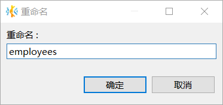

### 显示 ER 图

在数据库导航区，右键单击需要查看 ER 图的表，然后选择**显示 ER 图**。

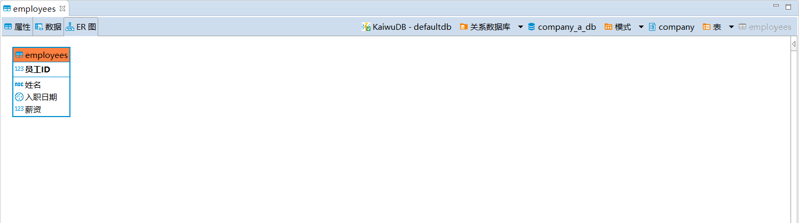

### 导出数据

如需导出关系表中的数据，遵循以下步骤。

1. 在数据库导航区，右键单击需要导出数据的表，然后选择**导出数据**。
2. 在**数据转化**窗口，选择数据传输目标的类型和格式，然后单击**下一步**。

    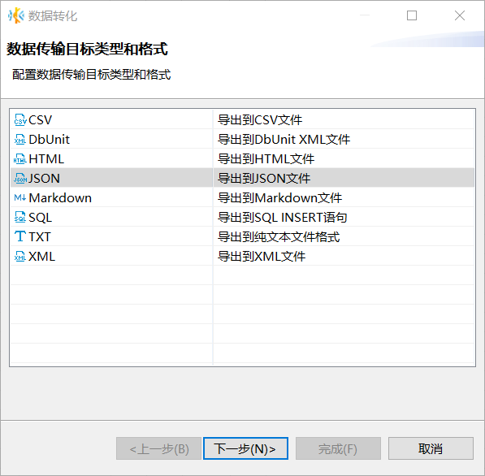

3. 设置提取、格式和导出选项，然后单击**下一步**。

    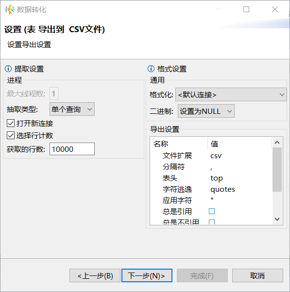

4. 设置导出输出参数，例如目录、文件名称、编码、是否压缩和分割等，然后单击**下一步**。

    

5. 检查导出设置，然后单击**完成**。成功导出数据后，系统将提示完成数据转换。

### 导入数据

如需向关系表中导入数据，遵循以下步骤。

1. 在数据库导航区，右键单击需要导入数据的表，然后选择**导入数据**。
2. 在**数据转化**窗口，选择数据传输源的类型和格式，然后单击**下一步**。

    

3. 在输入文件窗口，单击**源端名称**下的表，选择文件或文件所在目录，然后单击**下一步**。

    - 如需导入单个数据文件，选择需要导入的数据文件。
    - 如需导入多个文件，勾选**批量导入**，然后选择文件所在的目录。

    

4. 在**预览数据导入过程**窗口，设置 `rowid`, 确认预览数据，然后单击**下一步**。

    

5. 设置数据加载方式、执行过程和打开方式，然后单击**下一步**。

    

6. 检查导入设置，然后单击**完成**。成功导入数据后，系统将提示完成数据转换。

### 生成 SQL 语句

KaiwuDB 开发者中心支持为指定表生成以下 SQL 语句：

- SELECT
- INSERT
- UPDATE
- DELETE
- MERGE
- DDL

如需为关系表生成 SQL 语句，遵循以下步骤。

1. 在数据库导航区，右键单击需要生成 SQL 语句的表，选择**生成 SQL**，然后选择需要生成的 SQL 语句。

    

2. 在**生成 SQL 语句**窗口，选择是否**使用标准名称**和**紧凑型 SQL**，然后单击**复制**或**关闭**。

    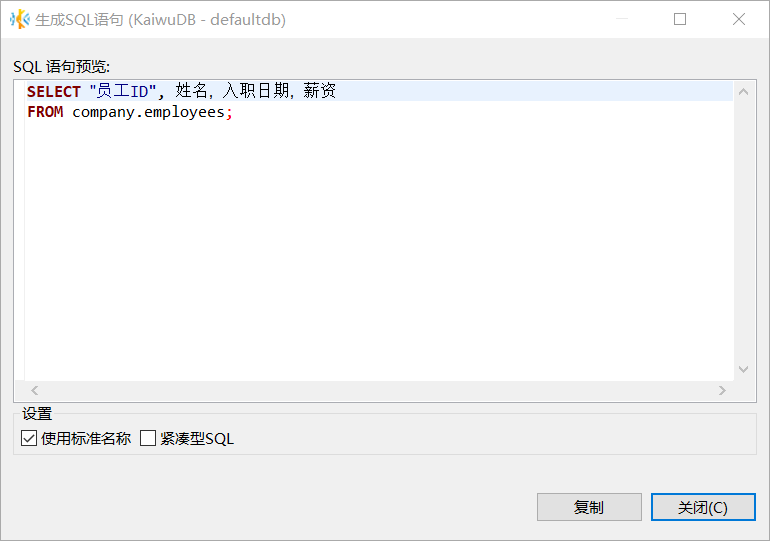

    默认情况下，使用标准名称，不使用紧凑型 SQL。

## 字段

字段页面以表格的形式展示字段名、列表序号、数据类型、长度、数组、字符集、非空、默认值和描述信息。

### 前提条件

- 需要添加、修改、删除、重命名字段的关系表不在读写过程中。
- 用户拥有 TABLE CREATE 或 ALL 权限。

### 创建字段

如需为关系表添加字段，遵循以下步骤。

1. 单击字段右下角的**新建字段**按钮，或者右键单击字段页面空白处，然后选择**新建字段**。

    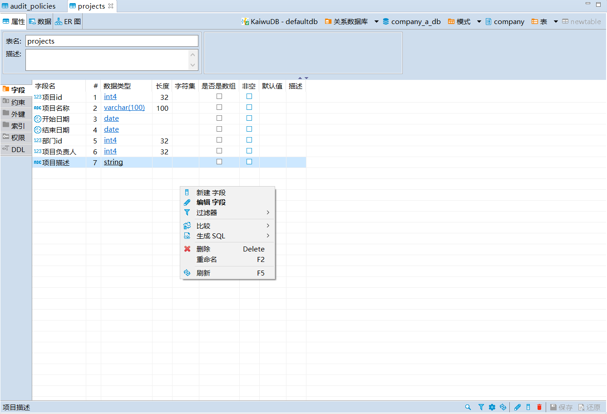

2. 在**编辑属性**窗口，编辑字段名称和属性，然后单击**确定**。

    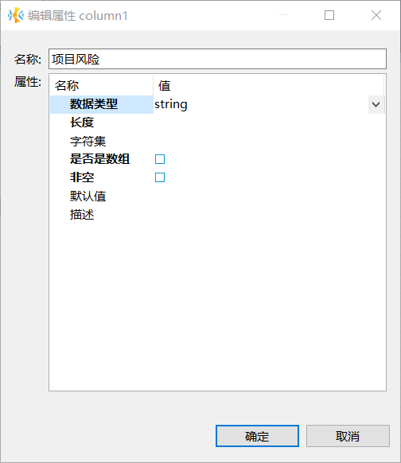

3. 单击页面右下方的保存按钮。
4. 在**执行修改**窗口，确认 SQL 语句无误，然后单击**执行**。

### 修改字段

如需修改关系表的字段，遵循以下步骤。

1. 双击需要编辑的字段信息，即可编辑字段。

    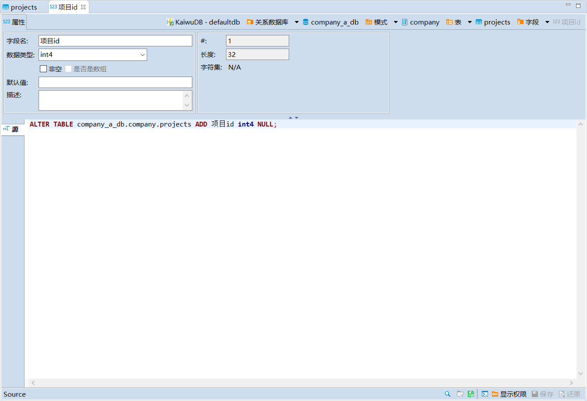

2. 单击页面右下方的保存按钮。
3. 在**执行修改**窗口，确认 SQL 语句无误，然后单击**执行**。

### 删除字段

如需删除关系表的字段，遵循以下步骤。

1. 右键单击需要删除的字段，然后选择**删除**。

    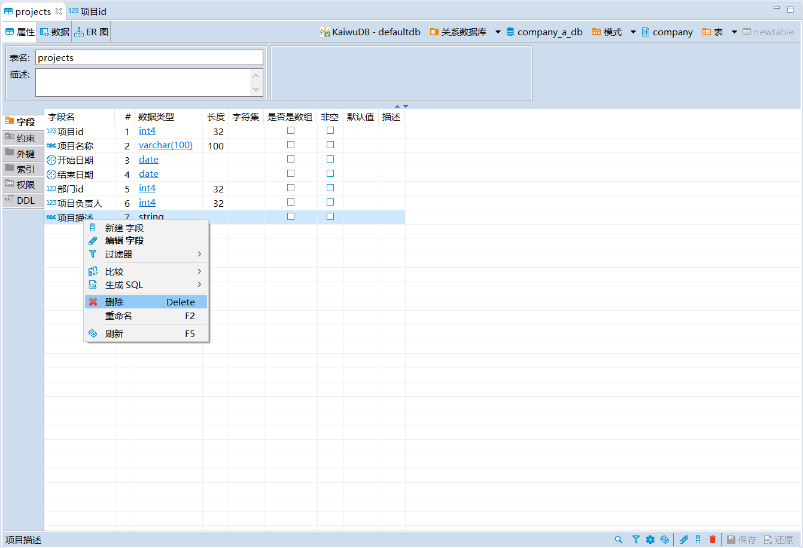

2. 单击页面右下方的保存按钮。
3. 在**执行修改**窗口，确认 SQL 语句无误，然后单击**执行**。

### 重命名字段

如需重命名关系表的字段，遵循以下步骤。

1. 右键单击需要重命名的字段，然后选择**重命名**。

    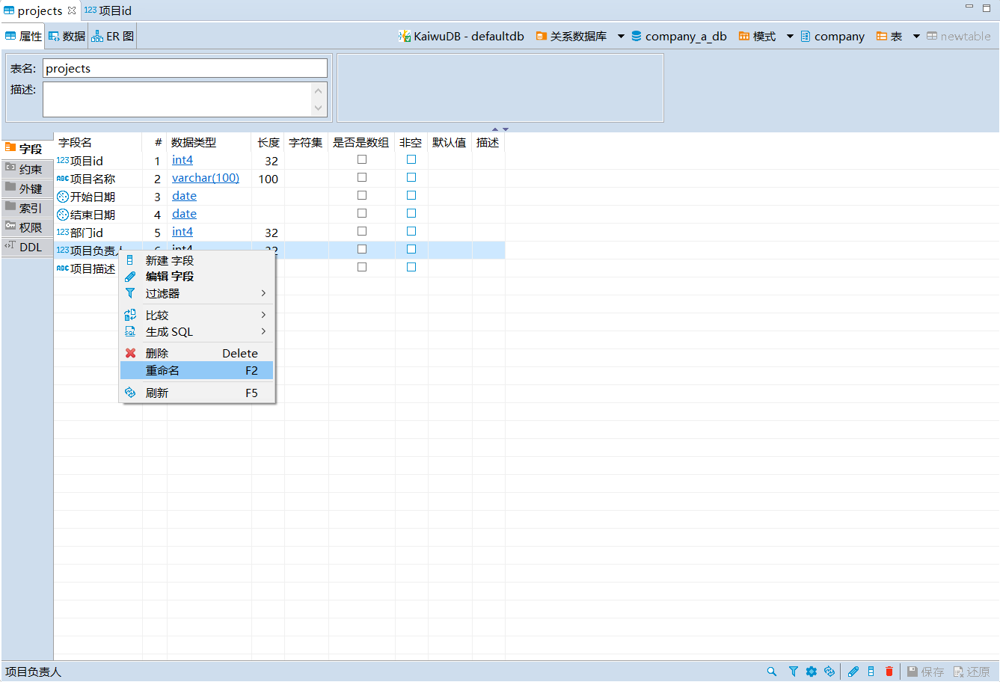

2. 在**重命名**窗口，编辑字段名称，然后单击**确定**。

    

3. 单击页面右下方的保存按钮。
4. 在**执行修改**窗口，确认 SQL 语句无误，然后单击**执行**。

### 生成 SQL 语句

如需为关系表的字段生成 SQL 语句，遵循以下步骤。

1. 右键单击字段，选择**生成 SQL** > **DDL**。

    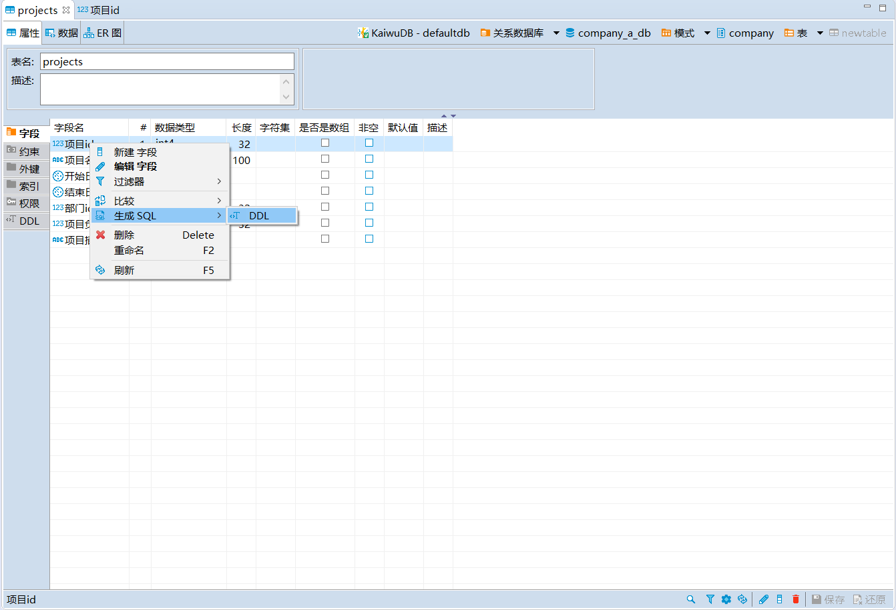

2. 在**生成 SQL 语句**窗口，选择是否**使用标准名称**和**紧凑型 SQL**，然后单击**复制**或**关闭**。

    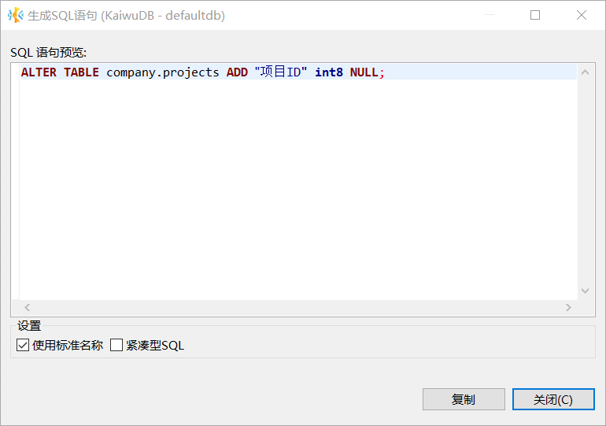

    默认情况下，使用标准名称，不使用紧凑型 SQL。

## 约束

约束页面以表格的形式展示约束名称、所有者、类型、表达式和是否禁用信息。KaiwuDB 开发者中心支持以下三种约束：

- 主键（PRIMARY KEY，或 PK）约束
- 唯一键（UNIQUE KEY，或 UK）约束
- 检查约束（CHECK）：用于约束表中某列或某些列中可接受的数值或者数据格式。单个列可以应用一个或多个检查约束。多个列也可以共用一个检查约束。删除指定表后，也同时删除该表的检查约束。

### 创建约束

如需为关系表创建约束，遵循以下步骤。

1. 单击**约束**页面右下方的**新建约束**按钮，或者在**约束**页面，右键单击**新建约束**。

    - 新建约束页面

      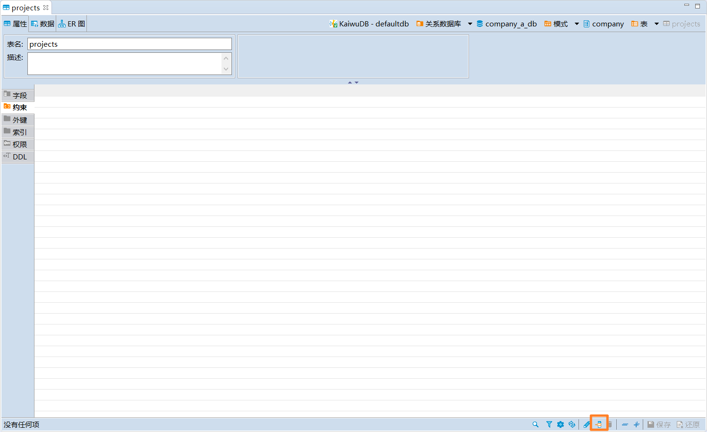

    - 右键菜单页面

      

2. 在**添加约束**窗口，设置约束名称，然后选择约束类型和字段。

    

3. 如果选择新建检查约束，需要添加相应的约束表达式。

    

4. 单击**确定**。
5. 单击页面右下方的保存按钮。
6. 在**执行修改**窗口，确认 SQL 语句无误后，然后单击**执行**。

### 编辑约束

KaiwuDB 开发者中心支持修改约束的名称。

如需修改关系表的约束，遵循以下步骤。

1. 双击需要编辑的约束。
2. 在**约束**页面，编辑约束名称。

    

3. 单击页面右下方的保存按钮。
4. 在**执行修改**页面检查 SQL 语句无误后，单击**执行**。

### 删除约束

如需删除关系表的约束，遵循以下步骤。

1. 右键单击需要删除的约束，然后选择**删除**。
2. 单击页面右下方的保存按钮。
3. 在**执行修改**窗口，确认 SQL 语句无误后，然后单击**执行**。

### 重命名约束

如需重命名关系表的约束，遵循以下步骤。

1. 右键单击需要重命名的约束，然后选择**重命名**。
2. 在**重命名**窗口，编辑约束名称，然后单击**确定**。

    

3. 单击页面右下方的保存按钮。
4. 在**执行修改**窗口，确认 SQL 语句无误，然后单击**执行**。

## 外键

外键（Foreign Key）是关系数据库的一种机制，可以引用其他关系模式的主键（Primary Key，PK）或唯一键（Unique Key，UK）。

### 前提条件

- 创建外键：已创建两张关系表，且两张表都设置了主键或唯一键。

### 创建外键

如需为关系表创建外键，遵循以下步骤。

1. 双击需要添加外键的表，打开对象窗口。
2. 切换到**外键**页签，右键单击页签空白处，然后选择**新建外键**。
3. 在**编辑外键**窗口，选择模式、参照表、唯一键，添加表字段，选择删除和更新外键时的动作，然后单击**确定**。外键页签将自动更新新建外键的信息。

    :::warning 说明
    选择的字段必须是主键、唯一键或者索引。
    :::

    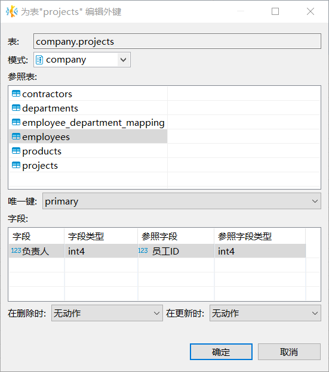

4. 单击页面右下方的保存按钮。
5. 在**执行修改**窗口，确认 SQL 语句无误，然后单击**执行**。

    系统将自动校验外键数据。如发现数据不匹配，系统报错，要求人工检查是否已修改数据。

    

### 校验数据

KaiwuDB 开发者中心保存外键时会自动校验外键数据，也支持对外键进行额外数据校验。

如需为关系表校验外键数据，遵循以下步骤。

1. 右键单击需要校验数据的外键，然后选择**校验数据**。
2. 单击页面右下方的保存按钮。
3. 在**执行修改**窗口，确认 SQL 语句无误，然后单击**执行**。

    

### 编辑外键

如需编辑关系表的外键，遵循以下步骤。

1. 双击需要编辑的外键，即可对外键进行重命名操作。

    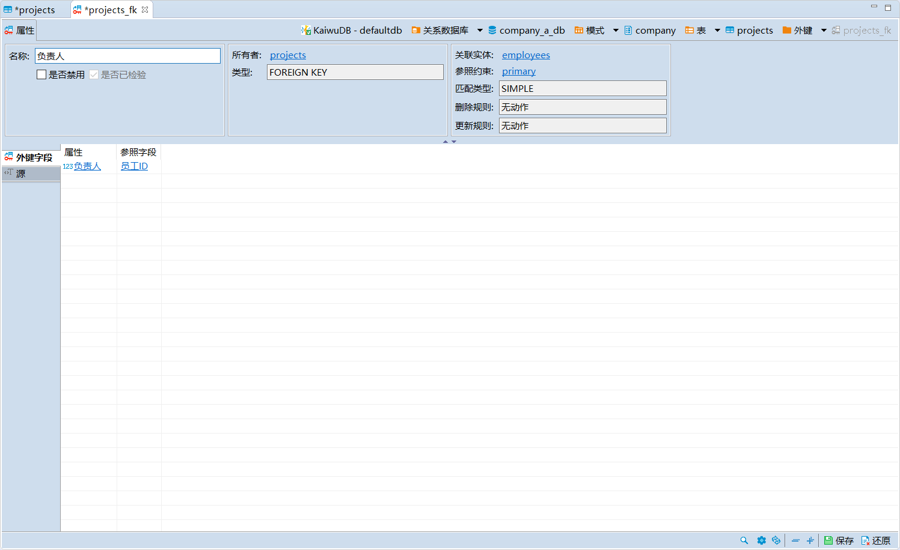

2. 单击页面右下方的保存按钮。
3. 在**执行修改**窗口，确认 SQL 语句无误，然后单击**执行**。

### 删除外键

如需删除关系表的外键，遵循以下步骤。

1. 右键单击需要删除的外键，然后选择**删除**。
2. 单击页面右下方的保存按钮。
3. 在**执行修改**窗口，确认 SQL 语句无误，然后单击**执行**。

### 重命名外键

如需重命名关系表的外键，遵循以下步骤。

1. 右键单击需要重命名的外键，然后选择**重命名**。
2. 在**重命名**窗口，编辑外键名称，然后单击**确定**。

    

3. 单击页面右下方的保存按钮。
4. 在**执行修改**窗口，确认 SQL 语句无误，然后单击**执行**。

### 生成 SQL 语句

如需为关系表的外键生成 SQL 语句，遵循以下步骤。

1. 右键单击指定外键，然后选择**生成 SQL** > **DDL**。
2. 在**生成 SQL 语句**窗口，选择是否**使用标准名称**和**紧凑型 SQL**，然后单击**复制**或**关闭**。

    

    默认情况下，使用标准名称，不使用紧凑型 SQL。

## 索引

索引页面显示已创建的主键和唯一键。

### 创建索引

如需为关系表创建索引，遵循以下步骤。

1. 双击需要添加索引的表，打开对象窗口。
2. 切换到**索引**页签，右键单击页签空白处，然后选择**新建索引**。
3. 在**编辑索引**窗口，选择是否为唯一索引和字段，然后单击**确定**。索引页签将自动更新索引信息。

    

4. 单击页面右下方的保存按钮。
5. 在**执行修改**窗口，确认 SQL 语句无误，然后单击**执行**。

### 编辑索引

如需编辑关系表的索引，遵循以下步骤。

1. 右键单击索引，然后选择**编辑索引**，或者双击需要编辑的索引，即可对索引进行重命名操作。
2. 单击页面右下方的保存按钮。
3. 在**执行修改**窗口，确认 SQL 语句无误，然后单击**执行**。

### 删除索引

如需删除关系表的索引，遵循以下步骤。

1. 右键单击需要删除的索引，然后选择**删除**。
2. 单击页面右下方的保存按钮。
3. 在**执行修改**窗口，确认 SQL 语句无误，然后单击**执行**。

### 重命名索引

如需重命名关系表的索引，遵循以下步骤。

1. 右键单击需要重命名的索引，然后选择**重命名**。
2. 在**重命名**窗口，编辑索引名称，然后单击**确定**。

    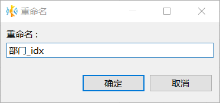

3. 单击页面右下方的保存按钮。
4. 在**执行修改**窗口，确认 SQL 语句无误，然后单击**执行**。

### 生成 SQL 语句

如需为关系表的索引生成 SQL 语句，遵循以下步骤。

1. 右键单击指定外键，选择选择**生成 SQL** > **DDL**。
2. 在**生成 SQL 语句**窗口，选择是否**使用标准名称**和**紧凑型 SQL**，然后单击**复制**或**关闭**

    

    默认情况下，使用标准名称，不使用紧凑型 SQL。

## 权限

权限管理用于赋予不同用户指定表的各项权限。

### 赋予权限

如需为用户赋予权限，遵循以下步骤。

1. 在指定表的对象窗口，单击**权限**页签，打开指定表的权限页面。

    

2. 选择需要授权的用户，勾选相应的权限。

    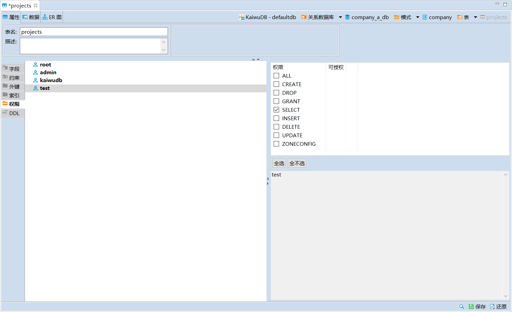

3. 单击页面右下方的保存按钮。
4. 在**执行修改**窗口，确认 SQL 语句无误后，单击**执行**

### 撤销权限

如需撤销用户的权限，遵循以下步骤。

1. 在指定表的对象窗口，单击**权限**页签，打开指定表的权限页面。
2. 选择需要撤销授权的用户，取消勾选相应的权限。

    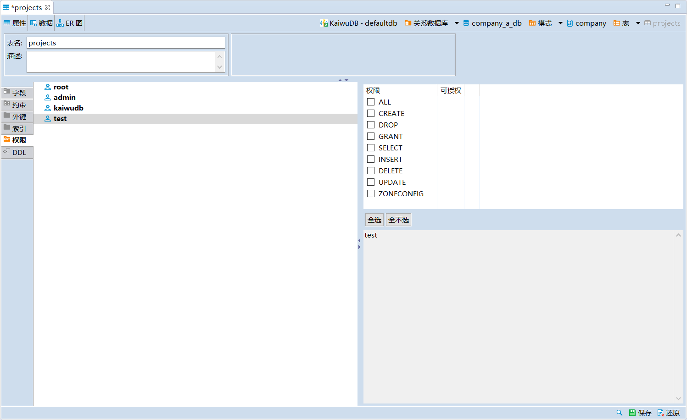

3. 单击页面右下方的保存按钮。
4. 在**执行修改**窗口，确认 SQL 语句无误，然后单击**执行**。

### 查看 DDL 语句

在指定表的对象窗口，单击 **DDL** 页签，即可查看相关 DDL 语句。

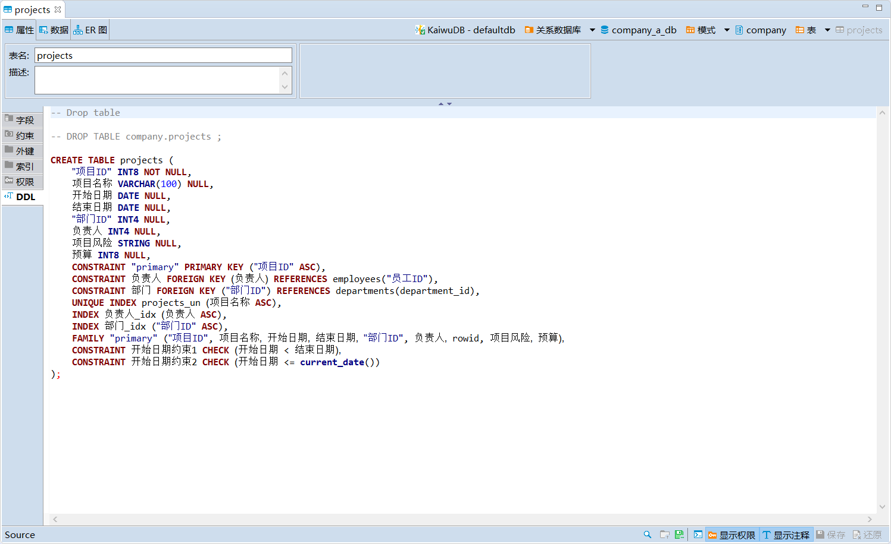
