# 关系表管理

KaiwuDB 开发者中心支持管理关系表以及表中的字段、约束、外键、索引、触发器、权限等元素。

## 关系表

### 创建关系表

#### 前提条件

用户是 `admin` 角色成员或者拥有所属数据库的 CREATE 权限。默认情况下，`root` 用户属于 `admin` 角色。

#### 步骤

如需创建关系表，遵循以下步骤。

1. 在数据库导航区，选择要操作的数据库和模式。

2. 右键单击**表**，然后选择**新建表**。

    

    系统将自动创建名为 `newtable` 的表，并打开对象窗口。

3. 在对象窗口，填写表名、描述信息、添加字段，根据需要设置非空等列属性，然后单击**保存**。

   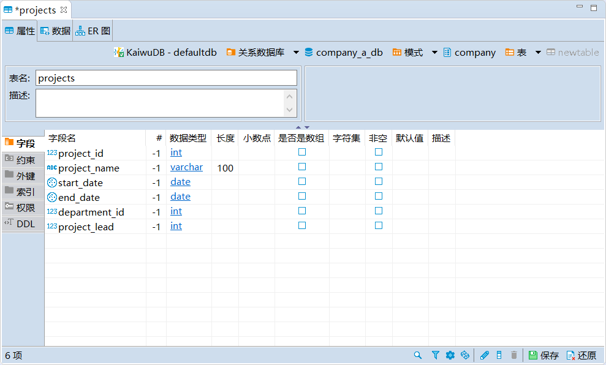

4. 在**执行修改**窗口，确认 SQL 语句无误，然后单击**执行**。

### 编辑关系表

#### 前提条件

- 编辑字段、约束、外键、索引、触发器：用户是 `admin` 角色成员或者拥有目标表的 CREATE 权限。默认情况下，`root` 用户属于 `admin` 角色。
- 写入数据：用户是 `admin` 角色成员或者拥有目标表的 INSERT 权限。默认情况下，`root` 用户属于 `admin` 角色。
- 更新数据：用户是 `admin` 角色成员或者拥有目标表的 UPDATE 和 SELECT 权限。默认情况下，`root` 用户属于 `admin` 角色。
- 删除数据：用户是 `admin` 角色成员或者拥有目标表的 SELECT 和 DELETE 权限。默认情况下，`root` 用户属于 `admin` 角色。

**说明：**

输入以下特殊数据类型时，需要进行特殊处理：

- `JSONB` 类型：需要在数值查看器中手动输入数据。

    

- `BYTEA` 类型：使用外部程序将二进制数据输入到数据库中，或者在数值查看器中手动输入数据。

- `BLOB` 和 `CLOB` 类型：支持在数据编辑器页面通过**从文件中载入**导入数据，或通过**保存至文件**导出数据。为保证数据库性能，建议单个文件大小不超过 64MB。

    

- `TIMESTAMP` 类型：输入 `TIMESTAMP` 或 `TIMESTAMPTZ` 类型数据时，日期部分需要使用短横线（`-`）、空格（` `）或正斜杠符号（`/`）分割，时间部分需要使用冒号（`:`）分割，支持精确到微秒，例如：`2023-01-25 10:10:10.123`、`2023 01 25 10:10:10.123` 或 `2023/01/25 10:10:10.123`。

    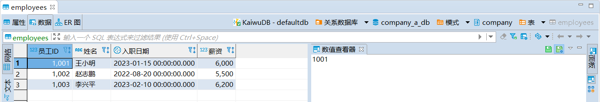

#### 步骤

如需向关系表中写入数据或者修改表中数据，遵循以下步骤。

1. 在数据库导航区，右键单击需要修改的表，然后选择**编辑表**。

2. 在**属性**页签，编辑字段、约束、外键、索引、触发器或权限，然后单击**保存**。

3. 切换到**数据**页签，单击表格最下方的**添加新行**按钮，向表中加入相应的数据。

    

4. 如需修改已有数据，直接双击数据进行修改。
5. 如需查看相应的 SQL 语句，单击**生成 SQL 语句**，然后单击**执行**。
6. 如果无需查看 SQL 语句，单击**保存**。

### 查看关系表

#### 前提条件

用户是 `admin` 角色成员或拥有目标表的 SELECT 权限。默认情况下，`root` 用户属于 `admin` 角色。

#### 步骤

在数据库导航区，双击要查看的表，即可查看时序表的属性、数据和 ER 图信息。

下表列出了属性、数据和 ER 图中的信息：

| 页面  | 信息                                                       |
| ----- | ---------------------------------------------------------- |
| 属性  | 表名、描述、字段、约束、外键、索引、触发器、权限和建表语句等信息。 |
| 数据  | 以网格和文本形式查看表内数据。                             |
| ER 图 | 以图形方式展示数据库实体、属性和关系之间的结构和链接。     |

::: warning 提示

- 如果表中包含大量数据行，可以通过工具栏查看数据的总行数，设置每页显示的行数（默认 100 行），并通过点击第一页、上一页、下一页和最后一页图标来分页查看。
- 设置每页显示行数后，需要点击第一页、上一页、下一页或最后一页图标，以查看生效后的分页效果。

:::

### 截断关系表

#### 前提条件

用户是 `admin` 角色成员或拥有所属数据库 CREATE 权限。默认情况下，`root` 用户属于 `admin` 角色。

#### 步骤

如需截断关系表，遵循以下步骤。

1. 在数据库导航区，右键单击需要截断的表，然后选择**工具** > **截断**。
2. 在**截断表**窗口，选择是否**在单独的事务中运行**以及是否**级联**，然后单击**复制**或**确定**。

    

    系统将自动弹出**截断表**窗口，显示进度及是否完成截断。

    

::: warning 说明
完成截断后，双击已截断的表即可查看是否已清除数据。
:::

### 删除关系表

#### 前提条件

用户是 `admin` 角色成员或拥有目标表 DROP 权限。默认情况下，`root` 用户属于 `admin` 角色。

#### 步骤

如需删除关系表，遵循以下步骤。

1. 在数据库导航区，右键单击需要删除的表，然后选择**删除**。
2. 在**删除对象**窗口，选择是否需要**级联删除**，然后单击**是**。

    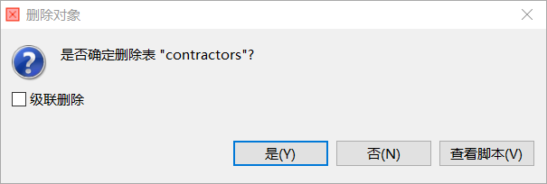

### 重命名关系表

#### 前提条件

- 用户是 `admin` 角色的成员或者拥有所属数据库的 CREATE 权限和原表的 DROP 权限。默认情况下，`root` 用户属于 `admin` 角色。
- 当表存在视图依赖时，系统不支持重命名表。

::: warning 说明
新表名必须唯一，并且遵循[数据库标识符规则](../../sql-reference/sql-identifiers.md)。
:::
#### 步骤

如需重命名关系表，遵循以下步骤。

1. 在数据库导航区，右键单击需要重命名的表，然后选择**重命名**。
2. 在**重命名**窗口，编辑表名称，然后单击**确定**。

    

### 显示 ER 图

在数据库导航区，右键单击需要查看 ER 图的表，然后选择**显示 ER 图**。

### 导出数据

#### 前提条件

用户是 `admin` 角色的成员。默认情况下，`root` 用户属于 `admin` 角色。

#### 步骤

如需导出关系表中的数据，遵循以下步骤。

1. 在数据库导航区，右键单击需要导出数据的表，然后选择**导出数据**。
2. 在**数据转化**窗口，根据需要设置目标类型和格式、提取行数、导出参数、导出目录等，确认设置后单击**确定**。系统将自动切换到转化进度界面，显示数据导出是否成功以及所用时长。
    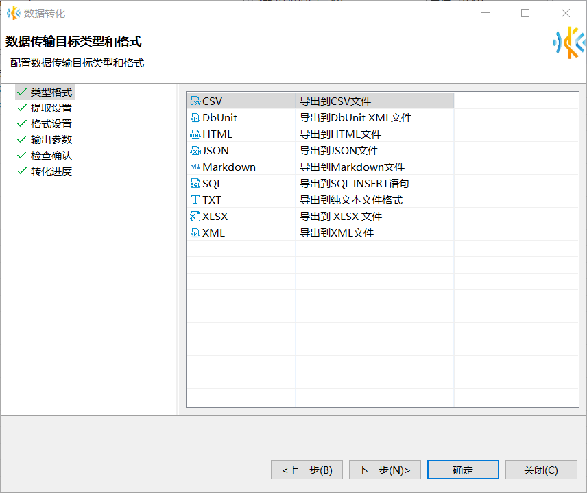

### 导入数据

#### 前提条件

用户是 `admin` 角色的成员或者拥有目标表 INSERT 权限。默认情况下，`root` 用户属于 `admin` 角色。

#### 步骤

如需向关系表中导入数据，遵循以下步骤。

1. 在数据库导航区，右键单击需要导入数据的表，然后选择**导入数据**。
2. 在**数据转化**窗口，选择从 CSV 文件导入，设置源端名称、根据需要完成导入设置，然后单击**下一步**。
      

3. 在**预览数据导入过程**界面，确认预览数据，然后单击**下一步**。

4. 在**数据加载设置**界面设置数据加载方式、执行过程和打开方式，然后单击**下一步**。

5. 在**检查确认**界面检查导入设置，然后单击**确定**。系统将自动切换到**转化进度**界面，显示数据导入是否成功以及所用时长。

### 生成 SQL 语句

KaiwuDB 开发者中心支持为指定表生成以下 SQL 语句：

- SELECT
- INSERT
- UPDATE
- DELETE
- MERGE
- DDL

如需为关系表生成 SQL 语句，遵循以下步骤。

1. 在数据库导航区，右键单击需要生成 SQL 语句的表，选择**生成 SQL**，然后选择需要生成的 SQL 语句。

2. 在**生成 SQL 语句**窗口，选择是否**使用标准名称**和**紧凑型 SQL**，然后单击**复制**或**关闭**。

    

    默认情况下，使用标准名称，不使用紧凑型 SQL。

## 字段

字段页面以表格的形式展示字段名、列表序号、数据类型、长度、数组、字符集、非空、默认值和描述信息。

### 前提条件

- 需要添加、修改、删除、重命名字段的关系表不在读写过程中。
- 用户是 `admin` 角色成员或拥有目标表的 CREATE 权限。默认情况下，`root` 用户属于 `admin` 角色。

### 创建字段

如需为关系表添加字段，遵循以下步骤。

1. 单击字段右下角的**新建字段**按钮，或者右键单击字段页面空白处，然后选择**新建字段**。

    

2. 在**编辑属性**窗口，编辑字段名称和属性，然后单击**确定**。

    

3. 单击页面右下方的保存按钮。
4. 在**执行修改**窗口，确认 SQL 语句无误，然后单击**执行**。

### 修改字段

如需修改关系表的字段，遵循以下步骤。

1. 双击需要编辑的字段信息，即可编辑字段。

    

2. 单击页面右下方的保存按钮。
3. 在**执行修改**窗口，确认 SQL 语句无误，然后单击**执行**。

### 删除字段

如需删除关系表的字段，遵循以下步骤。

1. 右键单击需要删除的字段，然后选择**删除**。

    

2. 单击页面右下方的保存按钮。
3. 在**执行修改**窗口，确认 SQL 语句无误，然后单击**执行**。

### 重命名字段

如需重命名关系表的字段，遵循以下步骤。

1. 右键单击需要重命名的字段，然后选择**重命名**。

    

2. 在**重命名**窗口，编辑字段名称，然后单击**确定**。

    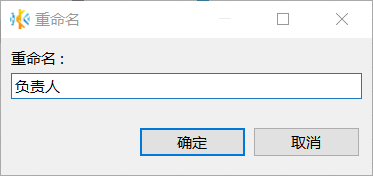

3. 单击页面右下方的保存按钮。
4. 在**执行修改**窗口，确认 SQL 语句无误，然后单击**执行**。

### 生成 SQL 语句

如需为关系表的字段生成 SQL 语句，遵循以下步骤。

1. 右键单击字段，选择**生成 SQL** > **DDL**。

    

2. 在**生成 SQL 语句**窗口，选择是否**使用标准名称**和**紧凑型 SQL**，然后单击**复制**或**关闭**。

    

    默认情况下，使用标准名称，不使用紧凑型 SQL。

## 约束

约束页面以表格的形式展示约束名称、所有者、类型、表达式和是否禁用信息。KaiwuDB 开发者中心支持以下三种约束：

- 主键（PRIMARY KEY，或 PK）约束
- 唯一键（UNIQUE KEY，或 UK）约束
- 检查约束（CHECK）：用于约束表中某列或某些列中可接受的数值或者数据格式。单个列可以应用一个或多个检查约束。多个列也可以共用一个检查约束。删除指定表后，也同时删除该表的检查约束。

### 前提条件

- 需要添加、修改、删除、重命名约束的关系表不在读写过程中。
- 用户是 `admin` 角色成员或拥有目标表的 CREATE 权限。默认情况下，`root` 用户属于 `admin` 角色。

### 创建约束

如需为关系表创建约束，遵循以下步骤。

1. 单击**约束**页面右下方的**新建约束**按钮，或者在**约束**页面，右键单击**新建约束**。

    - 新建约束页面

      

    - 右键菜单页面

      

2. 在**添加约束**窗口，设置约束名称，然后选择约束类型和字段。

    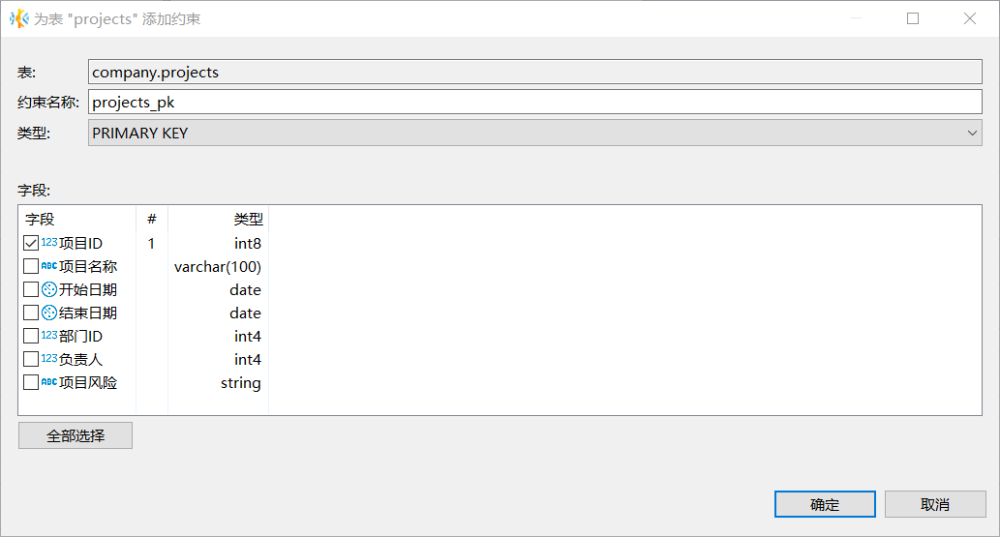

3. 如果选择新建检查约束，需要添加相应的约束表达式。

    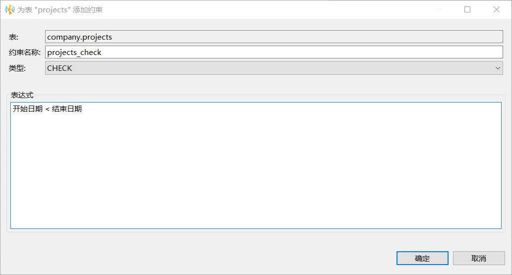

4. 单击**确定**。
5. 单击页面右下方的保存按钮。
6. 在**执行修改**窗口，确认 SQL 语句无误后，然后单击**执行**。

### 编辑约束

KaiwuDB 开发者中心支持修改约束的名称。

如需修改关系表的约束，遵循以下步骤。

1. 双击需要编辑的约束。
2. 在**约束**页面，编辑约束名称。

    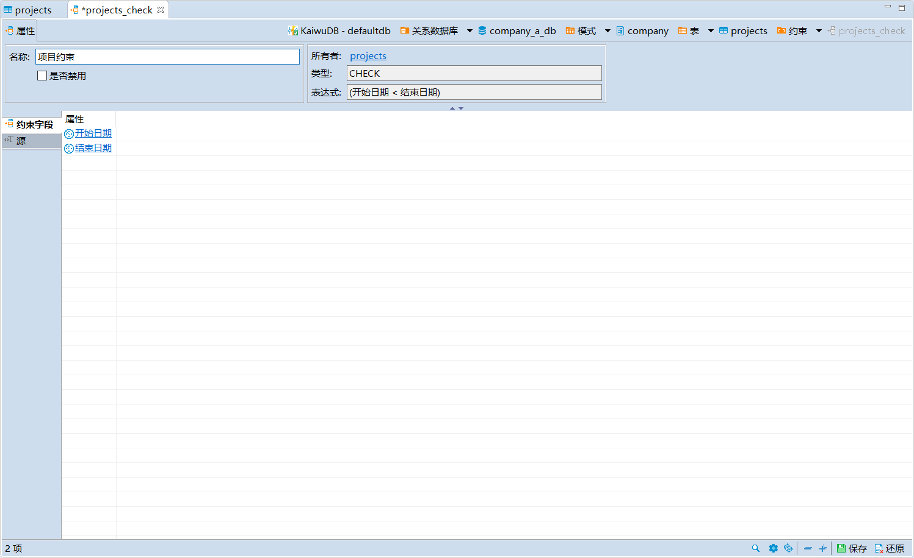

3. 单击页面右下方的保存按钮。
4. 在**执行修改**页面检查 SQL 语句无误后，单击**执行**。

### 删除约束

如需删除关系表的约束，遵循以下步骤。

1. 右键单击需要删除的约束，然后选择**删除**。
2. 单击页面右下方的保存按钮。
3. 在**执行修改**窗口，确认 SQL 语句无误后，然后单击**执行**。

### 重命名约束

如需重命名关系表的约束，遵循以下步骤。

1. 右键单击需要重命名的约束，然后选择**重命名**。
2. 在**重命名**窗口，编辑约束名称，然后单击**确定**。

    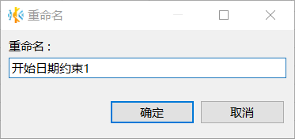

3. 单击页面右下方的保存按钮。
4. 在**执行修改**窗口，确认 SQL 语句无误，然后单击**执行**。

## 外键

外键（Foreign Key）是关系数据库的一种机制，可以引用其他关系模式的主键（Primary Key，PK）或唯一键（Unique Key，UK）。

### 前提条件

- 创建外键：已创建两张关系表，且两张表都设置了主键或唯一键。
- 用户是 `admin` 角色成员或拥有目标表的 CREATE 权限。默认情况下，`root` 用户属于 `admin` 角色。

### 创建外键

如需为关系表创建外键，遵循以下步骤。

1. 双击需要添加外键的表，打开对象窗口。
2. 切换到**外键**页签，右键单击页签空白处，然后选择**新建外键**。
3. 在**编辑外键**窗口，选择模式、参照表、唯一键，添加表字段，选择删除和更新外键时的动作，然后单击**确定**。外键页签将自动更新新建外键的信息。

    :::warning 说明
    选择的字段必须是主键、唯一键或者索引。
    :::

    

4. 单击页面右下方的保存按钮。
5. 在**执行修改**窗口，确认 SQL 语句无误，然后单击**执行**。

    系统将自动校验外键数据。如发现数据不匹配，系统报错，要求人工检查是否已修改数据。

    

### 校验数据

KaiwuDB 开发者中心保存外键时会自动校验外键数据，也支持对外键进行额外数据校验。

如需为关系表校验外键数据，遵循以下步骤。

1. 右键单击需要校验数据的外键，然后选择**校验数据**。
2. 单击页面右下方的保存按钮。
3. 在**执行修改**窗口，确认 SQL 语句无误，然后单击**执行**。

    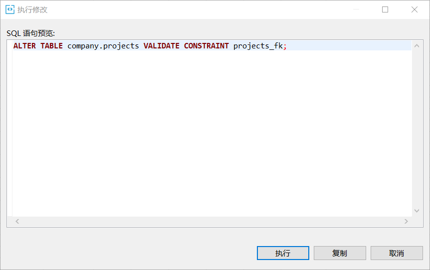

### 编辑外键

如需编辑关系表的外键，遵循以下步骤。

1. 双击需要编辑的外键，即可对外键进行重命名操作。

    

2. 单击页面右下方的保存按钮。
3. 在**执行修改**窗口，确认 SQL 语句无误，然后单击**执行**。

### 删除外键

如需删除关系表的外键，遵循以下步骤。

1. 右键单击需要删除的外键，然后选择**删除**。
2. 单击页面右下方的保存按钮。
3. 在**执行修改**窗口，确认 SQL 语句无误，然后单击**执行**。

### 重命名外键

如需重命名关系表的外键，遵循以下步骤。

1. 右键单击需要重命名的外键，然后选择**重命名**。
2. 在**重命名**窗口，编辑外键名称，然后单击**确定**。

    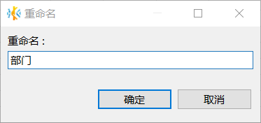

3. 单击页面右下方的保存按钮。
4. 在**执行修改**窗口，确认 SQL 语句无误，然后单击**执行**。

### 生成 SQL 语句

如需为关系表的外键生成 SQL 语句，遵循以下步骤。

1. 右键单击指定外键，然后选择**生成 SQL** > **DDL**。
2. 在**生成 SQL 语句**窗口，选择是否**使用标准名称**和**紧凑型 SQL**，然后单击**复制**或**关闭**。

    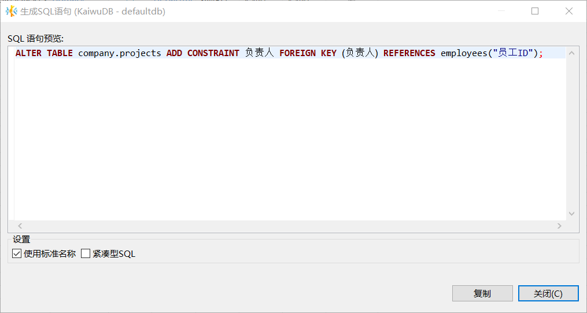

    默认情况下，使用标准名称，不使用紧凑型 SQL。

## 索引

索引页面显示已创建的主键和唯一键。

### 前提条件

- 需要添加、修改、删除、重命名索引的关系表不在读写过程中。
- 用户是 `admin` 角色成员或拥有目标表的 CREATE 权限。默认情况下，`root` 用户属于 `admin` 角色。

### 创建索引

如需为关系表创建索引，遵循以下步骤。

1. 双击需要添加索引的表，打开对象窗口。
2. 切换到**索引**页签，右键单击页签空白处，然后选择**新建索引**。
3. 在**编辑索引**窗口，选择是否为唯一索引和字段，然后单击**确定**。索引页签将自动更新索引信息。

    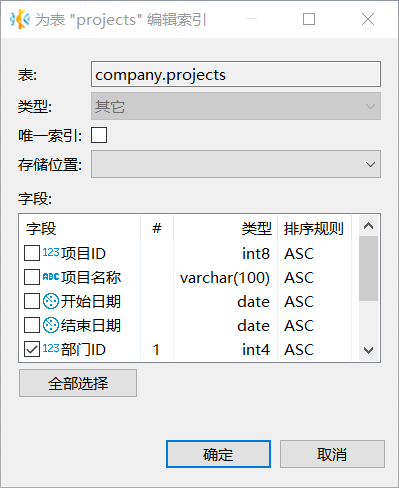

4. 单击页面右下方的保存按钮。
5. 在**执行修改**窗口，确认 SQL 语句无误，然后单击**执行**。

### 编辑索引

如需编辑关系表的索引，遵循以下步骤。

1. 右键单击索引，然后选择**编辑索引**，或者双击需要编辑的索引，即可对索引进行重命名操作。
2. 单击页面右下方的保存按钮。
3. 在**执行修改**窗口，确认 SQL 语句无误，然后单击**执行**。

### 删除索引

如需删除关系表的索引，遵循以下步骤。

1. 右键单击需要删除的索引，然后选择**删除**。
2. 单击页面右下方的保存按钮。
3. 在**执行修改**窗口，确认 SQL 语句无误，然后单击**执行**。

### 重命名索引

如需重命名关系表的索引，遵循以下步骤。

1. 右键单击需要重命名的索引，然后选择**重命名**。
2. 在**重命名**窗口，编辑索引名称，然后单击**确定**。

    

3. 单击页面右下方的保存按钮。
4. 在**执行修改**窗口，确认 SQL 语句无误，然后单击**执行**。

### 生成 SQL 语句

如需为关系表的索引生成 SQL 语句，遵循以下步骤。

1. 右键单击指定外键，选择选择**生成 SQL** > **DDL**。
2. 在**生成 SQL 语句**窗口，选择是否**使用标准名称**和**紧凑型 SQL**，然后单击**复制**或**关闭**

    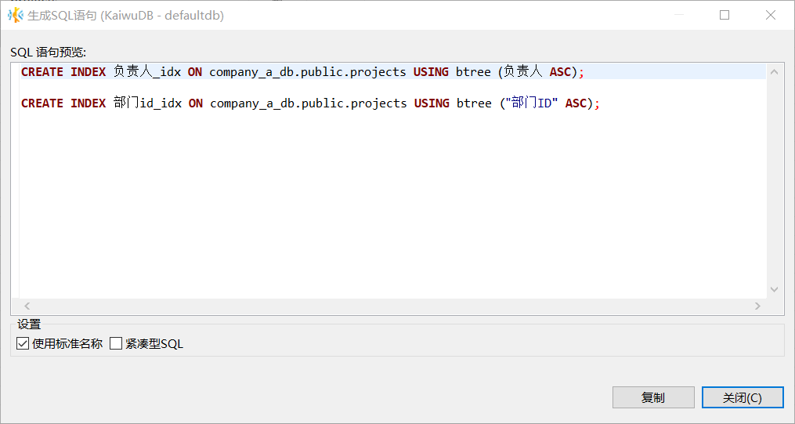

    默认情况下，使用标准名称，不使用紧凑型 SQL。

## 触发器

触发器用于在数据层实现自动化、可靠且低耦合的业务逻辑处理，同时保障数据的完整性与一致性。

### 前提条件

- 创建触发器：用户是 `admin` 角色的成员或者拥有触发器关联表的 CREATE 权限和触发器主体中相关 SQL 操作的权限。默认情况下，`root` 用户属于 `admin` 角色。
- 删除触发器：用户是 `admin` 角色的成员或者拥有触发器关联表的 DROP 权限。默认情况下，`root` 用户属于 `admin` 角色。
- 重命名触发器：用户是 `admin` 角色的成员或者拥有触发器关联表的 DROP 权限。默认情况下，`root` 用户属于 `admin` 角色。

### 创建触发器

如需为关系表创建触发器，遵循以下步骤。

1. 双击需要添加触发器的表，打开对象窗口。
2. 切换到**触发器**页签，右键单击页签空白处，然后选择**新建触发器**。
3. 在**创建新的触发器**窗口，填写触发器名称(仅支持数字和小写字母)、时间、事件、SQL 语句等信息，注意使用`$$`分隔符封装语句，然后点击**确定**。

    

4. 单击页面右下方的保存按钮。
5. 在**执行修改**窗口，确认 SQL 语句无误，然后单击**执行**。

### 删除触发器

如需删除关系表的触发器，遵循以下步骤。

- 在触发器页签删除

    1. 右键单击需要删除的触发器，然后选择**删除**。

        

    2. 单击页面右下方的保存按钮。
    3. 在**执行修改**窗口，确认 SQL 语句无误，然后单击**执行**。

- 在导航栏删除

    1. 右键单击需要删除的触发器，然后选择**删除**。

        

    2. 在删除对象窗口，单击**是**。

### 重命名触发器

如需重命名关系表的触发器，遵循以下步骤：

- 在触发器页签重命名

    1. 右键单击需要重命名的触发器，然后选择**重命名**。

        

    2. 在**重命名**窗口，编辑触发器名称(仅支持数字和小写字母)，然后单击**确定**。
    3. 单击页面右下方的保存按钮。
    4. 在**执行修改**窗口，确认 SQL 语句无误，然后单击**执行**。

- 在导航栏重命名

    1. 右键单击需要重命名的触发器，然后选择**重命名**。

        

    2. 在重命名对象窗口，单击**确定**。

## 权限

权限管理用于赋予不同用户指定表的各项权限。

### 前提条件

用户是 `admin` 角色的成员或者拥有目标表 GRANT 和相应的权限。默认情况下，`root` 用户属于 `admin` 角色。

### 赋予权限

如需为用户赋予权限，遵循以下步骤。

1. 在指定表的对象窗口，单击**权限**页签，打开指定表的权限页面。

    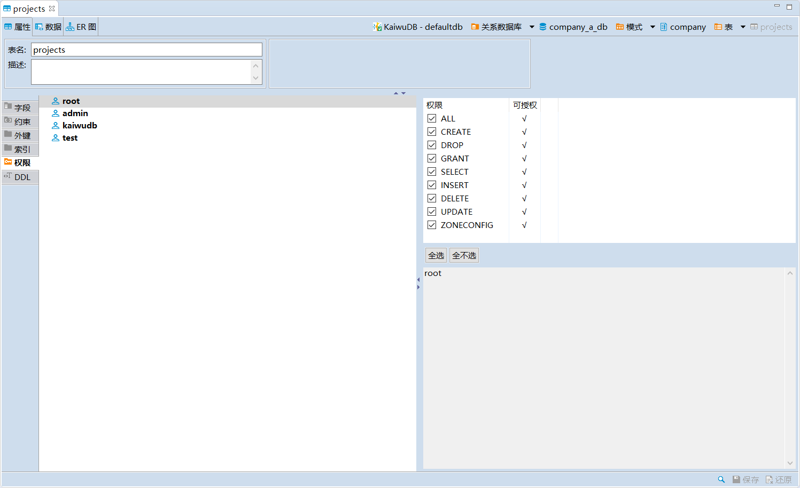

2. 选择需要授权的用户，勾选相应的权限。

    

3. 单击页面右下方的保存按钮。
4. 在**执行修改**窗口，确认 SQL 语句无误后，单击**执行**

### 撤销权限

如需撤销用户的权限，遵循以下步骤。

1. 在指定表的对象窗口，单击**权限**页签，打开指定表的权限页面。
2. 选择需要撤销授权的用户，取消勾选相应的权限。

    

3. 单击页面右下方的保存按钮。
4. 在**执行修改**窗口，确认 SQL 语句无误，然后单击**执行**。

## 查看 DDL 语句

在指定表的对象窗口，单击 **DDL** 页签，即可查看相关 DDL 语句。

