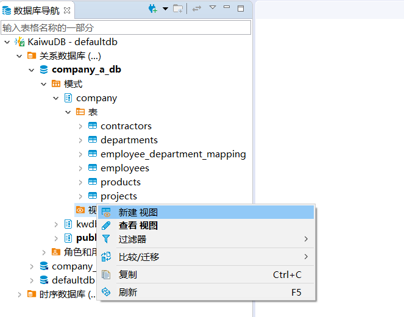
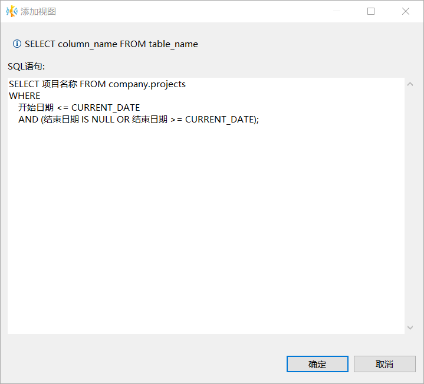
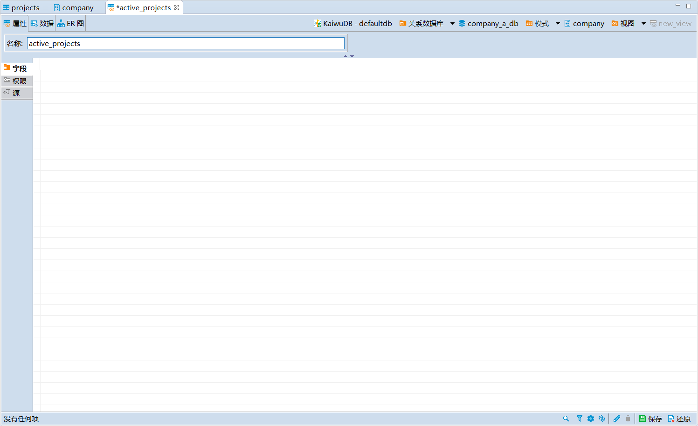
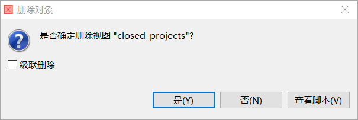
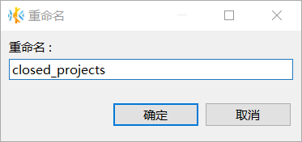
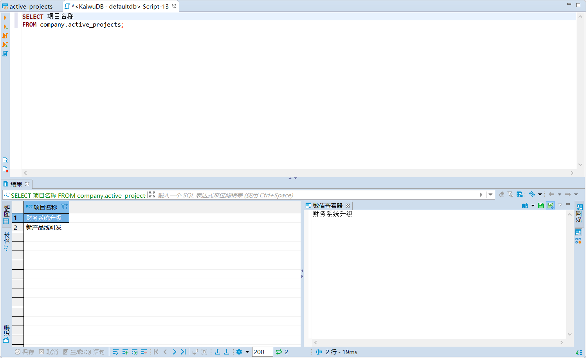
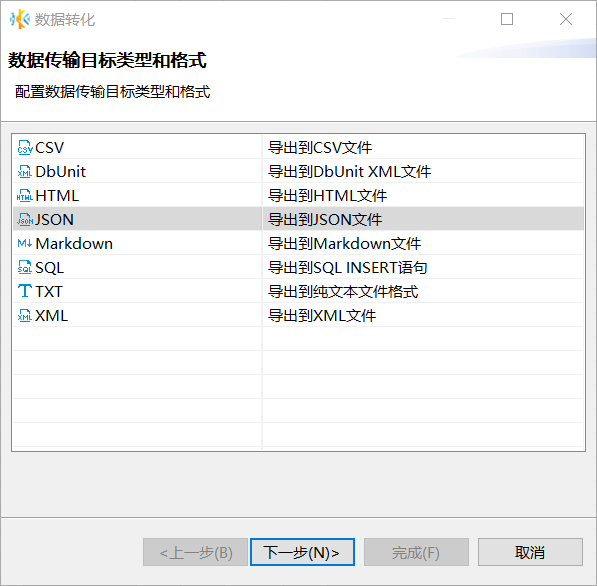
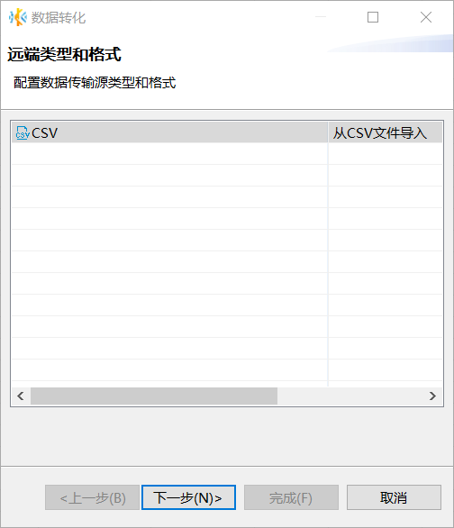
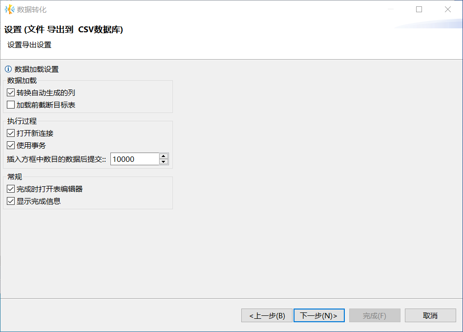
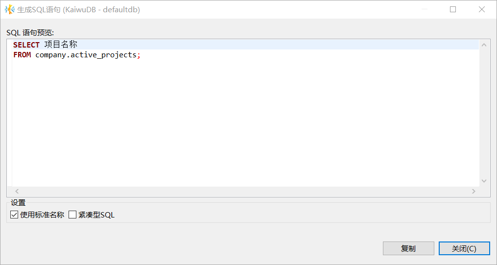

# 视图管理

KaiwuDB 开发者中心支持创建、编辑、删除、重命名视图，向视图中写入数据或从视图中读取数据、查看视图的 ER 图，在 SQL 控制台中读数据，以及为视图生成 SQL 语句。

## 创建视图

如需为关系表创建视图，遵循以下步骤。

1. 在数据库导航区，右键单击指定数据库模式下的视图，然后选择**新建视图**。

    

2. 在**添加视图**对话框，写入想要查询的 SQL 语句，然后单击**确定**。

    

3. 在新视图的**属性**页签，修改视图名称，然后单击页面右下方的保存按钮。

    

4. 在**执行修改**窗口，确认 SQL 语句无误，然后单击**执行**。

## 编辑视图

如需编辑关系表的视图，遵循以下步骤。

1. 在数据库导航区，右键单击需要编辑的视图，然后选择**编辑数据**。
2. 在**属性**页面，修改视图名称。
3. 单击页面右下方的保存按钮。

## 删除视图

如需删除关系表的视图，遵循以下步骤。

1. 在数据库导航区，右键单击需要删除的视图，然后选择**删除**。
2. 在**删除对象**窗口，单击**是**。

    

## 重命名视图

如需重命名关系表的视图，遵循以下步骤。

1. 在数据库导航区，右键单击需要重命名的视图，然后选择**重命名**。
2. 在**重命名**窗口，编辑视图名称，然后单击**确定**。

    

3. 单击页面右下方的保存按钮。
4. 在**执行修改**窗口，确认 SQL 语句无误，然后单击**执行**。

## 在 SQL 控制台中读数据

在数据库导航区，右键单击需要在 SQL 控制台中读数据的视图，然后选择**在 SQL 控制台中读数据**，即可在 SQL 编辑器、结果窗口和数值查看器窗口查看相应的 SQL 语句、表数据和数值。

## 显示 ER 图

在数据库导航区，右键单击需要查看 ER 图的视图，然后选择**显示 ER 图**。

## 导出数据

### 前提条件

- 用户为 Admin 用户或者 Admin 角色成员。
- 用户拥有目标表的 TABLE SELECT 权限。

### 步骤

如需导出关系表视图中的数据，遵循以下步骤。

1. 在数据库导航区，右键单击需要导出数据的视图，然后选择**导出数据**。
2. 在**数据转化**窗口，选择数据传输的目标类型和格式，然后单击**下一步**。

    

3. 设置提取、格式和导出选项，然后单击**下一步**。

    

4. 设置导出输出参数，例如目录、文件名称、编码、是否压缩和分割等，然后单击**下一步**。

    

5. 检查导出设置，然后单击**完成**。成功导出数据后，系统将提示完成数据转换。

## 导入数据

### 前提条件

- 用户为 Admin 用户或者 Admin 角色成员。
- 用户拥有目标表的 TABLE INSERT 权限。

### 步骤

如需向关系表视图中导入数据，遵循以下步骤。

1. 在数据库导航区，右键单击需要导入数据的视图，然后选择**导入数据**。
2. 在**数据转化**窗口，选择数据传输源的类型和格式，单击**下一步**。

    

3. 在输入文件窗口，单击**源端名称**下的表，选择文件或文件所在目录，然后单击**下一步**。

    - 如需导入单个数据文件，选择需要导入的数据文件。

    - 如需导入多个文件，勾选**批量导入**，然后选择文件所在目录。

    

4. 在**预览数据导入过程**窗口，确认预览数据，然后单击**下一步**。

5. 设置数据加载方式、执行过程和打开方式，然后单击**下一步**。

    

6. 检查导入设置，然后单击**完成**。成功导入数据后，系统将提示完成数据转换。

## 生成 SQL 语句

如需为关系表视图生成 SQL 语句，遵循以下步骤。

1. 在数据库导航区，右键单击需要生成 SQL 语句的视图，选择**生成 SQL**，然后选择需要生成的 SQL 语句。
2. 在**生成 SQL 语句**窗口，选择是否**使用标准名称**和**紧凑型 SQL**，然后单击**复制**或**关闭**。

    

    默认情况下，使用标准名称，不使用紧凑型 SQL。
