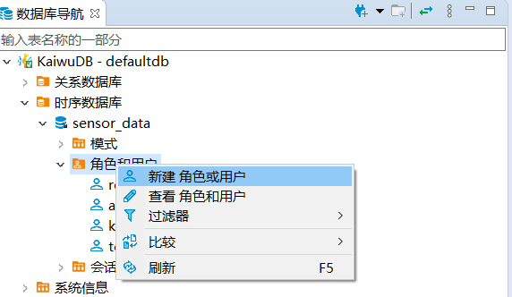
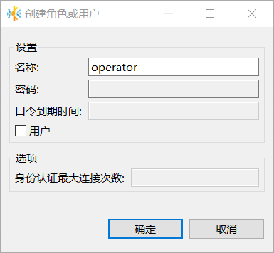
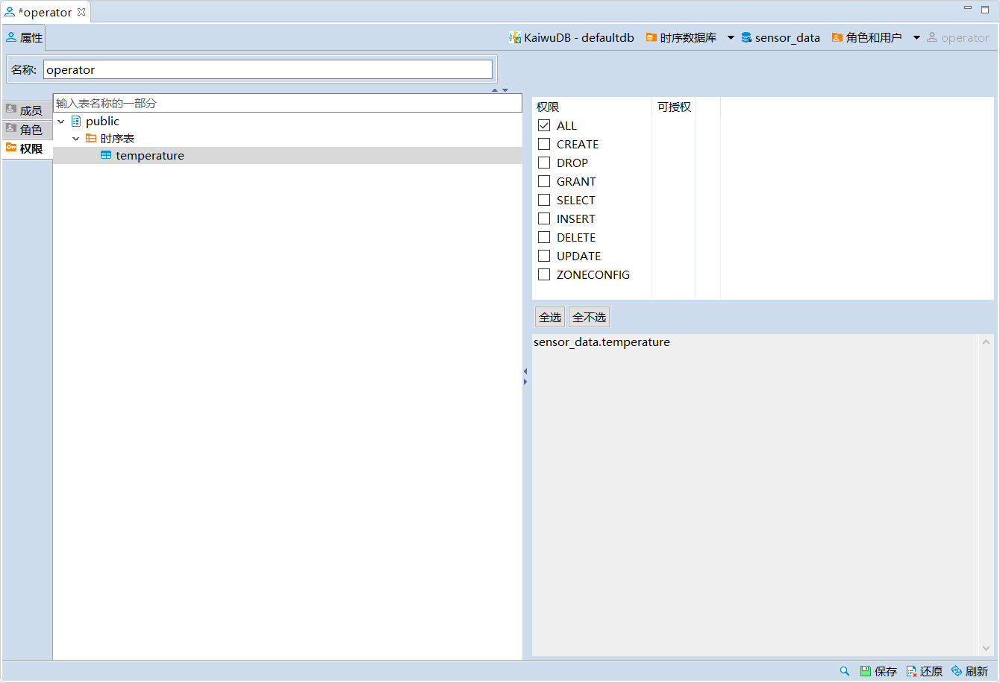
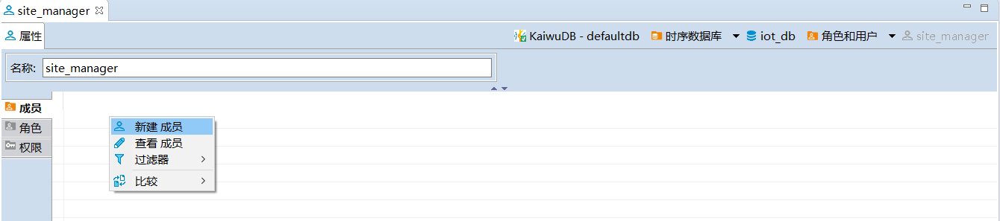
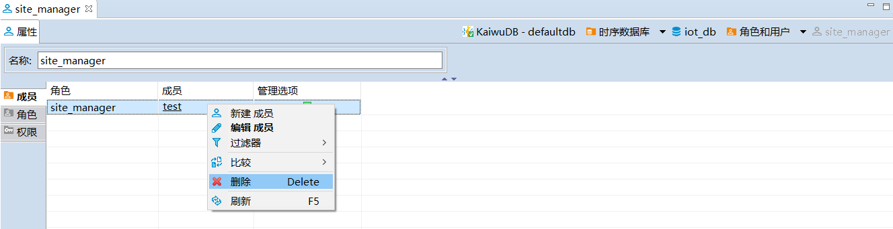
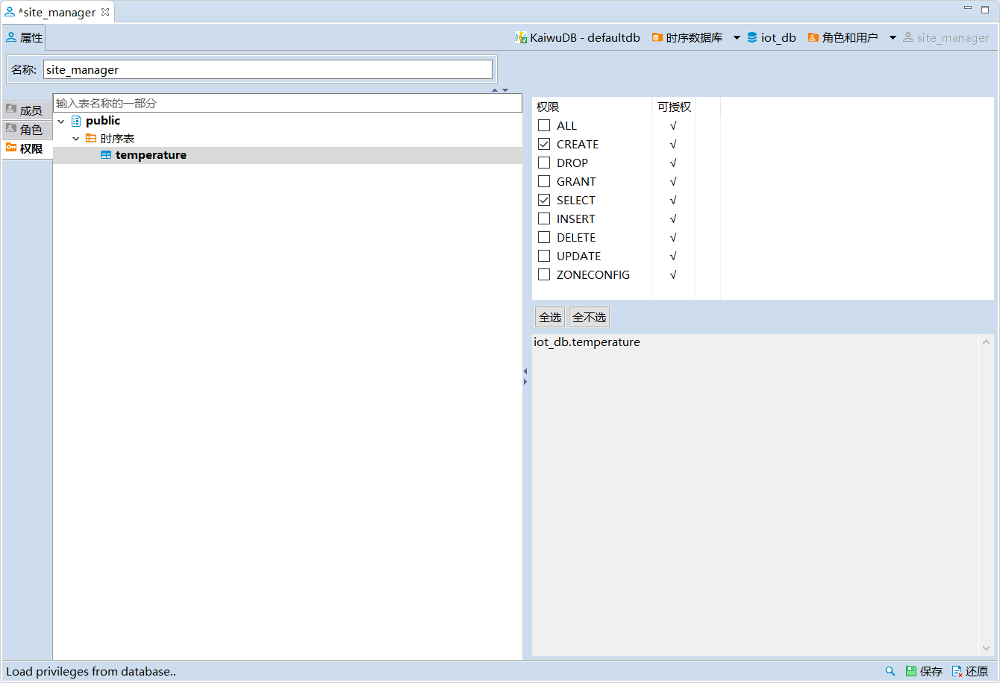

# 角色与用户管理

KaiwuDB 开发者中心支持创建、删除角色或用户，为角色或用户添加成员、删除成员、赋予权限、撤销权限等操作。

## 创建角色或用户

### 前提条件

用户具备创建角色（CREATEROLE）的权限或者是 admin 角色的成员。默认情况下，root 用户属于 admin 角色。

### 步骤

如需创建角色或用户，遵循以下步骤。

1. 在数据库导航区，右键单击**角色与用户**，然后选择**新建角色或用户**。

    

2. 在**创建角色或用户**窗口，设置名称，选择是否勾选用户。如果不勾选，创建角色，勾选后，创建用户。

    ::: warning 提示
    KWDB 目前暂不支持设置口令到期时间和身份认证最大连接次数。
    :::

     

3. 在系统自动弹出的用户属性页面，点击右下方的保存按钮。
4. 根据需要为用户或角色勾选相应的权限，然后单击页面右下方的保存按钮

    
5. 在**执行修改**窗口，确认 SQL 语句无误，然后单击**执行**。

## 删除角色或用户

### 前提条件

已经撤销待删除角色或用户的权限。

### 步骤

如需删除角色或用户，遵循以下步骤。

1. 在数据库导航区，右键单击需要删除的角色或用户，然后单击**删除**。
2. 在**删除对象**窗口，单击**是**。

    

## 为角色或用户添加成员

### 前提条件

用户是角色的管理员或者 `admin` 角色的成员。如需为 `admin` 角色添加成员，用户必须是具有 `WITH ADMIN OPTION` 权限的 `admin` 角色。默认情况下，`root` 用户属于 `admin` 角色。

### 步骤

KaiwuDB 开发者中心支持为角色或用户添加成员。角色或用户的所有权限都被其成员继承。

如需为用户或角色添加成员，遵循以下步骤。

1. 在数据库导航区，双击需要添加成员的角色或用户。
2. 在**成员**页面，右键单击需要添加成员的角色或用户，然后选择**新建成员**。

    

3. 从下拉菜单中选择需要添加的角色或用户。
4. 选择是否授予管理员权限，获得管理员权限的成员可以授予或撤销指定角色的成员资格。
5. 单击页面右下方的保存按钮。
6. 在**执行修改**窗口，确认 SQL 语句无误，然后单击**执行**。

## 为角色或用户删除成员

### 前提条件

用户是角色的管理员或者 `admin` 角色的成员。如需删除 `admin` 角色的成员，用户必须是具有 `WITH ADMIN OPTION` 权限的 `admin` 角色。默认情况下，`root` 用户属于 `admin` 角色。

### 步骤

如需为用户或角色删除成员，遵循以下步骤。

1. 在数据库导航区，双击需要删除成员的角色或用户。
2. 在**成员**页面，右键单击需要删除的成员，然后选择**删除**。

    

3. 单击页面右下方的保存按钮。
4. 在**执行修改**窗口，确认 SQL 语句无误，然后单击**执行**。

## 为角色或用户授权

### 前提条件

授予权限的用户在目标数据库、表或模式（只适用于关系数据自定义模式）上具备 `GRANT` 权限和被授予的权限。例如，向其他用户授予目标表的 `SELECT` 权限的用户必须具备目标表的 `GRANT` 和 `SELECT` 权限。

### 步骤

如需为用户或角色授权，遵循以下步骤。

1. 在数据库导航区，双击需要授权的角色或用户。

2. 在**权限**页签，选择要授权给角色或用户的模式、表或视图。

   

3. 勾选相关权限，然后单击页面右下方的保存按钮。
4. 在**执行修改**窗口，确认 SQL 语句无误，然后单击**执行**。

## 撤销角色或用户的权限

### 前提条件

撤销其他用户的权限的用户具备目标数据库、表或模式（只适用于关系数据自定义模式）的 `GRANT` 权限和被撤销的权限。例如，撤销其他用户目标表的 SELECT 权限的用户必须具备目标表的 GRANT 和 SELECT 权限。

### 步骤

如需撤销用户或角色的授权，遵循以下步骤。

1. 在数据库导航区，双击需要撤销授权的角色或用户。
2. 在**权限**页签，选择需要撤销用户授权的的模式、表或视图。

    

3. 取消勾选相关权限，然后单击页面右下方的保存按钮。
4. 在**执行修改**窗口，确认 SQL 语句无误，然后单击**执行**。
